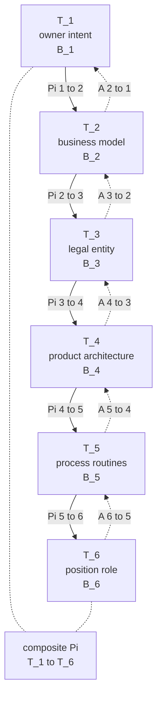

# Figure 1: Six-Tier Projection Cascade — Mermaid Source

**Paper**: The Projection Cascade: Why Reorganizations Fail When the Specification Cascade Doesn't
**Citation key**: 2026m (v2.1)
**Section**: §3.1

This file contains the Mermaid source for Figure 1 of the paper. A vector-graphic upgrade (SVG/PDF via Typst or Graphviz) is pending Phase-6 polish.

## Caption

*Figure 1: Six-Tier Projection Cascade.* Each tier T_i is a finite-dimensional real vector space. Each junction Pi_{i->i+1} is a linear surjection (in the generic case) onto the tier below. Each A_{i+1->i} is the lower-tier feedback operator. The composite Pi = Pi_{5->6} composed with ... composed with Pi_{1->2}: T_1 -> T_6 is the cascade. B_i denotes the bounded subset on which Theorem 1's contraction conditions hold.

*Notes*: The diagram captures only the static cascade as stipulated by scope condition (iv) of §3.4; longitudinal extensions in which T_6 enactment retroactively reshapes T_1 are out of scope for §3 and noted as future work.

## Mermaid source

## Usage notes

- Solid arrows (-->) represent downward projection operators Pi_{i->i+1}.
- Dashed arrows (-.->) represent upward feedback operators A_{i+1->i}.
- The PI node represents the composite cascade operator from T_1 to T_6.
- Vector-graphic upgrade (SVG export from Mermaid CLI or Graphviz redraw) is flagged for Phase-6 polish before submission.
