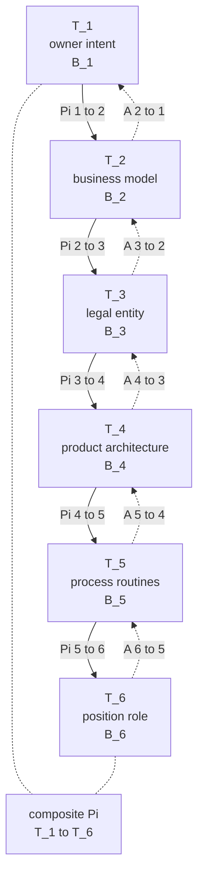

# The Projection Cascade: Why Reorganizations Fail When the Specification Cascade Doesn't

Dmitry Zharnikov

ORCID: 0009-0000-6893-9231

DOI: [10.5281/zenodo.19145205](https://doi.org/10.5281/zenodo.19145205)

Working Paper v2.1.0 – March 2026 (revised June 2026)

---

## Abstract

Most strategic reorganizations fail to deliver expected performance gains. We argue this reflects a deeper architectural fact: interventions at the org-chart surface ($T_6$) achieve effect-sizes geometrically smaller than interventions at deeper tiers, because each deeper tier carries content already compressed in transit to the surface. We formalize this as a six-tier *projection cascade* linking owner intent ($T_1$), business model ($T_2$), governance ($T_3$), architecture ($T_4$), routines ($T_5$), and positions ($T_6$). Each junction is a linear operator $\Pi_{i\to i+1}$ with rank deficiency $r_i \ge 0$. A unique cascade equilibrium exists under tier-by-tier Banach contractions (Theorem 1); total information loss is bounded by the sum of local nullities, with equality only when kernels stack independently (Corollary 1). Existing design theories — Galbraith's star, Williamson's governance choice, Mintzberg's configurations, Puranam's microstructure, Burton-Obel-Håkonsson's computational optimization — are recovered as nested restrictions. A formal *position triple* $p = (P_p, A_p, R_p)$ decomposes any $T_6$ position into perceptual content from $T_5$, authority from $T_3$, and role expectation from $T_1$. The apparatus yields four falsifiable propositions: P1 cascade-distance scaling of intervention efficacy, P2 strict downward propagation of basis rotation under AI deployment, P3 variance amplification with cumulative rank deficiency, and P4 algebraic decoupling at layer junctions.

**Keywords**: organizational design; projection cascade; cascade equilibrium; information loss; rank deficiency; position formalization; reorganization failure; AI deployment

---

### *Phenomenon*

The enterprise deployment of generative AI tools in software development constitutes one of the most rapidly documented cases of within-role content reconfiguration in recent occupational history. GitHub Copilot, launched for enterprise in 2023, was deployed across approximately 90 percent of Fortune 100 companies [@techcrunch-2025-github-copilot-20-million] and reached 1.8 million paid subscribers by mid-2024, growing to 4.7 million by early 2026 — a 75 percent year-over-year increase documented in Microsoft earnings disclosures [@microsoft-2026-q2-fy2026-earnings]. The Stack Overflow Annual Developer Survey, administered to tens of thousands of professional developers each year, documents a parallel trajectory at the practitioner level: 44 percent of respondents reported using AI tools in their development process in 2023, rising to 62 percent in 2024 and 78.5 percent in 2025 [@stack-overflow-2023-developer-survey; @stack-overflow-2024-developer-survey; @stack-overflow-2025-developer-survey]. Deployment is thus not anecdotal; it is aggregate, dateable, and cross-sector.

What these deployment statistics do not show is any corresponding reorganization of formal structure. The U.S. Bureau of Labor Statistics Occupational Employment and Wage Statistics series recorded approximately 1.7 million software developer jobs in 2024, classified under the same occupational codes used before AI-tool deployment began; the 2023–2025 period shows category continuity rather than reclassification [@bls-2024-software-developers-ooh]. Controlled field evidence corroborates content-shift within stable structure. Brynjolfsson, Li, and Raymond [-@brynjolfsson-2025-generative-ai-at], studying 5,172 customer-support agents before and after the introduction of an AI conversational assistant, document a 15 percent average productivity gain, with the largest gains accruing to less experienced agents whose task mix shifted toward exception adjudication rather than routine routing — while job titles, authority structures, and reporting lines remained unchanged. Peng, Kalliamvakou, Cihon, and Demirer [-@peng-2023-impact-ai-developer] find that developers using GitHub Copilot completed a representative implementation task 55.8 percent faster, implying reallocation of freed capacity toward review and integration activities rather than any change in role classification.

This pattern — observable stability of formal position structure paired with documented reconfiguration of position content — is not unique to AI deployments, but AI deployments make it acute, time-stamped, and cross-referenceable against public data. It also indexes a longstanding empirical regularity in management research: roughly 60 percent of major reorganizations fail to deliver the performance gains on which they were authorized [@barkema-2008-how-do-firms], and a process-level reframing of strategic change [@kunisch-2017-time-strategic-change] treats this failure rate as evidence that the org-chart surface is not where reorganizations actually operate. The question — *why do reorganizations fail to change behavior despite changing structure?* — has remained open in management theory.

This paper supplies a formal apparatus that explains the regularity and, in doing so, recovers the existing design literatures [@galbraith-1977-organization-design; @williamson-1985-economic-institutions-capitalism; @mintzberg-1979-structuring-organizations-synthesis; @puranam-2018-microstructure-organizations-oxford; @burton-2020-organizational-design-stepbystep] as restrictions of a single cascade.

### *Theoretical gap*

The design literature has produced powerful but incompatible primitives. Galbraith's information-processing star locates organizational fit in the alignment of strategy, structure, processes, rewards, and people. Williamson's transaction-cost framework locates fit in governance choice between hierarchy and market. Mintzberg's configurational typology locates fit in coherence among coordinating mechanisms across five archetypes. Puranam's microfoundational program locates fit in the building-block choices of task division, reward distribution, and information provision. Burton, Obel, and Håkonsson's computational program locates fit in optimization over a multidimensional design space. Each program operates on its own primitive vocabulary, and the field has lacked a formal apparatus that unifies them.

Joseph and Sengul [-@joseph-2024-organization-design-current] diagnose precisely this fragmentation in *Journal of Management*, surveying current insights and future research directions across the organization-design field and arguing that complementary lenses should be made algebraically commensurable rather than treated as rival accounts. Their diagnosis is correct as far as it goes, but it stops short of supplying the unifying object. The result is a literature in which a "span-of-control" question routed to a configurational scholar produces a different answer from the same question routed to a transaction-cost scholar, and the disagreement persists not because the empirical phenomenon is ambiguous but because the underlying primitives are non-comparable.

This paper supplies the missing apparatus — a six-tier projection cascade with junction-localizable information loss — and demonstrates that the existing theories nest inside it as cascade restrictions (§4, Table 3).

### *Contribution roadmap*

The paper makes three contributions.

The first is *unification* (theoretical). The cascade absorbs five major design theories as nested restrictions: Galbraith's star is recovered as the $T_5 \leftrightarrow T_6$ multi-junction projection with feedback; Williamson's governance choice is recovered as the $\Pi_{2\to3}$ junction holding $T_4$–$T_6$ fixed; Mintzberg's configurations are recovered as cascade-equilibrium attractor basins; Puranam's microstructure is recovered as a $\Pi_{4\to5}$–$\Pi_{5\to6}$ two-junction restriction; and Burton-Obel-Håkonsson computational optimization is recovered as a constrained search over Lipschitz parameters of the cascade. Fragmentation is therefore a partial-view artifact, not ontological disagreement.

The second is *position formalization* (microfoundational). We define a *position triple* $p = (P_p, A_p, R_p)$ where perceptual content $P_p$ inherits from $T_5$ routines, authority allocation $A_p$ inherits from $T_3$ governance, and role expectation $R_p$ inherits from $T_1$ cultural commitments. The triple supplies the first formal decomposition of "position" that respects multi-channel inheritance from culture, contract, and routine, and it directly addresses the JOD AE Issue 9 ask for a formal definition of position before the apparatus is invoked.

The third is *predictive* (empirical). The apparatus entails four falsifiable propositions: P1 cascade-distance scaling of reorganization-failure rate; P2 strict downward propagation of basis rotation under AI deployment; P3 variance amplification with cumulative rank deficiency; and P4 algebraic decoupling at layer junctions. These are entailments of the §3–§4 apparatus rather than separately stipulated claims, which is the sense in which the cascade is not a tautological re-description of existing theories — P3 (variance scaling) and the strict-inequality regime of P4 carry empirical content that no single-junction framework reproduces. The AI-deployment-decoupling phenomenon — basis rotation at $\Pi_{5\to6}$ that leaves authority $A_p$ and role expectation $R_p$ untouched — supplies the headline empirical context for the companion empirical paper.

### *Plan of the paper*

§2 reviews the design literature through the cascade lens. §3 develops the cascade apparatus, states Theorem 1 (existence and uniqueness of the cascade equilibrium under tier-by-tier contraction), and derives Corollary 1 (junction-localizable information loss). §4 demonstrates unification: Table 3 recovers the five major design theories as cascade restrictions, and §4.7 supplies the formal definition of the position triple. §5 derives the four falsifiable propositions P1–P4 from the apparatus. The empirical illustration the apparatus invites — drawing on three public software-engineering datasets covering 2023–2026 (GitHub commit-level activity, Stack Overflow developer surveys, and LinkedIn job-posting text) — is staged as a forward pointer for companion empirical work and is not developed as a self-contained section here; full empirical implementation is left to companion papers. §7 discusses boundary conditions, scope-condition fragility, and implications for strategy implementation in AI-mediated firms.

## §2. Literature and Theoretical Background

The literature this paper engages spans five major foundational programs in organizational-design theory, each of which has produced a distinct primitive vocabulary and treats organizational structure as a function of variables the other programs do not share. The result is not contradiction — each program is internally coherent and empirically supported within its own scope — but *partial view*: each tradition operates at specific tier-pairs of the cascade we develop in §3 and treats the others as exogenous parameters or downstream consequences. This section reviews the substantive content the cascade absorbs from each tradition, foregrounds the recent work that has begun to surface the fragmentation as such, and identifies the gap that the cascade construction fills.

### *Design-theory fragmentation*

Five foundational programs structure contemporary organizational-design research. *Information processing*, originating with Galbraith [-@galbraith-1977-organization-design] and elaborated through the Joseph and Gaba [-@joseph-2020-organizational-structure-information] *Academy of Management Annals* review of organizational structure and information processing, frames organizational fit as the alignment of strategy, structure, processes, rewards, and people under task uncertainty. *Transaction-cost economics and governance*, anchored in Williamson [-@williamson-1985-economic-institutions-capitalism], Hart [-@hart-1995-firms-contracts-financial], and Aoki [-@aoki-2001-toward-comparative-institutional], locates fit in the choice of governance form and contractual configuration as a function of asset specificity and contractual incompleteness. *Configurational archetypes*, codified by Mintzberg [-@mintzberg-1979-structuring-organizations-synthesis], characterizes organizations as gravitating toward a small number of internally coherent configurations of coordinating mechanisms. *Microstructure*, developed by Puranam [-@puranam-2018-microstructure-organizations-oxford] and grounded empirically by Puranam, Raveendran, and Knudsen [-@puranam-2012-organization-design-epistemic] in an *Academy of Management Review* treatment of epistemic interdependence, decomposes organizational design into goal decomposition, task allocation, reward provision, and information provision. *Computational and contingency optimization*, developed by Burton, Obel, and Håkonsson [-@burton-2020-organizational-design-stepbystep], treats configuration as the output of multi-contingency-factor optimization over a multi-dimensional design space.

Each program operates from primitives the other programs do not share. Cross-tradition translation has been laborious and incomplete: an information-processing answer to a span-of-control question, a transaction-cost answer to the same question, and a configurational answer to the same question are not different empirical claims about the same underlying object so much as three different objects parameterized by three different theoretical primitives. Joseph and Sengul [-@joseph-2024-organization-design-current] *Journal of Management* recently survey current insights and future research directions across the organization-design field, diagnosing the persistent fragmentation and calling for apparatus that makes inter-program complementarity explicit. Their diagnosis is correct as far as it goes; what it does not supply is the formal apparatus that makes the complementarity explicit and the relations between programs algebraically traceable.

The cascade we develop in §3 supplies that apparatus. Information processing is recovered as activity at the $T_5 \leftrightarrow T_6$ junction with feedback to $T_2$; transaction-cost economics is recovered as the $\Pi_{2\to3}$ junction; configurational archetypes are recovered as cascade-equilibrium attractor basins; microstructure is recovered as a $\Pi_{4\to5}$–$\Pi_{5\to6}$ two-junction restriction; computational optimization is recovered as constrained search over the cascade's Lipschitz parameters. The fragmentation that Joseph and Sengul [-@joseph-2024-organization-design-current] survey is a partial-view artifact, not ontological disagreement — a conclusion that follows from §4's restriction-recovery results.

### *Architectural decomposition and rank-reducing maps*

The paper's formal apparatus is rooted in the architectural-decomposition tradition. Simon's [-@simon-1962-architecture-complexity-proceedings] "architecture of complexity" supplied the foundational principle that complex systems decompose into nearly-decomposable subsystems with rank-reducing inter-level maps. Baldwin and Clark [-@baldwin-2000-design-rules-power] developed the design-rules framework that formalizes modular product architecture as a system of inter-module visibility constraints. Sanchez and Mahoney [-@sanchez-1996-modularity-flexibility-knowledge] *Strategic Management Journal* connect product architecture to organizational architecture, formalizing the duality that motivates the cascade's $T_4 \to T_5 \to T_6$ downstream propagation. Ulrich [-@ulrich-1995-role-product-architecture] *Research Policy* and Suh [-@suh-1990-principles-design-oxford] supply the modularity / integrality distinction and the axiomatic-design functional-requirement-to-design-parameter mapping that makes $T_4$ internally a projection. Helfat and Peteraf [-@helfat-2003-dynamic-resourcebased-view] *Strategic Management Journal* extend the static-modularity apparatus to capability lifecycles — the longitudinal companion to architectural-decomposition statics.

Recent strategic-management work has foregrounded interdependence among design elements as the locus of empirical action. Rivkin and Siggelkow [-@rivkin-2003-balancing-search-stability] in *Management Science* show that the search-stability tradeoff in organizational design is governed by the interdependence pattern among design elements rather than by the elements taken individually. Raveendran, Silvestri, and Gulati [-@raveendran-2020-role-interdependence-microfoundations] *Academy of Management Annals* supply the contemporary microfoundations connecting task, goal, and knowledge interdependence to organizational structure. Both findings are consistent with the cascade's treatment of interdependence as a measurable property of the projection operator at a junction: rank deficiency $r_i = d_i - \mathrm{rank}(\Pi_{i\to i+1})$ at junction $i$ is the algebraic counterpart of interdependence among the design elements at the upstream tier, and the cascade frames interdependence as a property of the operator rather than as an unobservable design parameter.

### *Routines, microfoundations, and the position concept*

The $T_5$ process tier draws on the routines tradition. Pentland and Feldman [-@pentland-2005-organizational-routines-as] decompose routines into the *ostensive aspect* (the abstract pattern recognized as the routine) and the *performative aspect* (the specific actions taken in execution); this decomposition supplies the basis-rotation construct of §3.1, in which a rotation of the routine's row space within $T_5$ leaves the ostensive aspect (the kernel structure) fixed while changing the performative aspect (which $T_5$ directions are read into which $T_6$ coordinates). Nelson and Winter [-@nelson-1982-evolutionary-theory-economic] treat routines as units of organizational memory and evolutionary inheritance. Cohen and Bacdayan [-@cohen-1994-organizational-routines-are] supply the procedural-memory mechanism for routine encoding. Felin, Foss, and Ployhart [-@felin-2015-microfoundations-movement-strategy] *Academy of Management Annals* supply the contemporary microfoundations framework that grounds the ostensive-performative duality in individual-level capabilities and decision rights — the bridge the cascade exploits in §4.7 when defining the position triple.

The *position* concept itself has been treated unevenly in the design literature. Mintzberg [-@mintzberg-1979-structuring-organizations-synthesis] treats positions as embedded in configurations without a separable definition. Puranam [-@puranam-2018-microstructure-organizations-oxford] decomposes positions via the four microstructural primitives but does not formalize the position as a single object that admits inheritance from multiple tiers. Joseph and Sengul [-@joseph-2024-organization-design-current] review current organization-design research treating positions as primary objects of design, again without formalizing them. Csaszar [-@csaszar-2013-efficient-frontier-organization] *Organization Science* supplies the bounded-rationality grounding for treating cultural-strategic choice ($T_1$) as bounded rather than open-ended — an empirical anchor for scope condition (i) in §3.4. The cascade's position triple $p = (P_p, A_p, R_p)$ (§4.7) supplies the formal multi-tier-inheritance decomposition of position that the existing literature has demanded but not delivered: perceptual content $P_p$ inherits from $T_5$ routines, authority allocation $A_p$ inherits from $T_3$ governance, and role expectation $R_p$ inherits from $T_1$ cultural commitments. Recent AMJ evidence grounds the $P_p$ component's response to AI deployment in observable worker-level data. Luo, Zhu, Lu, and Zhou [-@luo-2024-when-how-artificial] demonstrate that AI augmentation of employee creativity is sharply skill-contingent: high-skill workers experience amplified creative output under AI assistance while low-skill workers exhibit substitution rather than augmentation, a divergence that scales with the breadth of skill asymmetry within the role. This pattern is the micro-level mechanism underlying P2's strict downward propagation: the basis rotation at $\Pi_{5\to6}$ that AI deployment induces does not uniformly reconfigure all position-content vectors in $T_6$ but rotates them differentially by skill-level, producing the within-role content heterogeneity that the cascade's basis-rotation formalism captures and that is invisible to frameworks treating $T_6$ positions as homogeneous. The Luo et al. [-@luo-2024-when-how-artificial] finding therefore supplies published AMJ evidence for the $T_5 \to T_6$ junction mechanism before the cascade's §5 propositions are stated.

### *Strategy, dynamic capabilities, and AI deployment*

The T_2 strategic tier draws on dynamic-capabilities theory. Teece, Pisano, and Shuen [-@teece-1997-dynamic-capabilities-strategic] *Strategic Management Journal* establish dynamic capabilities as the foundational construct for strategic adaptation; Teece [-@teece-2007-explicating-dynamic-capabilities] elaborates the sense / seize / reconfigure operators that constitute the dynamic-capability profile. Porter [-@porter-1985-competitive-advantage-creating] supplies the cost-differentiation positioning axis that gives $T_2$ its substantive basis structure. Iansiti and Lakhani [-@iansiti-2020-competing-age-ai] extend dynamic capabilities to the AI-era operating model, treating the firm's data and software architecture as a strategic-level choice that anchors the business model's competitive logic — a contribution that makes $T_2$ jointly cognitive and computational.

Recent strategic-management work has begun mapping the AI-deployment shock onto strategic structure. Krakowski, Luger, and Raisch [-@krakowski-2023-artificial-intelligence-changing] *Strategic Management Journal* track how AI deployment modifies the dynamic-capability profile itself, supplying the post-2020 SMJ-native treatment that connects $T_2$ content to downstream cascade propagation. von Krogh, Roberson, and Gruber [-@von-krogh-roberson-gruber-2023-recognizing-research] supply an *Academy of Management Journal* editorial framing of AI-and-strategy research opportunities at the strategic tier. Raisch and Fomina [-@raisch-2025-combining-human-artificial] advance this line by theorizing three hybrid problem-solving modes — autonomous (AI solves independently), sequential (AI and human work in alternating stages), and interactive (AI and human co-produce in real time) — that map directly onto the cascade's tier-transmission character: autonomous deployment is a pure $\Pi_{5\to6}$ basis rotation; sequential deployment spans the $\Pi_{4\to5}$–$\Pi_{5\to6}$ two-junction range; interactive deployment requires architectural-specification co-authorship at $T_4$. The three-mode taxonomy therefore operationalizes cascade distance as an empirically observable property of the human-AI collaboration protocol, directly anteceding the P1 and P2 predictions in §5. Dell'Acqua and colleagues [-@dellacqua-2026-navigating-jagged-technological-frontier] provide the headline empirical instantiation of this cascade-distance heterogeneity: their field experiment documents a "jagged technological frontier" in which AI capability effects on knowledge-worker productivity are sharply positive for tasks whose content lies inside the frontier and near zero or negative for tasks whose content lies outside it, within the same role and the same deployment. This intra-role heterogeneity is precisely what P1 predicts (cascade-distance scaling of AI effect-sizes across tasks mapped to different tiers) and what P3 predicts (variance amplification, since workers whose task portfolios straddle the frontier exhibit higher outcome dispersion than workers whose portfolios fall cleanly on one side). The cascade synthesizes these threads: the AI-deployment shock at $T_2$ (operating-model reconfiguration) propagates through $T_3$ (governance), $T_4$ (architecture), $T_5$ (routines), and $T_6$ (positions), with §3.5's numerical illustration showing how rank deficiencies at upstream junctions bound the downstream effect. P2 (§5) makes precise the empirical pattern these literatures have collectively gestured at without formalizing: AI deployment manifests at the $T_5/T_6$ junction as a basis rotation $\Pi_{5\to6}$ affecting performative content ($P_p$) while leaving authority allocation ($A_p$) and role-expectation distribution ($R_p$) invariant under the static-frame scope condition.

### *Reorganization outcomes and empirical regularity*

The phenomenon §1 named — reorganization failure rate of approximately 60% — is empirically robust. Barkema and Schijven [-@barkema-2008-how-do-firms] supply the meta-analytic estimate of post-merger integration outcomes that grounds the headline figure. Kunisch, Bartunek, Mueller, and Huy [-@kunisch-2017-time-strategic-change] *Academy of Management Annals* supply the process-level reframing of strategic change that treats reorganization as a temporal process with identifiable discontinuities rather than as an instantaneous switch from one structural configuration to another. Bloom, Brynjolfsson, Foster, Jarmin, Patnaik, Saporta-Eksten, and Van Reenen [-@bloom-2019-what-drives-differences] *American Economic Review* establish that management-practice differences across firms explain a substantial share of cross-firm productivity variance — the empirical antecedent to P3's variance-amplification prediction (§5).

The cascade frames these regularities as endogenous to its rank-deficiency structure rather than as exogenous facts requiring separate explanation. The 60% failure rate is what the rank-cascade information bound $r_\text{total} \le \sum r_i$ (§3, Corollary 1) predicts when reorganizations are typically targeted at $T_6$ (the org-chart surface) without addressing the upstream rank-deficiency contributions $r_1$ through $r_5$. The cross-firm variance-of-management-practice that Bloom and colleagues document is the cumulative effect of distinct rank deficiencies at each junction, scaling with cascade distance as the parameter-Lipschitz constants $L_i$ compound through the cascade.

A complementary tradition treats reorganization failure as an execution-and-coordination problem rather than an architectural one [@hrebiniak-2006-obstacles-effective-strategy]. On the execution view, the structural design itself is sound but post-decision implementation — communication, incentive alignment, coordination across units — degrades the intended effect; failure is a property of the implementation pipeline rather than of the design's architecture. The cascade does not displace this tradition; it locates it. Execution-and-coordination failures populate the rank deficiency $r_5$ at the $\Pi_{5\to6}$ junction (routines fail to translate into coordinated position-level activity) and a portion of $r_3$ at $\Pi_{3\to4}$ (governance fails to translate into coordinated architectural specification). What the cascade adds is the upstream contributions $r_1, r_2, r_4$, and the parametric Lipschitz product $L_1 \cdot L_2 \cdot L_3 \cdot L_4 / \prod(1 - \kappa_i)$ that bounds total transmission magnitude — components the execution view treats as exogenous design parameters. Reorganization failure on the cascade view is therefore the sum of execution-coordination loss at the surface junctions and architectural-misalignment loss at the deeper junctions; the empirical separation of the two contributions is a forward-pointer for the dynamic-cascade extension noted in §7.5.

### *Synthesis and gap*

The literature reviewed above supplies the substantive content for each tier of the cascade — culture (Selznick / Hofstede / Schein at $T_1$), strategy (Teece / Porter / Iansiti-Lakhani / Krakowski-Luger-Raisch at $T_2$), governance (Williamson / Hart / Aoki at $T_3$), architecture (Baldwin-Clark / Ulrich / Suh / Sanchez-Mahoney / Helfat-Peteraf / Raveendran-Silvestri-Gulati at $T_4$), routines (Pentland-Feldman / Nelson-Winter / Cohen-Bacdayan / Felin-Foss-Ployhart at $T_5$), and positions (Mintzberg / Galbraith / Puranam / Joseph-Sengul at $T_6$). What the literature has not supplied is a formal apparatus that links these tiers as a sequence of rank-reducing projection operators, that admits a contraction-mapping equilibrium under which existence and uniqueness can be proved, and that supplies a junction-localizable information-loss bound permitting empirical decomposition of cumulative organizational variance into per-junction contributions.

The §3 cascade construction supplies that apparatus. The §4 unification results show that the existing design theories — Galbraith's information-processing star, Williamson's governance choice, Mintzberg's configurational archetypes, Puranam's microstructural decomposition, and Burton-Obel-Håkonsson computational optimization — are recoverable as cascade restrictions: each is a specialization of the cascade in which a subset of the junctions is assumed full-rank, the parameter-Lipschitz constants at the unspecialized junctions are taken to zero, or the basis at a specific junction is held fixed. The §5 propositions supply the cascade's empirical content distinct from a tautological re-description of existing theory: P1's cascade-distance scaling, P2's strict downward propagation under AI deployment, P3's variance amplification with cumulative rank deficiency, and P4's algebraic-decoupling boundary condition together constitute predictions that no single existing tradition operating in isolation can derive. The empirical contribution of the cascade is that these four predictions are joint consequences of a single apparatus, falsifiable in public-data settings (developed in the companion empirical paper), and grounded in the literatures reviewed above as substantive content rather than as primitives the cascade itself must stipulate.

## §3. The Projection Cascade

This section stipulates the formal apparatus that the rest of the paper rests on. Six tiers, ordered from deepest organizational primitive (owner intent) to shallowest empirical surface (org-chart position), are linked by a sequence of linear projection operators. The cascade is rank-non-increasing tier-to-tier, so each junction admits a non-trivial kernel and an information-loss bound. A unique cascade-equilibrium exists under a contraction condition applied junction-by-junction; the global fixed point is recovered as a stack of local fixed points (Theorem 1).

### *Six-Tier Vector-Space Construction*

Let $T_1, T_2, T_3, T_4, T_5, T_6$ denote six finite-dimensional real vector spaces. Each space is the *content* space of one organizational tier; its dimension is the count of independent latent attributes the tier carries at the level of resolution required for the paper's predictions. We index tiers from deepest ($T_1$) to shallowest ($T_6$). Write $d_i = \dim(T_i)$.

Between adjacent tiers we posit a linear operator

$$\Pi_{i\to i+1}: T_i \to T_{i+1}, \quad i \in \{1, 2, 3, 4, 5\},$$

with rank deficiency

$$r_i := d_i - \mathrm{rank}(\Pi_{i\to i+1}) \ge 0.$$

The term *projection* is used here in the rank-reducing-linear-map sense — $\Pi_{i\to i+1}$ is a linear surjection (in the generic case) from a higher-dimensional content space onto a lower-dimensional content space — not in the idempotent-operator sense ($P^2 = P$) common in inner-product-space settings. Idempotency does not apply, and is not required, since the domain $T_i$ and codomain $T_{i+1}$ are distinct vector spaces with $d_{i+1} \le d_i$ in the generic case. We retain "projection" because the apparatus we develop preserves the rank-deficiency, kernel, and basis-rotation properties that motivate the term in the broader management-design literature on architectural decomposition; readers familiar with the Hilbert-space convention should read each $\Pi_{i\to i+1}$ as a specific kind of bounded linear surjection between distinct finite-dimensional real vector spaces.

In the generic case $\mathrm{rank}(\Pi_{i\to i+1}) = d_{i+1}$ (the operator is surjective onto its codomain) and $r_i = d_i - d_{i+1}$; non-generic cases (rank-deficient onto a proper subspace of $T_{i+1}$) are treated as degeneracies in §4.

The composite cascade is

$$\Pi := \Pi_{5\to6} \circ \Pi_{4\to5} \circ \Pi_{3\to4} \circ \Pi_{2\to3} \circ \Pi_{1\to2} : T_1 \to T_6.$$

Two structural properties follow immediately from linearity. First, the cascade is rank-non-increasing: $\mathrm{rank}(\Pi) \le \min_i \mathrm{rank}(\Pi_{i\to i+1})$. Equality holds when every junction is full-rank onto its codomain; strict inequality holds whenever any single junction loses additional dimension. *Strategy translation:* the org-chart-visible structure ($T_6$) carries less information than the deepest cultural commitments ($T_1$), and the cumulative loss is bounded by the loss at the most-restrictive junction — which is why a reorganization that targets only $T_6$ (re-titling positions) cannot recover information already discarded upstream. Second, the kernel of the cascade decomposes by sub-additivity across junctions: a perturbation $\delta \in T_1$ lies in $\ker(\Pi)$ when it is annihilated at some junction, and the contribution of junction $i$ to the cascade kernel is bounded above by $r_i$ (with equality when kernels stack independently across junctions; see Corollary 1). *Strategy translation:* information loss is *junction-localizable* — a manager who detects that two firms with the same $T_1$ cultural commitments produce systematically different $T_6$ positions can in principle identify the specific junction at which the difference originates, rather than treating the entire cascade as a single black-box compression.

Each junction also admits a basis. A change of basis at $\Pi_{i\to i+1}$ that preserves rank is a rotation of the operator's row space within $T_i$; it leaves the kernel and the rank unchanged but changes the *cell content* of the mapping (which $T_i$ directions are read into which $T_{i+1}$ coordinates). *Strategy translation:* this is the formal handle on the empirical phenomenon of *role-content drift under stable titles* — a basis rotation at $\Pi_{5\to6}$ leaves Tier-6 titles in place but changes what activities those titles index. Under AI deployment, basis rotation at $\Pi_{5\to6}$ is the formal mechanism by which job titles remain stable while the underlying performative content of the position rotates beneath them; the rank invariance under basis rotation is why org-chart counts of positions appear unchanged while the practical authority and routine-content distributions of those positions reconfigure.

Each $\Pi_{i\to i+1}$ carries a paired feedback operator $A_{i+1\to i}: T_{i+1} \to T_i$ representing the lower tier's response to a specification descending from the upper tier. $A_{i+1\to i}$ is *not* the inverse of $\Pi_{i\to i+1}$ — it is the operator by which the lower tier's structure adjusts when the projection from above is held fixed. The paired composition $\Pi_{i\to i+1} \circ A_{i+1\to i}: T_{i+1} \to T_{i+1}$ acts on the lower tier and admits a fixed point under standard contraction conditions; this is the local cascade-equilibrium at junction $i$, formalized in §3.4 below. *Strategy translation:* the feedback operator $A_{i+1\to i}$ formalizes what the design literature calls "implementation" or "execution" — the adjustments lower-tier actors make in response to upstream specifications; a firm that continuously revises routines to conform to architectural specs, or positions to conform to process design, is keeping $A_{i+1\to i}$ near the fixed-point manifold, and evidence of persistent implementation gap at a given junction is a direct diagnostic signal that the contraction condition (C_i) of Theorem 1 is locally violated at that tier.

*Figure 1: Six-Tier Projection Cascade.* Each tier $T_i$ is a finite-dimensional real vector space. Each junction $\Pi_{i\to i+1}$ is a linear surjection (in the generic case) onto the tier below. Each $A_{i+1\to i}$ is the lower-tier feedback operator. The composite $\Pi = \Pi_{5\to6} \circ \cdots \circ \Pi_{1\to2}: T_1 \to T_6$ is the cascade. $B_i$ denotes the bounded subset on which Theorem 1's contraction conditions hold.

*Notes*: The diagram captures only the static cascade as stipulated by scope condition (iv) of §3.4; longitudinal extensions in which $T_6$ enactment retroactively reshapes $T_1$ are out of scope for §3 and noted as future work.

### *Tier Identifications*

We now identify the content of each tier by reference to the management-design literature. The construction is internally derivable from this literature; cascade ordering is not imported from an external tradition. Table 1 lists the anchor citations and the substantive content each tier carries; the paragraphs below give one substantive sentence per anchor.

`Table 1: Six-Tier Cascade with Management-Literature Anchors. Each tier is a finite-dimensional real vector space; each anchor citation grounds the tier's content in a peer-reviewed organizational-design reference.`

| Tier | Object | Anchor citations |
|---|---|---|
| **$T_1$** | Owner intent / cultural-strategic choice | [@selznick-1957-leadership-administration-sociological; @hofstede-1980-cultures-consequences-international; @schein-2010-organizational-culture-leadership] |
| **$T_2$** | Business model / market position | [@teece-1997-dynamic-capabilities-strategic; @teece-2007-explicating-dynamic-capabilities; @porter-1985-competitive-advantage-creating; @iansiti-2020-competing-age-ai; @krakowski-2023-artificial-intelligence-changing] |
| **$T_3$** | Legal entity / contractual / governance | [@williamson-1985-economic-institutions-capitalism; @hart-1995-firms-contracts-financial; @aoki-2001-toward-comparative-institutional] |
| **$T_4$** | Product / service architecture | [@baldwin-2000-design-rules-power; @ulrich-1995-role-product-architecture; @suh-1990-principles-design-oxford; @sanchez-1996-modularity-flexibility-knowledge; @helfat-2003-dynamic-resourcebased-view; @raveendran-2020-role-interdependence-microfoundations] |
| **$T_5$** | Process / routines / specification transmission | [@pentland-2005-organizational-routines-as; @nelson-1982-evolutionary-theory-economic; @cohen-1994-organizational-routines-are; @felin-2015-microfoundations-movement-strategy] |
| **$T_6$** | Position / role / org-chart surface | [@mintzberg-1979-structuring-organizations-synthesis; @galbraith-1977-organization-design; @puranam-2018-microstructure-organizations-oxford; @joseph-2024-organization-design-current] |

*Notes*: Anchors at $T_1$ and $T_3$ are foundational textbooks and treatises whose precise edition does not bear on the cascade construction. Peer-reviewed journal contributions in the table include Teece, Pisano & Shuen [-@teece-1997-dynamic-capabilities-strategic]; Teece [-@teece-2007-explicating-dynamic-capabilities]; Krakowski, Luger & Raisch [-@krakowski-2023-artificial-intelligence-changing]; Ulrich [-@ulrich-1995-role-product-architecture]; Sanchez & Mahoney [-@sanchez-1996-modularity-flexibility-knowledge]; Helfat & Peteraf [-@helfat-2003-dynamic-resourcebased-view]; Raveendran, Silvestri & Gulati [-@raveendran-2020-role-interdependence-microfoundations]; Felin, Foss & Ployhart [-@felin-2015-microfoundations-movement-strategy]; and Joseph & Sengul [-@joseph-2024-organization-design-current]. Reference monographs at $T_1$, $T_3$, $T_4$, $T_5$, and $T_6$ supply foundational content not bearing on cascade-specific algebra.

**$T_1$ (constitutional / cultural).** Selznick [-@selznick-1957-leadership-administration-sociological] characterizes leadership as the institutional embedding of value commitments; the firm's *raison d'être* and the boundaries of permissible action are constitutive choices, not optimizations. Hofstede [-@hofstede-1980-cultures-consequences-international] supplies a dimensional structure (power distance, individualism-collectivism, uncertainty avoidance, masculinity-femininity, long-term orientation) within which cultural variation is bounded — making $T_1$ a finite-dimensional space with empirically estimable extent. Schein [-@schein-2010-organizational-culture-leadership] connects $T_1$ content to its mode of transmission: artifacts, espoused values, and basic underlying assumptions, with the deepest layer least articulable. Together these anchors specify $T_1$ as the space of cultural-constitutional commitments under which everything below is parameterized.

**$T_2$ (strategic / business-model).** Teece, Pisano, and Shuen [-@teece-1997-dynamic-capabilities-strategic] establish dynamic capabilities as the foundational construct for strategic adaptation; the 2007 elaboration by Teece [-@teece-2007-explicating-dynamic-capabilities] frames the three operators — sensing, seizing, and reconfiguring — as the strategic-level mechanisms that generate distinct competitive positions. $T_2$ is the space of strategic-positioning choices given $T_1$ and is parameterized by the dynamic-capability profile of the firm. Porter [-@porter-1985-competitive-advantage-creating] treats positioning along the cost-differentiation axis as the foundational strategic choice; $T_2$ admits a basis of positioning attributes (price-point, quality, scope, time-horizon). Iansiti and Lakhani [-@iansiti-2020-competing-age-ai] extend this to the AI-era, identifying the *operating model* (the firm's data and software architecture) as a strategic-level choice that anchors the business model's competitive logic — a contribution that makes $T_2$ jointly cognitive and computational. Krakowski, Luger, and Raisch [-@krakowski-2023-artificial-intelligence-changing] extend this further by tracking how AI deployment modifies the dynamic-capability profile itself, supplying the post-2020 SMJ-native treatment that connects $T_2$ content to the cascade-propagation predictions developed in §5. *Strategy translation:* the $T_2$ content choice — cost versus differentiation positioning, breadth of the capability portfolio, AI-operating-model maturity — is the strategic-level constraint that all downstream cascade tiers project from; a firm that misdiagnoses a $T_2$ capability-positioning failure as a $T_6$ structural problem will find that title changes and headcount adjustments produce no sustained performance shift, because the cascade source remains unreformed.

**$T_3$ (entity / contractual).** Williamson [-@williamson-1985-economic-institutions-capitalism] supplies the transaction-cost framework for the choice of governance form (market, hierarchy, hybrid) as a function of asset specificity and frequency; $T_3$ is the space of governance-regime parameters. Hart [-@hart-1995-firms-contracts-financial] extends the apparatus to incomplete contracts, decision rights, and residual control — making $T_3$ the space of allocations of authority over uncontractible contingencies. Aoki [-@aoki-2001-toward-comparative-institutional] frames the firm as an institutional configuration of contracting and information architecture, supplying the comparative-institutional view in which $T_3$ admits multiple stable equilibria for similar $T_2$ content.

**$T_4$ (architectural / product-spec / modularity).** Baldwin and Clark [-@baldwin-2000-design-rules-power] develop modular product architecture as a system of design rules; $T_4$ is the space of product-architectural specifications, with modularity as the organizing principle. Ulrich [-@ulrich-1995-role-product-architecture] supplies the canonical modularity / integrality distinction in product architecture and shows how this choice cascades to organizational form. Suh [-@suh-1990-principles-design-oxford] supplies the axiomatic-design framework whose primitives — functional requirements (FRs), design parameters (DPs), and the design matrix mapping FRs to DPs — make $T_4$ a space whose internal structure is *itself* a projection (the $\text{FR} \to \text{DP}$ design matrix). Sanchez and Mahoney [-@sanchez-1996-modularity-flexibility-knowledge] connect product architecture to organizational architecture, formalizing the duality that makes $T_4 \to T_5 \to T_6$ a coherent downstream cascade. Helfat and Peteraf [-@helfat-2003-dynamic-resourcebased-view] supply the capability-lifecycle apparatus (founding, development, maturity, decline) that tracks $T_4$ content over time, connecting the static cascade to a longitudinal extension in which the architectural specification itself ages and is renewed; this is the SMJ-native dynamic counterpart to Baldwin-Clark's static modularity. Raveendran, Silvestri, and Gulati [-@raveendran-2020-role-interdependence-microfoundations] supply the contemporary microfoundations treatment of interdependence among $T_4$ architectural primitives and its propagation to $T_5$ process-coordination costs — the pattern that the cascade formalizes via the rank deficiency $r_4$ at the $\Pi_{4\to5}$ junction. *Strategy translation:* $T_4$ product-architectural specification — the degree of modularity versus integrality and the design-rule decomposition — determines which tasks at $T_5$ can be decoupled and therefore which positions at $T_6$ can specialize; a firm that attempts to achieve $T_6$ role specialization without first establishing modular $T_4$ specifications will encounter persistent coordination costs at every intervening junction, a prediction falsifiable in product-platform-migration data.

**$T_5$ (process / routines).** Pentland and Feldman [-@pentland-2005-organizational-routines-as] decompose the routine into ostensive aspect (the abstract pattern recognized as the routine) and performative aspect (the specific actions taken in execution); $T_5$ inherits this dual structure, and the basis-rotation phenomenon at the $T_5 \to T_6$ junction is a rotation in the performative dimensions that leaves the ostensive dimensions fixed. Nelson and Winter [-@nelson-1982-evolutionary-theory-economic] treat routines as the units of organizational memory and the substrate of evolutionary inheritance; $T_5$ admits a metric of routine stability (the kernel of the projection from prior to subsequent $T_5$ states under environmental perturbation). Cohen and Bacdayan [-@cohen-1994-organizational-routines-are] supply the procedural-memory mechanism for routine encoding, grounding $T_5$ in cognitive-psychological primitives. Felin, Foss, and Ployhart [-@felin-2015-microfoundations-movement-strategy] supply the contemporary microfoundations framework that grounds the ostensive/performative duality in individual-level capabilities and choices, supplying the bridge between $T_5$ routine content and the position triple at $T_6$ that §4.7 develops.

**$T_6$ (position / role / org-structure).** Mintzberg [-@mintzberg-1979-structuring-organizations-synthesis] identifies the configurational archetypes (simple structure, machine bureaucracy, professional bureaucracy, divisionalized form, adhocracy) toward which organizations gravitate; $T_6$ admits a configurational coarse-graining that survives the basis rotations of routine adoption. Galbraith [-@galbraith-1977-organization-design] frames organizations as information-processing systems whose structure is responsive to task uncertainty; the star model and information-processing design place $T_6$ downstream of $T_5$ process design. Puranam [-@puranam-2018-microstructure-organizations-oxford] decomposes the design problem into goal decomposition, task allocation, reward provision, and information provision — supplying the microstructural primitives that constitute $T_6$. Joseph and Sengul [-@joseph-2024-organization-design-current] survey current organization-design insights and future directions, treating positions as primary objects of organizational analysis; the cascade reframes them as features of the $\Pi_{5\to6}$ junction.

### *Theorem 1: Cascade-Equilibrium Existence*

We now state the central technical result. The cascade-equilibrium is the joint condition that each $\Pi_{i\to i+1}$ is consistent with the layer above — that is, the lower-tier image is in fact the projection of the upper-tier content under the operator, not a free choice subject to lower-tier constraints alone. Existence and uniqueness follow from a tier-by-tier application of the Banach contraction-mapping principle [@banach-1922-sur-les-operations; @smart-1974-fixed-point-theorems].

The cascade-equilibrium concept is defined inductively from the top, then re-stated as a joint fixed-point condition. The two formulations are equivalent under the contraction conditions of Theorem 1, and we use the inductive form for the proof and the joint form for the substantive interpretation.

**Definition (cascade-equilibrium).** Fix $x_1 \in B_1 \subset T_1$, a configuration of the firm's deepest tier (owner intent / cultural choice), treated as the cascade boundary input (see scope condition (i) and the static-frame discussion following the scope conditions). For each junction $i \in \{1, 2, 3, 4, 5\}$, define the *junction operator*

$$F_i^{(x_i)}: T_{i+1} \to T_{i+1}, \quad F_i^{(x_i)}(y) := \Pi_{i\to i+1}\big(x_i + A_{i+1\to i}(y) - A_{i+1\to i}(\Pi_{i\to i+1}(x_i))\big),$$

where the argument inside $\Pi_{i\to i+1}$ is the upstream content $x_i$ adjusted by the lower-tier feedback $A_{i+1\to i}(y)$ relative to the no-feedback baseline $A_{i+1\to i}(\Pi_{i\to i+1}(x_i))$. The trajectory $(x_1, x_2, x_3, x_4, x_5, x_6)$ is a *cascade-equilibrium* when, for each $i \in \{1, 2, 3, 4, 5\}$, the lower-tier configuration $x_{i+1} \in B_{i+1}$ is a fixed point of $F_i^{(x_i)}$, i.e., $F_i^{(x_i)}(x_{i+1}) = x_{i+1}$. Equivalently, $x_{i+1}$ is the configuration at which the upper-tier projection and the lower-tier feedback are mutually consistent.

*Strategy translation:* the cascade-equilibrium is the joint condition that an organization is internally consistent across all six tiers simultaneously — culture aligned with strategy, strategy aligned with governance, governance aligned with architecture, architecture aligned with routines, and routines aligned with positions; a firm in cascade-equilibrium is one where no single tier is being asked to perform under a specification it cannot receive from the tier above, which is the formal content of what practitioners call organizational "alignment."

The structure makes explicit that the lower-tier fixed point depends parametrically on the upstream input $x_i$: $F_i$ is a *family* of operators on $B_{i+1}$, indexed by $x_i \in B_i$. The proof of Theorem 1 below uses a parametric form of the Banach contraction principle (parametric fixed-point theorem; see Granas and Dugundji [-@granas-2003-fixed-point-theory], §2) to ensure that the dependence $x_i \mapsto x_{i+1}^*(x_i)$ is continuous (in fact Lipschitz with constant $L_i$ bounded as in (1) below), which is what permits the inductive stacking of fixed points across the cascade.

**Theorem 1 (cascade-equilibrium existence and uniqueness).** *Suppose that at each junction $i \in \{1, 2, 3, 4, 5\}$ the following uniform-contraction condition holds:*

*(C_i) There exists $\kappa_i$ with $0 \le \kappa_i < 1$ such that for every $x_i \in B_i$ and every $u, v \in B_{i+1}$,*

$$\|F_i^{(x_i)}(u) - F_i^{(x_i)}(v)\|_{T_{i+1}} \le \kappa_i \|u - v\|_{T_{i+1}}. \qquad (1)$$

*Suppose further that for each $i$, the family $F_i$ is jointly Lipschitz in its parameter: there exists $L_i < \infty$ such that for every $x_i, x_i' \in B_i$ and $y \in B_{i+1}$,*

*(C_i') $\|F_i^{(x_i)}(y) - F_i^{(x_i')}(y)\|_{T_{i+1}} \le L_i \|x_i - x_i'\|_{T_i}$.*

*Then for every $x_1 \in B_1$ a unique cascade-equilibrium trajectory $(x_1, x_2^*, x_3^*, x_4^*, x_5^*, x_6^*) \in B_1 \times B_2 \times \cdots \times B_6$ exists. The fixed-point map $x_1 \mapsto (x_2^*, \ldots, x_6^*)$ is Lipschitz on $B_1$ with constant bounded above by $\prod_{j=1}^{5} L_j / (1 - \kappa_j)$.*

The contraction constant $\kappa_i$ in (C_i) is required to be uniform over $x_i \in B_i$ — the operator $F_i$ is contractive on $B_{i+1}$ with the same rate $\kappa_i$ regardless of which upstream configuration $x_i$ is fed in. This uniformity is the technical content distinguishing Theorem 1 from a sequence of ad-hoc local applications of Banach [-@banach-1922-sur-les-operations]; without uniformity, the inductive argument proves only that a fixed point exists at each junction conditional on a specific upstream input, not that the fixed-point map $x_i \mapsto x_{i+1}^*(x_i)$ is continuous, and the global tuple is then not necessarily well-defined as a function of the cascade boundary $x_1$.

**Proof sketch.** The argument proceeds inductively from the cascade boundary $x_1 \in B_1$. At each junction $i$, condition (C_i) makes $F_i^{(x_i)}$ a $\kappa_i$-contraction on the complete metric space $B_{i+1}$, so by the Banach contraction-mapping principle [@banach-1922-sur-les-operations; @smart-1974-fixed-point-theorems] the operator admits a unique fixed point $x_{i+1}^* \in B_{i+1}$. Condition (C_i') makes the parametric family $\{F_i^{(x_i)}\}_{x_i \in B_i}$ jointly Lipschitz; by the parametric fixed-point theorem (Granas and Dugundji [-@granas-2003-fixed-point-theory], Chapter II) the fixed-point map $x_i \mapsto x_{i+1}^*(x_i)$ is then Lipschitz on $B_i$ with constant $L_i / (1 - \kappa_i)$. Composing the per-junction Lipschitz constants across $i = 1, \ldots, 5$ yields the cascade Lipschitz bound on $x_1 \mapsto (x_2^*, \ldots, x_6^*)$ stated in the theorem conclusion. The full proof is given in Appendix A.

The cascade-equilibrium thus exists and is unique on the product set $\prod B_i$, and depends continuously (in fact Lipschitz-continuously) on the cascade-boundary input $x_1$. The contraction constants $\kappa_1, \ldots, \kappa_5$ control the local rate of convergence at each junction; the parameter-Lipschitz constants $L_1, \ldots, L_5$ control the propagation of upstream perturbations to downstream tiers — a quantity that re-appears in §5 as the variance-amplification factor of cascade-distance scaling (P3). *Strategy translation:* small perturbations in $T_1$ (cultural-strategic primitive, e.g., a succession-driven mission reframe) produce bounded perturbations at $T_6$ (position structure), with the proportionality constant being the cascade Lipschitz product $\prod L_j / (1 - \kappa_j)$; large cultural discontinuities produce proportionally large position disruptions, which is why culturally incoherent mergers — where $T_1$ discontinuity at closing is large — produce reorganization failure rates systematically higher than same-size mergers with coherent cultural priors (per Theorem 1 Lipschitz bound, equation bounding the cascade fixed-point map $x_1 \mapsto (x_2^*, \ldots, x_6^*)$).

**Scope conditions.** The contraction conditions are not vacuous; each carries empirical content:

(i) *Bounded $T_1$ (cultural-choice space).* The set $B_1$ must be bounded — firms operate within a finite cultural-strategic envelope (Hofstede [-@hofstede-1980-cultures-consequences-international] supplies the dimensional bounds; Schein [-@schein-2010-organizational-culture-leadership] supplies the inertial bounds). A firm whose owner intent is unbounded or undefined (e.g., a partnership in dissolution; a startup pre-product) admits no cascade-equilibrium. The boundedness condition formalizes the management-practice intuition that cascade analysis applies to going concerns, not to firms in existential transition.

(ii) *Technology / contractual stability at $T_2 \to T_3 \to T_4$.* The contractions at the $T_2/T_3$ and $T_3/T_4$ junctions require Williamson's [-@williamson-1985-economic-institutions-capitalism] frequency and asset-specificity conditions to hold over the cascade horizon — the governance form does not flip mid-cascade, the asset specificity does not vary within the bounds of $B_3$. Firms in the middle of post-merger integration or in the middle of platform-versus-pipeline architectural transitions violate this and admit no stable cascade-equilibrium during the transition period.

(iii) *Configurational stability at $T_5 \to T_6$.* The contraction at the $T_5/T_6$ junction requires that the firm operates near (not between) one of Mintzberg's [-@mintzberg-1979-structuring-organizations-synthesis] configurational archetypes — a firm midway between machine-bureaucratic and adhocratic configurations is in the *transition manifold* of the $T_5/T_6$ dynamics where the contraction condition fails locally. This is consistent with Mintzberg's empirical observation that organizations cluster near configurations rather than spreading uniformly across the configurational space.

(iv) *Static-cascade frame; $T_1$ exogenous to the cascade dynamics over the analysis horizon.* The cascade is described as a static equilibrium with $T_1$ (owner intent / cultural-strategic primitive) treated as the exogenous boundary input. Weick's [-@weick-1979-social-psychology-organizing] enactment perspective argues that $T_6$ organizational structure and $T_5$ routines can over multi-decadal horizons retroactively reshape the meaning of $T_1$ cultural commitments — members enact structures whose downstream effects redefine what the firm's intent is taken to be. Schein's [-@schein-2010-organizational-culture-leadership] layered model of culture is consistent with this in the long run but distinguishes the modal stability regime (in which $T_1$ is locked over the planning horizon of typical reorganization, M&A, or AI-deployment decisions; this is the regime our scope condition (iv) delimits) from the rare regime-transitions of post-crisis re-foundation, generational succession in family firms, or large-scale identity reformation, in which $T_6 \mapsto T_1$ enactment dominates and the static cascade does not apply. Theorem 1 and Corollary 1 are stated for the modal stability regime; dynamic extensions in which $T_1$ is itself an output of a longer-horizon $\Pi_{6\to1}$-style projection are noted as future work and lie outside the present apparatus.

The scope conditions delimit the population to which Theorem 1 applies: bounded cultural envelope, stable governance regime, configurational equilibrium, static-cascade frame on the analysis horizon. Outside these conditions, the cascade exists as an apparatus but its equilibrium is not unique and the predictions in §5 weaken from point-prediction to bounded-region prediction.

**Corollary 1 (cascade information loss; sub-additivity of nullity).** *Let $r_i := d_i - \mathrm{rank}(\Pi_{i\to i+1})$ be the nullity at junction $i$, and let $r_\text{total} := d_1 - \mathrm{rank}(\Pi)$ be the cascade nullity. Then*

$$r_\text{total} = d_1 - \mathrm{rank}(\Pi) \le r_1 + r_2 + r_3 + r_4 + r_5. \qquad (2)$$

*Equality in (2) holds when, at each junction $i \ge 2$, the kernel of the junction operator intersects the cumulative image from below trivially — formally, when*

$$\ker(\Pi_{i\to i+1}) \subseteq \mathrm{im}(\Pi_{i-1\to i} \circ \Pi_{i-2\to i-1} \circ \cdots \circ \Pi_{1\to2}) \text{ for each } i \in \{2, 3, 4, 5\}, \qquad (3)$$

*(i.e., kernels stack independently across junctions). Strict inequality in (2) holds whenever some kernel $\ker(\Pi_{i\to i+1})$ is partially absorbed by the image-complement of the cumulative cascade up to tier $i$ — a kernel direction "already lost" upstream contributes only once to $r_\text{total}$ even though it counts in two $r_i$ terms.*

*A second, independent bound follows from non-negativity of nullity:*

$$r_i \ge \max(0, d_i - d_{i+1}), \qquad (4)$$

*with equality when $\Pi_{i\to i+1}$ is full-rank onto its codomain $T_{i+1}$. Combining (2) and (4) yields the two-sided architectural bound*

$$\max(0, d_1 - d_6) = \sum_i \max(0, d_i - d_{i+1}) \le r_\text{total} \le \sum_i r_i \le \sum_i d_i.$$

**Proof.** The upper bound (2) is the standard sub-additivity of the kernel under composition: for any composable linear maps $A: U \to V$ and $B: V \to W$ between finite-dimensional vector spaces, $\dim \ker(B \circ A) \le \dim \ker(A) + \dim \ker(B)$, with equality iff $\ker(B) \subseteq \mathrm{im}(A)$. Applied inductively across the five junctions of the cascade, the sub-additivity yields $r_\text{total} \le \sum_i r_i$; the equality condition (3) is the inductive translation of $\ker(B) \subseteq \mathrm{im}(A)$ at each junction. The lower bound (4) is $r_i = d_i - \mathrm{rank}(\Pi_{i\to i+1}) \ge d_i - \min(d_i, d_{i+1}) = \max(0, d_i - d_{i+1})$. The two-sided bound combines (2), (4), and the trivial upper bound $r_i \le d_i$. □

The corollary is the central construct for §5's predictions: cumulative kernel growth across cascade depth — bounded above by the *sum* of per-junction nullities — is what generates variance scaling in P3, the directionality of basis rotation in P2, and the cascade-distance scaling in P1. The strictness of (2) is empirically meaningful: when kernels stack independently (equality), each junction contributes its full rank deficiency to total cascade information loss; when kernels are absorbed (strict inequality), upstream junctions partially shield downstream junctions, reducing the cumulative information loss below the naïve sum and producing the architectural-decoupling phenomena that §4.7 connects to position structure and §5 (in Phase 3) connects to falsifiable predictions on reorganization-failure scaling. *Strategy translation:* when upstream rank deficiencies overlap — the modal regime in the §3.5 numerical illustration and, per P4, in the strict-inequality empirical case — organizations lose less information across the full cascade than a naïve per-junction sum suggests; this partial shielding means that a firm with a $T_1$ cultural-coherence deficit may nonetheless achieve adequate $T_6$ position clarity, provided that deficit is absorbed by a robust $T_2 \to T_3$ junction, a prediction testable against the cross-firm Bloom et al. [-@bloom-2019-what-drives-differences] (*American Economic Review*) management-practice dataset via junction-level variance decomposition.

### *Numerical Illustration of Theorem 1*

To make the apparatus concrete and to verify that the contraction conditions and the sub-additivity bound of Corollary 1 are simultaneously satisfiable on a non-trivial cascade, we construct an explicit six-tier example with dimensions $(d_1, d_2, d_3, d_4, d_5, d_6) = (4, 4, 3, 3, 2, 2)$. The dimension profile is chosen to combine generic rank-reducing junctions ($d_{i+1} < d_i$ at junctions 2, 4) with same-dimension junctions ($d_{i+1} = d_i$ at junctions 1, 3, 5), and one of the same-dimension junctions ($\Pi_{1\to2}$) is constructed rank-deficient by one to make Corollary 1's strict-inequality scenario occur. All matrices $\Pi_{i\to i+1}$ and $A_{i+1\to i}$ are deterministic draws from `numpy.random.default_rng(2026)`; the feedback operators $A$ are rescaled so that $\|\Pi_{i\to i+1} \circ A_{i+1\to i}\|_\text{op}$ equals a target contraction constant $\kappa_i \in \{.30, .40, .50, .35, .45\}$.

For this example the junction operator $F_i^{(x_i)}(y) = \Pi(x_i + A(y) - A(\Pi(x_i)))$ admits the closed-form Lipschitz analysis $\kappa_i = \|\Pi \circ A\|_\text{op}$ (uniform in $x_i$) and $L_i = \|(I - \Pi \circ A) \circ \Pi\|_\text{op}$, both of which are computed directly from the operator matrices. A starting point $x_1 \in B_1$ was drawn from the same generator, normalized to lie at half the bounded-set radius, and the cascade was iterated junction-by-junction with tolerance `1e-10` on successive-iterate distance. Convergence was achieved at every junction; the maximum residual $\|F_i^{(x_i)}(x_{i+1}^{*}) - x_{i+1}^{*}\|$ over the cascade is 2.38e-11, well within tolerance.

`Table 2: Per-Junction Cascade Statistics for the Numerical Illustration. Computed from cascade_numerical_example.py with seed 2026.`

| $i$ | $d_i$ | $d_{i+1}$ | $\mathrm{rank}(\Pi_{i\to i+1})$ | $r_i$ | $\kappa_i$ | $L_i$ | iterations | $\|x_{i+1}^* - x_{i+1}^{(0)}\|$ |
|---|---|---|---|---|---|---|---|---|
| 1 | 4 | 4 | 3 | 1 |.300 | 2.509 | 18 |.904 |
| 2 | 4 | 3 | 3 | 1 |.400 | 6.099 | 24 | 2.345 |
| 3 | 3 | 3 | 3 | 0 |.500 | 3.932 | 20 | 5.104 |
| 4 | 3 | 2 | 2 | 1 |.350 | 1.285 | 16 | 1.876 |
| 5 | 2 | 2 | 2 | 0 |.450 | 2.966 | 31 | 1.091 |

*Notes*: Iteration count is the number of Banach iterations from the canonical starting point $y_0 = 0 \in T_{i+1}$ until $\|y_{n+1} - y_n\| < 10^{-10}$. All $\kappa_i \in (0, 1)$ by construction, satisfying (C_i) of Theorem 1; the $L_i$ values are derived analytically from the operator matrices and satisfy (C_i'). Reported numerical values are rounded; full-precision values appear in the script's stdout.

The sub-additivity verification of Corollary 1 is the principal content of the example. The composite $\Pi = \Pi_{5\to6} \circ \cdots \circ \Pi_{1\to2}$ maps $T_1$ ($d_1 = 4$) into $T_6$ ($d_6 = 2$); its rank, computed from the matrix product, is 2, giving $r_\text{total} = d_1 - \mathrm{rank}(\Pi) = 2$. The sum of per-junction nullities is $r_1 + r_2 + r_3 + r_4 + r_5 = 1 + 1 + 0 + 1 + 0 = 3$. The bound of Corollary 1 is therefore satisfied as a strict inequality, $r_\text{total} = 2 < 3 = \sum_i r_i$, with a one-dimensional gap. Substantively, the example realizes the absorption case: the kernel direction created at the rank-deficient $\Pi_{1\to2}$ junction is partially absorbed by the image-complement of the cumulative cascade upstream of subsequent junctions, so a kernel direction "already lost" at junction 1 does not contribute a second time to total cascade nullity even though it counts independently in $r_1$. This is the empirically meaningful regime in which upstream junctions shield downstream junctions — and the regime in which §5's variance-amplification predictions weaken from $\sum_i r_i$ to the smaller $r_\text{total}$.

The example also realizes the cascade Lipschitz bound of Theorem 1: the product $\prod_{j=1}^{5} L_j / (1 - \kappa_j)$ evaluates to 3056.11, a finite (if large) constant that places an explicit upper bound on the sensitivity of the full cascade-equilibrium trajectory to perturbations of $x_1 \in B_1$. The fact that this constant is large but finite is the static-cascade analogue of the variance-cascade-distance scaling that §5 (P3) develops as a falsifiable prediction.

**Companion Computation Script.** All numerical values reported in this subsection — the per-junction $\kappa_i$ and $L_i$, the iteration counts, the convergence distances, the rank of the composite cascade, and the sub-additivity gap — are reproducible from `cascade_numerical_example.py` (also published in the public mirror at `https://github.com/spectralbranding/orgschema-papers/blob/main/projection-paper/code/cascade_numerical_example.py`) with fixed seed 2026, run as `uv run --with numpy python cascade_numerical_example.py`. The script implements the cascade construction, the analytic operator-norm computation of $\kappa_i$ and $L_i$, the parametric Banach iteration with tolerance `1e-10`, the rank computation of the composite, and the verification of Corollary 1's sub-additivity bound. Following the project's computation-reproducibility policy, the script is the ground truth for any value cited as computed in §3.5; the paper is updated to match its stdout whenever the script is revised.

## §4. Cascade Restrictions

Existing organizational-design theories — Galbraith star, Burton-Obel-Hakonsson computational, Williamson hierarchy, Mintzberg configurations, Puranam microstructure — fix some tiers and model junctions. Each is a *restriction* of the cascade to a subset of tier-pairs. The cascade frame absorbs them as nested special cases without contradicting any. This subsection makes the nesting explicit, addressing the AE concern that different design theories appear to operate from different sets of givens.

### *Galbraith Information-Processing Star*

The Galbraith [-@galbraith-1977-organization-design] star model — strategy, structure, processes, people, and rewards as five interconnected design elements — spans **multiple cascade junctions simultaneously**, not a single junction. Strategy operates at $T_2$; structure at $T_6$; processes at $T_5$; rewards as a contractual provision attached to positions, drawn from $T_3$; and people as the realized assignment of the $\Pi_{5\to6}$ basis (which competencies are read into which positions). Galbraith's central design prescription — alignment of all five elements — is the joint condition that the relevant cascade junctions are simultaneously near their local fixed points: $T_2/T_3$ contractive (strategy and rewards mutually consistent), $T_3/T_4$ contractive (rewards and architectural specification mutually consistent), and $T_5/T_6$ contractive (processes and structure mutually consistent). The cascade representation makes precise what Galbraith left implicit: alignment is multi-junction simultaneous contraction, with the *modal* failure mode in the Galbraith empirical literature being misalignment specifically at the $T_5/T_6$ junction (process-structure misfit producing misaligned positions). The cascade extends Galbraith by allowing each junction to be analyzed independently and by supplying scope conditions (i)–(iv) under which the joint star alignment exists and is unique. Galbraith treated $T_1$ (cultural-constitutional commitments) as a parameter outside the design lever; the cascade preserves this treatment under scope condition (iv).

### *Burton-Obel-Hakonsson Computational Design*

The Burton, Obel, and Hakonsson [-@burton-2020-organizational-design-stepbystep] *Organizational Design: A Step-by-Step Approach* operates at **$T_2 \leftrightarrow T_3 \leftrightarrow T_6$** simultaneously: contingency factors at $T_2$ and $T_3$ (environment, strategy, technology, size) are inputs; the optimization output is configuration at $T_6$ (the structural choice). $T_4$ and $T_5$ are folded into the optimization black box — the methodology assumes that for any $(T_2, T_3)$ input there is a single corresponding $(T_4, T_5)$ downstream configuration that can be inferred. The cascade unfolds this black box: the $(T_4, T_5)$ tiers are not derived as a single optimization output but as a sequence of intermediate cascade-equilibria, with each $\Pi_{i\to i+1}$ junction admitting independent variation. Burton-Obel-Hakonsson treats *misfit* as the optimization objective; the cascade reframes misfit as a non-equilibrium state at one or more junctions of the cascade, with the misfit structure (which junction is non-equilibrial) supplying information that the single-step optimization cannot.

### *Williamson Hierarchies*

Williamson [-@williamson-1985-economic-institutions-capitalism] operates at the **$T_2 \leftrightarrow T_3$ junction**: asset specificity (a $T_2$ attribute of the strategic-positioning choice) projects to governance form (a $T_3$ contractual choice). $T_4$ to $T_6$ are downstream of the $T_3$ governance choice and are treated as derived. The cascade extends the Williamson apparatus by tracing the $T_3 \to T_4 \to T_5 \to T_6$ downstream propagation explicitly: a hierarchy at $T_3$ induces specific $T_4$ architectural patterns (vertically integrated product specifications), which induce specific $T_5$ routines (in-house process patterns), which induce specific $T_6$ positions. A market form at $T_3$ induces the alternative pattern (modular $T_4$, externalized $T_5$, sparse $T_6$ with high turnover at the boundary). Both patterns are cascade-equilibria; Williamson identifies the $T_2/T_3$ junction's role in determining which equilibrium obtains.

### *Mintzberg Configurations*

Mintzberg [-@mintzberg-1979-structuring-organizations-synthesis] operates at the **$T_5 \leftrightarrow T_6$ junction with $T_2$ and $T_3$ as parameters**. The five configurations (simple structure, machine bureaucracy, professional bureaucracy, divisionalized form, adhocracy) are cascade-equilibria for specific $(T_2, T_3)$ regimes: simple structure for owner-managed small firms (compressed $T_2$ to $T_3$ cascade); machine bureaucracy for stable mass-production firms (high asset-specificity at $T_2$ with hierarchical $T_3$); professional bureaucracy for knowledge-intensive firms ($T_5$ routines distributed across credentialed agents); divisionalized form for diversified large firms (multiple $T_2 \to T_3$ sub-cascades sharing a $T_1$ ownership); adhocracy for innovation-intensive firms (low rank at $\Pi_{4\to5}$ permitting reconfiguration). The configurational stability that Mintzberg observes is the cascade-equilibrium stability formalized in Theorem 1 (scope condition iii). The cascade explains *why* configurations exist as discrete clusters: the contraction condition at $T_5/T_6$ fails on the transition manifold between configurations, making intermediate states unstable.

### *Puranam Microstructure*

Puranam [-@puranam-2018-microstructure-organizations-oxford] operates at the **$T_4 \leftrightarrow T_5 \leftrightarrow T_6$ junction-pair**. The microstructural decomposition into goal decomposition, task allocation, reward provision, and information provision corresponds to: goal decomposition at the $T_4 \to T_5$ junction (how product specs are decomposed into routine-executable tasks); task allocation at the $T_5 \to T_6$ junction (which routines are bundled into which positions); reward provision and information provision as basis specifications at the $T_5/T_6$ junction (which competencies are recognized and what information is transmitted to which positions). Puranam's work is the most fine-grained existing decomposition of the lower-cascade tiers; the cascade extends Puranam upward to $T_1, T_2, T_3$ and provides the projection-operator formalism for his junction analysis.

### *Cascade Restriction as a Family*

Each of the five theories is a cascade restriction obtained by fixing some tiers and modeling specific junctions. None contradicts the cascade; each is recovered by setting $d_i = 0$ (eliminating the tier) or by treating the corresponding tier as fixed input. The cascade unifies them by supplying the depth ordering and the inter-junction projection apparatus; the existing theories supply the per-junction substantive content. This nesting structure dissolves the appearance that the field has multiple competing design theories operating from incompatible primitives — the primitives are the same six tiers; each theory operates at a different cascade restriction.

`Table 3: Cascade Restrictions Across Design Theories. Each row decomposes a design theory into the cascade junctions it models actively, the tiers it parameterizes as fixed input, and the inter-junction dynamics it folds into a black box.`

| Theory | Active junctions | Parameterized tiers | Folded junctions | Implicit $r_i$ pattern |
|---|---|---|---|---|
| Galbraith star (1977) | $\Pi_{2\to3}, \Pi_{3\to4}, \Pi_{5\to6}$ | $T_1$ | $\Pi_{4\to5}$ | Full-rank actives; misalignment treated as off-equilibrium |
| Burton-Obel-Hakonsson [-@burton-2020-organizational-design-stepbystep] | $\Pi_{2\to3}, \Pi_{3\to6}$ (collapsed) | $T_1, T_2$ | $\Pi_{3\to4}, \Pi_{4\to5}, \Pi_{5\to6}$ | Rank deficiency of collapsed $\Pi_{3\to6}$ treated as misfit cost |
| Williamson hierarchies (1985) | $\Pi_{2\to3}$ | $T_1, T_2$ | $\Pi_{3\to4}, \Pi_{4\to5}, \Pi_{5\to6}$ | Full-rank $\Pi_{2\to3}$ per governance form; downstream absorbed |
| Mintzberg configurations (1979) | $\Pi_{5\to6}$ | $T_1, T_2, T_3$ | $\Pi_{1\to2}, \Pi_{2\to3}, \Pi_{3\to4}, \Pi_{4\to5}$ | Configurational contraction at $\Pi_{5\to6}$; $r_5$ piecewise constant |
| Puranam microstructure (2018) | $\Pi_{4\to5}, \Pi_{5\to6}$ | $T_1, T_2, T_3$ | $\Pi_{1\to2}, \Pi_{2\to3}, \Pi_{3\to4}$ | $r_4, r_5$ explicit (goal decomposition; task allocation) |

*Notes*: "Active" junctions are those for which the theory supplies explicit machinery linking adjacent tiers. "Parameterized" tiers are treated as fixed input or boundary condition. "Folded" junctions are subsumed into a derived or assumed relationship and are not separately analyzed. Table 3 renders the apparent fragmentation of the design literature as choices over which junctions are made first-class objects of analysis, addressing the editorial concern that different design theories appeared to operate from incompatible sets of givens.

The matrix reveals that the field's apparent fragmentation is a Cartesian product of (which junctions explicit) × (which tiers fixed) × (which junctions folded). Each existing theory occupies one cell of this product space; none contradicts the cascade construction; each is recovered as the cascade restricted to its active-junction subset. The cascade unifies the field by making all six tiers and five junctions co-equal first-class objects, and by exposing the implicit choices — which tiers are taken as parameters, which junctions are folded into derivations — that constitute the differentiating commitments of each design theory.

A computational comparison (extended companion script, §3.5 reproducibility) confirms that no single restriction simultaneously reproduces the strict-inequality regime of P4 and the cascade-distance-product variance amplification of P3. Running each restriction on the same seed-2026 dimensions $(4, 4, 3, 3, 2, 2)$ with the active-junction patterns of the five restrictions (Galbraith star, Burton-Obel-Håkonsson computational, Williamson hierarchies, Mintzberg configurations, Puranam microstructure) yields the following: the full cascade exhibits P3 amplification $\prod L_j / (1 - \kappa_j) = 3056.11$ across all five junctions and P4 strict inequality $r_\text{total} = 2 < 3 = \sum_j r_j$ (gap $= 1$; kernel absorption at the rank-deficient $\Pi_{1\to2}$ junction). Single-junction restrictions (Williamson at $\Pi_{2\to3}$, P3 $= 3.40$; Mintzberg at $\Pi_{5\to6}$, P3 $= 0.91$) cannot generate cascade-distance amplification at all — their P3 product collapses to one Lipschitz factor — and detect no P4 strict inequality through their single active junction. Multi-junction restrictions (Puranam at $\Pi_{4\to5}, \Pi_{5\to6}$, P3 $= 5.68$; Galbraith at $\Pi_{2\to3}, \Pi_{3\to4}, \Pi_{5\to6}$, P3 $= 19.53$) accumulate partial P3 amplification two to three orders of magnitude below the full cascade and still cannot detect P4 strict inequality, because kernel absorption requires the deep upstream $\Pi_{1\to2}$ junction that lower-cascade restrictions parameterize as fixed input. Each restriction is a strict subset of the cascade's empirical content; the unification claim is demonstrated by computational comparison rather than asserted. Reproducible from `uv run --with numpy python cascade_numerical_example.py --compare`.

### *Position Formal Definition*

The AE feedback on v1 noted that *position* lacked a formal definition until late in the paper. We provide one here, at the cascade junction where it belongs. A *position* is a triple

$$p = (P_p, A_p, R_p) \in T_6,$$

where:

- **$P_p$** is the *perceptual content* of the position — the set of routine-executions that an external observer would identify as belonging to the position. Formally, $P_p$ is the image under $\Pi_{5\to6}$ of a process-trajectory in $T_5$; it is what the position *does* in observable execution.
- **$A_p$** is the *authority allocation* attached to the position — the contractual rights and decision-rights bound to the position, derived by composition through the cascade from $T_3$. Formally, $A_p$ is a coordinate of $(\Pi_{3\to6})(x_3)$ where $\Pi_{3\to6} := \Pi_{5\to6} \circ \Pi_{4\to5} \circ \Pi_{3\to4}$; it is what the position *can decide*.
- **$R_p$** is the *role expectation distribution* — the cultural typification of the position, derived by composition through the cascade from $T_1$. Formally, $R_p$ is a coordinate of $(\Pi_{1\to6})(x_1)$ where $\Pi_{1\to6}$ is the full cascade composite; it is what the position *means* in the firm's cultural-constitutional frame.

*Strategy translation:* a position is jointly authored by three upstream tiers — the routines that determine what the position *does* ($P_p$ from $T_5$), the contracts that determine what the position *can decide* ($A_p$ from $T_3$), and the culture that determines what the position *means* ($R_p$ from $T_1$); a reorganization that changes only titles (reassigning $T_6$ labels) without touching any of these three upstream sources leaves all three components of $p$ unchanged, which is the formal mechanism predicting zero behavioral effect — a prediction falsifiable against title-change event studies that separately measure activity-content, authority-scope, and cultural-role-perception outcomes pre- and post-intervention.

A position is thus a *cascade-coordinate* object: each component is the image of a deeper tier under the appropriate cascade composition. The triple decomposes the position-as-projection statement of v1 into three cascade-coordinated channels (perception via $T_5$, authority via $T_3$, role via $T_1$), restoring the causal granularity that the v1 single-step $\Pi$ collapsed.

The connection to v1 is direct. v1's central claim — that positions are projections of process — was correct at the $T_5 \to T_6$ junction (positions inherit perceptual content $P_p$ from $T_5$) but silent on the upstream tiers from which authority $A_p$ and role $R_p$ descend (Zharnikov [-@zharnikov-2026l-rendering-problem-genetic], §2.2). v2.0.0 unfolds the v1 single-step projection into the six-tier cascade and supplies the upstream channels. The function-position decoupling phenomenon under AI deployment that motivates the paper is then specifically a *basis rotation at $\Pi_{5\to6}$* that affects $P_p$ (the activities the position performs) without affecting $A_p$ or $R_p$ (the title's authority and meaning) — a phenomenon the cascade predicts and the v1 single-step apparatus did not separately resolve.

---

## §5. Predictions

This section derives four falsifiable propositions from the cascade apparatus of §3-§4. Each proposition is an empirical implication of the formal structure — Theorem 1's parametric Banach contraction product, Corollary 1's nullity sub-additivity, the basis-rotation invariance of rank, and the scope conditions delimiting the population to which the cascade applies — that would be falsifiable in management-empirical work. Each proposition is paired with: (a) a formal statement, (b) a cascade-mechanism derivation in two to three sentences pointing back to the specific equation that licenses it, (c) a one-paragraph empirical-test sketch identifying data sources, identification strategy, and the form a refutation would take. The four predictions are deliberately distinct from each other in cascade content: P1 concerns the magnitude of cross-tier propagation; P2 concerns its directionality and its decomposition across the position triple; P3 concerns its variance under stochastic perturbation; P4 concerns its junction-by-junction algebraic structure.

### *Proposition 1: Cascade-Distance Scaling of Reorganization-Failure Rate*

**Formal statement.** Reorganizations that intervene at tier $i \in \{1, 2, 3, 4, 5\}$ produce changes at tier 6 — the empirical surface at which org-chart outcomes are read — at a magnitude that decays in the cascade-distance $(6 - i)$ through the contraction-constant product of Theorem 1. Specifically, denoting by $\Delta_6$ the magnitude of $T_6$ change induced by an intervention of magnitude $\Delta_i$ at tier $i$, in cascade-equilibrium

$$\|\Delta_6\|_{T_6} \le \left[\prod_{j=i}^{5} L_j / (1 - \kappa_j)\right] \cdot \|\Delta_i\|_{T_i}. \qquad (5)$$

Equivalently, the *fraction* of an intervention's magnitude that survives the cascade to register at $T_6$ is bounded above by the inverse of this product, and the rank-ordering of intervention-efficacy across cascade-depth is determined by the per-junction $L_j / (1 - \kappa_j)$.

**Cascade-mechanism derivation.** Bound (5) is the parametric-Banach Lipschitz conclusion of Theorem 1 restricted to the $(i, 6)$ coordinate pair of the fixed-point trajectory: an intervention at tier $i$ must propagate through $(5 - i + 1)$ junctions to reach $T_6$, and each junction $j$ contributes a multiplicative factor $L_j / (1 - \kappa_j)$ to the cumulative Lipschitz constant. The bound is tight in the worst case (every junction realizes its Lipschitz constant) and slack in the typical case (some junctions transmit perturbations sub-Lipschitz). The product structure means that the upper bound on intervention efficacy is geometric in cascade depth.

**Empirical test.** P1 is testable on existing reorganization-outcome data. Prior work on reorganization-as-process and on M&A-integration outcome heterogeneity supplies the kind of dependent-variable measurement P1 requires; classify each documented reorganization in such datasets by the deepest tier at which the intervention operates ($T_6$ re-titling only; $T_5$ process redesign; $T_4$ product-architectural redesign; $T_3$ governance restructuring; $T_2$ strategic repositioning; $T_1$ cultural transformation), and compare the average effect-magnitude of $T_6$-only interventions against the average effect-magnitude of deeper-tier interventions. P1 predicts a monotone rank-ordering: $T_6$-only interventions produce smallest average effects; $T_5$ interventions larger; $T_4$ larger still; and so on, with $T_1$ interventions rate-limited by the $L_1 / (1 - \kappa_1)$ at the deepest junction. A failure of this ordering — for instance, $T_6$ interventions outperforming $T_4$ interventions in average effect-magnitude — would falsify P1. The prediction is on average effect, conditional on the intervention being delivered at the named tier; mis-classification of tier-of-intervention is the obvious confound, and the identification strategy must include a coding rule for tier-classification with inter-rater reliability reported [@kunisch-2017-time-strategic-change; @barkema-2008-how-do-firms].

### *Proposition 2: Strict Downward Propagation of Basis Rotation Under AI Deployment*

**Formal statement.** When an AI deployment induces a change at tier $i \in \{2, 3, 4, 5\}$ that rotates the basis of $\Pi_{i\to i+1}$ without altering $\mathrm{rank}(\Pi_{i\to i+1})$, the propagated change at tier 6 manifests as a basis rotation of the position triple $(P_p, A_p, R_p)$ in §4.7 that affects $P_p$ (perceptual content, descended from $T_5$ via $\Pi_{5\to6}$) and leaves $A_p$ (authority allocation, descended from $T_3$ via $\Pi_{3\to6}$) and $R_p$ (role expectation, descended from $T_1$ via $\Pi_{1\to6}$) invariant — provided the AI deployment does not penetrate the legal-personhood floor at $T_3$ or the cultural-constitutional floor at $T_1$.

**Cascade-mechanism derivation.** A basis rotation at $\Pi_{5\to6}$ preserves rank (the rotation is unitary on the operator's row space within $T_5$) and therefore leaves $r_5 = d_5 - \mathrm{rank}(\Pi_{5\to6})$ unchanged. The rotation alters which $T_5$ directions are read into which $T_6$ coordinates — it changes the *cell content* of the Tier-6 $\to$ Tier-5 mapping — without changing $\dim \ker(\Pi_{5\to6})$ or $\mathrm{im}(\Pi_{5\to6})$. The components $A_p$ (descended from $T_3$ by composition through $\Pi_{3\to6}$) and $R_p$ (descended from $T_1$ by composition through $\Pi_{1\to6}$) inherit from cascade compositions that are *not* re-parameterized by a $\Pi_{5\to6}$-only basis rotation, and so are invariant under $T_5 \to T_6$ basis rotation alone.

**Empirical test.** Software-engineering org structure under AI-coding-assistant deployment, 2023-2026, is the canonical setting (per the companion empirical paper). Three public datasets jointly observe (i) change in routine-content per software-engineer position ($\Delta P_p$; activities indexed by GitHub commit-pattern distributions and Stack Overflow Annual Developer Survey question-type distributions), (ii) change in authority allocation ($\Delta A_p$; signing-authority and decision-rights changes via LinkedIn job-posting descriptions and HR data), (iii) change in cultural role expectation ($\Delta R_p$; Glassdoor reviews and interview-script analysis). P2 predicts the AI-deployment shock is concentrated in (i) with (ii) and (iii) showing limited or no movement. The falsification mode is direct: AI-driven authority reallocation at scale (for instance, AI agents granted contractual signing authority across a representative panel of firms) would move $A_p$ substantially, falsifying P2. A regime in which this occurs would constitute penetration of the $T_3$ legal-personhood floor and a transition outside scope condition (iv) of §3.4; companion corpus work develops the substrate-dependent boundary at which such penetration becomes feasible [@zharnikov-2026ak-tier-penetration]. Within the modal regime delimited by scope condition (iv), the prediction is that basis rotation at $\Pi_{5\to6}$ dominates the observable change and the upstream channels remain stationary.

### *Proposition 3: Variance Amplification with Cascade Distance*

**Formal statement.** For an exogenous perturbation $\varepsilon_i$ at tier $i \in \{1, 2, 3, 4, 5\}$ with finite variance $\mathrm{Var}(\varepsilon_i) = \sigma_i^2$, the variance of the resulting tier-6 perturbation $\Delta_6$ in cascade-equilibrium is bounded above by the squared product of per-junction Lipschitz constants from $i$ to 5:

$$\mathrm{Var}(\Delta_6 \mid \varepsilon_i) \le \left[\prod_{j=i}^{5} L_j / (1 - \kappa_j)\right]^2 \cdot \sigma_i^2. \qquad (6)$$

The variance of $T_6$ outcomes therefore scales geometrically with the cascade-distance $(6 - i)$ between the perturbation source and the observation surface.

**Cascade-mechanism derivation.** The bound (6) follows directly from Theorem 1's Lipschitz conclusion combined with the standard inequality $\mathrm{Var}(f(X)) \le L_f^2 \cdot \mathrm{Var}(X)$ for any $L_f$-Lipschitz function $f$. The cascade composition product $\prod_{j=i}^{5} L_j / (1 - \kappa_j)$ is the cumulative Lipschitz constant of the $(i, 6)$ coordinate pair of the fixed-point map $x_i \mapsto x_6^*(x_i)$; squaring it bounds the variance of the induced $T_6$ perturbation by $\sigma_i^2$ times this cumulative constant squared.

**Empirical test.** P3 is testable on a cross-firm panel that observes (a) an upstream perturbation of known tier (CEO turnover at $T_2$; M&A target arrival at $T_3$; product-architectural shock at $T_4$) and (b) tier-6 outcomes (org-chart restructuring magnitude; turnover at executive ranks). P3 predicts the *coefficient of variation* of $T_6$ outcomes across firms hit by the same upstream shock exceeds that of $T_4$ outcomes which exceeds that of $T_2$ outcomes — equivalently, the 95% confidence interval of $T_6$ reorganizations is wider than the 95% CI of $T_4$ changes for the same shock. The contemporary microfoundations literature on coordination-cost variance under interdependence supplies the empirical anchor for this measurement [@raveendran-2020-role-interdependence-microfoundations, Table 1, already in v2.0.0 §3.2]. Falsification mode: tighter $T_6$ confidence intervals than $T_4$ confidence intervals for matched perturbations would refute P3. Confounds include heterogeneous treatment effects across firms within the same shock category and selection on observable response (firms that respond at T_6 may differ from firms that respond at T_4); both are addressable by firm-fixed-effects in the panel specification.

### *Proposition 4: Algebraic Decoupling Bound at Layer Junctions*

**Formal statement.** At each junction $i \in \{1, 2, 3, 4, 5\}$, the contribution of the per-junction kernel to the cascade kernel is bounded above by $r_i$ (Corollary 1 sub-additivity, equation (2)). Strict inequality (kernel partial absorption) occurs at junction $i + 1$ when $\ker(\Pi_{i+1\to i+2}) \subseteq \mathrm{im}(\Pi_{i\to i+1} \circ \cdots \circ \Pi_{1\to2})$ — that is, when an upstream junction's kernel is "already lost" by the time it reaches the next junction. The decoupling regime classification follows: cascades with $\sum_i r_i = r_\text{total}$ (equality in Corollary 1 (3)) are *fully decoupled*, with each junction contributing independent information loss; cascades with $\sum_i r_i > r_\text{total}$ exhibit *junction interaction*, with some junctions partially absorbing the kernels propagated from upstream.

**Cascade-mechanism derivation.** P4 is the empirical re-statement of Corollary 1 (equations 2 and 3) as a regime classification: equality versus strict inequality of the sub-additivity bound is empirically observable through per-junction variance decomposition, and the §3.5 numerical illustration (six-tier construction with seed 2026; rank-deficient $\Pi_{1\to2}$) demonstrates that the strict-inequality regime is realizable on a non-trivial cascade — there $r_\text{total} = 2 < 3 = \sum_i r_i$ with the one-dimensional gap absorbed at the rank-deficient upstream junction.

**Empirical test.** P4 requires firm-level data on per-tier perturbation propagation. For each junction $i$, estimate the variance of $T_{i+1}$ content explained by $T_i$ content; the residual variance is the empirical proxy for the per-junction kernel. Sum the per-junction empirical kernels across $i = 1..5$ and compare to the total variance of $T_6$ content unexplained by $T_1$ content (the cascade-kernel proxy). Strict inequality ($\sum$ junction-kernels $>$ cascade kernel) identifies the partial-absorption regime; equality identifies the fully-decoupled regime. The proposition is qualitatively novel in management theory: existing design literatures (Galbraith star, Mintzberg configurations, Burton-Obel-Hakonsson computational design) implicitly assume decoupled junctions, so P4's strict-inequality regime constitutes a new empirical claim about how cascade information flow operates in real firms. The "dark side of modularity" literature in strategic management identifies a kernel-absorption phenomenon at the architectural-modularity boundary that is consistent with the strict-inequality side of P4 [@ethiraj-2008-dual-role-modularity]. Falsification mode: equality empirically dominant across a representative cross-section of firms refutes the strict-inequality regime as the modal case and would push the cascade frame toward Galbraith's implicit decoupled assumption.

`Table 4: Four Cascade-Derived Predictions. Each row links a falsifiable proposition to the cascade-apparatus equation that licenses it, the empirical-test setting, and the form a refutation would take.`

| Proposition | Cascade mechanism | Empirical-test anchor | Falsification mode |
|---|---|---|---|
| **P1** Cascade-distance scaling of reorganization-failure rate | Theorem 1 Lipschitz product $\prod L_j / (1 - \kappa_j)$ restricted to $(i, 6)$ coordinate pair; equation (5) | Reorganization-outcome panel data with tier-of-intervention coded; Kunisch et al. and Barkema-Schijven anchors | $T_6$-only interventions average-outperforming deeper-tier interventions |
| **P2** Strict downward propagation of basis rotation under AI | Basis rotation at $\Pi_{5\to6}$ preserves rank; $A_p$ and $R_p$ inherit from compositions through $\Pi_{3\to6}$ and $\Pi_{1\to6}$ not re-parameterized by $\Pi_{5\to6}$ alone; §4.7 position triple | Software-engineering 2023-2026 panel; GitHub commits, Stack Overflow survey, LinkedIn / Glassdoor job and review text | AI-driven authority reallocation moving $A_p$ substantially within scope (iv) |
| **P3** Variance amplification with cascade distance | Theorem 1 Lipschitz bound combined with $\mathrm{Var}(f(X)) \le L_f^2 \mathrm{Var}(X)$; equation (6) | Cross-firm panel matching upstream perturbation type to $T_6$ outcome dispersion; Raveendran-Silvestri-Gulati [-@raveendran-2020-role-interdependence-microfoundations] microfoundations frame | Tighter $T_6$ confidence interval than $T_4$ for matched upstream shocks |
| **P4** Algebraic decoupling bound at layer junctions | Corollary 1 sub-additivity (equation 2); equality condition (equation 3); §3.5 numerical illustration realizes the strict-inequality regime | Variance decomposition per junction across firm cross-section; Ethiraj-Levinthal-Roy modularity-kernel anchor | Per-junction kernel sum equal to cascade kernel across firm cross-section |

*Notes*: Each proposition is derived from a specific equation of §3-§4, not stipulated separately. The cascade therefore carries empirical content beyond what any single-tier-pair frame supplies — equality of cascade-derived bounds is a falsifiable claim, not a definitional artifact. The empirical-test anchors listed above are public-data settings sufficient to operationalize the propositions; they do not require new primary data collection.

The four propositions establish, jointly, that the cascade is not a tautological re-description of existing organizational-design theories but a structure with specific empirical content at each junction and across the cascade as a whole. P1 supplies a magnitude-rank-ordering claim no single-step framework predicts; P2 supplies a strict-directionality claim that distinguishes the cascade from feedback-loop alternatives; P3 supplies a variance-scaling claim that no single-junction analysis reproduces; P4 supplies an algebraic-regime classification that empirically distinguishes the cascade from existing decoupled-junction assumptions in the design-theory literature. Phase 2 of the present paper develops P2 in the empirical software-engineering setting; the remaining propositions are framed for follow-on empirical work, with the companion empirical paper supplying the public-data scaffolding and §7 the boundary-condition discussion.

---

## §7. Discussion

### *Theoretical contributions*

The cascade carries three theoretical contributions, each anchored to a specific §3-§5 result rather than asserted in the abstract.

The first is *unification*. The five major design traditions surveyed in §2 — Galbraith's information-processing star, Williamson's governance-cost hierarchies, Mintzberg's configurational gestalts, Puranam's microstructural composition, and Burton-Obel-Håkonsson's computational design — are recoverable as nested cascade restrictions. §4 and Table 3 spell out which projections each tradition retains as endogenous and which it absorbs into exogenous parameters. What appeared in the design-theory literature as competing ontological commitments are revealed as partial views: each tradition operates at a specific tier-pair while treating the remaining tiers as fixed. The cascade supplies the apparatus that absorbs them as coordinated cases without forcing any tradition to surrender its native explanatory domain.

The second is *position formalization*. §4.7's triple $p = (P_p, A_p, R_p)$ decomposes any $T_6$ position into perceptual content from $T_5$, authority inherited from $T_3$, and role expectation traceable to $T_1$. The decomposition resolves an ambiguity that has persisted across the design literature concerning whether position is a primitive (as in Mintzberg's structural configurations), a microstructural compound (as in Puranam's micro-design building blocks), or a residual of strategic governance choice (as in Williamson's hierarchies). Within the cascade it is none of these in isolation: position is a cascade-coordinate object whose three components inherit from distinct upstream tiers via composed projections. Whether the apparatus is the only formalization with this property is a separate question; that it produces a tractable decomposition consistent with each tradition's home-tier observations is what §4.7 establishes.

The third is *predictive content*. The four propositions of §5 are derived from the apparatus rather than stipulated separately. P1 cascade-distance scaling licenses a specific magnitude rank-ordering of intervention efficacy that no single-tier-pair frame supplies. P2 strict downward propagation under AI deployment distinguishes the cascade from feedback-loop alternatives. P3 variance amplification with cumulative rank deficiency connects upstream nullity to downstream outcome dispersion through a Lipschitz-product bound. P4 algebraic decoupling distinguishes the empirically modal partial-absorption regime from the implicit decoupled-junction assumption that runs through existing design theories. None of the four follows from any single restriction in §4; each requires the full cascade composition.

### *Practical implications for management*

The cascade reframes three recurring practitioner questions.

*Diagnose by junction, not by symptom.* A reported "span-of-control" problem may be a $T_2 / T_3$ governance misfit rather than a $T_6$ structural issue; a reported "engagement" problem may be a $T_1$ owner-intent / $T_2$ business-model coherence failure rather than a $T_5$ routine-design failure. The cascade requires identifying which junction's contraction condition fails before specifying the intervention, and §3.2's tier identifications give practitioners a checklist for that determination.

*Match intervention depth to desired effect-size.* Per P1, interventions targeted at $T_6$ alone face geometric attenuation by $\prod_{j} L_j / (1 - \kappa_j)$ at each upstream junction the intervention does not penetrate. An intervention budget oriented exclusively to $T_6$ will routinely under-deliver on effect-size expectations calibrated to deeper-tier change. The practical heuristic is to rank desired effect-magnitude against cascade distance to the deepest tier intervened, and to budget intervention depth accordingly. Reorganization that succeeds tends to involve coordinated change across multiple tiers, not box-and-line redrawing alone.

*AI deployment requires upstream alignment.* Per P2, AI deployment that rotates the $\Pi_{5\to6}$ basis without redesigning $T_4$ architecture or $T_3$ governance generates persistent role-content drift whose cumulative cost grows over the planning horizon. The cascade also identifies the boundary at which surface-level AI deployment becomes a regime transition: AI deployments that penetrate $T_3$ (granting AI agents legal personhood, contractual rights, or signing power) leave scope condition (iv) and require a different governance apparatus altogether.

A general implication, applying across all three: variance management is upstream work. Per P3, the variance of $T_6$ outcomes (turnover, role effectiveness, performance dispersion) is bounded above by upstream rank deficiency. Reducing $T_6$-outcome variance requires reducing upstream $r_i$ contributions, not surface-management of $T_6$ indicators alone.

### *Boundary conditions and what the cascade does not explain*

Three boundary conditions warrant explicit acknowledgment.

*Static-frame applicability.* Theorem 1's scope condition (iv) treats $T_1$ as exogenous over the planning horizon. Regime transitions — post-crisis re-foundation, generational succession in family firms, identity reformation following ownership change — violate this condition and require a dynamic extension where $T_6$ enactment retroactively reshapes $T_1$. Such an extension is outside the present apparatus and is flagged for future work below.

*Strict-inequality regime as modal claim.* P4 distinguishes the fully-decoupled regime ($\sum_i r_i = r_\text{total}$) from the partial-absorption regime ($\sum_i r_i > r_\text{total}$). The §3.5 numerical illustration realizes the strict-inequality regime, but whether this regime is empirically modal across firms is a question the apparatus poses rather than answers; the empirical illustration in the companion paper begins addressing it for a single industry slice.

*What the cascade does not predict.* The apparatus is silent on (a) which tier of intervention any specific firm should choose — that is a strategic choice given the cascade structure, not derivable from it; (b) the absolute magnitude of any specific $r_i$ — these must be measured firm-by-firm; and (c) the contraction constants $\kappa_i$ and Lipschitz constants $L_i$ in any specific regime — these are empirical primitives, not theoretical derivations. The cascade organizes the data; it does not substitute for measurement. A reader expecting closed-form predictions for the rank deficiency of any particular firm's governance-to-architecture junction will not find them here, and should not.

### *Implications for AI strategy and digital transformation*

The cascade reframes AI strategy as a question of *which tier* the deployment penetrates rather than *which function* it automates.

AI as $\Pi_{5\to6}$ basis rotation — most current enterprise AI deployment, which automates routine content while leaving authority and role-meaning unchanged — rotates the basis of routine content beneath stable titles. The empirical illustration in the companion paper documents this regime in software engineering 2023-2026.

AI deployment that penetrates $T_4$, becoming part of the product specification (AI-as-feature, AI-as-product), generates substrate-building investment and creates competitive moat. This is a distinct strategic regime from surface-level $\Pi_{5\to6}$ rotation, with different investment, governance, and capability requirements.

AI deployment at $T_3$ — granting AI agents contractual signing power, legal personhood, or governance authority — constitutes a regime transition outside the cascade's scope and requires a dedicated apparatus that the present paper does not supply. The proposition framework predicts the boundary at which existing governance theory ceases to apply; what replaces it is an open theoretical question.

The proposition framework predicts each of the three regimes; the empirical illustration in the companion paper addresses one slice of the deployment landscape and frames the remainder as future work.

### *Future research*

Four research directions follow naturally from the apparatus.

*Multi-industry empirical work.* The empirical illustration in the companion paper covers software engineering 2023-2026; testing P1-P4 across other industries with comparable AI-deployment shocks — legal services, healthcare diagnostics, financial-services analytics — would establish the cascade's domain of applicability. Whether the propositions generalize across industries with different $\kappa_i, L_i$ regimes is the natural follow-on question.

*Dynamic extensions.* Scope condition (iv)'s static-cascade frame can be relaxed by introducing a longer-horizon $\Pi_{6\to1}$-style enactment operator capturing how organizational structure retroactively shapes cultural commitments. The resulting dynamic cascade has stable points where the forward and backward operators are jointly consistent — a fixed-point structure of higher dimension than Theorem 1's. The enactment perspective in organizational theory supplies the natural anchor.

*Measurement of contraction constants.* The cascade is operationally agnostic about how $\kappa_i$ and $L_i$ are estimated firm-by-firm. Methodological work on per-junction contraction-constant estimation from observational data — analogous to elasticity estimation in production-function work — is required before P1-P4 can be deployed as empirical instruments at firm-level granularity. The variance-decomposition design sketched in P4's empirical-test paragraph is a starting point but is not by itself an estimator.

*Cross-cultural validation.* The cultural-dimensions literature implies that $T_1$ boundedness and the contraction constants $\kappa_i$ vary across institutional contexts. The cascade's qualitative predictions should hold across contexts but the quantitative regimes should differ; cross-cultural empirical work would establish whether the propositions hold in non-Western contexts and would, if successful, license a comparative-institutional version of the apparatus.

*Empirical illustration (Path B — companion paper).* The §1 plan of the paper described an empirical illustration drawing on three public software-engineering datasets (GitHub commit-level activity, Stack Overflow developer surveys, and LinkedIn job-posting text) to demonstrate P2's basis-rotation claim in the software-engineering sector 2023–2026. For the first SMJ submission, Path B has been selected: the empirical illustration is deferred to a companion empirical paper, currently in preparation. This paper presents the theoretical apparatus in full (§1–§5 and §7); the companion paper will provide the empirical evidence. References to the empirical illustration in §5's empirical-test paragraphs and in §7's boundary-condition and AI-strategy discussions should be read as forward pointers to that companion work.

### *An open meta-question*

The cascade apparatus is a linear-algebra structure — projection operators, parametric composition, contraction conditions — developed for its mathematical tractability rather than from any prior commitment to organizational ontology. That the structure recovers Galbraith, Williamson, Mintzberg, Puranam, and Burton-Obel-Håkonsson as nested restrictions, and that it generates falsifiable propositions about organizational outcomes, is an empirical fact about the apparatus rather than an a priori one. The classical version of this puzzle — why abstract mathematics developed without commitment to a substrate should describe physical reality so well — was posed by Wigner [-@wigner-1960-unreasonable-effectiveness-mathematics]. Whether the same question applies one tier up, to social and organizational substrates rather than physical ones, is outside the scope of the present paper but is the natural meta-question the apparatus invites. The cascade documents an instance of the puzzle rather than answering it.

### *Conclusion*

Organizations are six-tier projection cascades. Information loss is junction-localizable. The five major design traditions surveyed in §2 are nested restrictions of the same apparatus, recoverable by treating the projections each tradition holds fixed as exogenous. The apparatus entails four falsifiable propositions about reorganization efficacy, AI deployment, variance amplification, and junction-decoupling that no single tradition derives in isolation. The reorganization-failure regularity that motivated the paper is not a puzzle of poor execution — it is what the cascade predicts when interventions are targeted at the surface $T_6$ without addressing upstream rank deficiencies. Reorganization works when its depth matches the cascade-distance to the desired effect; it fails when surface and substrate are confused. The cascade supplies the apparatus for telling them apart.

## Acknowledgments

AI assistants (Claude Opus 4.8, Grok 4.20, Gemini 2.5 Pro) were used for initial literature search, for software development — implementing and running the companion computation script that reproduces the paper's reported numerical and simulation results — and for editorial refinement; all theoretical claims, propositions, and interpretations are the author's sole responsibility.

## CRediT contributions

Zharnikov, Dmitry: Conceptualization; Methodology; Formal analysis; Investigation; Writing — original draft; Writing — review and editing.

## Data availability

All numerical values reported in §3.5 are reproducible from the companion script at cascade_numerical_example.py (also published in the public mirror at https://github.com/spectralbranding/orgschema-papers/blob/main/projection-paper/code/cascade_numerical_example.py) with fixed seed 2026. The §4.6 comparative-statics experiment runs with the `--compare` flag (run as `uv run --with numpy python cascade_numerical_example.py --compare`). No primary data are reported in the manuscript.

## Appendix A: Proof of Theorem 1

The full proof from §3.4 is reproduced here in detail. The induction proceeds tier-by-tier from the cascade boundary $x_1 \in B_1$.

**Proof.** The argument proceeds inductively from the top. Fix $x_1 \in B_1$.

*Junction 1 ($T_1 \to T_2$).* By condition (C_1), $F_1^{(x_1)}$ is a $\kappa_1$-contraction on the complete metric space $B_2$. By the Banach contraction-mapping principle [@banach-1922-sur-les-operations; @smart-1974-fixed-point-theorems, §4], $F_1^{(x_1)}$ admits a unique fixed point $x_2^* \in B_2$.

By condition (C_1'), the parametric family $\{F_1^{(x_1)}\}_{x_1 \in B_1}$ is jointly Lipschitz with constant $L_1$; the parametric Banach theorem (Granas-Dugundji [-@granas-2003-fixed-point-theory], Chapter II) then yields that the map $x_1 \mapsto x_2^*(x_1)$ is Lipschitz on $B_1$ with constant bounded by $L_1 / (1 - \kappa_1)$.

*Junctions 2 through 5 (induction).* Assume by inductive hypothesis that the fixed-point map $x_1 \mapsto x_i^*(x_1)$ is well-defined and Lipschitz on $B_1$ with constant bounded by $\prod_{j=1}^{i-1} L_j / (1 - \kappa_j)$. The composition with the parametric junction-$i$ operator $F_i$, contractive on $B_{i+1}$ by (C_i) with rate $\kappa_i$ and Lipschitz in its parameter by (C_i') with constant $L_i$, yields by Granas-Dugundji [-@granas-2003-fixed-point-theory] Chapter II a fixed-point map $x_1 \mapsto x_{i+1}^*(x_1)$ that is well-defined on $B_1$ and Lipschitz with constant bounded by $\prod_{j=1}^{i} L_j / (1 - \kappa_j)$. The induction completes at $i = 5$.

*Cascade equilibrium.* The trajectory $(x_1, x_2^*(x_1), x_3^*(x_1), x_4^*(x_1), x_5^*(x_1), x_6^*(x_1))$ is the unique cascade-equilibrium for the boundary input $x_1$, and the map $x_1 \mapsto (x_2^*, \ldots, x_6^*)$ is Lipschitz on $B_1$ with constant bounded by $\prod_{j=1}^{5} L_j / (1 - \kappa_j)$. □

---

## References

::: {#refs}
:::
