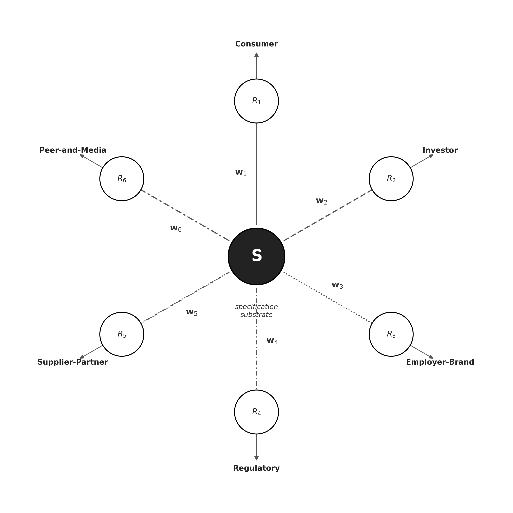

# Specification Readiness and Endogenous Friction: An Information-Theoretic Model of Multi-Interface Organizational Architecture

Dmitry Zharnikov

ORCID: 0009-0000-6893-9231

DOI: [10.5281/zenodo.20379981](https://doi.org/10.5281/zenodo.20379981)

Working Paper v1.1.0 – May 2026 (revised June 2026)

---

## Abstract

Organizations incur substantial friction when guessing recipients' need profiles and pushing outputs toward those guesses. This paper develops an information-theoretic theory treating alignment friction as endogenous to specification codification. Architecture decomposes into three layers: a codified specification substrate encoding commitments across six ontological tiers, an interface layer defined by recipient-class perception-weight vectors, and a function layer whose headcount and spend constitute a measurable tax on specification gaps. In push regimes, energy loss scales with cross-entropy between guessed and actual need profiles. In pull regimes, consumption-layer AI lets recipients query the specification directly, collapsing misalignment toward zero as codification completeness rises. Recipient classes are architectural primitives whose distinct perception geometries impose coherence conditions across interfaces. Four contributions follow. First, push-pull cost asymmetry is formalized as a structural analog to Shannon's cross-entropy. Second, geometric machinery links specification to interface rendering. Third, functional friction is a consequence of specification investment rather than governance choice. Fourth, specification readiness is the critical moderator of AI returns, distinguishing Substrate-Operator execution (specification-constrained, coherent across interfaces) from Surface-Operator execution (locally fluent, globally inconsistent). Specification codification is architecturally prior to governance and capability deployment; the theory generates predictions distinct from transaction-cost economics, stakeholder theory, and existing AI-augmentation scholarship.

**Keywords**: organizational coupling; multi-interface architecture; specification readiness; recipient-class perception geometry; endogenous friction; push-pull asymmetry; AI-mediated pull

---

Every organization must solve a structural coupling problem: how to align what it actually is with what multiple, heterogeneous audiences perceive it to be. Traditional solutions have relied on push — pre-rendered outputs sent toward guessed recipient needs. The resulting misalignment generates measurable friction: marketing spend that fails to convert, investor relations efforts that do not shift valuations, recruiting costs that do not improve retention. This friction is not an exogenous feature of the environment but an endogenous consequence of incomplete specification investment.

Consumption-layer AI fundamentally alters the feasible solution space. When recipients — or their AI agents — can query a codified organizational substrate directly, the mechanical necessity of push disappears. Yet most firms continue to invest in ever-larger interface-maintaining functions rather than upstream specification codification. This observation reveals a theoretical puzzle that existing frameworks cannot resolve. Transaction-cost economics [@coase-1937-nature-firm-economica; @williamson-1975-markets-hierarchies-analysis; @williamson-1985-economic-institutions-capitalism] optimizes governance structures given a level of friction; it does not theorize the organizational investment that sets the friction level itself. Stakeholder theory [@freeman-1984-strategic-management-stakeholder; @mitchell-1997-toward-theory-stakeholder] correctly identifies multiplicity of audiences but supplies salience-ranking mechanisms rather than architectural principles for rendering a common specification across non-commensurable perception geometries. Dynamic-capabilities scholarship [@teece-1997-dynamic-capabilities-strategic; @raisch-2021-artificial-intelligence-management; @schilke-2018-quo-vadis-dynamic] recognizes complementary investments yet stops short of specifying what those investments must be when AI operates at the consumption layer. Puranam's [-@puranam-2018-microstructure-organizations-oxford] microstructure framework develops epistemic interdependence as a design principle but does not trace cost consequences when interdependence is unresolved across multiple recipient classes simultaneously.

The gap is both structural and consequential. Each tradition treats friction as an input. None asks how that friction level is set by prior specification choices. The present theory proposes that specification codification is the sequentially prior variable — the organizational choice that endogenizes the friction which downstream governance structures, salience allocations, and capability deployments then manage. Recognizing this priority reorients standard capital-allocation logic: the theory predicts that returns to specification codification dominate returns to functional capacity when AI penetrates to the consumption layer.

This paper develops an information-theoretic model of multi-audience organizational coupling. The model's central claim is that alignment friction is endogenous to specification codification. When specifications are incomplete or contradictory, functions must apply force (push) to compensate. When specifications are coherent and queryable, recipients — or their AI agents — pull directly, converting functions from force-appliers to monitors. The strategic variable is therefore not governance form but the firm's choice of how completely to codify commitments across six ontological tiers and how to design rendering policies for six canonical recipient classes, each characterized by a distinct perception-weight vector **w**_i.

This claim extends beyond brand or marketing scholarship. The manufacturing evidence establishes the point at scale: Ohno's [-@ohno-1988-toyota-production-system] Toyota Production System showed that push-based material requirements planning forces production against forecast, generating inventory buffers, waste, and rework; kanban-based pull systems let downstream demand signal upstream production directly, eliminating the buffer. Womack, Jones, and Roos [-@womack-1990-machine-that-changed] generalized the demonstration; four decades of operations research confirm the structural logic. The present paper applies the same criterion to demand-specification coupling across the breadth of multi-audience organizational output systems within the five scope conditions enumerated below. The information-theoretic framing — following a structural analog to Shannon [-@shannon-1948-mathematical-theory-communication], explicitly licensed in the tradition of Puranam, Raveendran, and Knudsen [-@puranam-2012-organization-design-epistemic] and Csaszar and Eggers [-@csaszar-2013-organizational-decision-making] — supplies the formal machinery to make this cross-domain claim tractable.

Four contributions follow. First, this paper formalizes push-pull asymmetry as a structural analog to Shannon's [-@shannon-1948-mathematical-theory-communication] cross-entropy: push-regime energy loss is H(p, q) between actual and guessed recipient need profiles; pull-regime energy collapses toward zero as specification codification increases. Second, it introduces the multi-interface specification model, which decomposes organizational output architecture into specification, interface, and function layers and defines N recipient classes as the strategic variable organizing the interface layer. Third, it derives the function-as-friction-tax proposition with lineage in Radner [-@radner-1993-organization-decentralized-information], providing an architectural account of why functional headcount in interface-maintaining roles is a structural consequence of specification gaps rather than a governance choice — answering directly the call by Felin and Holweg [-@felin-holweg-2024-theory-is-all-you-need] for theory-grounded engagement with AI's organizational implications. Fourth, it distinguishes Substrate-Operator from Surface-Operator and establishes that AI-ROI realization tracks specification readiness, not AI spend — directly engaging the theory-deficit Felin and Holweg [-@felin-holweg-2024-theory-is-all-you-need] identify in AI research.

The paper proceeds as follows. The next section synthesizes structural deficiencies in prior literature and presents a comparative assumptions table. The Multi-Interface Specification Model section introduces the three-layer decomposition, formalizes the rendering operator and coherence condition, and states five formal propositions with comparative statics. The Formalization of Push-Pull Asymmetry section derives the information-theoretic asymmetry and the friction-tax proposition. The Discussion section develops theoretical contributions to the theory of the firm, stakeholder theory, and capability scholarship, enumerates five scope conditions, and addresses falsifiability. The paper concludes with the four interlocking contributions.

---

## **Theoretical Lacunae**

***Prior Traditions and Their Structural Gaps***

Three traditions form the direct intellectual antecedents of this paper. Each has developed substantial apparatus for the problems it addresses, and each leaves a structural gap that the present theory fills. Table 1 compares the core assumptions across these traditions and the proposed framework.

*Transaction-cost economics.* Coase [-@coase-1937-nature-firm-economica] asked where the boundary of the firm should be drawn: at the point where market transaction costs exceed internal coordination costs. Williamson [-@williamson-1975-markets-hierarchies-analysis; -@williamson-1985-economic-institutions-capitalism] developed TCE into a mature framework in which governance structures — markets, hierarchies, hybrids — are chosen to minimize transaction costs given existing frictions generated by asset specificity, uncertainty, and opportunism. The gap is equally precise: TCE treats friction as exogenous to governance choice. The sequentially prior question — what organizational investment sets the friction level itself — falls outside TCE's optimization problem. Adner, Puranam, and Zhu [-@adner-2019-what-is-different] address what is distinctive about digital strategy and specification-constrained rendering; the present paper extends further by identifying specification readiness as the architectural determinant of pull feasibility in AI-mediated markets. Foss and Klein [-@foss-2005-theory-firm-its] address post-digitization capabilities and boundaries but do not theorize the specification-readiness bottleneck. TCE generates no prediction about the sign of the relationship between specification investment and functional headcount; the present theory predicts a negative relationship.

*Stakeholder theory.* Freeman [-@freeman-1984-strategic-management-stakeholder] established that firms transact with multiple stakeholder classes whose interests and time horizons differ. Mitchell, Agle, and Wood [-@mitchell-1997-toward-theory-stakeholder] formalized stakeholder salience as a function of power, legitimacy, and urgency, developing the ranking from latent to definitive salience. Donaldson and Preston [-@donaldson-1995-stakeholder-theory-corporation] established the normative-instrumental-descriptive structure of stakeholder theory. Harrison, Bosse, and Phillips [-@harrison-2010-managing-stakeholders-stakeholder] formalized stakeholder utility-function heterogeneity as a determinant of competitive advantage. Bridoux and Stoelhorst [-@bridoux-2014-microfoundations-stakeholder-theory] supplied microfoundations for stakeholder heterogeneity in motivational architectures.

The structural gap is geometric. The most developed stakeholder-theory treatments operate on attributes of stakeholders as seen by managers [@mitchell-1997-toward-theory-stakeholder] or on motivational heterogeneity [@bridoux-2014-microfoundations-stakeholder-theory]. Neither supplies the machinery to specify how the firm designs architecturally distinct interfaces for multiple recipient classes, or what it means for those interfaces to be coherent or contradictory. The question "how much attention should managers allocate to which stakeholders?" is different from the question "how should the firm design its interface architecture to minimize aggregate friction across all recipient classes simultaneously?" The six canonical interfaces in the present model correspond to the six structurally distinct evaluation traditions that Mitchell, Agle, and Wood's [-@mitchell-1997-toward-theory-stakeholder] typology implies: consumer [@keller-1993-conceptualizing-measuring-managing], investor [@healy-2001-information-asymmetry-corporate], employee [@edmondson-2003-speaking-up-operating; @detert-2007-leadership-behavior-employee], regulator [@bitektine-2011-toward-theory-social], supplier-partner [@dyer-1998-relational-view-cooperative], and peer-and-media [@rindova-2005-being-good-or]. These are not arbitrary — they correspond to six structurally distinct evaluation traditions in management scholarship.

*Dynamic capabilities.* Teece, Pisano, and Shuen [-@teece-1997-dynamic-capabilities-strategic] introduced the sense-seize-reconfigure triad as the mechanism through which firms maintain advantage under technological change. Raisch and Krakowski [-@raisch-2021-artificial-intelligence-management] established that AI automation and AI augmentation generate divergent returns depending on organizational substrates. Schilke, Hu, and Helfat [-@schilke-2018-quo-vadis-dynamic] provide a content-analytic synthesis of the dynamic-capabilities construct. Krakowski, Luger, and Raisch [-@krakowski-2023-artificial-intelligence-changing] extend the dynamic-capabilities tradition to AI-era competitive advantage, showing how the sources of advantage shift when AI penetrates strategic decision-making. Stelmaszak, Joshi, and Constantiou [-@stelmaszak-2026-artificial-intelligence-as] frame artificial intelligence itself as an organizing capability arising from human–algorithm relations, situating AI as a capability-formation locus rather than merely an automation tool. This literature correctly identifies that complementary investments moderate AI returns yet does not specify what those investments must be when AI operates at the consumption layer. The present paper closes that gap by identifying specification codification as the precise form of complementary investment that moderates AI-ROI; this answer satisfies the microfoundational-specificity standard developed by Felin, Foss, Heimeriks, and Madsen [-@felin-2012-microfoundations-routines-capabilities] and Felin, Foss, and Ployhart [-@felin-2015-microfoundations-movement-strategy] for grounding capability constructs in identifiable individual-level actions — here, the act of codifying a specification artifact that an operator (human or AI) can query.

*Theory-based view.* The theory-based view holds that firms compete through firm-specific causal theories of value creation, and that articulating and acting on those theories improves strategic outcomes [@felin-holweg-2024-theory-is-all-you-need]. Ott and Hannah [-@ott-2024-origin-entrepreneurial-theories], in a five-year longitudinal study of nine consumer-platform ventures, show that such theories are not given but made: each begins as a thesis — an initial, poorly articulated idea — and matures into an actionable causal model through iterated theorizing practices and data generation. This literature theorizes how a theory becomes articulable in the founders' minds; it does not theorize whether that theory has been externalized into an artifact an operator can act on without them. The present theory supplies that missing stage: specification readiness is the codification continuation of the thesis-to-theory gradient Ott and Hannah document — where their account ends when a theory is articulable, specification readiness measures how much of it has been rendered into a queryable substrate, making the founders' tacit causal model executable by a human or AI operator at the consumption layer.

*Knowledge codification.* The treatment of codification as a strategic variable originates in the knowledge-management tradition. Boisot [-@boisot-1998-knowledge-assets-securing] modeled codification — the degree to which knowledge is rendered into symbolic, transmissible form — as one axis of an organization's information space, alongside abstraction and diffusion. Davenport and Prusak [-@davenport-1998-working-knowledge-how] treated the codification of organizational knowledge as a core management practice governing how knowledge is stored, transferred, and reused. Brown and Duguid [-@brown-2000-social-life-information] supplied the countervailing caution that information carries a social life its formal encoding cannot fully capture, bounding the completeness any codification attains. The present theory inherits codification as its central variable but relocates the construct: where the knowledge-management tradition treats codification as a means of internal knowledge reuse, here the codification of the organizational specification is the architectural antecedent that determines whether AI-mediated pull can substitute for functional push across recipient classes — a shift from knowledge-sharing efficiency to interface-substitutability feasibility.

*Open Strategy.* Hautz, Seidl, and Whittington [-@hautz-2017-open-strategy-dimensions] and Whittington [-@whittington-2019-opening-strategy] develop an alternative architectural answer to the multi-audience coordination problem: inclusive process. Open Strategy proposes that strategy formation across heterogeneous audiences is achieved through inclusion (multi-stakeholder participation), transparency (open access to in-progress strategic content), and procedural openness rather than through architectural codification. The present theory differs structurally rather than competitively: Open Strategy specifies the *process* by which a specification gains political legitimacy across recipient classes; the present theory specifies the *artifact* whose codification mediates AI-substitutability across recipient classes. The two are complementary in principle — codification supplies the artifact that inclusion legitimates; inclusion supplies the political acceptability that lets codification bind — but they make discriminating empirical predictions. Under the specification-readiness theory, firms that are inclusion-high but codification-low (process-heavy consultancies that revisit specifications each engagement) realize lower AI ROI than firms that are inclusion-low but codification-high (regulatory-disclosure firms whose specifications are exhaustively codified but produced through bounded internal processes); under Open Strategy, inclusion intensity should dominate. This contrast is developed as a falsifiable prediction in the Falsifiability and Future Research section.

*Sociomateriality and the substrate–rendering separation.* Orlikowski and Scott [-@orlikowski-2008-sociomateriality-challenging-separation] and Leonardi [-@leonardi-2013-theoretical-foundations-study] develop the sociomaterial position that technology, work, and organization are constitutively entangled and that analytic separation of material artifact from social practice misrepresents organizational reality. The present theory's distinction between substrate (codified specification) and rendering (operator execution) might appear to require ontological separability of artifact and practice. It does not. The substrate–rendering distinction is *analytic*, not *ontological*: at execution time, substrate, operator, and recipient class are constitutively entangled in the rendering event — this paper does not deny that. What it claims is that the *design problem of what to codify* is logically separable from the *practice problem of how rendering occurs*, and that this analytic separation is what makes architectural choice (the codification investment c) a tractable variable. Sociomateriality's constitutive-entanglement claim concerns the execution-time integration of human, material, and social agency; the present theory's separability claim concerns the design-time decomposition of codification investment from rendering practice. The two positions coexist.

***Information-Theoretic Lineage***

The information-theoretic framing draws on two lineages developed in organizational theory. The Radner [-@radner-1993-organization-decentralized-information] lineage treats organizational layers as information-processing costs: Arrow [-@arrow-1974-limits-organization-new] established authority and communication channels as organizational costs; Milgrom and Roberts [-@milgrom-1992-economics] established complementarities in organizational design; Csaszar and Eggers [-@csaszar-2013-organizational-decision-making] model organizational decision-making using Shannon-adjacent language; Csaszar [-@csaszar-2018-what-makes-decision] develops organizational structure as an information filter. Anderson, Banker, and Janakiraman [-@anderson-2003-are-selling-general] provide the empirical anchor: SG&A costs are quasi-fixed overhead with asymmetric adjustment, consistent with function-layer spending as a structural consequence of specification gaps.

The modularity lineage supplies formal language for interface coherence. Baldwin and Clark [-@baldwin-2000-design-rules-power] establish that layered modular architectures reduce design costs through interface standardization. Ethiraj and Levinthal [-@ethiraj-2004-modularity-innovation-complex] formalize the conditions under which module boundaries stabilize or fragment under search. Galbraith [-@galbraith-2014-designing-organizations-strategy] establishes interface design as the central problem of organizational architecture. Puranam, Raveendran, and Knudsen [-@puranam-2012-organization-design-epistemic] develop epistemic interdependence as the cross-agent design problem that interface architecture must resolve — the cross-layer logic the present paper formalizes. Adner, Puranam, and Zhu [-@adner-2019-what-is-different] establish that digital strategy's distinctiveness lies precisely in the feasibility of specification-constrained rendering that analog architectures could not achieve.

Table 1: Comparison of Assumptions Across Four Theoretical Frameworks.

| Theoretical assumption | TCE (Coase, Williamson) | Stakeholder Theory (Freeman, Mitchell et al.) | Dynamic Capabilities (Teece, Helfat) | Multi-Interface Specification Model |
|---|---|---|---|---|
| Friction status | Exogenous input to governance choice | Implicit / unmodeled | Bundled into "capabilities" | Endogenous to specification investment |
| Recipient treatment | Generic counterparty | Salience-ranked stakeholder | Capability beneficiary | Distinct perception geometry |
| Coupling object | Transaction | Stakeholder claim | Capability deployment | Specification rendering |
| Optimization variable | Governance form | Stakeholder attention | Capability development | Specification codification |
| AI role | Unspecified | Unspecified | Generic complement | Substrate-Operator vs Surface-Operator renderings |

*Notes*: Each row identifies a structural assumption made by each tradition. The proposed framework's column shows the move adopted in this paper.

---

## **The Multi-Interface Specification Model**

The central architectural contribution is a three-layer decomposition of organizational output architecture: a specification layer that constitutes what the firm actually is; an interface layer through which that specification is rendered to distinct recipient classes; and a function layer comprising the operational capabilities that maintain alignment between specification and interface.

***The Specification Layer***

The specification layer is the substrate. It encodes what the firm actually is, what it commits to producing, how it operates, and under what conditions its commitments persist. The specification is not any single document. It is the full stack of commitments across all six tiers of the organizational ontology [@zharnikov-2026-dual-hierarchies-organizational-transferability-six]: the owner-intent commitment at Tier 1, the business-model logic at Tier 2, the legal-entity structure at Tier 3, the product and brand definition at Tier 4, the operational process codification at Tier 5, and the organizational capability and cultural commitment at Tier 6.

The specification has the properties Penrose [-@penrose-1959-theory-growth-firm] identified as characteristic of inimitable organizational resources: its value derives from the organizational history that produced it, which competitors observing only surface renderings cannot access. Dierickx and Cool [-@dierickx-1989-asset-stock-accumulation] establish that asset stocks accumulate through sustained investment flows and cannot be acquired in factor markets; the specification substrate exhibits precisely this property. Barney's [-@barney-1991-firm-resources-sustained] VRIN conditions apply directly: a coherent, versioned, machine-readable specification generated through organizational history is both inimitable and non-substitutable. Peteraf's [-@peteraf-1993-cornerstones-competitive-advantage] four cornerstones map onto the specification substrate's competitive properties. Critically, a specification that claims one thing and does another is a contradictory specification, not a pull-capable substrate.

***The Interface Layer***

The interface layer comprises the distinct renderings of the specification that the firm produces for different recipient classes. Six canonical interfaces correspond to the primary recipient classes that strategic management theory and organizational economics have identified as consequential counterparties: the consumer interface, maintained toward purchasing and repeat-purchasing agents; the investor interface, maintained toward capital-allocating agents; the employer-brand interface, maintained toward current and prospective employees; the regulatory-positioning interface, maintained toward state and supra-state authority; the supplier-partner interface, maintained toward supply-chain and distribution counterparties; and the peer-and-media interface, maintained toward competitors, partners, analysts, and journalists.

Each interface has three defining attributes: the recipient class (the set of agents characterized by a common perception geometry, a common access pattern, and a common decision context); the emission policy (the firm's choice of whether to push this interface at this recipient class or to codify the specification so that the recipient class can pull it); and the interface-specific perception geometry (a weighting vector over the specification's dimensions that determines which elements of the specification are visible to this recipient class). The perception-weight vector **w**_i is treated throughout as the class-expectation weight vector; within-class dispersion is bounded by recipient-class construction (agents are grouped into a class precisely because they share a common perception geometry within a threshold) and is reserved for future work that relaxes the class-homogeneity assumption.

Interface coherence obtains when two conditions hold simultaneously: the specification is internally consistent across tiers, and each interface rendering accurately reflects the specification rather than papering over its gaps. Zavyalova, Pfarrer, Reger, and Hubbard's [-@zavyalova-2016-reputation-as-multiaudience] empirical finding — that the same firm signal generates structurally distinct reputation outcomes across audiences — is precisely the inter-interface divergence the present model identifies as a specification-level property rather than a communication artifact. Digital disruption does not merely complicate communication; it exposes specification-level inconsistencies that push-based interface management had previously suppressed, because AI-mediated recipients query the substrate directly and surface contradictions that no amount of push-rendering can paper over.

***The Function Layer***

The function layer comprises the organizational capabilities that maintain spec-to-interface alignment. Marketing maintains the consumer interface. Investor relations maintains the investor interface. Human resources and recruiting maintain the employer-brand interface. Legal and compliance maintain the regulatory-positioning interface. Procurement and supply-chain management maintain the supplier-partner interface. Communications and public affairs maintain the peer-and-media interface.

In the information-processing tradition of organizational design [@galbraith-2014-designing-organizations-strategy; @puranam-2018-microstructure-organizations-oxford], the structural question is how information-processing capacity is distributed across layers — precisely the question the function-layer analysis addresses. When the specification is strong and coherent, the function's role is monitoring and calibration. When the specification is weak or contradictory, the function applies force — marketing spend, roadshow presentations, recruiter outreach, regulatory filings — to compensate.

***The Rendering Operator and Coherence Condition***

To operationalize perception geometry formally, let the specification be a vector **S** ∈ ℝ^d where d is the dimensionality of the firm's identity-relevant attributes across all six tiers. Recipient class r_i has a perception-weight vector **w**_i ∈ ℝ^d where **w**_{i,k} indicates how heavily attribute k weighs in r_i's evaluation. The rendering operator produces the scalar evaluation r_i applies to the firm:

> R_i(**S**, **w**_i) = ⟨**S**, **w**_i⟩ + ε_i

where ε_i is the rendering-process noise specific to the interface's emission policy: lower under pull, where the recipient queries the specification directly; higher under push, where the sender must guess the recipient's need profile and absorb alignment friction. Interface coherence between two recipient classes i and j holds when their normalized renderings are within a threshold κ:

> ‖⟨**S**, **w**_i⟩/‖**w**_i‖ − ⟨**S**, **w**_j⟩/‖**w**_j‖‖ ≤ κ

Interface incoherence is a specification-level contradiction — a property of **S** — not a communication failure. This coherence condition has no counterpart in TCE or stakeholder-salience theory, both of which treat coupling as bilateral and static rather than as a one-to-many architecture problem with cross-class coherence constraints. Ethiraj and Levinthal's [-@ethiraj-2004-modularity-innovation-complex] formalization of module boundary stability supplies the closest prior-art machinery; the coherence condition generalizes their analysis from production modules to interface renderings.

Figure 1 illustrates the model architecture: a single specification vector **S** ∈ ℝ^d at the center; six perception-weight vectors **w**_1 through **w**_6 emanating outward, each with a distinct pattern of dimension weights; six rendering operators R_1 through R_6 mapping **S** × **w**_i to interface-specific scalar evaluations; and six interface labels (Consumer, Investor, Employer-Brand, Regulatory, Supplier-Partner, Peer-and-Media) at the periphery. The key architectural insight is that a single substrate supports six structurally distinct renderings — coherence is a property of **S**, not of any individual rendering.

**Figure 1:** The Multi-Interface Specification Model — One Substrate, Six Rendering Operators.

*Notes*: Hub-and-spoke architecture. Specification substrate **S** sits at the hub. Six perception-weight vectors **w**_1 through **w**_6 emanate as spokes with distinct dimension-weight profiles, one per recipient class. Six rendering operators R_1 through R_6 — represented by the nodes at the spoke ends — map **S** × **w**_i to interface-specific output. Recipient-class labels (Consumer, Investor, Employer-Brand, Regulatory, Supplier-Partner, Peer-and-Media) sit at the periphery. Coherence is measured by the maximum pairwise difference between normalized renderings — a property of **S**'s consistency across tiers, not of any individual **w**_i. Operators (whether human or AI) execute the R_i rendering operation; Substrate-Operators query **S**; Surface-Operators do not.

The Brand-as-Modular-Layer framework [@zharnikov-2026-brand-as-modular-layer-tiered] establishes that brand surface is the Tier-4 product specification's consumer-facing interface. The present model extends laterally: rather than one interface at Tier 4, there are N structurally distinct interfaces each rendered to a different recipient class from the same specification substrate.

***Scope Conditions***

Five scope conditions define the theory's domain and appear here, immediately after the model, to sharpen interpretation of the propositions that follow.

*No-specification firms.* The pull regime requires a queryable substrate. Firms operating without a codified specification — early-stage startups before product-market fit stabilizes, firms in active restructuring — have no pull-capable substrate. The theory predicts that such firms will have high function-layer intensity as a structural consequence of specification absence.

*Monolithic recipient class.* The multi-interface architecture requires at least two structurally distinct recipient classes. Firms whose entire strategic dependency derives from a single recipient class operate with a degenerate architecture in which recipient-class differentiation collapses.

*No AI-mediation regime.* The phase-shift argument depends on AI operating at the consumption layer. In markets where AI-mediated consumption has not diffused — highly regulated information environments, air-gapped institutional settings — recipients default to push-dependent reception regardless of the firm's specification quality.

*Non-codifiable specifications.* Pull infrastructure requires a codifiable substrate. Codifiability is graded rather than binary: most firms codify operations-tier specifications fully, governance-tier specifications partially, and culture-tier specifications only fragmentarily. Domains in which the firm's core specification is genuinely tacit and resists codification — artisan craft, relational-service delivery, bespoke legal or surgical judgment — cannot build pull infrastructure regardless of AI capability at the consumption layer [@nonaka-1994-dynamic-theory-organizational]. For these firms, push remains the only viable interface architecture because there is no substrate to query at the relevant tier.

*Adversarial recipient classes.* A recipient class whose interests directly oppose the firm's reverses the pull efficiency claim: a fully machine-queryable specification that lowers alignment friction for cooperative recipients also lowers extraction friction for adversarial ones. The theory's pull-efficiency claim is scoped to non-adversarial recipient classes.

***Formal Propositions***

Five formal propositions with comparative statics follow from the three-layer architecture and the rendering operator. These are theoretical predictions derived from the model's structure — not empirical propositions with identification strategies, which are developed in the companion empirical paper Zharnikov [-@zharnikov-2026an-specification-readiness-empirical].

**Proposition 1 (Interface Coherence).** Interface coherence — measured as the minimum cosine similarity between normalized renderings across pairs of recipient classes — is non-decreasing in specification consistency across tiers. Formally, if specification **S** is consistent across tiers t_1, t_2 (i.e., the value assigned to each attribute is identical across tier renderings), then min_{i,j} cos(R_i(**S**, **w**_i), R_j(**S**, **w**_j)) ≥ θ for some threshold θ > 0; if specification is inconsistent, coherence is unbounded below. *Comparative static*: ∂(min_{i,j} cos(·))/∂c ≥ 0, where c is specification codification completeness. Higher codification produces weakly greater inter-interface coherence.

**Proposition 2 (Friction-Tax Scaling).** The functional friction tax T scales positively with specification gap g and inversely with codification investment c. Formally, T(g, c) = α · g(c)/c + β, where g(c) is non-increasing in c (more codification reduces the gap). This derivation follows from Radner's [-@radner-1993-organization-decentralized-information] information-processing-cost framework extended to multi-audience interface rendering. *Comparative static*: ∂T/∂c < 0 for all interior points of the codification domain. Increasing specification investment reduces the aggregate friction tax across all N interfaces.

**Proposition 3 (Push-Pull Cost Asymmetry).** Under the cross-entropy structural analog, push-regime alignment cost C_push = H(p, q), where p is the recipient's actual need profile and q is the firm's guessed need profile. Pull-regime alignment cost C_pull = H(p, **S**|p), which approaches 0 as specification codification completeness → 1 and recipient query capability → 1. *Comparative static*: ∂(C_push − C_pull)/∂c > 0. The cost asymmetry between push and pull grows strictly with codification investment. At full codification, pull dominates push at every interior point of the parameter space.

**Proposition 4 (AI Phase-Shift Boundary).** The fraction of firms operating in a viable pull regime is monotonically increasing in α, the consumption-layer AI penetration parameter. For α = 0, only domains with pre-AI codified substrates (financial accounting, manufacturing parts catalogs) operate in pull. For α ≥ α* ≈ .6 − .9 (domain-dependent), nearly all coupling domains become pull-viable. *Comparative static*: ∂(pull-viable fraction)/∂α > 0. Substrate-Operator execution — whether by a human or an AI that queries the specification — realizes the pull regime; Surface-Operator execution — locally fluent but globally inconsistent output produced without specification grounding — does not. The α* threshold is treated as a domain-specific parameter for future empirical estimation; the Brynjolfsson, Rock, and Syverson [-@brynjolfsson-2017-artificial-intelligence-modern] AI-productivity-paradox data provide one empirical anchor on the order of magnitude (the productivity gap closes only after AI penetration exceeds a complementary-investment threshold of similar magnitude).

**Proposition 5 (Specification Readiness Moderates AI ROI).** AI return on investment, holding AI spend constant, is monotonically increasing in pre-AI specification codification c. Formally, ∂(ROI_AI)/∂c|_{spend} > 0. *Comparative static*: ∂(ROI_AI)/∂(spend)|_{c} is bounded above by a function of c — high AI spend without codification produces bounded marginal returns. Specification readiness moderates the substitutability of human Substrate-Operators by AI Substrate-Operators: firms with codified specifications realize higher AI returns because the AI-substitutable share of operator roles is larger. This proposition operationalizes Brynjolfsson, Rock, and Syverson's [-@brynjolfsson-2017-artificial-intelligence-modern] complementarity finding by specifying what the complementary investment must be: codification of the specification substrate that enables AI Substrate-Operator execution rather than Surface-Operator substitution.

---

## **Formalization of Push-Pull Asymmetry**

***Information-Theoretic License***

The energy-and-friction vocabulary used throughout this paper functions as a structural analog licensed by Shannon's [-@shannon-1948-mathematical-theory-communication] information-entropy formalism, not a literal physical claim about organizations. The structural-analog license is the same Shannon invoked when he demonstrated that the mathematics of entropy, originally developed in statistical mechanics, applies with equal rigor to information uncertainty without requiring that messages and heat be commensurable. Energy in the present theory denotes measurable resource expenditure — budget, headcount, management attention — consumed to close the gap between what the firm produces and what the recipient class needs. Friction denotes the measurable waste generated by misalignment between a pushed output and the recipient's actual need profile. Entropy denotes the degree of misalignment between the firm's specification vector **S** and the recipient class's perception-weight vector **w**_i.

This is a structural analog in the tradition of Puranam, Raveendran, and Knudsen [-@puranam-2012-organization-design-epistemic] and Csaszar and Eggers [-@csaszar-2013-organizational-decision-making], who apply information-theoretic concepts as formal organizational analogs rather than literal physical claims. Empirical measurement requires resource-expenditure accounting, not calorimetry.

***Derivation of Push-Pull Cost Asymmetry***

The push-pull cost asymmetry follows from the structural-information-entropy analog as follows. Let p ∈ Δ^d be the recipient's true need profile over d specification attributes, and let q ∈ Δ^d be the firm's guessed need profile (where Δ^d is the d-simplex). Under push, the firm renders output against q; the alignment cost is the cross-entropy:

> H(p, q) = −Σᵢ pᵢ log qᵢ

By Gibbs' inequality, H(p, q) ≥ H(p) with equality if and only if p = q; misalignment cost is therefore bounded below by entropy of p and unbounded above. The information-theoretic vocabulary used here — cross-entropy, KL divergence, Shannon [-@shannon-1948-mathematical-theory-communication] — follows the canonical treatment in Cover and Thomas [-@cover-2006-elements-information-theory]. Kronrod and Huber [-@kronrod-2019-ad-wearout-wearout] document one mechanism through which push energy is systematically lost: high-frequency push generates annoyance that decays faster than memory, producing reversal effects in which the residual of a push campaign becomes positive only after the friction has dissipated. The push-energy-loss mechanism is empirically documented in the direction the theory predicts.

Under pull, recipient queries the firm's codified specification **S**. The cost is H(p, **S**|p) — the conditional cross-entropy between p and **S** given query knowledge of p. As codification completeness c → 1 and recipient AI query capability → 1, the conditional information about p contained in **S** approaches the recipient's own information; H(p, **S**|p) → 0 by the chain rule for conditional entropy. The asymmetry:

> C_push − C_pull = H(p, q) − H(p, **S**|p)

is strictly positive at all interior points of (c, AI penetration) parameter space, and approaches H(p, q) as c → 1. This establishes Proposition 3's comparative static analytically: the push-pull cost difference grows with codification investment and collapses push costs toward zero in the limit. Cao, Jiang, Yang, and Zhang [-@cao-2020-how-to-talk-machine-listening] document that machine-readable disclosures are increasingly consumed by AI systems that mine the underlying structured data rather than receiving pushed narrative summaries — precisely the investor-interface pull mechanism this derivation describes.

***Push-Regime Energy Loss***

Integrated over the population of recipients within a class and over the duration of the push campaign, total push energy is proportional to ∫∫ H(p_i, q_i) dt di. This is minimized when q = p across all recipients — a condition the function layer can approach only by investing in ever-finer-grained guessing of recipient need profiles. The function layer is therefore a structural embodiment of the firm's inability to observe p directly.

Hermès illustrates the consumer-interface pull state. The firm maintains relatively few retail locations globally, does not advertise at scale relative to category peers, and routinely generates waiting lists for its central products. The advertising-to-revenue ratio is structurally low; demand persistence following cessation of any given spend is structurally high. Patagonia approaches the same configuration from the ideological dimension: its specification's Tier-1 environmental commitment is sufficiently strong and verified over time that a large consumer cohort pulls the product without requiring constant push. The same configuration appears at the supplier-partner and operations interface in the Toyota Production System [@ohno-1988-toyota-production-system]: kanban-pull substitutes a codified specification of downstream demand for the inventory-buffer push system of MRP-era manufacturing, eliminating the function-layer overhead that buffered the upstream-downstream mismatch. Consumer-luxury, ideologically-grounded, and operations exemplars are illustrative rather than exhaustive; the theory's claim generalizes within the five scope conditions to investor, employer-brand, regulatory, and peer-and-media interfaces wherever a codifiable substrate is feasible.

***Pull-Regime Energy Collapse***

In pull regimes, H(p, **S**|p) → 0 in the limit of a perfectly codified specification coupled with a capable AI consumption layer that can render the specification into whatever format the recipient requires. Cao, Jiang, Yang, and Zhang [-@cao-2020-how-to-talk-machine-listening] show that machine-readable disclosures are increasingly consumed by AI systems — precisely the investor-interface pull mechanism the theory claims as timely. As machine-readable disclosure consumption by AI systems grows, sell-side analysts' exclusive role as human pull-interfaces for financial disclosures is structurally narrowing.

***Proposition on the Friction Tax***

*Informally stated*: Every functional layer that exists to maintain interface coherence under push conditions absorbs a fraction of firm energy that a pure pull system would not require. The aggregate friction tax across all N interfaces is a monotonically increasing function of the specification gap — the distance between the firm's actual specification and its pull-capable codification ceiling. Firms minimize their aggregate friction tax by codifying and strengthening the specification, reducing the force required to close it, and in the limit converting each function from a force-applier to a monitor-and-calibrator.

*Formal derivation.* Let G_i denote the specification gap at interface i, defined as the Euclidean distance between the fully codified specification **S*** and the firm's actual specification **S**: G_i = ‖**S*** − **S**‖ projected onto recipient class i's perception geometry. The force F_i required to maintain interface coherence at class i under push is increasing in G_i: F_i(G_i) > 0 for G_i > 0, and F_i(0) = F_min_i > 0, where F_min_i is the irreducible monitoring cost under full codification. The aggregate friction tax across N interfaces is T = Σ_i F_i(G_i). Specification investment that reduces G_i toward zero reduces T toward Σ_i F_min_i — the monitoring floor that pull systems cannot eliminate but also need not exceed. This establishes Proposition 2: ∂T/∂c < 0 for all interior points.

Jensen and Meckling [-@jensen-1976-theory-firm-managerial] provide the economic framing in which monitoring and governance functions are defined as costs incurred because of principal-agent misalignment — the alignment-friction reading. Anderson, Banker, and Janakiraman [-@anderson-2003-are-selling-general] establish empirically that SG&A costs are quasi-fixed and asymmetrically sticky — a structural consequence, on the present theory, of function layers existing to compensate for specification gaps rather than as flexibly efficient production inputs. This prediction — that specification codification reduces functional headcount and spend — is not derivable from TCE, which optimizes governance given G_i rather than predicting the functional-headcount consequences of G_i reduction.

***The Substrate-Operator Distinction***

Organizations render outputs through *operators* — entities that execute the rendering function for a recipient class. The term is used in its mathematical sense: an operator is the entity that applies a function to an argument and returns a value. The rendering operator R_i defined in the Multi-Interface Specification Model is one such function; the operator that executes R_i — that takes the specification S and the recipient-class perception weights w_i as inputs and produces interface output — is the entity of architectural interest in this section. (The same usage is established in the broader corpus: the projection operator π in Zharnikov [-@zharnikov-2026al-capability-as-projection] treats human and artificial entities symmetrically as executors of the capability-projection function on an organizational log.) Operators can be human (employees, contractors, partners) or artificial (large language models, retrieval-augmented systems, agentic workflows). The architectural question is not whether the operator is human or artificial but whether it operates as a Substrate-Operator or a Surface-Operator.

A Substrate-Operator queries the firm's codified specification substrate and renders output constrained by what the specification permits. A Surface-Operator produces output without grounding in the specification — relying on pattern-matching, local context, or recalled training data. Locally, both can produce competent output for a single task. Globally, only the Substrate-Operator produces output that remains coherent across tasks, interfaces, and recipient classes. Raisch and Krakowski's [-@raisch-2021-artificial-intelligence-management] automation-augmentation distinction directly grounds this dichotomy: AI augmentation requires investment in the organizational substrates that AI can augment. Meincke and colleagues [-@meincke-2024-using-large-language] show that AI produces divergent quality outcomes depending on whether the underlying problem structure is coherent — a finding that maps directly onto the specification-readiness mechanism.

The distinction reframes the AI replacement question. AI does not replace humans qua humans. AI replaces humans qua operators in any rendering task where AI can execute the same operator role at lower cost or higher fidelity. The substitution happens at the operator level, not the human level. A human employee operating as a Substrate-Operator — cascading specification to interface output — is substitutable by an AI Substrate-Operator that performs the same specification-grounded rendering. The substitution is gated by whether AI can read the specification, render against it, and maintain fidelity at the relevant point of the work. Bloom, Garicano, Sadun, and Van Reenen [-@bloom-2014-distinct-effects-information] document empirically that better information and communication technology flattens hierarchical function layers — the pre-AI analog of what Substrate-Operator AI adoption delivers.

*Substrate-operator characteristics.*

A Substrate-Operator's output is constrained by the specification at generation time. The provenance of every rendered element traces back to a specification commitment, making the rendering auditable. Consistency across interfaces is achieved by construction: two Substrate-Operators serving different interfaces draw from the same substrate and produce outputs that satisfy the coherence condition defined in the Multi-Interface Specification Model. When the specification is incomplete, a well-designed Substrate-Operator returns a specification gap rather than confabulating — preserving auditability at the cost of a scope boundary.

*Surface-operator characteristics.*

A Surface-Operator's output is unconstrained by the firm's specification. Each rendering is locally fluent — consistent with the agent's training distribution or local context — but globally inconsistent, because no mechanism anchors output to the firm's Tier-1-through-Tier-4 commitments. Over time, a corpus of Surface-Operator output accumulates inconsistencies across interfaces: the consumer interface claims one thing about the firm's values while the employer-brand interface implies another. The firm has substituted scale for coherence without resolving the specification gap that generates misalignment. Vaccaro, Almaatouq, and Malone's [-@vaccaro-2024-when-combinations-humans] systematic review and meta-analysis of human-AI combination outcomes documents that combination performance turns on the structure of the underlying problem; the present theory identifies specification readiness as the precise structural condition that converts AI augmentation from a Surface-Operator failure mode into a Substrate-Operator gain.

*The substitution mechanism.*

Substrate-Operator roles substitute from human to AI execution faster than Surface-Operator roles because the specification is machine-readable by construction. An AI system that can read a versioned specification artifact and render against it performs the Substrate-Operator role at least as well as a human doing the same cascade-reading — and at lower marginal cost per rendering as volume scales. Brynjolfsson, Rock, and Syverson [-@brynjolfsson-2017-artificial-intelligence-modern] established that AI delivers returns only after complementary organizational investments are in place; the present theory specifies what those investments must be: specification codification that makes AI Substrate-Operator execution possible.

Surface-Operator roles persist on the human side longer when tacit interpretation is required — when the operator must exercise judgment that the specification does not fully constrain [@nonaka-1994-dynamic-theory-organizational]. But these are penalty roles created by specification gaps, not an inherent advantage of human operators. The architecturally correct response is to close the specification gap, converting the Surface-Operator role into a Substrate-Operator role that AI can subsequently execute. Defending a Surface-Operator role against AI substitution by claiming it requires tacit judgment is a claim that the specification is incomplete, which is exactly the condition the theory identifies as generating excess friction tax. Raisch and Fomina [-@raisch-2025-combining-human-artificial] establish that hybrid human–AI problem-solving in organizations decomposes into autonomous, sequential, and interactive search processes whose outcomes depend on organizational preconditions that existing AI-strategy literature has not systematically enumerated; specification readiness is the central such precondition identified in this theory.

*Implications for AI ROI.*

Firms realize AI returns by codifying specifications such that AI Substrate-Operator execution becomes possible across an increasing share of interface-maintaining roles. AI ROI tracks specification readiness because specification readiness sets the AI-substitutable share of operator roles. Firms that deploy AI without codifying specifications create AI Surface-Operators — locally fluent, globally misaligned, exactly the failure mode the substitution promise was supposed to avoid. Proposition 5 formalizes this moderating relationship: AI return on investment, holding AI spend constant, is monotonically increasing in pre-AI specification codification. The investment required to enable AI Substrate-Operator execution is identical to the investment required to make human operators Substrate-Operators: codify the specification, version it, make it machine-queryable, and cascade it to every interface-maintaining function.

A companion computation repository establishing numerical coherence of the rendering operator and friction-tax derivations is available online.[^code]

[^code]: The companion computation repository is available at https://github.com/spectralbranding/orgschema-papers/tree/main/specification-readiness/code/ under MIT license for code and CC BY 4.0 for documentation. The repository is shared with the empirical companion paper Zharnikov [-@zharnikov-2026an-specification-readiness-empirical] at concept DOI 10.5281/zenodo.20384084. The repository contains: [`friction_tax_montecarlo.py`](https://github.com/spectralbranding/orgschema-papers/blob/main/specification-readiness/code/friction_tax_montecarlo.py) (the Monte Carlo friction-tax simulation); [`push_pull_regression_sim.py`](https://github.com/spectralbranding/orgschema-papers/blob/main/specification-readiness/code/push_pull_regression_sim.py) (the regression-identification power simulation); [`PRE_EXPERIMENT_NOTES.md`](https://github.com/spectralbranding/orgschema-papers/blob/main/specification-readiness/code/PRE_EXPERIMENT_NOTES.md) (the pre-registration anchor and anti-HARKing register); [`POST_EXPERIMENT_REPORT.md`](https://github.com/spectralbranding/orgschema-papers/blob/main/specification-readiness/code/POST_EXPERIMENT_REPORT.md) (the PASS/FAIL evaluation and post-hoc deviation log); [`render_figure1.py`](https://github.com/spectralbranding/orgschema-papers/blob/main/specification-readiness/code/render_figure1.py) (matplotlib renderer for Figure 1); `monte_carlo_summary.csv` and `regression_simulation_summary.csv` (machine-readable result summaries); `plots/` (twelve diagnostic plots); `logs/` (verbatim stdout from both simulation runs, date-stamped); and [`README.md`](https://github.com/spectralbranding/orgschema-papers/blob/main/specification-readiness/code/README.md) documenting run commands, fixed seed, dependency manifest, and DOI linkage. The pre-registered methods appendix lives alongside the code at [`METHODS_APPENDIX.md`](https://github.com/spectralbranding/orgschema-papers/blob/main/specification-readiness/METHODS_APPENDIX.md). Fixed seed: `np.random.seed(20260525)`. The repository does not constitute empirical confirmation; real-firm confirmation requires the archival panel study developed in companion empirical work.

---

## **Discussion**

***Theoretical Contributions***

The information-theoretic theory of multi-interface organizational architecture makes four interlocking contributions to strategic organization theory.

First, it establishes specification codification as the sequentially prior variable that endogenizes friction levels taken as given by transaction-cost economics, stakeholder theory, and dynamic-capabilities scholarship. By treating friction as an output of upstream architectural choices rather than an input to downstream optimization, the theory generates predictions — most notably a negative relationship between specification investment and interface-maintaining functional headcount — that cannot be derived from existing frameworks even in reframed form. TCE and stakeholder theory are not displaced by this move; they are extended by identifying the prior optimization problem that sets the friction levels and salience structures they then manage.

Second, the theory supplies geometric machinery — recipient-class perception-weight vectors and associated coherence conditions — that translates stakeholder multiplicity into architectural design choices rather than attentional ranking. Interface incoherence is revealed as a specification-level contradiction propagated across structurally distinct projections, not a communication failure amenable to functional effort. This shifts stakeholder theory from "how much attention?" to "how should the firm design its interface portfolio to satisfy cross-class coherence constraints while minimizing aggregate friction?"

Third, the function-as-friction-tax mechanism, with clear lineage in Radner [-@radner-1993-organization-decentralized-information] and empirical grounding in SG&A stickiness [@anderson-2003-are-selling-general], provides the first architectural account of why interface-maintaining functions expand with specification gaps. Codification reduces those gaps, converting force-application into monitoring and producing observable declines in functional intensity.

Fourth, the framework identifies specification readiness as the critical moderator of AI augmentation returns. The Substrate-Operator versus Surface-Operator distinction operationalizes the complementarity Brynjolfsson, Rock, and Syverson [-@brynjolfsson-2017-artificial-intelligence-modern] and Raisch and Krakowski [-@raisch-2021-artificial-intelligence-management] identify but do not specify. AI does not render functional layers obsolete; coherent specification does.

***Implications for the Theory of the Firm***

The core implication for the theory of the firm is that firm boundaries should be evaluated not only where market transaction costs exceed internal coordination costs [@coase-1937-nature-firm-economica; @williamson-1975-markets-hierarchies-analysis] but where specification codification makes pull architecturally feasible — where a codified substrate can replace functional force-application as the mechanism of recipient-class alignment. Foss and Klein [-@foss-2005-theory-firm-its] address post-digitization firm theory; the specification-readiness construct extends their analysis to multi-interface architecture. Adner, Puranam, and Zhu [-@adner-2019-what-is-different] establish that digital strategy's distinctiveness lies in specification-constrained rendering; the present theory provides the organizational architecture through which that rendering is managed across multiple recipient classes simultaneously and extends to AI-mediated markets by identifying specification readiness as the architectural determinant of pull feasibility.

***Implications for Stakeholder Theory***

For stakeholder theory, the implication is that stakeholder multiplicity is architectural, not merely attentional. The present theory adds the geometric machinery: each stakeholder class occupies a distinct position in the firm's interface architecture, characterized by a perception-weight vector **w**_i that determines which specification dimensions are visible and at what rendering cost. This moves stakeholder theory from the question of "how much attention should managers allocate to which stakeholders?" to the question of "how should the firm design its interface architecture to minimize aggregate friction across all recipient classes simultaneously?" Harrison, Bosse, and Phillips [-@harrison-2010-managing-stakeholders-stakeholder] and Bridoux and Stoelhorst [-@bridoux-2014-microfoundations-stakeholder-theory] provide the microfoundational grounding for this move.

The theory also generates a new diagnosis of stakeholder-relation failure. When inter-interface contradictions arise — when the consumer interface claims one thing and the investor interface implies another — stakeholder theory diagnoses a communication or attention failure. The present theory diagnoses a specification-level contradiction propagated to two structurally distinct projections. These are different diagnoses with different remedies: communication interventions cannot resolve specification-level contradictions.

***Implications for Capability and AI Scholarship***

For capability theory, the implication is that the AI phase shift is a dynamic-capability event [@teece-1997-dynamic-capabilities-strategic] with a specific mechanism: specification readiness as the bottleneck. Firms that built pull-capable specification substrates before the shift realize the augmentation returns Raisch and Krakowski [-@raisch-2021-artificial-intelligence-management] identify; firms invested in push infrastructure face a structural disadvantage that increased push expenditure cannot resolve. The specification substrate, as Penrose [-@penrose-1959-theory-growth-firm] would recognize, derives its inimitability from the organizational history it records.

Schilke, Hu, and Helfat [-@schilke-2018-quo-vadis-dynamic] identify microfoundational specificity as the central challenge for dynamic-capabilities research. The present theory supplies a specific microfoundation for one class of dynamic-capability outcomes: specification codification is the observable organizational investment that determines whether AI augmentation generates returns or merely automates surface inconsistency. The microfoundational standard developed by Felin, Foss, Heimeriks, and Madsen [-@felin-2012-microfoundations-routines-capabilities] and Felin, Foss, and Ployhart [-@felin-2015-microfoundations-movement-strategy] — that collective-level constructs must bottom out in identifiable individual-level actions — is satisfied here at the codification act: an individual specification commitment, dated and attributable, is the irreducible unit that aggregates into the substrate. Felin and Holweg [-@felin-holweg-2024-theory-is-all-you-need] argue that AI research risks substituting data-based prediction for theory-grounded causal logic; the specification-codification construct is a direct response, grounding AI returns in an architectural precondition rather than scaling effects. Murray, Rhymer, and Sirmon [-@murray-2021-humans-technology-forms] develop a typology of human–technology conjoined agency in organizations; the Substrate-Operator versus Surface-Operator distinction refines that typology by conditioning agency type on the codification state of the underlying specification, predicting that the conjoined-agency forms Murray and colleagues identify are stable only when an upstream codification investment is sustained. Bailey, Faraj, Hinds, Leonardi, and von Krogh [-@bailey-2022-we-are-all] frame the post-AI research agenda as relational rather than substantive — emerging technology constitutes organizing relations rather than tools deployed within organizing — and the present theory specifies one such relational primitive: the operator-to-substrate query relation that distinguishes coherent AI augmentation from incoherent AI scaling. Hinds and von Krogh [-@hinds-2024-generative-ai-emerging] frame generative AI deployment as progressive encapsulation of organizational activity into machine-readable artifacts; the specification substrate is the upstream object that determines whether such encapsulation produces coherent or fragmented organizational output. Raisch and Fomina [-@raisch-2025-combining-human-artificial] and Vaccaro, Almaatouq, and Malone [-@vaccaro-2024-when-combinations-humans] establish performance and pathology conditions for human-AI combination; specification readiness is the architectural determinant of which condition obtains.

***Boundary Conditions***

Five scope conditions bound the theory's domain, each generating a falsifiable restriction. The theory applies to non-adversarial recipient classes (adversarial classes reverse the pull-efficiency claim), multi-audience organizational contexts (monolithic recipient-class firms have degenerate architectures), AI-mediated consumption environments (pre-AI contexts default to push regardless of specification quality), codifiable specification domains (tacit-specification domains cannot build pull infrastructure regardless of AI capability), and stable ontological tiers (firms in active restructuring lack the specification coherence required for pull architecture). Deviation from any condition changes the prediction.

***Falsifiability and Future Research***

The theory generates several falsifiable predictions. First, a negative relationship between specification codification investment and functional headcount in interface-maintaining roles: as specification codification increases, functional headcount decreases — not merely becomes more efficient. This is observationally distinct from TCE predictions. Second, a positive interaction between specification readiness and AI adoption in predicting performance outcomes: firms with higher pre-AI specification codification should realize greater returns from subsequent AI investment, holding AI spend constant. Third, inter-interface coherence should covary positively with specification consistency across tiers, and negatively with push-proxy magnitudes from Table 2. Fourth — discriminating against Open Strategy [@hautz-2017-open-strategy-dimensions] — under the specification-readiness theory, inclusion-high / codification-low firms (process-heavy consultancies that revisit specifications each engagement) realize lower AI ROI than inclusion-low / codification-high firms (regulatory-disclosure firms with exhaustively codified but bounded-internal specifications); under Open Strategy, the prediction is the reverse. This contrast can be tested in panel data that measures both inclusion intensity (multi-stakeholder participation in strategy formation) and codification completeness (machine-readable specification coverage) alongside AI deployment outcomes.

Operational empirical hypotheses derived from this theory are developed in the companion empirical paper Zharnikov [-@zharnikov-2026an-specification-readiness-empirical], which states the five propositions as falsifiable empirical hypotheses H1–H5 with pre-registered identification strategies and Monte Carlo mechanism tests. Future theoretical work should model mixed-adversarial portfolios, in which some recipient classes are cooperative and others adversarial, to specify the tradeoff between pull efficiency and extraction vulnerability. Future research should also formalize the optimal specification investment path under stochastic recipient perception vectors, building on Levinthal and Wu's [-@levinthal-2024-corporate-strategy-resource] resource-redeployment framework to model how specification investment evolves as firms redeploy capability stocks toward new best uses over time.

---

## **Conclusion**

These contributions redraw several theoretical boundaries. For the theory of the firm, boundaries should be evaluated not only where market transaction costs exceed internal coordination costs but where specification codification makes pull architecturally feasible. For stakeholder theory, the move from salience to perception geometry shifts the question from "how much attention?" to "how should the firm design its interface portfolio to satisfy cross-class coherence constraints while minimizing aggregate friction?" For capability and AI scholarship, the phase shift is not generic complementarity but a specific requirement that AI penetrate to the specification substrate rather than automate surface rendering.

The theory is bounded by the five scope conditions enumerated above. The ultimate prediction is architectural rather than technological: AI does not render functional layers obsolete, but coherent specification does. Under AI-mediated consumption, the theory predicts that returns to specification codification dominate returns to functional capacity — not as a prescriptive claim but as an observable structural consequence of the push-pull cost asymmetry derived in Proposition 3.

---

## Acknowledgments

AI assistants (Claude Opus 4.8, Grok 4.20 reasoning, Perplexity sonar-pro) were used for initial literature search, for software development — implementing and running the companion computation script(s) that reproduce the paper's reported numerical and simulation results — and for editorial refinement; all theoretical claims, propositions, and interpretations are the author's sole responsibility. The companion code repository (referenced in the footnote on the formal model section) carries the same author responsibility for design and interpretation; AI was used as implementation assistance under specified parameter constraints, not as a source of independent analytical contribution.

**CRediT Statement**: Dmitry Zharnikov: Conceptualization, Formal Analysis, Writing — Original Draft, Writing — Review and Editing.

---

## References

::: {#refs}
:::
