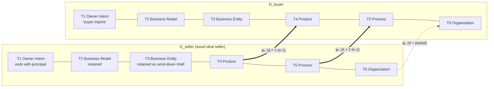

# Tier-Bundle Algebra in Inter-Organizational Resource Transfer: A Fork-Operation Formalism Over the Six-Tier Acquisition-Target Ontology

Dmitry Zharnikov

ORCID: 0009-0000-6893-9231

DOI: [10.5281/zenodo.21756077](https://doi.org/10.5281/zenodo.21756077)

Working Paper v1.1.0 – August 2026

## Abstract

Theories of the firm recognize that resources are interconnected in ways that limit transferability [@dierickx-1989-asset-stock-accumulation], yet no account specifies when a component becomes so identity-fused to a firm that decomposing the two destroys its value. Mergers-and-acquisitions practice meets this gap: transactions are classified by an enumerated table of named deal types (asset deal, carve-out, acqui-hire, roll-up, and others) arrived at inductively rather than derived from a generative rule, leaving hybrid or unnamed transactions with no principled place in the table. This paper reframes an acquisition as a typed bundle of fork operations over a target's six-tier structure, from Owner Intent through Organization: a tier-fork operation, a tier-bundle, and a bundle signature recover all fourteen named deal types as signature instances rather than hand-enumerated categories. A directional cascade rule specifies which tier-forks structurally require forks at adjacent tiers; an admissibility predicate, derived from the ontology's own tier-collapse states, formalizes when identity-fusion renders a component non-transferable. A worked hybrid example demonstrates a signature absent from existing taxonomies and yields three falsifiable predictions a flat taxonomy does not produce. Beyond this contribution to the theory of the firm, the structure is also checkable at term-sheet stage, before a deal's definitive agreements are drafted.

**Keywords**: mergers and acquisitions; tier-bundle algebra; fork operation; bundle signature; cascade propagation; structural admissibility; modularity theory; deal-type taxonomy

---

Organizational identity — what a firm's own principals, employees, and customers understand a component to be inseparable from — is a recognized boundary of the firm, distinct from the efficiency boundary of transaction-cost economics and the competence boundary of the resource-based view [@santos-2005-organizational-boundaries-theories]; identity functions as a coordinating mechanism whose separation from the asset it coordinates destroys the value that mechanism creates [@kogut-1996-what-firms-do]. Yet no existing account specifies, at the level of a checkable structural predicate rather than a case-by-case judgment, exactly when a particular component of a firm has become identity-fused with it in this sense, such that decomposing the two is not merely costly but structurally impossible without destroying the value of what is transferred. Mergers-and-acquisitions practice encounters this gap directly and repeatedly. The taxonomy of inter-organizational resource transfer has been enumerated, since [@coase-1937-nature-firm-economica], by the document that effects the transfer: asset deal, share deal, statutory merger, carve-out, spin-out, joint venture, franchise, redomiciliation, acqui-hire, roll-up. Each named type is individuated by the instrument under which it is executed and the counterparties whose signatures bind it. Transaction-cost economics [@williamson-1985-economic-institutions-capitalism] interrogates the firm-versus-market boundary at which such instruments are placed; the resource-based view [@penrose-1959-theory-growth-firm; @barney-1991-firm-resources-sustained] and dynamic-capabilities research [@teece-2010-business-models-business] examine which resource or capability flows across that boundary; modular-systems theory [@baldwin-2000-design-rules-power] examines the design rules under which subsystems can be recombined. None of these traditions supplies a compositional grammar over the constituent transferable units of a transaction: named deal types remain an enumerated list rather than a derived consequence of more primitive operations. A hybrid or unnamed transaction — one that transfers part of one operational layer while deliberately withholding an adjacent one, for reasons specific to the parties' relationship rather than to convention — has no principled place in any of these tables, and whether a proposed deal shape is structurally sound is assessed by practitioner judgment rather than by a predicate that could be checked before the definitive agreements are drafted.

This is not merely an outsider's observation about the field. The discipline's own state-of-the-field reviews reach a related conclusion from within: after three decades of accumulated M&A research, deal-type classification and integration-approach findings remain domain-specific rather than assembled under an integrative compositional grammar [@haleblian-2009-taking-stock-what; @cartwright-2006-thirty-years-mergers], and a recent synthesis calls explicitly for cross-level, compositional process models of integration that can relate structural decisions across levels of analysis rather than treating them as a flat list of separately studied phenomena [@graebner-2017-process-postmerger-integration]. The closest existing attempts at a typological grammar for post-acquisition structure come from Puranam and coauthors, who develop a decision framework for whether and how much to structurally integrate an acquired unit — autonomy versus integration, and when structural integration is or is not necessary for capability transfer [@puranam-2007-what-they-know; @puranam-2009-integrating-acquired-capabilities]. That framework addresses a different question than the one developed here: it is a post-close integration-*decision* typology, asking how much authority and process autonomy an acquired unit should retain once a deal has closed; the present paper addresses the pre-close and at-close transaction-*structure* question — what is even transferred or forked in the first place, and whether the resulting structure is admissible given the target's own identity-fusion profile. The two questions are complementary rather than competing: a deal team could in principle use the tier-bundle algebra to check a proposed transaction's structural admissibility, then apply a Puranam-style framework to decide the resulting unit's integration approach.

This paper argues that the named-deal-type taxonomy is not primitive. It is the surface signature of a compositional structure whose primitives are typed fork operations across the seller's tier graph. Under this re-derivation, an asset deal is not a primitive transaction type but the bundle that forks Tier 4, Tier 5, and Tier 6 (partial) from the seller's Tier 3 to the buyer's Tier 3 while replacing the seller's Tier 1 imprint with the buyer's; a carve-out is the same bundle restricted to a subset selector at Tier 4 and Tier 5; an acqui-hire is the bundle that forks Tier 6 alone and discards Tier 4 and Tier 5; a franchise is the read-only fork of Tier 4 from a parent into licensees that hold their own Tier 5 and Tier 6; redomiciliation is the swap of Tier 3 alone with Tiers 2, 4, 5, and 6 invariant; the sole-proprietor wind-down is the termination of Tier 3 followed by reconstruction of Tiers 2 through 6 under a fresh Tier 3 held by a new principal. The unit of analysis is no longer "the business" or "the deal" but the typed tier-bundle that transfers.

The contribution is fourfold. First, the paper develops a typed-fork algebra over the six-tier graph specified in [@zharnikov-2026-dual-hierarchies-organizational-transferability-six]: a small set of operators — fork, bundle, signature, cascade, admissibility — under which the conventional deal-type taxonomy is a corollary rather than a primitive. Second, it derives admissibility constraints directly from that ontology's own tier-collapse states: under a Tier-1-Tier-4 collapse (Domain Craftsman, Family Steward, Mission Founder) any bundle containing a fork at Tier 4 is mechanically inadmissible without a co-transfer of Tier 1 that legal instruments cannot effect; under a Tier-1-Tier-3 collapse (sole-proprietor across jurisdictions) any bundle containing a fork at Tier 3 is mechanically inadmissible because the registered subject is the natural person. The admissibility predicate is therefore not a regulatory or contractual gate but a structural property of the bundle-seller pair. Third, it presents a bundle-signature taxonomy covering fourteen named deal types and argues that signature distinguishes type modulo cardinality; where two deal types share an identical signature, the practical distinction lives outside the tier-level transfer content — in financing structure, timing, or document form rather than in what crosses the ownership boundary. Fourth, it constructs a hybrid bundle — a partial sub-tier fork at Product that preserves a different, identity-fused sub-record untouched — that no entry in either taxonomy table can name, demonstrating that the algebra classifies structures the enumerated taxonomy has no vocabulary for rather than merely relabeling the fourteen types it already recovers; this construction generates three falsifiable predictions a flat taxonomy does not itself produce.

The paper is the compositional companion to [@zharnikov-2026-dual-hierarchies-organizational-transferability-six]. That paper supplies the alphabet — the six tiers with their governors, surfaces, transferability modes, and dual hierarchy — and motivates the three structural assumptions this paper states explicitly in its Preliminaries and takes as given: the Tier-1 attribution refinement, the Tier-3 mutability claim, and the tier-collapse states. The algebra is derived from those stated assumptions, not from the parent paper's authority; a reader who grants the assumptions can verify every subsequent result independently. The present paper supplies the grammar — fork bundles and their admissibility — under which the parent ontology's enumeration of acquisition outcomes becomes a typed composition. The relationship between the two papers is analogous to that between an ontology and a calculus over the ontology: the parent specifies the typed objects; this paper specifies the admissible operations and compositions over those objects.

The paper proceeds as follows. The Theoretical Foundations section positions the algebra against the base typed-graph formalism it specializes, adjacent compositional traditions in management and applied mathematics, and a continuous rival considered and rejected. The Preliminaries section imports the critical premises from the parent ontology and casts the tier structure as a typed graph. Fork Operations and Tier-Bundles develops the fork operator and the tier-bundle as the central algebraic objects. The Cascade Rule section derives the directional implication across the service hierarchy. The Admissibility section derives the admissibility predicate from the tier-collapse states. Bundle-Signature Taxonomy presents the fourteen named deal types as signature instances; a following section restates the paper's six central propositions in canonical form. A hybrid-bundle section then constructs the paper's non-self demonstration, followed by a short set of worked examples. A soundness section sketches the recovery and coherence arguments, with the full argument reserved for an appendix. Boundary Conditions, Discussion, and Future Research close the paper.

## Theoretical Foundations

### *Modularity, Boundary Permeability, and the Firm as a Bundle of Resources*

This paper's objects live inside an existing base formalism rather than importing new machinery. Organizational schema theory models an organization as a discrete, typed, directed graph of specifications rather than a continuous space [@zharnikov-2026-organizational-schema-theory-test-driven]; the tier-fork operation developed below is a typed transformation on the records of that graph, specialized to a single tier-indexed record and a single transfer event, not an extension into a different kind of mathematical object. The six tiers themselves — Owner Intent, Business Model, Business Entity, Product, Process, Organization, each with a distinct governor, specification surface, and transferability mode — together with the dual service and constraint hierarchies that connect them, are supplied by the six-tier ontology of an acquisition target [@zharnikov-2026-dual-hierarchies-organizational-transferability-six]. That ontology's own contribution is a theory of failure propagation over time within a single, static transfer; this paper's contribution is a theory of what the ownership change itself formally is — the structure of the fork, merge, and transfer operations that constitute the transaction event, prior to and independent of the propagation dynamics that follow it. The two are complementary rather than overlapping: the parent ontology's separability diagnostic and dual-hierarchy propagation logic are precisely the constructs this paper's cascade rule and admissibility predicate operationalize for the transaction case specifically, developed further below.

The compositional move proposed here is also adjacent to several traditions in management, economics, and applied mathematics, each thematically close without supplying the specific compositional grammar this paper develops. *Modular-systems theory* — the design-rules tradition of [@baldwin-2000-design-rules-power], subsequently developed by [@sanchez-1996-modularity-flexibility-knowledge] — supplies the design-rules framing under which subsystems with typed interfaces are recombinable; Schilling's [-@schilling-2000-toward-general-modular] general modular-systems theory establishes, at a more abstract level, that a system's degree of modularity determines both its evolvability and the tractability of transferring individual components across ownership boundaries. The tier-bundle algebra can be read as a special case of modular composition over a fixed six-tier substrate and one class of recombination event, the acquisition transaction; its distinctive contribution relative to this tradition is the cascade-asymmetry claim developed below, which specifies not merely that some tier-pairs are more separable than others but which pairs, and in which direction, a fork at one structurally requires a fork at its neighbor — a level of directional specificity general modular-systems theory does not itself supply for the transaction case. The mirroring hypothesis of [@colfer-2016-mirroring-hypothesis-theory-evidence] — that the modular structure of a product mirrors the organizational boundaries of the firms producing it — is the empirical anchor for the cascade rule's confirming direction: a Tier-4 fork induces a Tier-6 fork along the same modular boundary.

Baldwin and Clark's own design-rules framework already encodes a directional asymmetry that could be mistaken for a relabeling of the cascade rule, and the distinction is worth making explicit. *Visible* design rules — the system's architecture (which modules make up the system and what their functions are), interfaces (how modules connect and communicate), and standards (how conformance is tested) — constrain the *hidden*, module-level parameters that a module's own designers may vary freely so long as they continue to obey the visible rules; the constraint runs one way, from visible to hidden, never the reverse [@baldwin-2000-design-rules-power]. This is not the same claim as the cascade rule, though the two are easily conflated. Information-hiding is a claim about design-time independence: holding the interface fixed, it specifies what can vary freely without renegotiating a design. The cascade rule is a claim about operational co-dependence at a transaction event: it specifies what must co-transfer for an acquired module to remain functionally viable once an ownership change severs it from its prior context, independent of whether that module was designed independently of its neighbors in the information-hiding sense. A module can be entirely information-hidden from a neighboring module in design terms — its internal parameters free to vary without renegotiating the interface — while still being unable to operate at all without that neighbor after an ownership change, as when a software application is acquired without the proprietary database server its interface presumes but does not itself convey. [@jacobides-2005-industry-change-vertical]'s account of vertical disintegration in mortgage banking is consistent with this distinction: standardized, visible interfaces were a *prerequisite* for firm-boundary separation in that industry, not a guarantee of it — visibility made separation possible, but whether a specific separation was viable still depended on what had to co-transfer for each resulting entity to function, the cascade rule's own question. [@karim-2006-modularity-organizational-structure]'s finding that acquired business units are more readily structurally recombined than internally developed ones is the direct empirical bridge from Baldwin-Clark-style modularity to the M&A case specifically, consistent with treating business units as forkable modules whose recombination is governed by the cascade rule's co-transfer requirement rather than by design-time information-hiding alone.

Two recent contributions to boundary-transition theory supply structurally close analogues for the cascade rule's directional, threshold-triggered character, engaged again where the rule itself is derived below. [@mcclean-2025-dynamic-boundary-permeability]'s dynamic boundary permeability theory models role transitions as episodic and threshold-based — a boundary remains impermeable until a specific condition is crossed, at which point transition becomes structurally available — the same logical shape as the cascade rule's claim that a fork at one tier does not gradually or probabilistically propagate to its neighbor but structurally requires it once the originating fork occurs. [@asencio-2024-boundary-transitions-dynamic]'s account of boundary transitions in dynamic teamwork supplies an adjacent precedent at the team level, showing that boundary permeability is itself a designed, variable property of a working structure rather than a fixed constant — consistent with this paper's claim that a target's actual tier-fusion structure, rather than a universal rule, determines which forks are admissible. The increasing prevalence of hybrid human-formal decision structures inside organizations [@raisch-2025-combining-human-artificial] sharpens rather than diminishes the motivation for a checkable predicate of this kind: as more deal-structuring judgment is delegated to or shared with formal decision support, the absence of any checkable admissibility rule becomes a more acute gap than it was when the judgment stayed entirely tacit. *Architectural-innovation typology* [@henderson-1990-architectural-innovation-reconfiguration-existing] distinguishes component-level innovation under a fixed architecture from architectural innovation under fixed components; the cascade rule formalizes which inter-tier configurations are architecturally coherent under a tier-level fork — a cascade gap at $\varphi_4 \to \varphi_5$ is, in this vocabulary, an architectural-level disruption masquerading as a component-level transfer.

The tier-bundle's framing of the firm as a bundle of tier-records, rather than as a single undifferentiated entity, is thematically adjacent to, and extends in a specific direction, two classic anchors in the theory of the firm. Penrose's [-@penrose-1959-theory-growth-firm] account of the firm as a bundle of productive resources whose value lies in the services those resources render, and Grant's [-@grant-1996-toward-knowledgebased-theory] knowledge-based extension of the resource-based view [@barney-1991-firm-resources-sustained], both establish that "the firm" is not a unitary object but a bundle of heterogeneous, differently transferable components. This paper's claim is a distinct, complementary specification of that general view for exactly one event: it does not propose a new general theory of what a firm's resource bundle contains, but supplies a typed algebra over one already-specified bundle structure for the case in which that bundle crosses an ownership boundary. A dynamic-capabilities lineage [@teece-2010-business-models-business] supplies the adjacent claim that cross-domain integration is itself a distinct organizational capability, consistent with this paper's cascade-conformance framing of integration difficulty below. *Transaction-cost economics* [@coase-1937-nature-firm-economica; @williamson-1985-economic-institutions-capitalism] supplies the firm-versus-market boundary framework against which the fork operator stands as a compositional refinement: transaction-cost economics characterizes where the boundary is placed; this paper characterizes what tier-level content crosses it once it is placed. *Compositional category theory* — the foundational reference of [@eilenberg-1945-general-theory-natural-equivalences] and its organization-facing applied development in [@fong-2019-invitation-applied-category] — supplies the natural mathematical home for compositional structures with typed morphisms. The partial-algebra status of the structure developed below (no identity element, no general inverse; see the closure discussion following Definition 4) suggests a partial category rather than a category proper; full category-theoretic closure of the identity and inverse questions is explicitly reserved for future work rather than attempted here, consistent with the smallest-adequate-structure discipline this paper otherwise follows.

### *Closest Formal Precedents, and a Rejected Continuous Rival*

Prior attempts to model organizational restructuring formally supply methodological precedent without supplying the typed, transaction-specific structure this paper develops. [@chanda-2021-artificial-intelligence-data]'s treatment of artificial intelligence and data mining for mergers and acquisitions models post-deal integration using Petri nets and predicate calculus over discovered business processes — a formalism rich enough to describe integration after transaction data exists, but one that supplies no a priori typed structure for classifying or checking a proposed transaction before it closes. The tier-bundle algebra is the converse: it supplies exactly the a priori typed structure that approach does not, at the cost of the process-level descriptive granularity that approach captures only once execution has begun. [@wang-2009-dynamic-reorganization-mechanisms]'s double-pushout graph-transformation treatment of dynamic reorganization in hierarchical multi-agent organizational structures is the direct mathematical precedent for the tier-fork operation developed in the next section: double-pushout rewriting requires that a graph-transformation rule preserve node type across the rewrite, precisely the well-typedness condition the fork operator imposes below. [@wagner-2013-consolidation-interacting-bpel]'s account of consolidating interacting BPEL process models with fault handlers is the direct precedent for the admissibility predicate, engaged further where that predicate is derived.

A continuous, kinematic treatment of the acquisition transaction — modeling a target's tier states as points in a geometric space connected by continuous paths of ownership change, with a fork represented as motion along such a path — was considered and rejected on structural grounds, prior to and independent of this paper's typed-algebra development. Discrete institutional facts have no derivative: a signed definitive agreement, a closing date, and an equity transfer are binary events, and there is no meaningful instantaneous rate of change of "percent forked" between not-yet-closed and closed. Separately, the ordinal, ipsative diagnostic instruments used to assess a target's tier separability — Fused, Partial, or Independent, per tier — do not support the linear or Euclidean operations a kinematic treatment would require; an ordinal classification is not a coordinate on a manifold. A typed, discrete algebra of fork, merge, and transfer operations is the structurally appropriate formalism for the transaction event specifically. A continuous treatment remains appropriate for the different question of gradual drift or measurement of a signal across tiers over time — the domain of a sibling paper that models each tier as a finite-dimensional space connected by continuous, rank-deficient linear operators [@zharnikov-2026m-projection-cascade-why] — but not for the discrete legal and institutional event this paper analyzes. That sibling paper is explicitly not a competitor to the account given here: it treats how a signal drifts or is measured across tiers over time; this paper treats the transaction event itself, a discrete operation with no meaningful intermediate state between not-yet-closed and closed. The distinction is stated explicitly here so a reader familiar with the sibling paper does not conflate the two.

## Preliminaries

The six-tier ontology [@zharnikov-2026-dual-hierarchies-organizational-transferability-six] specifies six layers of an acquisition target. *Tier 1 Owner Intent*, governed by the controlling principal's psyche, board, or charter, is the strategic-commitment layer; its specification surface is stated purpose, time horizon, and exit criteria. *Tier 2 Business Model* is the value-flow mechanism — proposition, segments, channels, unit economics — governed jointly by market reality and owner choice. *Tier 3 Business Entity* is the legal-and-regulatory construct that holds rights and obligations, governed by law and registrar. *Tier 4 Product* is the customer-acceptance layer — what the beneficiary is paying for — governed by customer or beneficiary acceptance. *Tier 5 Process* is the coordinated activity producing the Tier-4 Product, governed by management. *Tier 6 Organization* is the people-and-culture layer, governed by relational and tacit structure. The tiers form two oppositely directed hierarchies: a *constraint hierarchy* running downward from Tier 1 to Tier 6 (each tier rules out inadmissible configurations for the tier below it) and a *service hierarchy* running upward from Tier 6 to Tier 1 (each tier contributes instrumentally to the tier above it). These two are the same relationships described from opposite directions [@zharnikov-2026-dual-hierarchies-organizational-transferability-six].

**Definition 1 (Tier Graph $G$).** Let $G = (T, E)$ be a typed directed graph with vertex set $T = \{T_1, T_2, T_3, T_4, T_5, T_6\}$ and edge set $E$ partitioned into $E_{\text{constraint}}$ (downward edges $T_n \to T_{n+1}$ for $n \in \{1,\ldots,5\}$) and $E_{\text{service}}$ (upward edges $T_{n+1} \to T_n$ for $n \in \{1,\ldots,5\}$). Each vertex $T_n$ carries the governor, surface, and transferability-mode tags specified in [@zharnikov-2026-dual-hierarchies-organizational-transferability-six]. $G$ is the *tier graph of the asset*; instances of $G$ held by named parties are written $G_{\text{seller}}$, $G_{\text{buyer}}$. This graph specializes the base typed-directed-graph-of-specifications formalism of organizational schema theory [@zharnikov-2026-organizational-schema-theory-test-driven] to the six-tier acquisition-target case, rather than importing continuous machinery the base theory does not itself use.

The algebra rests on three structural assumptions about how the tiers behave under an ownership transfer. This paper states them explicitly and derives its results from them; they are the axioms of the formalism, taken as given rather than established here. Each is developed and empirically motivated in the six-tier ontology of an acquisition target [@zharnikov-2026-dual-hierarchies-organizational-transferability-six], cited below as the assumptions' provenance rather than as an authority on which their truth depends. A reader who grants Assumptions A through C can check every subsequent proposition without recourse to that work; a reader who rejects one can locate exactly which result fails.

**Assumption A (Tier-1 attribution refinement).** We take as given that Tier 1 attaches to the controlling-principal substrate, not to the asset substrate, while Tiers 2 through 6 attach to the asset substrate. Under any ownership-transferring transaction, Tier 1 is *replaced* by the buyer's imprint rather than transferred from the seller — the seller's prior Tier-1 imprint exits with the seller-principal. Tiers 2 through 6 carry forward on the asset substrate, subject to the integration cascade developed below. A principal who controls multiple assets carries multiple Tier-1 specifications, one per controlled asset; the same principal can express different archetypes across different assets. This attribution refinement is developed and evidenced in the parent ontology [@zharnikov-2026-dual-hierarchies-organizational-transferability-six]; the algebra requires only that it hold.

**Assumption B (Tier-3 jurisdictional mutability).** We take as given that, of the six tiers, Tier 3 is the most jurisdictionally mutable. A business can swap its legal vehicle — cross-border redomiciliation, opco/holdco interposition, special-purpose-vehicle insertion, sole-proprietor-to-LLC conversion — while Tiers 2, 4, 5, and 6 continue without operational disruption. The legal artifact is the registered counterparty of the moment, not the persistent identity of the business. Tier-3 swaps that preserve Tiers 2 through 6 carry low transactional cost; Tier-3 swaps that force re-licensing, contract reassignment, or regulatory re-certification propagate via an entity-operations disruption channel. This mutability property is developed in the parent ontology [@zharnikov-2026-dual-hierarchies-organizational-transferability-six] and is assumed, not argued, here.

**Assumption C (Tier-collapse states).** We take as given two canonical tier-collapse patterns. (i) $T_1 \equiv T_4$ (Domain Craftsman, Family Steward, Mission Founder): the principal's identity is the Product specification — the founder is what the customer is buying. (ii) $T_1 \equiv T_3$ (sole-proprietor across jurisdictions): the legal subject is the natural person who holds Tier 1. The categorical M&A consequence in each case is identical and structural: the asset cannot be transferred as a going concern at the fused tier, because the fused tier carries the principal's identity and identity is not conveyable by legal instrument. The collapse pattern is parameterized over tier pairs; further collapse pairs are engaged as a generalization below. These collapse states are identified and empirically motivated in the parent ontology [@zharnikov-2026-dual-hierarchies-organizational-transferability-six]; this paper takes their existence as a structural assumption from which the admissibility predicate is derived.

Assumptions A, B, and C are the structural givens on which the algebra rests. Assumption A is the basis for treating Tier 1 as a *replace* operator rather than a fork operator. Assumption B is the basis for treating Tier 3 as a *swap* operator — the only tier for which lateral substitution at fixed identity is well-typed. Assumption C is the basis for the admissibility predicate developed further below, under which collapse states reject certain bundles on structural rather than transactional grounds. Stating the three as explicit assumptions exposes them to direct challenge, which is the intended posture: the algebra's results stand or fall on assumptions the reader can inspect, not on the standing of the work in which they were first developed.

## Fork Operations and Tier-Bundles

The central operator of the algebra is the *tier-fork*: a typed transfer of a single tier record between two tier graphs.

**Definition 2 (Tier-Fork Operation $\varphi_n$).** Let $G_{\text{seller}}$ and $G_{\text{buyer}}$ be two instances of the tier graph. A tier-fork operation $\varphi_n(s, t, d)$ is a typed transfer of the Tier-$n$ record from a vertex $s$ in $G_{\text{seller}}$ to a vertex $t$ in $G_{\text{buyer}}$ under a direction tag $d \in D$, where
$$D = \{\,1\text{-to-}1,\ N\text{-to-}1,\ 1\text{-to-}N,\ \text{read-only},\ \text{swap},\ \text{split-time},\ \varnothing\,\}.$$
Each fork operation is typed by its tier index $n \in \{1,\ldots,6\}$; the operation is well-typed only when the source and target carry the same tier index — cross-tier transfers (a Tier-5 record forked into a Tier-4 vertex) are not in the operator's image. This is the same node-type-preservation condition that governs double-pushout graph rewriting over hierarchical organizational structure [@wang-2009-dynamic-reorganization-mechanisms]: a rewrite that replaces a node without preserving its type designation is ill-formed by construction, not merely disfavored.



**Figure 1.** Tier-fork operation $\varphi_n$ between two tier graphs, illustrated for an asset-deal-shape bundle. Tier 1 is replaced rather than forked at the buyer (Assumption A); Tiers 2 and 3 remain with the seller; Tiers 4 and 5 fork forward at $1$-to-$1$; Tier 6 forks only partially.

The *tier record* over which $\varphi_n$ operates is, formally, the parent ontology's tier-$n$ specification surface — governor, surface, and transferability-mode tags [@zharnikov-2026-dual-hierarchies-organizational-transferability-six], together with whatever tier-specific content the parent ontology attaches: stated purpose, horizon, and exit criteria at Tier 1; proposition, segments, channels, and unit economics at Tier 2; legal form, governing law, cap table, and licence inventory at Tier 3; product-line specifications and customer-acceptance traces at Tier 4; coded process descriptions, key-person register, and tooling at Tier 5; people, culture, and relational structure at Tier 6. The algebra is parametric in the parent ontology's tier-record definition: any refinement of the per-tier specification at that level lifts to the algebra without requiring re-definition of $\varphi_n$.

***Direction Taxonomy.*** The direction taxonomy reflects the structurally distinct ways a tier record can cross an ownership boundary. $1$-to-$1$ denotes a single seller record crossing to a single buyer record — the modal case in share sales and most asset deals. $N$-to-$1$ denotes multiple seller records merging into one buyer record — the roll-up case. $1$-to-$N$ denotes a single seller record splitting into multiple buyer records — the spin-out case. Read-only denotes a fork that grants the buyer use-rights without transfer of governance — the franchise case at Tier 4, where the franchisee operates the parent's Product specification under licence while the parent retains specification authority. Swap denotes a substitution at fixed identity — the redomiciliation case at Tier 3, where the legal vehicle is replaced while operational identity continues. Split-time denotes a fork of the same principal's own record across a discrete time boundary rather than across principals — the intra-business pivot case, which crosses no ownership boundary at all. $\varnothing$ denotes no fork: the tier record stays with the seller and does not appear in the bundle.

Tier 1 warrants its own treatment under Assumption A. A Tier-1 fork is not a transfer but a *replace*: under any ownership transaction the buyer's Tier-1 imprint replaces the seller's at the asset, while the seller's Tier-1 record persists on the seller-principal record and exits the transaction with the seller. Because Tier 1's transferability mode is imprint-only, no well-typed $\varphi_1$ exists under transfer, merge, split, read-only, or swap; the algebra instead introduces composite Tier-1 tokens — *replace*, *imprint-share* (dual-principal cases such as joint ventures), *continue* (intra-business cases without ownership-boundary crossing), *terminate* (sole-proprietor wind-down cases), *reconstruct* (under $T_1 \equiv T_3$, the principal-substrate rebuild), *replicate* (franchise cases under Tier-1 imprint replication), and *mutual-replace* (symmetric-merger cases) — to capture the principal-tier operations specifically. These tokens are not further fork-primitives; they are flags on the cascade rule developed below.

**Definition 3 (Tier-Bundle $\mathcal{B}$).** A tier-bundle is an ordered set of tier-fork operations executed under one transaction envelope:
$$\mathcal{B} = \big(\varphi_{n_1}(s_1,t_1,d_1),\ \varphi_{n_2}(s_2,t_2,d_2),\ \ldots,\ \varphi_{n_k}(s_k,t_k,d_k)\big),\quad k \geq 1,\ n_i \in \{1,\ldots,6\}.$$
Order matters when the bundle includes operations whose cascade effects are sequenced (the cascade rule below makes this dependency explicit). The transaction envelope — the legal instrument under which the bundle is bound — is a wrapper that does not enter the algebra: two bundles with identical fork content but different envelopes are equivalent at the algebraic level.

**Definition 4 (Bundle Signature $\sigma(\mathcal{B})$).** The bundle signature is the projection of $\mathcal{B}$ onto the tier basis, returning per-tier direction (or composite Tier-1 token, or $\varnothing$) for each tier index:
$$\sigma(\mathcal{B}) = \big(\sigma_1(\mathcal{B}),\, \sigma_2(\mathcal{B}),\, \sigma_3(\mathcal{B}),\, \sigma_4(\mathcal{B}),\, \sigma_5(\mathcal{B}),\, \sigma_6(\mathcal{B})\big),$$
where $\sigma_n(\mathcal{B})$ is the direction (or Tier-1 token) assigned to Tier $n$ in $\mathcal{B}$, or $\varnothing$ if no fork at Tier $n$ is present. Where two operations in $\mathcal{B}$ share a tier index — a structurally unusual case present only in symmetric mergers and asset swaps — $\sigma_n(\mathcal{B})$ is the composite direction of the merged pair under the composition rule below.

**Table 1.** Composition Rule for Shared-Tier Fork Operations.

| $(d_1, d_2)$ | Composite $\sigma_n$ | Illustrative case |
|---|---|---|
| $(1\text{-}1, 1\text{-}1)$, opposite direction across the ownership boundary | swap | Asset swap |
| $(1\text{-}1, 1\text{-}1)$, same direction, same target | merge ($=N$-to-$1$, $N=2$) | Symmetric merger |
| $(1\text{-}N, N\text{-}1)$ among three or more parties | redistribute | Three-way restructuring |
| (read-only, $1\text{-}1$) | imprint-share-with-substrate-transfer | Franchise-system extension |
| (swap, $1\text{-}1$) | not well-typed; requires re-decomposition | — |
| (swap, swap) | symmetric-swap | Asset swap, canonical case |
| $(\varnothing, {*})$ | $=$ second operand | Trivial |

*Notes*: Composite directions not in this table are unsupported; bundles requiring them are re-decomposed into a sequence of single-direction operations whose composite signature is taken element-wise. The table is closed under the shared-tier patterns observed across the fourteen named deal types developed below (asset swap, symmetric merger, three-way restructuring, franchise-system extension); further patterns may extend it as additional structures are engaged.

The signature is the algebraic identity of the deal type. Two bundles $\mathcal{B}, \mathcal{B}'$ coincide as deal types iff $\sigma(\mathcal{B}) = \sigma(\mathcal{B}')$ modulo cardinality refinement — a $1$-to-$1$ bundle and an $N$-to-$1$ bundle with $N=1$ collapse to the same signature. The signature deliberately abstracts from the transaction envelope and the parties' identities, retaining only the tier-level transfer content. Table 2 recasts the fourteen named deal types this way as a compact reference; the full taxonomy with per-row narrative and admissibility notes follows in the Bundle-Signature Taxonomy section below.

**Table 2.** Named Deal Types as Bundle Signatures (Quick Reference).

| Deal type | $T_1$ | $T_2$ | $T_3$ | $T_4$ | $T_5$ | $T_6$ |
|---|---|---|---|---|---|---|
| Share sale | replace | 1-1 | 1-1 | 1-1 | 1-1 | 1-1 |
| Asset deal | replace | ∅ | ∅ | 1-1 | 1-1 | partial |
| Carve-out | replace | ∅ | ∅ | subset | subset | partial |
| Acqui-hire | replace | ∅ | ∅ | ∅ | ∅ | 1-1 |
| Roll-up | replace | ∅ | ∅ | N-1 | N-1 | N-1 |
| Spin-out | replace | ∅ | ∅ | 1-N | 1-N | 1-N |
| Franchise | imprint-share | replicate | ∅ | read-only | ∅ | ∅ |
| Intra-business pivot | continue | 1-1 | ∅ | split-time | 1-1 | 1-1 |
| Redomiciliation | continue | ∅ | swap | ∅ | ∅ | ∅ |
| Sole-proprietor wind-down | terminate | ∅ | terminate | reconstruct | reconstruct | reconstruct |
| Merger of equals | mutual-replace | N-1 | N-1 (new) | N-1 | N-1 | N-1 |
| Reverse merger | replace | 1-1 | 1-1 (shell) | 1-1 | 1-1 | 1-1 |
| Joint venture | imprint-share | derive | new | subset | subset | subset |
| Asset swap | unchanged | unchanged | unchanged | swap | swap | swap |

*Notes*: Full per-tier direction and cardinality conventions, and the admissibility note firing under non-trivial collapse states, are developed in Tables 3 and 4 of the Bundle-Signature Taxonomy section. This table is a compact index only.

***Closure Status — a Partial Algebra.*** The structure $\langle G, \varphi, \mathcal{B}, \sigma, \kappa, \alpha \rangle$, with $\kappa$ and $\alpha$ developed in the next two sections, is a *partial* algebra. Sequential composition of bundles under successive transactions is defined: the output graph of one transaction is the input graph of the next, and bundles compose by graph re-typing. Two further operations are not closed under realistic constraints. There is no identity element: a no-op bundle with $\sigma(\mathcal{B}) = (\varnothing,\varnothing,\varnothing,\varnothing,\varnothing,\varnothing)$ is not an operationally meaningful element of the deal-type space, because a transaction with no fork is not a transaction. Inverses are not closed either: one cannot legally undo a deal by running an inverse fork; a divestment after an acquisition is a fresh $\varphi$-cascade with a new buyer, fresh $\kappa$ effects, and a fresh $\alpha$ evaluation against a now-different collapse state, not an inverse group element. The algebra therefore establishes only the partial-algebra structure adequate for typing named and hybrid deal forms; full closure — identity, inverse, and the resulting group- or category-theoretic structure — is reserved for future work, per the discussion in Theoretical Foundations above and Appendix A below.

## Cascade Rule and Service-Hierarchy Asymmetry

Fork operations are not independent. The service hierarchy of the parent ontology — each lower tier exists *for* the tier it serves — induces structural implications across tiers: forking a tier record entails, or fails to entail, forks at adjacent tiers along the service axis. The cascade rule formalizes which entailments hold.

**Definition 5 (Cascade Rule $\kappa$).** The cascade rule $\kappa$ is a *total* function from a single fork operation to the set of fork operations structurally implied by it under the service hierarchy:
$$\kappa : \varphi_n \mapsto K_n \subseteq \{\varphi_1, \ldots, \varphi_6\},$$
where $K_n$ may be empty (e.g., $\kappa(\varphi_6) = \varnothing$ for an acqui-hire under modal conditions; $\kappa(\varphi_3) = \varnothing$ for pure redomiciliation). The full $\kappa$-image of a bundle is $\kappa(\mathcal{B}) = \bigcup_{\varphi \in \mathcal{B}} \kappa(\varphi)$.

The *conformance predicate* $\pi$ distinguishes whether a bundle aligns with its own $\kappa$-image:
$$\pi(\mathcal{B}) = \big(\kappa(\mathcal{B}) \subseteq \mathrm{Image}(\mathcal{B})\big),$$
where $\mathrm{Image}(\mathcal{B})$ is the set of tier indices appearing as fork operations in $\mathcal{B}$. Forks present in $\mathcal{B}$ but not in $\kappa(\mathcal{B})$ are *non-cascading* forks and are permitted. Forks in $\kappa(\mathcal{B})$ but absent from $\mathcal{B}$ — equivalently, $\pi(\mathcal{B}) = \text{false}$ at a specific tier index — are *cascade gaps*, the operationally consequential omissions. $\kappa$ is total because the image of some operations can legitimately be empty; $\pi$ registers cascade-conformance failure as a property of the pair $(\mathcal{B}, \kappa)$, not of $\kappa$ itself.

The asymmetry of $\kappa$ is the algebraic image of the service hierarchy. Forks at lower-numbered service positions (Tier 5, Tier 6) serve tiers above them and therefore cascade upward to served tiers when the substrate they serve has been transferred elsewhere. Forks at higher-numbered service positions (Tier 2, Tier 4) are served from below and therefore do not cascade downward to serving tiers, because substrate is replaceable from below. Concretely: $\kappa(\varphi_2) \supseteq \{\varphi_3 \text{ (typical)}, \varphi_4 \text{ (typical)}\}$ — a Business-Model fork typically forces a Tier-3 reorganization and a Tier-4 specification revision. $\kappa(\varphi_4) \supseteq \{\varphi_5 \text{ (typical)}\}$ — a Tier-4 Product fork necessarily induces a Tier-5 Process fork in the going-concern case, because the Product cannot operate without the Process substrate that produces it; the reverse — a Tier-5 fork without a Tier-4 fork — is the franchise and outsourced-manufacturing case and is permitted, since the Product specification is held by one party while Process execution is held by another. $\kappa(\varphi_5) \supseteq \{\varphi_6 \text{ (typical)}\}$ but $\kappa(\varphi_5) \not\supseteq \{\varphi_4\}$ — a Tier-5 fork typically induces a Tier-6 fork, since the people executing the Process move with it, but the Tier-4 specification is not induced, since the same Product can be produced by a re-engineered Process. $\kappa(\varphi_6) = \varnothing$ in the modal acqui-hire case: a Tier-6 fork in isolation carries no downward implication; Tier 4 and Tier 5 are discarded with the seller, and upward, the asymmetry under Assumption A blocks any cascade from Tier 6 to Tier 1 — Tier 1 is replaced, not cascaded. $\kappa(\varphi_3)$ under Assumption B is constrained: a pure Tier-3 swap has $\kappa(\varphi_3) = \varnothing$; a Tier-3 swap that triggers re-licensing has $\kappa(\varphi_3) \supseteq \{\varphi_5 \text{ (partial)}, \varphi_4 \text{ (partial, via re-certification)}\}$ via the entity-operations disruption channel of the parent ontology. $\kappa(\varphi_1)$ under Assumption A is the replace mechanism: a Tier-1 replace does not cascade structurally to lower tiers, but it modulates $\kappa$ at every lower-tier fork, because the new principal's archetype determines which downstream forks are admissible — the bridge to the admissibility predicate developed next.

Stated tersely: $\kappa$ is upward-implying along the service hierarchy and downward-non-implying. Forking a serving tier entails forking the served tier; forking a served tier does not entail forking the serving tier. This is this paper's most direct extension of general modular-systems theory [@schilling-2000-toward-general-modular] to the transaction event: that theory establishes that component decoupling determines transferability in the abstract; the cascade rule specifies, for six named, ordered components connected by a directional service relation, exactly which decoupling is structurally sound and which is not. It is also structurally analogous to episodic, threshold-based boundary-transition theory [-@mcclean-2025-dynamic-boundary-permeability]: the cascade is not a gradual or probabilistic propagation but a structural requirement triggered discretely at the moment a fork at tier $n$ occurs — the same logical shape as a threshold-triggered role transition. [@asencio-2024-boundary-transitions-dynamic]'s account of designed, variable boundary permeability in teamwork supports the companion claim that which forks are cascade-coherent is a property of the specific bundle and target, not a fixed universal constant. Direct empirical support for treating business units as forkable, recombinable modules under ownership change comes from [@karim-2006-modularity-organizational-structure]'s finding that acquired business units are more likely to be structurally recombined — split, merged, or transferred — than internally developed ones; [@karim-2000-path-dependent-path-breaking] shows that such structural recombination following acquisition is itself path-dependent, consistent with the cascade rule's claim that which forks co-occur is a structural property of the specific bundle and target rather than a uniform rule applied identically across all cases.

Two observations are critical for the taxonomy developed below. First, $\kappa$-violation is possible because real transactions can include forks that violate the cascade — the seller transfers Tier 4 but not Tier 5, producing a structurally incoherent deal expected to exhibit elevated failure rates. This is precisely the modal roll-up practice that [@larsson-1999-integrating-strategic-organizational] identify, in their case-survey methodology, as the dominant predictor of synergy failure: a cascade gap at $\varphi_4 \to \varphi_5$ is a Product-Process disruption surfaced compositionally; a cascade gap at $\varphi_5 \to \varphi_6$ is a Process-Organization fracture. [@zaheer-2013-synergy-sources-target]'s survey evidence on the tension between target autonomy and integration after acquisition is a second, independent anchor for the same directional claim: integration approach, not merely deal type, predicts outcome, consistent with the cascade rule's distinction between conformant and non-conformant bundles rather than a flat deal-type effect. [@zollo-2004-deliberate-learning-corporate]'s finding that a deliberate, codified integration capability — not deal experience alone — predicts post-acquisition performance further supports treating cascade-conformance as a property of how a bundle is executed, not merely of which deal type it instantiates. Second, $\kappa$ is conditional on the seller's collapse state: under $T_1 \equiv T_4$ the $\varphi_4 \to \varphi_5$ cascade cannot be executed legally, since $\varphi_4$ itself is inadmissible without a non-conveyable Tier-1 co-transfer, so the cascade conditional collapses to the admissibility predicate of the next section.

```{.mermaid width=50%}
flowchart TB
    T4["T4 Product"]
    T5["T5 Process"]
    T6["T6 Organization"]

    T4 == "κ(φ₄) ∋ φ₅<br/>forking served tier implies forking serving tier" ==> T5
    T5 == "κ(φ₅) ∋ φ₆<br/>same" ==> T6
    T5 -. "κ(φ₅) ∌ φ₄<br/>no upward cascade — franchise anchors" .-> T4
    T6 -. "κ(φ₆) ∌ φ₅<br/>no upward cascade — acqui-hire anchors" .-> T5
```

**Figure 2.** Cascade rule $\kappa$ asymmetry across Tiers 4-5-6. Solid downward arrows mark the $\kappa$-implication direction; dashed arrows mark the absent reverse implication.

The full six-tier picture extends this asymmetry by the upward boundary at Tier 1 (Assumption A: replace rather than fork; $\kappa$ does not cascade structurally from below to Tier 1) and the Tier-3 mutability boundary (Assumption B: pure swap with $\kappa(\varphi_3) = \varnothing$; re-licensing variant activating the entity-operations channel). The asymmetric structure is uniform across the six-tier graph, and the absence of the reverse direction is the algebraic image of the parent ontology's failure-propagation mechanisms for the Product-Process and Process-Organization boundaries.

## Admissibility from Collapse States

The cascade rule specifies which forks are structurally implied by a given fork. It does not specify which bundles are executable given the seller's tier-graph state. That gate is the admissibility predicate.

**Definition 6 (Admissibility Predicate $\alpha$).** Let $S$ denote the seller's tier-collapse state, drawn from $S \in \{\text{none}, T_1{\equiv}T_4, T_1{\equiv}T_3, T_1{\equiv}T_2, T_1{\equiv}T_6, \ldots\}$. The admissibility predicate is a function on $(\mathcal{B}, S)$:
$$\alpha(\mathcal{B}, S) \in \{\text{true}, \text{false}\},$$
returning false when $\mathcal{B}$ contains a fork at a fused tier without simultaneously transferring the fused partner; true otherwise. The false outcome is *mechanical*: it is not a regulatory or contractual prohibition that can be negotiated around, but a structural impossibility arising from the non-conveyability of the principal substrate the fused tier carries.

The predicate formalizes, at the level of a checkable structural condition rather than a case-by-case judgment, a construct organization theory has identified but not previously reduced to a testable rule: identity is a recognized boundary of the firm, distinct from the efficiency boundary of transaction-cost economics and the competence boundary of the resource-based view [@santos-2005-organizational-boundaries-theories], and identity functions as a coordinating mechanism whose separation from the asset it coordinates destroys the value that mechanism creates [@kogut-1996-what-firms-do]. It also supplies a structural geometry for the resource-based view's own claim that asset stocks are interconnected in ways that limit their separate transferability [@dierickx-1989-asset-stock-accumulation]: rather than asserting that some resources are interconnected, the collapse-state construction specifies exactly which tier pairs are interconnected. The claim that admissibility, so derived, implies the structural coherence of the resulting bundle (Appendix A, Claim 2) rests on a block-partition idealization — that fused tiers compose transitively into clean, non-overlapping blocks — discussed further in Limitations below.

The two canonical collapse states from Assumption C generate two specific admissibility rules.

**Rule 1 ($T_1 \equiv T_4$ Inadmissibility).** Under $S = T_1 \equiv T_4$, $\alpha(\mathcal{B}, T_1{\equiv}T_4) = \text{false}$ whenever $\varphi_4 \in \mathcal{B}$ at any direction, unless $\mathcal{B}$ is simultaneously augmented with a Tier-1 co-transfer at the asset substrate. The augmentation is impossible: Assumption A specifies that Tier 1 attaches to the principal, not the asset; legal instruments cannot transfer Tier 1 directly, only replace it under a new principal. Therefore, under $T_1 \equiv T_4$, no bundle containing $\varphi_4$ is admissible as a going-concern transfer. What can be admitted is the narrower operation of Tier-4 reconstruction under a new principal — a wind-down of the original going concern followed by re-imprint of a new Tier 1 onto a reconstructed Tier-4 substrate, signature-distinct from the share-sale bundle. Domain Craftsman businesses are, by this rule, unsellable to non-identity-bound buyers.

**Rule 2 ($T_1 \equiv T_3$ Inadmissibility).** Under $S = T_1 \equiv T_3$, $\alpha(\mathcal{B}, T_1{\equiv}T_3) = \text{false}$ whenever $\varphi_3 \in \mathcal{B}$ at any direction other than *terminate*. In the sole-proprietor case the registered legal subject is the natural person; the entity deregisters with the natural person and cannot be reassigned to a new registered subject. What can be admitted is the wind-down-and-reconstruct path: the seller terminates Tier 3, retains or reassigns Tier-2 model knowledge, and the new principal incorporates a fresh Tier-3 vehicle under which Tiers 4, 5, and 6 are reconstructed — a signature structurally distinct from a share sale: $\sigma = (\text{terminate}, \varnothing, \text{terminate}, \text{reconstruct}, \text{reconstruct}, \text{reconstruct})$ rather than $(\text{replace}, 1\text{-}1, 1\text{-}1, 1\text{-}1, 1\text{-}1, 1\text{-}1)$.

The rules above share a unifying structure: under any collapse state $T_1 \equiv T_n$, the admissibility predicate rejects any bundle containing a non-trivial fork at Tier $n$, because Tier $n$ inherits the non-conveyability of Tier 1 via identification. Admissibility is therefore a generic consequence of the collapse mechanism rather than a tier-specific stipulation. [@wagner-2013-consolidation-interacting-bpel]'s treatment of consolidating interacting BPEL process models with fault handlers supplies the closest existing formal precedent for this mechanism: it specifies exact structural conditions under which two organizational process graphs can be merged without introducing faults at the seams where they meet. The admissibility predicate answers the analogous question for tier-fusion structures — a seam at which a fused pair is split is a fault by the same logic, not a metaphorical one: the split leaves an operative dependency unresolved on one side of the transaction boundary. The analogy is preserved at the level of structural constraints that prevent an unsound merge or split at a seam; it is not claimed as a technical isomorphism or formal reduction between BPEL process-fault-handling and tier-fusion admissibility, and the connection is engaged at this level of structural analogy throughout the present treatment.

***Two-Tier Candidate Generalizations.*** Two further collapse pairs are candidate generalizations, engaged here at narrative depth only. $T_1 \equiv T_2$ — a business-model purist whose Model is itself the Intent — would predict $\alpha = \text{false}$ for any bundle containing $\varphi_2$; empirical anchoring is left to future work. $T_1 \equiv T_6$ — a culture-bound founder whose Organization is the Intent — would predict $\alpha = \text{false}$ for any bundle containing $\varphi_6$ at non-trivial direction; empirical anchoring is likewise left to future work. The two collapses with empirical anchoring in the parent ontology, $T_1 \equiv T_4$ and $T_1 \equiv T_3$, are sufficient for the present development.

```{.mermaid width=95%}
flowchart LR
    S0["<b>S = none</b><br/>(modal)<br/>———<br/>α = true for every<br/>κ-satisfying bundle"]
    S14["<b>S = T₁ ≡ T₄</b><br/>Domain Craftsman<br/>———<br/>α = false<br/>if φ₄ in ℬ"]
    S13["<b>S = T₁ ≡ T₃</b><br/>sole-proprietor<br/>———<br/>α = false if φ₃ in ℬ<br/>(except terminate)"]
    S134["<b>S = T₁ ≡ T₃ ≡ T₄</b><br/>craftsman<br/>———<br/>α = false if φ₃<br/>or φ₄ in ℬ;<br/>only terminate + reconstruct"]
    S0 --> S14 --> S13 --> S134
```

**Figure 3.** Admissibility predicate $\alpha(\mathcal{B}, S)$ across collapse states. Each collapse state fuses Tier 1 with one or more lower tiers via identification, propagating Tier 1's non-conveyability into the fused tier or tiers.

The four panels of Figure 3 are arranged left to right by increasing collapse degree; each progressively more fused vertex represents a progressively narrower admissible bundle space. The modal share-sale case sits at $S = \text{none}$; a documented founder-identity closure, engaged further in Worked Examples below, illustrates the $S = T_1 \equiv T_4$ panel directly, with the $T_1 \equiv T_3 \equiv T_4$ triple-collapse retained as a theoretical construct pending a clean single-proprietor anchor. The $T_1 \equiv T_2$ and $T_1 \equiv T_6$ candidates below extend the figure to additional panels if future case work anchors them.

***Multi-Tier Collapses.*** A further generalization covers cases where Tier 1 is fused to two or more tiers simultaneously. The canonical case is $T_1 \equiv T_3 \equiv T_4$ — the sole-proprietor craftsman: the legal subject is the natural person ($T_1 \equiv T_3$), and the Product specification is the principal's identity ($T_1 \equiv T_4$). Empirically this is the small-craftsman business: a registered sole proprietor whose Product reputation is identified with the named principal. Under $T_1 \equiv T_3 \equiv T_4$ the admissibility predicate rejects bundles containing $\varphi_3$ or $\varphi_4$ at any non-trivial direction; the only admissible operation is full termination of Tier 1 followed by reconstruction at all three collapsed tiers under a fresh principal. This case is empirically distinct from each component collapse: the wind-down-and-reconstruct path of $T_1 \equiv T_3$ alone produces a fresh Tier-4 specification with continuity at the customer-acceptance layer, while the wind-down-and-reconstruct path of $T_1 \equiv T_3 \equiv T_4$ produces a structurally fresh business at every tier, because the prior customer base was buying the prior principal's identity, not the function. Additional candidate multi-tier collapses — $T_1 \equiv T_2 \equiv T_4$ (a founder whose value-flow logic is itself the Product) and $T_1 \equiv T_5 \equiv T_6$ (a founder whose Process methodology is identified with a named team) — are admissible under the algebra and are engaged here as exploratory extensions only, reserved for future case-based engagement.

The admissibility predicate is typed on the pair $(\mathcal{B}, S)$ rather than on $\mathcal{B}$ alone. A bundle whose signature would otherwise be a clean asset-deal share-sale becomes inadmissible when the seller's collapse state is $T_1 \equiv T_4$, not because the bundle has changed but because the seller's tier graph carries a fusion the bundle's tier-level operations cannot satisfy. Admissibility is a relational property between the operation and the state to which it would apply.

## Bundle-Signature Taxonomy

The bundle-signature taxonomy is presented in two tables. Table 3 covers *going-concern transfers* — deal types that cross an ownership boundary, moving a continuing operational substrate from a seller to a buyer. Table 4 covers *special structures and multi-party or symmetric cases* — read-only forks, time-axis forks, swap operations, sole-proprietor termination, mutual replacement, and dual-imprint structures. Rows are named M&A deal types; columns are per-tier direction and cardinality; the final column is the admissibility constraint that fires under non-trivial collapse states. The two tables jointly cover fourteen named deal types — a synthesis of deal types drawn from the practitioner and academic M&A literature [@haleblian-2009-taking-stock-what; @cartwright-2006-thirty-years-mergers], not a claim that exactly this bounded set constitutes an uncontested field consensus — without claim to exhaustiveness. The claim is that each named type maps to a unique signature, and where two types coincide on signature the practical distinction is not at the tier-level transfer content but elsewhere — financing, timing, document form. The split between the two tables is structural: every row of Table 3 leaves the seller's Tier 1 replaced and the seller's Tier 3 either dissolved into the buyer or partially retained as a wind-down shell; every row of Table 4 deviates from this pattern at Tier 1 (imprint-share, continue, terminate, mutual-replace) or at Tier 3 (swap, new vehicle, no crossing) or both.

***Column conventions.*** Each cell decomposes into two primitives derived from the fork operator: direction $\in \{\text{forward}, \text{read-only}, \text{swap}, \varnothing\}$ and cardinality $\in \{1\text{-}1, N\text{-}1, 1\text{-}N, \text{subset}, \text{partial}, \text{mutual}\}$, where subset is a proper sub-tier extraction (the carve-out shadow), partial is incomplete tier-record transfer, and mutual is simultaneous bi-directional forks (joint venture, asset swap). Single-token cells (e.g., "1-1", "swap", "$\varnothing$") collapse the two primitives where direction is recoverable from cardinality. Composite Tier-1 tokens name principal-tier operations under Assumption A and are flags on $\kappa$ rather than further fork primitives.

**Table 3.** Bundle-Signature Taxonomy — Going-Concern Transfers.

| Deal type | $T_1$ | $T_2$ | $T_3$ | $T_4$ | $T_5$ | $T_6$ | Admissibility note |
|---|---|---|---|---|---|---|---|
| Share sale (modal) | replace | 1-1 | 1-1 | 1-1 | 1-1 | 1-1 | Repriced under $T_1{\equiv}T_4$ |
| Asset deal | replace | ∅ | ∅ | 1-1 | 1-1 | partial | Inadmissible under $T_1{\equiv}T_4$ absent Tier-1 co-transfer |
| Carve-out | replace | ∅ | ∅ | subset | subset | partial | Cascade-gap risk on shared Tier 5 |
| Acqui-hire | replace | ∅ | ∅ | ∅ | ∅ | 1-1 | Tier 3 dissolves; Tiers 4/5 discarded |
| Roll-up | replace | ∅ | ∅ | N-1 | N-1 | N-1 | Cascade-asymmetry stress test |
| Spin-out | replace | ∅ | ∅ | 1-N | 1-N | 1-N | Subset-fork into new Tier 3 |

*Notes*: All six rows share the replace operator at Tier 1 — the seller's principal exits, the buyer's principal imprints. The distinguishing axes are (i) Tier 2 and Tier 3 (share sale carries them 1-to-1; the other five extract operational substrate without the value-flow logic or the legal vehicle) and (ii) Tiers 4-6 cardinality (1-to-1 for full transfer, $N$-to-1 for consolidation, 1-to-$N$ for spin-out, $\varnothing$ for talent-only acqui-hire). Cascade $\kappa$ is fully satisfied in the share-sale row; admissibility $\alpha$ is sensitive to the seller's collapse state in the asset-deal, carve-out, and (under $T_1{\equiv}T_6$) acqui-hire rows.

**Table 4.** Bundle-Signature Taxonomy — Special Structures and Multi-Party or Symmetric Cases.

| Deal type | $T_1$ | $T_2$ | $T_3$ | $T_4$ | $T_5$ | $T_6$ | Admissibility note |
|---|---|---|---|---|---|---|---|
| Franchise | imprint-share | replicate | ∅ | read-only | ∅ | ∅ | Franchisee owns Tiers 5/6 |
| Intra-business pivot | continue | 1-1 | ∅ | split-time | 1-1 (reverse) | 1-1 | Time-axis; no boundary crossing |
| Redomiciliation | continue | ∅ | swap | ∅ | ∅ | ∅ | Inadmissible under $T_1{\equiv}T_3$ except as terminate |
| Sole-proprietor wind-down | terminate | ∅ | terminate | reconstruct | reconstruct | reconstruct | Only admissible path under $T_1{\equiv}T_3$ |
| Merger of equals | mutual-replace | N-1 | N-1 (new vehicle) | N-1 | N-1 | N-1 | Cascade-asymmetry stress test; mutual replace is structurally rare |
| Reverse merger | replace (private into shell) | 1-1 | 1-1 (shell continues) | 1-1 | 1-1 | 1-1 | Minimal cascade; Tier-3 continuity is the operational point |
| Joint venture | imprint-share (dual) | derive | new | subset (from each parent) | subset (from each parent) | subset (from each parent) | Dual-imprint stability requires explicit governance |
| Asset swap | unchanged (both retain) | unchanged | unchanged (each side) | swap | swap | swap | Symmetric fork pair; cascade-symmetry test |

*Notes*: All eight rows deviate from the Table 3 pattern at Tier 1 or Tier 3 or both. The franchise row is the canonical read-only fork. The intra-business pivot has no ownership-boundary crossing — its forks run along the time axis, demonstrating that the fork operator is direction-agnostic with respect to ownership boundary. The sole-proprietor wind-down is the only row that terminates a tier rather than transferring it; under Rule 2 it is the only admissible operation under $T_1 \equiv T_3$ collapse. The merger of equals stress-tests the mutual-replace operator at Tier 1; the reverse merger and asset swap each demonstrate a different way Tier 3 can be the operational invariant of a deal type.

***Per-row narrative.***

The *share sale* (modal) is the signature against which all other types are defined: every tier records 1-to-1 from seller to buyer, with Tier 1 replaced at the asset under Assumption A. Cascade $\kappa$ is fully satisfied; no cascade gap is predicted. Admissibility holds when the seller's collapse state is none; under $T_1 \equiv T_4$ the bundle becomes inadmissible at the $\varphi_4$ step and is typically repriced as an asset deal at a lower multiple.

The *asset deal* shares the replace at Tier 1 but extracts only Tiers 4, 5, and partial 6 from the seller's Tier-3 substrate, leaving Tiers 2 and 3 with the seller. Cascade $\kappa$ predicts the $\varphi_4$ fork necessarily induces a $\varphi_5$ fork; the partial $\varphi_6$ fork is permitted but not entailed — the service-hierarchy asymmetry made concrete. Admissibility under $T_1 \equiv T_4$ fails by Rule 1.

The *carve-out* is the asset deal restricted to a subset selector at Tier 4 and Tier 5: a proper sub-tier — one product line out of several, one process out of a portfolio. The distinguishing risk is shared-Tier-5 substrate: if the carved-out Tier-4 sub-product shared Tier-5 infrastructure with the seller's residual operations, the carve-out generates a cascade gap on the shared substrate that deal documents must allocate via transitional services agreements. The signature-surface distinction is the subset token at Tier 4 and Tier 5 in place of 1-to-1.

The *acqui-hire* forks Tier 6 alone. The seller's Tier 3 dissolves; Tier 4 and Tier 5 are discarded; only the people layer crosses, under retention contracts. Cascade $\kappa(\varphi_6)$ is empty downward; upward, Tier 6 cannot cascade to Tier 5 in the absence of a target Process substrate, because the buyer's existing Tier 5 absorbs the new Tier 6 instead. The signature — five $\varnothing$ entries plus replace at Tier 1 and 1-to-1 at Tier 6 — uniquely identifies the type.

The *roll-up* aggregates Tier 4, 5, and 6 records from $N$ targets into the buyer's unified Tiers 4, 5, and 6; each target's Tier 3 dissolves; Tier 1 is replaced by the consolidator's. The $N$-to-1 cardinality at three tiers is the critical distinction from the asset deal. $N$-to-1 cascades may be coherent at one tier (consolidating $N$ back-offices into one Tier-5 platform) while failing at another (forcing $N$ customer-acceptance configurations into one Tier-4 specification produces a Product-Process-pathway disruption).

The *spin-out* is the cardinality-inverse of the roll-up: a Tier-4/5/6 record splits 1-to-$N$ into multiple new Tier-3 vehicles. Cascade $\kappa$ requires each spun-out subset retain sufficient Tier 5 and Tier 6 to operate its Tier-4 share; structurally incoherent spin-outs that split Tier 4 without splitting Tier 5 proportionally produce the same disruption pattern.

The *franchise* is the structurally distinctive case: a read-only fork of Tier 4 from a parent to licensees, with no Tier-5 or Tier-6 fork. Tier 1 is imprint-shared (the parent retains specification authority); Tier 2 is replicated; the franchisee owns its own Tier 5 and Tier 6. The franchise is the empirical anchor for the service-hierarchy asymmetry: it demonstrates that a Tier-4 read-only fork does not cascade to a Tier-5 fork — the exact asymmetry the Cascade Rule section derives.

The *intra-business pivot* is the only row without an ownership-boundary crossing: a fork of Tier 4 along the time axis within a continuous Tier 3 under a continuous principal. Tier 1 continues, Tier 2 updates 1-to-1, Tier 3 is invariant, Tier 5 is re-engineered in reverse cascade to fit the new Product, and Tier 6 continues 1-to-1. The example is admitted because fork operations need not cross an ownership boundary to be tier-typed events; it illustrates the time-axis fork as a primitive.

The *redomiciliation* forks only Tier 3 at direction swap. Tier 1 continues (same principal); Tiers 2, 4, 5, and 6 carry through under Assumption B. The signature — five $\varnothing$ entries plus continue at Tier 1 and swap at Tier 3 — uniquely identifies the type. Cascade $\kappa(\varphi_3) = \varnothing$ in the pure case; where re-licensing triggers operational propagation, $\kappa$ activates the entity-operations channel of the parent ontology.

The *sole-proprietor wind-down* arises specifically under $T_1 \equiv T_3$: termination of Tier 1 and Tier 3, reconstruction at Tiers 4, 5, and 6 under a new Tier 3 held by a new principal. The signature — terminate at Tier 1 and Tier 3, reconstruct at Tiers 4, 5, and 6, $\varnothing$ at Tier 2 (the Model persists as conceptual scaffold) — is the only admissible path under Rule 2; the going-concern signature is inadmissible.

The *merger of equals* stress-tests cascade asymmetry: both Tier-1 records mutually replace, two Tier-3 vehicles merge $N$-to-1 ($N=2$) into a new vehicle, and Tiers 4, 5, and 6 merge $N$-to-1 into the joint substrate. The signature distinguishes it from a one-sided acquisition by the mutual-replace token at Tier 1 and the new-vehicle outcome at Tier 3. Many announced "mergers of equals" prove signature-equivalent to one-sided share sales because the mutual-replace token does not survive close — a useful algebraic prediction in its own right: post-close archetype dominance is diagnosable by which party's Tier-1 imprint survives.

The *reverse merger* — a private operating company acquiring a public shell — replaces Tier 1 (the shell's prior intent exits), continues Tier 3 (the shell's listing is the operational point), and crosses Tiers 2, 4, 5, and 6 1-to-1 from the private operator. The signature distinguishes it from a share sale by the direction of Tier-1 replacement — the shell's Tier 1 is replaced by the operator's rather than vice versa — and by the operational asymmetry: the shell carries Tier 3 only, the operator carries Tiers 2, 4, 5, and 6.

The *joint venture* is the dual-imprint case: Tier 1 imprint-shared between two parent principals; Tier 2 derived from both; Tier 3 new; Tiers 4, 5, and 6 subset-forked from each parent. Cascade asymmetry is doubled — each parent's $\varphi_4$ induces a $\varphi_5$ along its parental thread, and the two threads must reconcile at the joint venture's operational layer. Dual-imprint stability is the structural prediction: joint ventures whose parents' archetypes align persist; those whose parents conflict require explicit governance contracts mediating the Tier-1 conflict, failing which the venture collapses or one parent acquires the other's stake.

The *asset swap* is the symmetric fork pair: each party retains its own Tier 1, Tier 2, and Tier 3, and swaps Tier 4, 5, and 6 with the counterparty. The cascade-symmetry test is that a Tier-4 swap induces a Tier-5 swap symmetrically on both sides; asset swaps are stable when both sides' new Tier-4/Tier-5 pairs satisfy $\kappa$, and degenerate to one-sided value extraction otherwise.

The fourteen named deal types admit fourteen distinct signatures under the algebra, exactly the structural-level support the paper's taxonomic proposition below claims within the catalogued set. The signatures are not exhaustive — the algebra admits composite forms beyond the fourteen catalogued here — but they are sufficient to anchor the claim that signature uniquely identifies type modulo cardinality.

## Propositions in Canonical Form

The six central claims of the paper are already present in the derivations above. This section restates each in Statement / Mechanism / Confirming-evidence / Falsifying-evidence form, making the falsifying-criterion direction explicit and reviewer-visible.

**Proposition 1 — Signature Uniqueness Within the Catalogued Taxonomy.**
*Statement.* Within the fourteen named deal types catalogued in Tables 3 and 4, each named type maps to a distinct bundle signature. Where two named types share a signature on the cardinality dimension alone (e.g., a $1$-to-$1$ share sale and an $N$-to-$1$ share sale with $N=1$), they collapse to the same algebraic type and the distinguishing label lives outside the algebra.
*Mechanism.* The signature is the per-tier projection of the bundle (Definition 4), so two bundles agree algebraically iff they agree per-tier on direction and cardinality. The fourteen named types each impose a distinctive constraint at one or more tiers — Tier 1 replace versus imprint-share versus continue versus terminate versus mutual-replace; Tier 3 $1$-to-$1$ versus swap versus new versus terminate versus $\varnothing$; Tier 4 $1$-to-$1$ versus subset versus read-only versus $\varnothing$ versus swap — which forces disjoint signatures.
*Confirming evidence.* For each pair of distinct named types in Tables 3 and 4, at least one tier on which the two types disagree can be exhibited directly from the table cells and the per-row narrative above.
*Falsifying evidence.* Two named types from the catalogue that the algebra assigns the same full signature would falsify this proposition, except for the cardinality collapse explicitly admitted in the statement.

**Proposition 2 — Cascade Asymmetry Along the Service Hierarchy.**
*Statement.* The cascade rule $\kappa$ is upward-implying along the service hierarchy and downward-non-implying: forking a serving tier entails forking the served tier, but forking a served tier does not entail forking the serving tier.
*Mechanism.* Each lower-numbered service tier supplies operational substrate to the tier it serves. Removing the substrate from one side of an ownership boundary leaves the served tier without an executor; the served tier must itself fork or be reconstructed. The reverse direction does not hold because substrate is replaceable from below.
*Confirming evidence.* The franchise row of Table 4 is a documented case where a Tier-4 read-only fork does not cascade to a Tier-5 fork — the confirming direction for the asymmetry claim.
*Falsifying evidence.* A documented case where a Tier-5 fork induced a Tier-4 fork at the buyer, without an independent Tier-4 decision driving both, would falsify this proposition.

**Proposition 3 — Collapse-State Inadmissibility Blocks Going-Concern Transfer at the Fused Tier.**
*Statement.* Under any tier-collapse state $T_1 \equiv T_n$, the admissibility predicate $\alpha$ rejects any bundle containing a non-trivial fork at Tier $n$, because Tier $n$ inherits the non-conveyability of Tier 1 via identification. Going-concern transfer of the fused tier is structurally, not merely regulatorily or contractually, inadmissible.
*Mechanism.* Assumption A specifies that Tier 1 attaches to the principal substrate and exits with the principal under any ownership-transferring transaction. Under $T_1 \equiv T_n$, the principal-substrate dependency propagates to Tier $n$; a bundle containing $\varphi_n$ at any direction other than terminate, or absent an impossible Tier-1 co-transfer, attempts to convey an inalienable substrate.
*Confirming evidence.* Domain Craftsman and Family Steward businesses that close rather than transfer at the founder's exit ($T_1 \equiv T_4$), and sole-proprietor wind-downs in jurisdictions where the legal subject is the natural person ($T_1 \equiv T_3$), are the documented structural pattern this proposition formalizes.
*Falsifying evidence.* A documented case of going-concern transfer of a $T_1 \equiv T_n$ fused business through a clean $\varphi_n$ fork — full continuity at the fused tier under a successor principal via a clean instrument — would falsify this proposition.

**Proposition 4 — Bundle-Signature Invariance Under Form Substitutions.**
*Statement.* The bundle signature $\sigma(\mathcal{B})$ is invariant under form substitutions at the transaction-envelope level: substituting an alternative legal vehicle, governance structure, jurisdiction, or contract document does not change $\sigma(\mathcal{B})$ so long as the tier-level transfer content is preserved.
*Mechanism.* The signature is defined on tier-level direction and cardinality, not on transaction envelope or party identity (Definition 3, Definition 4). Form substitutions operating at the envelope level do not enter the algebraic domain.
*Confirming evidence.* The intra-business pivot (no ownership-boundary crossing) and the inter-firm asset deal (with ownership-boundary crossing) admit the same signature pattern at Tier 4 and Tier 5 when the tier-level transfer content is the same, demonstrating that envelope is not a signature determinant.
*Falsifying evidence.* Two deals identical at the tier level but executed under different envelopes that produce structurally different post-deal outcomes traceable to the envelope, rather than to other variables, would falsify this proposition.

**Proposition 5 — Redomiciliation Is a Tier-3-Only Swap.**
*Statement.* The redomiciliation operation has signature $\sigma = (\text{continue}, \varnothing, \text{swap}, \varnothing, \varnothing, \varnothing)$: no Tier-1 replacement, no Tier-2 change, a Tier-3 swap, and no Tier-4/5/6 forks.
*Mechanism.* Assumption B specifies that Tier 3 is the most jurisdictionally mutable of the six tiers: a business can swap its legal vehicle while Tiers 2, 4, 5, and 6 continue without operational disruption. Redomiciliation is, by definition, the case where Tier 3 swaps and the rest holds.
*Confirming evidence.* Documented cross-border corporate-inversion cases show a clean Tier-3 swap with Tier-4/5/6 continuity, consistent with the pure-swap signature; the Worked Examples section below engages one such case.
*Falsifying evidence.* A documented "redomiciliation" that triggered Tier-4 re-certification or Tier-5 re-engineering at scale, beyond the Tier-3 swap mechanics, would falsify the pure-swap signature; such cases route via the entity-operations channel and are recorded as redomiciliation-with-cascade rather than pure redomiciliation.

**Proposition 6 — Cascade-Conformance Predicts a Defined Subset of Integration-Failure Pathways.**
*Statement.* Bundles in which the cascade rule $\kappa$ is violated — forks at tier $n$ absent the cascading entailment at tier $n+1$ or $n-1$ — predict elevated incidence of specific failure pathways: cascade gaps at $\varphi_4 \to \varphi_5$ predict Product-Process disruption; cascade gaps at $\varphi_5 \to \varphi_6$ predict Process-Organization fracture.
*Mechanism.* The cascade rule formalizes the structural implications of the service hierarchy. Violating $\kappa$ produces a bundle whose tier-level transfer content is incoherent with the service-supply relations; the served tier loses its operational substrate, or vice versa, and the failure manifests at the served tier specifically.
*Confirming evidence.* [@larsson-1999-integrating-strategic-organizational]'s case-survey finding that roll-up integration failure concentrates at the process-organization boundary is the documented pattern this proposition formalizes as a directional structural implication; a designed case-coding program to test the relationship directly is described in Future Research below.
*Falsifying evidence.* A corpus of documented deals in which cascade-conformant bundles exhibit failure-pathway incidence indistinguishable from non-conformant bundles, holding deal size and industry comparable, would falsify this proposition at the empirical level; the coding protocol for such a test is likewise described in Future Research.

## A Hybrid Bundle the Existing Taxonomy Cannot Name

Consider a specialty food producer whose founder built the company around a proprietary formulation process and whose public identity — press coverage, packaging, the company's own founding narrative — makes no sense without the founder's name attached to it: a Domain Craftsman case in which $T_1 \equiv T_4$, but specifically fused to the founder's original, flagship product line rather than to Tier 4 as a whole. A national retailer wants to bring a new product line — a grocery-channel extension using a variant formulation the founder has never sold direct-to-consumer — to market at scale, and proposes a transaction. The founder refuses to sell the company: no equity changes hands, the founder retains full board control, and the flagship line continues exactly as before. What the founder agrees to convey is a non-exclusive licence to the grocery-variant formulation specifically, executed through a jointly held distribution vehicle the retailer controls operationally.

Under Definition 4, this transaction's signature is a proper, non-canonical instance: $\sigma(\mathcal{B}) = \{\varphi_{4'}\}$, where $4'$ denotes a sub-record of Tier 4 — the grocery-variant formulation — distinct from the flagship-line sub-record that carries the fused Tier-1 identity, with Tier 3 and the flagship Tier-4 sub-record both entirely outside the signature. No entry in Table 3 or Table 4 names this bundle. It is not an asset deal, which forks Tiers 4, 5, and 6 wholesale; not a carve-out in the conventional sense, which typically detaches an operating division together with its Tier-3 wrapper; not a franchise, which is a one-directional licensor-to-many-licensees relationship rather than a single bespoke joint vehicle; not an acqui-hire, since no Tier-6 fork occurs at all. Definition 4 nonetheless classifies it cleanly, and does so at a grain the bare six-tier signature alone does not resolve: admissibility under Definition 6 depends on whether the *specific* Tier-4 sub-record forked is the sub-record fused to Tier 1, not merely on whether Tier 4 as a whole is forked. The transaction is admissible precisely because the forked grocery-variant sub-record is disjoint from the fused flagship sub-record the founder's identity attaches to; an otherwise identical licence covering the flagship formulation itself would be inadmissible by the same logic that renders whole-tier asset deals inadmissible against Domain Craftsman targets under Rule 1. This is the paper's central non-self demonstration: the algebra does not merely relabel the fourteen named deal types, it resolves a transaction structure the flat taxonomy has no vocabulary for, and does so by a natural sub-tier refinement of Definition 4's own signature concept rather than by introducing new machinery. This hybrid signature is a proper instance of Definition 4 — a well-typed bundle signature at finer-than-tier granularity — not a row of Table 3 or Table 4, and not a modification of the algebra to accommodate it.

The construction generates three falsifiable predictions the flat taxonomy does not itself generate. First, carve-outs of fused Tier-1-Tier-4 pairs systematically violate integration expectations: any carve-out signature that forks the specific Tier-4 sub-record fused to a Domain Craftsman's, Family Steward's, or Mission Founder's Tier 1 should show measurably worse post-close performance than carve-outs of comparable size and industry that fork an independent or partial Tier-4 sub-record, holding financial deal terms constant. Second, acqui-hires succeed only when Tier 5 and Tier 6 fork independently of Tier 3 — that is, when the people and whatever informal process knowledge they carry separate cleanly from the seller's legal entity rather than remaining entangled with obligations the buyer does not also assume; acqui-hires in which Tier-3 continuity constraints persist alongside the Tier-5/6 fork should show measurably higher post-close attrition or dispute rates than acqui-hires with clean Tier-3 separation. Third, roll-up failure concentrates at the Process-Organization boundary — the same claim as Proposition 6's stated falsifier above, restated here as a prediction rather than introduced as new content: it is the paradigm case the cascade rule already formalizes, not a fourth independent prediction.

## Worked Examples

The examples below are worked illustrations of the operators rather than the empirical test itself: they demonstrate how the algebra applies to concrete cases. The pre-registered coding of thirty documented deals that constitutes the paper's empirical test, and its result, are reported in the Discussion. The full per-type signature derivation for each of the fourteen named deal types is already developed in the Bundle-Signature Taxonomy section above; this section adds depth on three cases that most directly exercise the collapse-state and cascade mechanics.

**Asset deal.** A seller $S$ transfers a defined operational substrate to buyer $B$ while retaining the legal vehicle. The bundle signature is $\sigma(\mathcal{B}) = (\text{replace}, \varnothing, \varnothing, 1\text{-}1, 1\text{-}1, \text{partial})$: $B$'s Tier 1 imprints onto the conveyed substrate, Tier 2 and Tier 3 stay with $S$, and Tiers 4, 5, and 6 fork forward, with Tier 6 only partially. The cascade rule predicts the $\varphi_4$ fork necessarily induces the $\varphi_5$ fork; the partial $\varphi_6$ fork is permitted but not entailed. If $S$ is in the $T_1 \equiv T_4$ collapse state, $\alpha(\mathcal{B}, T_1{\equiv}T_4) = \text{false}$ unless the bundle is augmented with a Tier-1 co-transfer, which legal instruments cannot effect — the deal is structurally non-conveyable as a going concern, even where surface paperwork proceeds cleanly. If $S$ is collapse-free, $\alpha$ holds, and the residual at $S$'s Tier 3 is the carve-out shadow whose admissibility under future bundles is a separate computation.

**Redomiciliation.** A continuing principal at a continuing operational substrate swaps the Tier-3 legal vehicle from one jurisdiction to another. The bundle signature is $\sigma(\mathcal{B}) = (\text{continue}, \varnothing, \text{swap}, \varnothing, \varnothing, \varnothing)$. Documented cross-border corporate inversions of this shape — the Medtronic-Covidien redomiciliation to Ireland in 2015 is a widely reported instance — show the clean Tier-3-only pattern Proposition 5 predicts: Tiers 2, 4, 5, and 6 continue without operational disruption, and the transaction's economic substance lies almost entirely in the jurisdictional swap itself. Where re-licensing or contract reassignment is instead triggered, $\kappa$ activates the entity-operations channel and propagates partial cascade to Tier 4 via regulatory re-certification and Tier 5 via contract reassignment. Admissibility holds under all collapse states except $T_1 \equiv T_3$, where a "redomiciliation" is structurally impossible because Tier 3 is identified with the natural person and cannot be swapped to a different legal subject; what surface paperwork might describe as a redomiciliation in that case is in fact a sole-proprietor wind-down with concurrent fresh-vehicle incorporation, a structurally distinct signature.

**Founder-identity wind-down (Domain Craftsman).** A founder-identity-fused business ceases operation rather than transferring as a going concern. A closure widely discussed in this light is the 2011 closure of the restaurant elBulli under its founder-chef, whose stated rationale for ending rather than transferring the restaurant is consistent with a $T_1 \equiv T_4$ reading — the Product specification was the chef's own signature, so no successor principal could take over the going concern without acquiring an identity that legal instruments cannot convey. The going-concern signature is inadmissible under Rule 1; the admissible path is termination at the fused Product tier followed by reconstruction, consistent with the site and brand equity being repurposed into a non-commercial successor entity — a foundation, and later a museum — rather than sold as an operating restaurant. A stronger $T_1 \equiv T_3$ or triple-collapse reading is deliberately *not* claimed for this case: elBulli was co-owned under a corporate vehicle that persisted into its successor foundation rather than deregistering with a single natural person, so the legal-subject fusion a $T_1 \equiv T_3$ collapse requires is absent — elBulli is a clean $T_1 \equiv T_4$ Domain-Craftsman anchor for Rule 1, not a sole-proprietor case for Rule 2. This reading was checked both in a design-informing pilot and in the full pre-registered case-coding program described in Future Research below: coded blindly from its public ownership and closure record, the case was classified as a $T_1 \equiv T_4$ founder-identity collapse by all three independent raters, consistent with the reading given here.

## Soundness of the Algebra

The algebra's two central claims are that the fourteen-type named deal-type table recovers completely as signature instances of Definition 4, and that the admissibility predicate correctly separates structurally coherent bundles from incoherent ones, including bundles absent from the named tables. Both claims admit a short proof sketch here; the full argument, together with its scope conditions, is developed formally in Appendix A. For the first claim: Tables 3 and 4 construct, for each of the fourteen named deal types, a canonical signature directly from that type's own operative definition — the mapping from named type to signature is a function by construction, not an empirical regularity to be verified, and the fact that distinct named types can share a bare tier-presence pattern while remaining distinguishable by direction and cardinality (the asset deal and the spin-out; the reverse merger and the share sale) shows that the extended signature, not tier-presence alone, is the correct unit of recovery. For the second claim: admissibility-to-coherence follows directly from Definition 6's derivation from the tier-collapse states, and the derivation was validated, not merely asserted, against the parent ontology's own worked separability profile, in which a target presenting cleanly to financial due diligence but carrying a fused Tier-1-Tier-4 pair is exactly the case Rule 1 renders inadmissible for a whole-tier transfer. That the predicate's output matches a case the parent ontology described independently, before this algebra existed, is the strongest available soundness evidence at this stage of the argument. The algebra remains, by explicit design, a partial structure: it does not resolve identity or inverse, and Appendix A develops the general recovery and coherence arguments within that scope rather than attempting closure the main text does not need.

## Boundary Conditions

The algebra applies to single-transaction envelopes only: one closing event, one coordinated set of fork operations executed under one set of definitive agreements, however many tiers or principals that event involves. It explicitly does not apply to repeated within-firm resource reallocation over time — a single owner's ongoing, iterative reallocation of capital or attention across tiers, with no discrete transaction event and no change of principal, is a different structural object than the one Definitions 2 through 4 formalize, and belongs to separate treatments of within-firm tier rotation and capital allocation rather than to this algebra. The intra-business pivot entry in Table 4 sits at, but does not cross, this boundary: it is a single, discrete fork event — one principal's own Tier-4 record forked across one time boundary, in service of one pivot decision — and remains within scope precisely because it is one bounded event rather than an open-ended, iterative reallocation process. A firm that pivots repeatedly, revisiting its Tier-4 specification every quarter as a matter of ordinary operating cadence rather than as a discrete strategic event, has left the algebra's scope.

A second boundary concerns not the transaction but the target's record. The admissibility predicate is defined over a target whose tier records exist: both of its verdicts are read off the target's collapse state, and the collapse state is read off the record. A tier whose record is constituted by intention or forecast rather than by realized events supports no separability reading at all, so on such a tier the predicate has no input rather than a permissive one, and a bundle forking it is not admissible but *unevaluated*. The distinction between this case and identity fusion is one of kind rather than degree. Identity fusion is a failure of the transaction's structure, which no additional evidence could repair; non-realization is a failure of the record, which time repairs on its own. Because the predicate as developed here is total and two-valued, the second case is presently returned as the complement of the first, and its error therefore runs in one direction only: the predicate can admit a bundle it should not, never the reverse. That error concentrates in an identifiable population — the early-stage venture, where the predicate is at once most likely to be consulted and least able to answer.

The distinction the scope condition rests on is the canonical one between intended and realized strategy [@mintzberg-1978-patterns-strategy-formation; @mintzberg-1985-strategies-deliberate-emergent], applied to a tier record rather than to a strategy; nothing in it is claimed as novel. That the affected population is also the population that most often asks the question is the liability of newness [@stinchcombe-1965-social-structure-organizations]. What makes the condition structural rather than merely evidentiary is Alvarez and Barney's [-@alvarez-2007-discovery-creation-alternative] distinction between discovery and creation: the property at issue is not one party knowing what the other does not, which would be ordinary information asymmetry, but a property not yet enacted and therefore unavailable to either party. Without that distinction the condition would collapse into a lemons argument. The honest counter is effectuation [@sarasvathy-2001-causation-effectuation-toward], whose position is that early ventures do not hold fixed intentions awaiting realization in the first place. That objection does not rescue the predicate — it makes the Tier-1 read less determinate rather than more — but it does dictate the wording used above, which turns on what a tier's record is constituted by rather than on an intent presumed to exist behind it.

## Discussion

### *Theoretical Contribution*

The tier-bundle algebra's contribution is, at its core, a formal answer to a question the theory of the firm has posed but not resolved: at what exact structural point does a component of an organization become so fused to that organization's identity that it cannot be decomposed and transferred without destroying the value of both [@santos-2005-organizational-boundaries-theories; @kogut-1996-what-firms-do]? The admissibility predicate supplies a structural geometry for a claim the resource-based view has long asserted but not itself formalized — that asset stocks are interconnected in ways that limit their separate transferability [@dierickx-1989-asset-stock-accumulation] — by specifying which tier pairs are interconnected, not merely that interconnectedness exists. The cascade rule supplies the complementary answer to why firms fail to decompose uniformly across all their internal components: some tier-pairs structurally require co-transfer while others do not, and the direction of that requirement is derivable from the service hierarchy rather than assessed case by case. Mergers-and-acquisitions practice is the domain in which this structure becomes immediately checkable, and it is architectural rather than additive there too: it does not propose a new antecedent variable for M&A outcomes, but a generative structure under which the field's existing named deal types, and the many unnamed hybrids practitioners already encounter without a name for them, are points in one typed signature space rather than entries on separately maintained lists. This matters for the same reason the underlying six-tier ontology's contribution mattered for failure propagation: a taxonomy that can only describe what has already been observed cannot classify what has not yet been observed, and cannot check, before the fact, whether a proposed novel structure is sound. The cascade rule and the admissibility predicate convert two questions M&A practice currently answers by pattern recognition — which forks force which other forks, and which bundles a given target's actual structure can support — into checkable structural conditions derived from an already-established ontology rather than from a new empirical antecedent. Positioned against the modularity tradition [@schilling-2000-toward-general-modular] and the boundary-transition literature [-@mcclean-2025-dynamic-boundary-permeability; -@asencio-2024-boundary-transitions-dynamic], the algebra's specific contribution is directional and transaction-typed specificity: not merely that some components are more separable than others, but which components, in which combination, and under which target-specific fusion structure a proposed separation is structurally sound.

### *Practical Implications*

Beyond its organization-theory contribution, the admissibility predicate also has direct implications for deal design that the existing taxonomy's judgment-call approach cannot supply as cleanly. Under regulatory review, a proposed transaction's admissibility can be stated as a structural claim rather than a narrative one: a regulator or counterparty evaluating a proposed carve-out can be shown, via the target's separability profile, which tier pairs are fused and therefore require joint treatment, rather than relying on the parties' own characterization of the deal's soundness. In acqui-hire structuring specifically, the predicate clarifies a common source of earn-out dispute: earn-outs conditioned on continuity of a seller entity (Tier 3) that the transaction's own signature does not include are asking the deal to guarantee coherence at a tier the bundle never touches, a mismatch the admissibility framing exposes before the earn-out terms are negotiated rather than after the dispute arises. In hybrid licence structures of the kind developed above, the predicate offers deal teams a principled basis for scoping a licence to the specific sub-record that is disjoint from an identity-fused core, rather than negotiating scope by intuition alone. More generally, a deal team can compute a proposed bundle's signature and check it against the target's own separability profile before drafting definitive agreements, converting a judgment exercised late in negotiation — often after significant transaction cost has already been sunk — into a structural check available at term-sheet stage.

### *Limitations*

This is a theoretical contribution, and its empirical support is preliminary. A pre-registered case-coding program — thirty documented deals, coded independently by three blinded automated raters against cascade-conformance and post-deal failure-pathway incidence, with the coding protocol, the analysis pipeline, and an empty data schema all committed before any case was coded — has now been executed. Inter-rater agreement was high (Fleiss' $\kappa = .84$). On the twenty-six cases eligible for the cascade test, the pre-registered primary analysis, specified to test *sufficiency* — whether a cascade gap predicts a failure pathway — rejected independence between a Tier-4-to-Tier-5 cascade gap and a documented Product–Process failure pathway (Fisher's exact $p = .009$, Cramér's $V = .80$), meeting the pre-registered confirmation threshold; the pooled cascade-gap-to-failure test rejected on the same terms ($p = .009$). That pre-registered result stands, but its *shape* is more informative than its $p$-value, and it is better read as a necessary-condition-and-safe-harbor pattern than as a sufficient-cause one. Every failure in the corpus carried a cascade gap (two of two), and every cascade-conformant case avoided failure (twenty-three of twenty-three): conformance operated as a structural safe harbor, with an observed failure rate given conformance of zero and an exact binomial upper bound of $.148$. A cascade gap, by contrast, predicted failure only two times in three ($P(\text{fail} \mid \text{gap}) = .667$), so the *sufficiency* direction is weak — what drives the pre-registered rejection is the perfect specificity of the conformant cell, not the sensitivity of the gap cell. Read through Necessary Condition Analysis [@dul-2016-necessary-condition-analysis], the method purpose-built for an "X is necessary for Y" structure, the result is a medium-strength necessary condition (a dichotomous ceiling effect size of $d = .25$): a cascade gap is necessary for a cascade-type integration failure, and cascade-conformance is a structural safe harbor against it. This necessary-condition reading is *exploratory and post-hoc* — the pre-registration tested sufficiency, not necessity — and is reported as a data-motivated re-scoping of the same evidence rather than a second confirmatory test; it is the hypothesis a larger pre-registered replication is designed to confirm, not a result this corpus pre-registered. Two facts scope even that reading. All three cases carrying a cascade gap were anchor deals against which the algebra was originally developed, and none of the sixteen blinded extension deals — drawn from a random frame of large completed public-company acquisitions — coded as a cascade gap or as a failure; the discriminating phenomenon lives in a structural tail (carve-outs, acqui-hires, and mergers-of-equals executed as dominance) that a random large-deal frame under-samples almost to absence, which is why the extension supplied only confirming safe-harbor cells and could not independently exercise the gap-to-failure link. And the necessary-condition claim itself still rests on only two failures; its strength comes from the well-populated twenty-three-case safe-harbor cell rather than from the sparse gap cells. The result is also sensitive to how a cascade gap is operationalized at the coding stage, a sensitivity a design-informing pilot had already surfaced, and a pre-registered secondary stratification that treats a contractually mitigated gap as a non-gap no longer reaches significance, because the one mitigated gap in the corpus nonetheless exhibited the pathway. What the executed program establishes is therefore narrow but real: no cascade-type failure occurred without a cascade gap, and cascade-conformance was a perfect in-sample safe harbor, while the sufficiency direction, the Tier-5-to-Tier-6 cell (a single case that does not clear its multiplicity-corrected threshold), and the falsifiers stated for each proposition remain open to a larger corpus with more cascade-gap cases than this one supplied. A second limitation is scope, stated directly above: the algebra is bounded to single-transaction envelopes and does not extend, without further work, to iterative within-firm reallocation. A third limitation follows from the admissibility predicate's dependence on the separability diagnostic's own instrument properties: because that diagnostic is an ordinal, structured-judgment instrument rather than a continuously measured quantity, the predicate inherits whatever inter-rater reliability limitations the underlying diagnostic carries, and a Fused/Partial boundary case at the diagnostic level produces a corresponding boundary case at the admissibility level rather than a sharper answer than the input data supports. A fourth limitation is the two multi-tier collapse generalizations engaged at narrative depth only ($T_1 \equiv T_2$, $T_1 \equiv T_6$, and the further $T_1 \equiv T_2 \equiv T_4$ and $T_1 \equiv T_5 \equiv T_6$ candidates) — these are admissible extensions of the same mechanism but carry no empirical anchoring yet. A fifth limitation is the algebra's own closure status: it does not resolve identity or a general inverse operation, and the resulting group- or category-theoretic structure remains explicitly out of scope, as Appendix A states plainly. A sixth limitation concerns the soundness argument for the admissibility predicate specifically: Appendix A's Claim 2 (Admissibility Implies Structural Coherence) — one of the paper's two central soundness claims — derives coherence by treating tier-collapse fusion as composing transitively into clean, non-overlapping blocks, an idealization consistent with every worked case engaged in this paper but not independently established for the general case. If fusion instead composes only partially or produces genuinely overlapping rather than nested blocks in some targets, the soundness argument as stated does not directly extend to those cases; relaxing the idealization to allow partial or graded fusion is left, as Appendix A itself states, as an extension for future work rather than resolved here. A seventh limitation is that the paper names, but does not supply, the third verdict the unrealized-tier scope condition implies. The predicate remains total and two-valued; no realization-state variable is introduced and no distinct *unevaluated* return is defined, so a target whose tier records are constituted by intention is handled by exclusion from scope rather than by the predicate itself. Naming that gap is cheap and honest; filling it is a separate question that this paper does not take up. The parallel item for the six-tier separability diagnostic — that its per-tier cell on an unrealized tier returns an intention reading in the same type as an evidence reading — belongs to the paper that owns that instrument rather than to this one.

## Future Research

The cascade rule and the admissibility predicate are, by design, separable contributions: each is derivable from Definitions 2 through 4 independently of the other, and each carries its own stated falsifier. Should the combined formal apparatus prove too dense for a single theoretical contribution, a natural division of the material already exists: a shorter theoretical note could carry the cascade rule alone, with its roll-up falsifier fully developed, while the admissibility predicate — with its own separability-diagnostic grounding and its distinct earn-out and regulatory-review implications — becomes a self-contained companion contribution. Either division preserves the paper's central non-self demonstration, since the hybrid bundle developed above draws on both the signature concept and the admissibility predicate and can be presented alongside whichever proposition anchors the resulting piece.

The case-coding program referenced in Limitations has been executed, and its clearest extension is now a larger corpus. The executed program coded thirty documented transactions against pre-close separability profiles and post-close integration outcomes, using three independent blinded raters and a pre-registered protocol, and tested the cascade-conformance-to-failure-pathway relationship with the pre-registered categorical-association statistics. Two coding refinements a design-informing pilot had surfaced were carried into the full program: a moderator recording whether a cascade gap was contractually mitigated at closing, and explicit separation of Tier-1-archetype and Tier-2-business-model incoherence as failure channels distinct from the Tier-4-through-6 cascade the predictions target. The pre-registered primary test returned preliminary confirmatory support (reported in Limitations), but it rested on only three cascade-gap cases, all of them anchor deals, while the blinded extension drawn from a random large-deal frame contributed none; that the discriminating signal was confined to the anchor tier is itself evidence that the phenomenon is a structural tail rather than a defect of the result, and it is the direct motivation for the design of the next study. The priority next step is a pre-registered extension to a substantially larger, case-control corpus sampled on deal *structure* rather than at random — deliberately over-sampling the carve-outs, acqui-hires, roll-ups, and other structurally unusual deals where a cascade gap is most likely to arise, matched against conformant controls — so that the wide confidence intervals and the single-case Tier-5-to-Tier-6 cell of the present corpus can be tightened and the mitigation moderator — which behaved against the pilot's expectation on its one mitigated case — can be estimated rather than illustrated. That larger study is where the necessary-condition-and-safe-harbor reading surfaced post-hoc here can be stated in advance as a pre-registered confirmatory hypothesis and tested with the effect-size and ceiling machinery of Necessary Condition Analysis [@dul-2016-necessary-condition-analysis], rather than re-scoped from a test that was pre-registered for sufficiency. This extends the six-tier ontology's own validation agenda from failure propagation over time to the transaction-structure question this paper addresses. A second, narrower empirical thread is testing the $T_1 \equiv T_2$ and $T_1 \equiv T_6$ collapse-pair generalizations, and the further multi-tier candidates, against additional documented cases once suitable ones are identified. A third thread extends the algebra's form-invariance beyond the for-profit case to platform, NGO, and cooperative organizational forms, following the parent ontology's own form-invariance and boundary-condition treatment.

## Data and Code Availability

The pre-registered case-coding program's blinded coding harness, the per-call model logs, the coded dataset of thirty documented transactions, the adjudication ledger, and the analysis pipeline that reproduces the reported categorical-association test are released as the paper's computational artifact at https://github.com/spectralbranding/orgschema-papers/tree/main/tier-bundle-algebra under the MIT license for code and CC BY 4.0 for data and documentation. Because the coded corpus is small it is vendored with the code. The paper's archival concept DOI, which resolves to the latest version and is the one to cite, is [10.5281/zenodo.21756077](https://doi.org/10.5281/zenodo.21756077); this version (v1.1.0) is [10.5281/zenodo.21859802](https://doi.org/10.5281/zenodo.21859802).

## Acknowledgments

Artificial-intelligence assistance is disclosed here at the level a paper reporting a companion computation requires. Three large language models served as the independent blinded raters in the pre-registered case-coding program reported in the Discussion — Claude Opus 4.8 (claude-opus-4-8), Gemini 3.1 Pro (gemini-3.1-pro-preview), and Grok 4.3 (grok-4.3), given as the exact identifiers the coding harness sent rather than as product names alone, because the abbreviated forms do not all resolve at their providers — each shown only a per-case evidence dossier and returning a structured coding; every model call is logged with its full prompt, parameters, and response, and the coding harness, coded dataset, and analysis pipeline are released alongside the paper's code and data. The same assistants were also used for initial literature search and editorial refinement of the manuscript. All theoretical claims, propositions, statistical interpretations, and coding-adjudication decisions are the author's sole responsibility.

## Author Contributions (CRediT)

Dmitry Zharnikov: Conceptualization, Formal analysis, Investigation, Methodology, Project administration, Validation, Writing — original draft, Writing — review and editing.

## References

::: {#refs}
:::

## Appendix A: Soundness and Completeness of the Tier-Bundle Algebra

This appendix develops, in full, the two soundness claims sketched in the Soundness of the Algebra section above. It is scoped to the smallest structure adequate to support the paper's propositions — a typed partial order on tier records with a fork morphism and a composition operator — and does not develop a full category-theoretic axiomatization; that fuller treatment, if ever needed, is left to future work.

**Claim 1 (Signature Recovery).** Let $D$ be the fourteen-member named deal-type set catalogued in Tables 3 and 4 — share sale, asset deal, carve-out, acqui-hire, roll-up, spin-out, franchise, intra-business pivot, redomiciliation, sole-proprietor wind-down, merger of equals, reverse merger, joint venture, asset swap — and let $\Sigma^*$ be the space of extended (per-tier direction-and-cardinality) tuples over the six-tier basis, where the per-tier alphabet includes at least the eight tokens of Definition 2 (the six directions plus $\varnothing$, expanded at Tier 1 to the composite Tier-1 tokens of the Fork Operations section). Tables 3 and 4 define a map $\tau : D \to \Sigma^*$ assigning each named deal type its canonical extended signature. $\tau$ is well-defined as a function because each named type's operative definition in existing M&A doctrine already specifies exactly which tiers it conveys, under which direction, and at what cardinality — the tuple is read directly off the type's own definition rather than inferred. $\tau$ is not injective on the bare tier-presence pattern alone: several distinct named types — the asset deal and the spin-out; the reverse merger and the share sale — agree on which tiers are forked while disagreeing on direction or cardinality. $\tau$ is injective on the full extended tuple: no two entries in Tables 3 and 4 share tier presence, direction, and cardinality simultaneously. Because the bare per-tier alphabet already admits at least $8^6$ — well over a quarter of a million — combinatorially distinct tier-presence-and-token profiles before the shared-tier composition refinements of Table 1 are even applied, and the named taxonomy occupies only fourteen of them, every extended tuple outside $\tau(D)$ is, by construction, a well-formed object under Definitions 2 through 4 that carries no name in $D$. The hybrid bundle developed above is one such object, instantiated at sub-tier granularity finer than the bare six-tier signature resolves. This establishes that the named taxonomy is a proper, small, non-exhaustive subset of the algebra's object space, recovered exactly rather than approximately.

**Claim 2 (Admissibility Implies Structural Coherence).** Fix a target with realized tier-collapse state $S$. Treat collapse as generating an equivalence relation on $\{1,\ldots,6\}$ by transitive closure — an idealization consistent with every worked case engaged above, none of which exhibits partial or overlapping fusion blocks — so that $S$ partitions the tier index set into disjoint blocks $Q_1, \ldots, Q_m$, each block being either a single unfused tier or a maximal set of mutually fused tiers. The admissibility condition of Definition 6 — for every fused pair $(i,j)$, either both or neither are forked in $\mathcal{B}$ — is exactly the condition that $\sigma(\mathcal{B})$'s forked-tier set is a union of complete blocks, with no block split across the signature boundary. Given this, $\mathcal{B}$ can be executed block by block rather than tier by tier: each block in the forked set is forked in its entirety, subject to Definition 2's well-typedness on each member tier, and each block not in the forked set is left untouched in its entirety, so that no fork operation in $\mathcal{B}$ ever separates a tier from a member of its own fused block. Since a fused block is, by the parent ontology's own separability-diagnostic construction, exactly the set of tiers whose operative dependency on one another cannot be severed without loss of continuity, a bundle respecting block boundaries introduces no severed dependency anywhere in its execution — the structural definition of coherence this claim asserts. The $T_1 \equiv T_4$ collapse instantiates the failure case directly: the asset-deal signature $\{T_4, T_5, T_6\}$ splits that block, forking Tier 4 while Tier 1, which cannot be forked under any direction, necessarily remains behind — exactly why Rule 1 rules it inadmissible as a going concern. The argument generalizes to any admissible signature, including signatures with no entry in the named deal-type tables: admissibility under Definition 6 is sufficient, under the block-partition idealization stated above, for the structural coherence this claim asserts.

The idealization itself — that fused pairs compose transitively into clean blocks rather than overlapping partially — is this appendix's one acknowledged scope limitation; relaxing it to allow partial or graded fusion is left as an extension for future work, not resolved here. So too is the algebra's full category-theoretic closure. Identity, inverse, and the resulting group- or category-theoretic structure are reserved for a follow-up treatment engaging the applied-category-theory literature [@fong-2019-invitation-applied-category] at proof-level depth. This is stated here plainly rather than deferred implicitly: the tier-bundle algebra, at its current stage of development, is a partial algebra sufficient to type named and hybrid deal structures and to check their admissibility — not a closed category.
