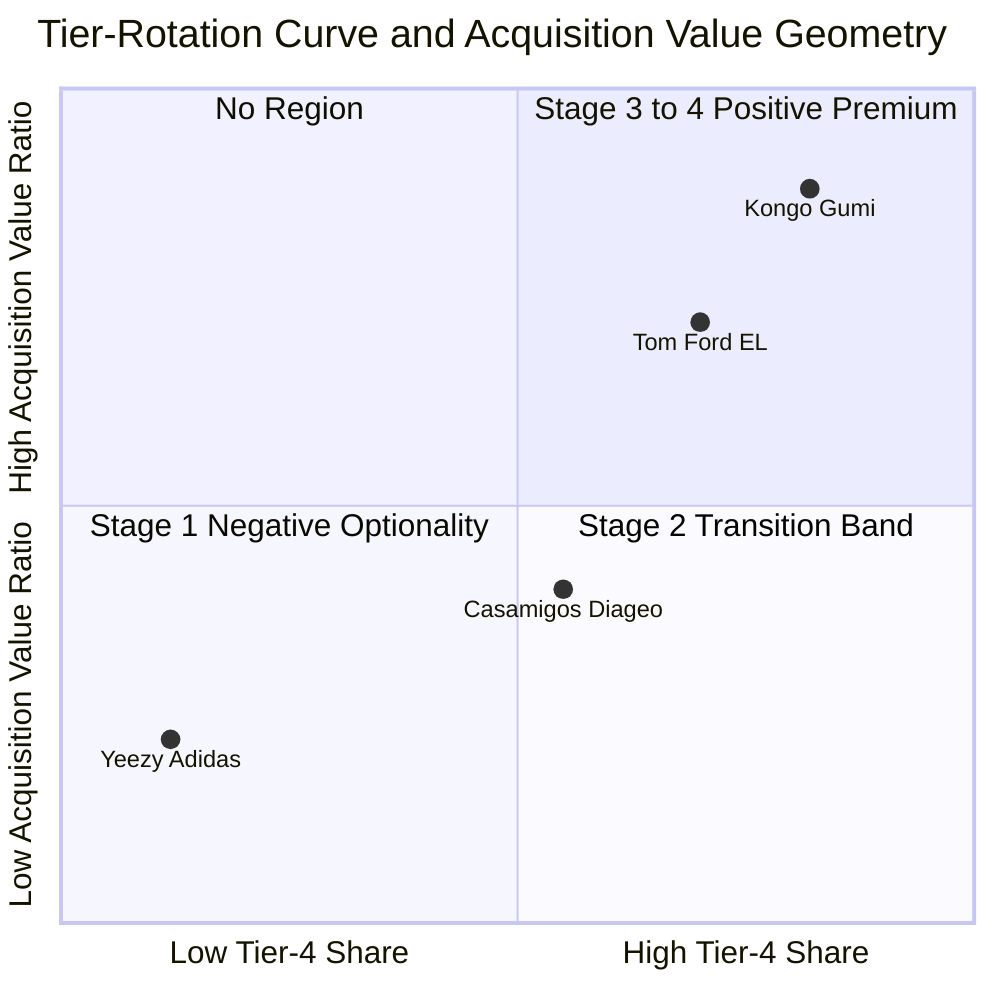

# The Tier-Rotation Curve: A Theory of Brand-Substrate Decoupling and Its M&A-Value Geometry

Dmitry Zharnikov

ORCID: 0009-0000-6893-9231

DOI: [10.5281/zenodo.20069605](https://doi.org/10.5281/zenodo.20069605)

Working Paper v1.1.0 – May 2026 (revised June 2026)

---

## Abstract

When founders exit branded firms, deal outcomes diverge sharply even among principals of comparable quality and brand strength. This paper attributes that variation to the proportion of brand conviction (the factual beliefs observers hold about the brand's performance claims, distinct from evaluative attitude) that has been externalized from the founder's personal judgment into organizational routines, guidelines, decision rights, and trademarks that an acquirer can own independently. Brand signal is modeled as accumulating in an organizational substrate according to a logistic trajectory whose rate is governed by sustained knowledge-externalization effort, a cold-start offset, and sector substitutability. Acquirer willingness-to-pay is a piecewise function of organizational-brand share featuring a separability threshold (the threshold above which brand assets become acquirable independent of the originating principal): below the threshold, founder-flight risk produces discounts and earnout structures; above it, the brand commands a premium increasing with sector substitutability. The model yields three contributions. First, it derives a non-monotonic value geometry with a discontinuous slope at the separability threshold — generating within-founder longitudinal predictions unavailable to cross-sectional human-capital or succession-discount theories, and constituting a sharp empirical wedge against them. Second, it grounds the accumulation process in Nonaka and Takeuchi's [-@nonaka-1995-knowledgecreating-company-how] SECI externalization mechanism and identifies four observable proxies — shifts in 10-K language, advertising allocation, media salience, and trademark composition — that allow empirical distinction from quality-based accounts. Third, it endogenizes the RBV's assumption of differential resource mobility for brand assets, extending the dynamic capabilities tradition [@teece-1997-dynamic-capabilities-strategic; @eisenhardt-2000-dynamic-capabilities-what] by specifying the mechanism, threshold, and sector moderator that determine when initially sticky brand resources become separable. The theory is illustrated with four boundary objects and yields five falsifiable propositions.

**Keywords**: brand assets; founder exit; intangible-asset separability; M&A valuation; organizational architecture; resource separability; tier rotation

---

Three founder-led brands reached M&A resolution within a five-year window, presenting a puzzle that standard accounts leave unresolved. In late 2022, Adidas terminated its Yeezy partnership with Kanye West, writing off approximately €1.2 billion in 2022 annual revenue within months [@adidas-2023-adidas-annual-report] — a collapse rather than a transfer. In 2017, Diageo acquired Casamigos tequila from George Clooney and partners for $700 million upfront plus up to $300 million in earnouts contingent on post-acquisition performance — a structure explicitly designed around founder retention. In late 2022, Estée Lauder Companies acquired the Tom Ford brand for $2.8 billion in total enterprise value, retaining Tom Ford as creative director through 2026 — a substantial multiple against analyst estimates of approximately $1.5 billion in fiscal year 2022 revenue, implying roughly 1.9 times revenue (analyst-estimated; the acquisition price is disclosed in the 8-K filing, but the underlying revenue figure is Estée Lauder's own analyst-estimated figure for the Tom Ford business, not a separately SEC-disclosed line item).

Three founders. Three liquidity events within the same calendar window. Identical logic of "the founder is the brand" applies to each. Yet the outcomes diverge structurally: zero transfer value in one case, earnout-dependent transfer in a second, and a substantial multiple in a third. The cross-sectional human-capital account — which attributes deal premia to founder quality, generalism, or successor capability — cannot explain this divergence. Tom Ford, George Clooney, and Kanye West are all globally recognized principals whose personal signals drove their respective brand revenues. Quality differences do not generate a three-way split of this magnitude. Deal timing, sector substitutability, and — crucially — the proportion of each brand's signal that had been projected into a substrate the acquirer could hold independently of the living principal do explain it.

This paper formalizes that explanation. The Tier-Rotation Curve is a continuous, logistic-form model of how brand signal migrates from a founder-bound substrate — Tier 1 in the six-tier organizational architecture of Zharnikov [-@zharnikov-2026-dual-hierarchies-organizational-transferability-six] — to an institutionally separable product-brand substrate — Tier 4 — through deliberate knowledge-externalization effort over time. M&A value at exit is derived as a non-monotonic function of Tier-4 share (the proportion of brand signal residing in organizational vs. founder-bound substrate) at deal time: below the separability kink, value exhibits negative optionality in the real-options sense [@dixit-1994-investment-under-uncertainty]; above the kink, value scales with the premium the buyer places on an asset it can acquire independently.

Three contributions follow.

1. **Formal geometry of non-monotonic M&A value.** The paper derives $V(s)$ as a piecewise function of Tier-4 share $s$ with a structural discontinuity at the separability kink $\kappa$ (the threshold above which brand assets become acquirable independent of the originating principal). The four-stage valuation rationale — pure-personal, partial-projection, substantial-projection, institutional — emerges as four regions of a continuous curve rather than four discrete types (see Table 1). This derivation cannot be reproduced from the succession-discount literature because that literature explains cross-sectional variation in deal premia as a function of who succeeds the founder; the Tier-Rotation Curve explains within-founder, longitudinal variation as a function of the brand's substrate composition at deal time. Under a human-capital account, a fixed-quality founder who rotates toward Tier-4 should see no change in M&A multiple; under the tier-rotation account, the same founder will command a structurally different multiple after crossing $\kappa$. This falsifiable divergence constitutes the empirical wedge between the two theories.

2. **Knowledge-externalization as the generative mechanism.** The paper grounds the logistic-accumulation equation in Nonaka and Takeuchi's [-@nonaka-1995-knowledgecreating-company-how] SECI model — specifically its externalization phase, in which tacit founder knowledge is converted into explicit organizational routines, documented brand guidelines, team-based decision rights, and algorithmic substitutes. Four observable proxies for rotation progress are derived from the mechanism (Table 3): declining founder-language salience in 10-K filings, shifting marketing-spend allocation from founder-attribute to product-attribute advertising, declining founder-media share of total brand impressions, and trademark-portfolio migration from founder-name marks to product-attribute marks. These proxies operationalize the otherwise-abstract rotation effort intensity parameter and give empirical testers measurable handles for the horse-race against human-capital accounts.

3. **Endogenization of resource-mobility assumptions in the RBV.** The resource-based view conventionally treats differential resource mobility as given — some resources are sticky, others are mobile, and competitive advantage derives from the former [@wernerfelt-1984-resourcebased-view-firm; @barney-1991-firm-resources-sustained; @grant-1996-toward-knowledgebased-theory]. Tier rotation supplies a theory of why brand resources, specifically, shift along the mobility spectrum: the mechanism is knowledge externalization; the threshold is the separability kink; the time path is the logistic curve. This positions the Tier-Rotation Curve within the strategy-architecture tradition [@rivkin-2003-balancing-search-stability; @adner-2017-ecosystem-as-structure] as a theory that explains the dynamics of resource mobility rather than presupposing its distribution, extending the dynamic capabilities tradition [@teece-1997-dynamic-capabilities-strategic; @eisenhardt-2000-dynamic-capabilities-what] and complementing the systematic review of that tradition by Schilke, Hu, and Helfat [-@schilke-2018-quo-vadis-dynamic], who identify mechanism specification as the central unresolved challenge in dynamic capabilities research.

The contribution is theoretical: a mechanism-based geometry that endogenizes the resource-mobility assumption of the resource-based view through specification of the substrate-conversion process. The framework supplies falsifiable propositions for empirical work but does not present new empirical analysis. A parallel literature on managerial human capital predicts that generalist CEOs spur innovation and M&A value through transferable skills [@custdio-2019-do-general-managerial]; the tier-rotation account does not depend on founder generalism. The within-founder longitudinal divergence is what distinguishes the two theories: the same founder, holding human-capital quality fixed, will command structurally different multiples before and after crossing the separability threshold.

The central incremental claim is directly distinguishable from succession-discount accounts. Succession-discount papers [@bennedsen-2007-inside-family-firm; @prezgonzlez-2006-inherited-control-firm; @villalonga-2006-how-do-family; @anderson-2003-foundingfamily-ownership-firm] explain cross-sectional variation as a function of who succeeds; tier rotation explains within-founder, longitudinal variation as a function of what the brand substrate is at deal time. The two theories generate identical predictions in the cross-section. They generate sharply diverging predictions in the within-founder longitudinal case. That divergence is the testable incremental claim.

The paper proceeds as follows. Theoretical foundations are developed, situating the paper within the brand-architecture, resource-separability, and knowledge-externalization literatures. The formal model is presented in full, including the logistic accumulation equation, the M&A value function, comparative statics, and boundary conditions. Five falsifiable propositions are derived from the model. Four illustrative boundary objects are examined — these cases illustrate the theory's predictions; they do not test it; empirical testing is deferred to the validation roadmap in the penultimate section. The Discussion elaborates theoretical, practical, and resource-based-view implications. The paper closes with a structured limitations section and an empirical validation roadmap.

---

## Theoretical Foundations

### Brand Assets as Tier-4 Projections

The organizational architecture underlying this paper draws on Zharnikov [-@zharnikov-2026-dual-hierarchies-organizational-transferability-six], which develops a six-tier ontology of organizational transferability in which every element of a firm's value-generating structure occupies one of six tiers ordered by decreasing substrate fragility: Tier 1 (Owner Intent and identity), Tier 2 (Business Model), Tier 3 (Business Entity / Legal), Tier 4 (Product Specification, including branded product layers), Tier 5 (Process / Routines), and Tier 6 (Organizational Surface). Tiers differ not in their importance to current-period value generation but in their separability from any given occupant; assets at lower tiers (higher numbers) are more separable — that is, more acquirable by a buyer independently of the individuals who currently embody Tier-1 intent.

Zharnikov [-@zharnikov-2026-brand-as-modular-layer-tiered] applies this framework specifically to brand architectures, showing that brand identity binds at Tier 4 and that the value a buyer can acquire in an M&A transaction is precisely and only the brand signal that has been projected from Tier-1 owner intent into a Tier-4 specification layer — documented brand guidelines, trained team-based decision rights, algorithmic brand-channel rules, and formal trademark portfolios — that persists independent of any individual. The fraction of brand signal residing at Tier 4 rather than Tier 1 at the time of a deal is the core construct of the present paper, denoted s. Hsu, Fournier, and Srinivasan [-@hsu-2016-brand-architecture-strategy] provide empirical evidence that brand architecture separability strategies — specifically, the degree to which a corporate brand is leveraged versus distanced from product-level identity — produce measurable differences in firm-level risk and return, consistent with the theoretical role of s in the value function developed here.

The brand's perception cloud — the aggregate of observer spectral profiles (the perceptual filters through which given consumer cohorts process brand signal) across cohorts — is formed at the Tier-4 specification level: observers perceive brand signal through the product layer, not through direct observation of Tier-1 owner intent. However, when the product layer remains insufficiently differentiated from the owner's personal projection — when what observers perceive as "Tom Ford" is substantially Tom Ford the person rather than Tom Ford the product specification system — then the perception cloud is implicitly Tier-1-dependent and does not transfer with the corporate entity. Keller's [-@keller-1993-conceptualizing-measuring-managing] foundational brand-equity construct captures the consumer-knowledge structures that build at Tier 4; the tier-rotation framework formalizes how those structures migrate from being person-dependent to being product-layer-resident. The Tier-Rotation Curve formalizes the transition between these two states.

### Resource Separability and the RBV's Mobility Assumption

The resource-based view of competitive advantage [@wernerfelt-1984-resourcebased-view-firm; @barney-1991-firm-resources-sustained; @peteraf-1993-cornerstones-competitive-advantage] establishes that resources generate sustained competitive advantage when they are valuable, rare, inimitable, and non-substitutable — the VRIN framework. The non-imitability condition requires that the resource be embedded in ways that competitors cannot replicate; this is the "stickiness" condition. The RBV, however, treats resource mobility as an exogenous parameter: resources are differentially sticky as a result of path dependence, causal ambiguity, or social complexity. The theory does not explain when or how a resource transitions from sticky to separable, or what mechanism drives that transition. Dierickx and Cool [-@dierickx-1989-asset-stock-accumulation] establish that asset stocks accumulate over time through sustained investment flows and that the sustainability of competitive advantage depends on the structural properties of that accumulation — properties such as time-compression diseconomies and asset mass efficiencies. The logistic accumulation equation in this paper is a formal instantiation of their asset-stock model applied specifically to the migration of brand signal between substrates.

The organizational modularity tradition [@baldwin-2000-design-rules-power; @rivkin-2003-balancing-search-stability] addresses a related question — how architectural interdependencies among organizational elements affect the costs of reconfiguration — but focuses on design choices rather than on the temporal dynamics of resource-substrate relationships. Adner [-@adner-2017-ecosystem-as-structure] extends the ecosystem lens to ask which firm-level capabilities become separable from the broader ecosystem as value chain structures evolve, but his frame is inter-firm rather than intra-firm and does not address the Tier-1/Tier-4 separation problem directly. The dynamic capabilities view [@teece-1997-dynamic-capabilities-strategic; @eisenhardt-2000-dynamic-capabilities-what] treats organizational capabilities as the mechanism for resource reconfiguration, establishing that firms with higher dynamic capability can reconfigure their asset bases in response to environmental change; the tier-rotation model extends this tradition by specifying knowledge-externalization capability as the precise dynamic capability that governs brand-resource mobility. As Schilke, Hu, and Helfat [-@schilke-2018-quo-vadis-dynamic] document in their content-analytic review of the dynamic-capabilities literature, the central challenge in moving dynamic capabilities theory forward is precisely the specification of micro-mechanisms that link capability development to firm-level outcomes — a gap the tier-rotation model addresses directly for the case of brand-asset separability.

The present paper fills this gap by providing a mechanism — knowledge externalization — and a time path — the logistic accumulation curve — for the transition from sticky to separable. For brand resources specifically, the RBV's assumption of differential resource mobility is not an exogenous parameter but the output of a rotation process that founders and management teams either undertake deliberately or neglect. The separability kink $\kappa$ is the threshold above which brand resources become acquirable by a buyer independent of the originating agent.

Importantly, the paper's contribution is distinct from the CEO human capital and M&A literature. Chen, Huang, Meyer-Doyle, and Mindruta [-@chen-2021-generalist-versus-specialist] demonstrate that generalist versus specialist CEO human capital characteristics affect acquisition premia and post-deal cumulative abnormal returns; their framework, in common with the succession-discount literature [@bennedsen-2007-inside-family-firm; @prezgonzlez-2006-inherited-control-firm; @anderson-2003-foundingfamily-ownership-firm], is a cross-sectional human-capital story. The tier-rotation account generates diverging predictions in the within-founder longitudinal case: a generalist founder who has not rotated will command a lower multiple than a specialist founder who has crossed $\kappa$, holding all human-capital quality metrics constant. This prediction is not available from the Chen et al. framework.

### The Two-Bodied Brand and Its Successors

Fournier and Eckhardt [-@fournier-2019-putting-person-back] provide the closest theoretical prior art for the construct central to this paper. Drawing on the dual-body doctrine of medieval political theory as Fournier and Eckhardt [-@fournier-2019-putting-person-back] apply it, they distinguish the body natural — the living, mortal, idiosyncratic person — from the body politic — the institutional role, the branded corporation, the continuity vehicle. They identify four risk vectors that arise when a firm maintains both simultaneously: mortality risk (the body natural will die or depart), hubris risk (personal overreach), unpredictability risk (idiosyncratic personal actions), and social embeddedness risk (the firm inherits the person's social conflicts). All four risk vectors are suppressed as s increases: a brand that has fully rotated to Tier-4 has converted the body natural into the body politic. Kantorowicz [-@kantorowicz-1957-kings-two-bodies] provides the political-theology source of the dual-body construct that Fournier and Eckhardt adapt.

Fournier and Eckhardt's contribution is conceptual: they name the duality and the risk vectors. What their framework does not supply is the projection geometry — the formal account of how the body politic is constructed from the body natural, what the transition path looks like, what determines its feasibility and duration, and how acquirer willingness-to-pay changes along the path. The Tier-Rotation Curve supplies this geometry.

The term "two-bodied brand" is preserved from Fournier and Eckhardt's vocabulary in this paper; it is used to denote the state in which both Tier-1 and Tier-4 brand signals are simultaneously active, which corresponds to Stage 2 and Stage 3 in the rotation trajectory.

### Knowledge Externalization as the Substrate-Conversion Mechanism

The generative mechanism by which Tier-1 brand signal becomes Tier-4 brand signal is knowledge externalization in the sense of Nonaka and Takeuchi [-@nonaka-1995-knowledgecreating-company-how]. Kogut and Zander [-@kogut-1992-knowledge-firm-combinative] establish the foundational premise that what firms do better than markets is the sharing and transfer of individual and group knowledge — and that new learning results from the firm's combinative capabilities, its ability to exploit existing knowledge and generate new applications through systematic codification. The SECI externalization cycle [@nonaka-1995-knowledgecreating-company-how] operationalizes this combinative-capability view: it identifies four modes of knowledge conversion — Socialization (tacit-to-tacit, through shared experience), Externalization (tacit-to-explicit, through articulation), Combination (explicit-to-explicit, through systemization), and Internalization (explicit-to-tacit, through embodied learning). For the Tier-Rotation Curve, the critical mode is Externalization: the founder's tacit brand decision rules — creative direction, style heuristics, customer-relationship management, quality thresholds — are progressively converted into explicit organizational artifacts, including written brand guidelines, formalized creative briefs, documented decision frameworks, trained team-based review protocols, and eventually algorithmic substitutes.

Nonaka, Toyama, and Konno [-@nonaka-2000-seci-ba-leadership] elaborate this mechanism through the concept of Ba — the shared context space in which knowledge conversion occurs. For brand rotation, Ba is the organizational context in which founder decisions become team decisions: the design studio review that the founder once ran alone, converted into a criteria-based review protocol the team can run; the hiring judgment the founder once made by instinct, converted into a formal creative-role specification. Grant [-@grant-1996-toward-knowledgebased-theory] grounds this at the firm level: organizational routines are the primary vehicle by which tacit knowledge is integrated and made firm-level rather than person-level. For brand rotation, routines are the Tier-4 carriers of formerly Tier-1 brand signal. Mawdsley and Somaya [-@mawdsley-2016-employee-mobility-organizational] develop an integrative conceptual framework distinguishing human capital from relational capital as the two channels through which mobile individuals transfer organizational impact; tier rotation is the dual problem — when the originating individual does not move but the brand asset does, the same human-versus-relational distinction maps onto Tier-1 (founder-bound tacit) versus Tier-4 (organizational-codified) substrates, with the separability kink $\kappa$ marking the threshold at which relational capital has been sufficiently codified to sustain independent transfer.

A moderator on rotation effort intensity (e) deserves explicit naming. Fauchart and Gruber [-@fauchart-2011-darwinians-communitarians-missionaries] show that founders self-categorize into distinct identity types — Darwinian (profit-driven), Communitarian (community-focused), and Missionary (cause-oriented) — and that these identity types predict opportunity selection and venture choices that pure economic optimization does not. The same mechanism operates on rotation effort: founders whose self-concept is bound to a personal-creative-vision identity (the body natural as the brand's essential signal carrier) face a higher psychic cost of externalization than founders whose self-concept is bound to an institution-building identity (the body politic as the legitimate inheritor of the founder's contribution). The rotation-effort parameter e is therefore not exogenous to the founder; the founder's identity type is one of its principal antecedents, and a complete empirical specification of the rotation curve must condition rotation rate on founder-identity type as a covariate.

The logistic accumulation equation in the next section is the mathematical encoding of this mechanism. Four observable intermediate markers of rotation progress derive from the mechanism and are specified in Proposition P5 (Table 3): declining founder-language salience in 10-K filings (Externalization → explicit brand documentation); shifting marketing-spend allocation from founder-attribute to product-attribute advertising (Combination → systematic product-brand investment); declining founder-media share of total brand impressions (Internalization → team-driven brand communication); and trademark-portfolio migration from founder-name marks to product-attribute marks (Combination → formal IP codification).

### Decoupling: Substantive Versus Symbolic

Bromley and Powell [-@bromley-2012-smoke-mirrors-walking] distinguish symbolic from substantive decoupling in the organizational behavior literature. Symbolic decoupling involves the adoption of formal structures, policies, or labels that are not matched by underlying operational change — what Bromley and Powell term "means-ends decoupling." Substantive decoupling involves genuine operational change that is structurally distinct from the nominal structure. Crilly, Hansen, and Zollo [-@crilly-2016-grammar-decoupling-cognitivelinguistic] extend this distinction by showing that decoupling can be parsed cognitive-linguistically: stakeholders distinguish symbolic from substantive claims by attending to whether disclosed practices are accompanied by coordinated patterns of organizational action rather than by isolated formal markers. The tier-rotation literature must make an equivalent distinction, and the cognitive-linguistic refinement of Crilly, Hansen, and Zollo [-@crilly-2016-grammar-decoupling-cognitivelinguistic] gives the empirical strategy in the present paper its diagnostic shape: the four P5 observables must shift in *coordinated* direction to count as structural rotation; an isolated shift in any one observable is consistent with symbolic rotation alone.

Apparent tier rotation is symbolic: a brand adopts the formal markers of Tier-4 codification — registering product-attribute trademarks, publishing brand guidelines, naming a creative-review committee, allocating advertising budget to product-attribute claims — without converting the underlying brand conviction from founder-dependent to product-dependent form. The diagnostic signature of apparent rotation is *partial* movement in the P5 observables: trademark composition shifts (the easiest move, being administrative), but founder-language salience in 10-K filings does not decline because the firm continues to frame brand decisions as founder vision; or advertising allocation shifts but founder-media share remains high because the founder remains the primary publicly visible carrier of brand meaning. The perception cloud in such cases remains implicitly Tier-1-anchored: observers cannot distinguish the product specification from the founder's personal sensibility without the founder's continued presence as a visible signal, and the brand's observer spectral profile collapses toward Tier-1 quality if the founder is removed.

Structural tier rotation is substantive: the brand's observer spectral profile genuinely responds to product-layer cues independently of whether the founder is visible, named, or present. The diagnostic signature of structural rotation is *coordinated* movement across all four P5 observables, with the four time series loading on a single principal component that shifts in concert. The separability kink $\kappa$, in this paper's model, is formally the point at which structural rotation has occurred — where s has moved above the threshold at which the Tier-4 product layer can sustain buyer valuation independently. The empirical wedge in P2 (within-founder longitudinal divergence) is meaningful only against structural rotation; a founder whose firm shows partial-rotation symbolic markers without coordinated P5 shifts will not command the post-$\kappa$ premium and will not falsify the human-capital account because the rotation has not actually occurred. This distinction, sharpened from Bromley and Powell [-@bromley-2012-smoke-mirrors-walking] by Crilly, Hansen, and Zollo [-@crilly-2016-grammar-decoupling-cognitivelinguistic], positions the four-observable principal-component design in the validation roadmap as the operational test for structural-versus-apparent rotation.

---

## Formal Model: The Tier-Rotation Curve

### Setup and Definitions

Let $s \in [0, 1]$ denote the Tier-4 share: the proportion of a brand's total observable signal residing in a substrate the acquirer can hold independently of any individual at a given moment in time. The complement, $1 - s$, is the Tier-1 share: the proportion of brand signal that is founder-bound — tacit, personal, and non-transferable without the living principal.

Three parameters govern the dynamics of s over time:

- **e** (rotation effort intensity, per-period flow): the firm's ongoing investment in the knowledge-externalization loop — budget allocation to brand guidelines, team capability development, creative-process codification, and algorithmic brand-decision tooling. $e \in [0, 1]$ is normalized to the maximum feasible investment level.

- **$\kappa$** (separability kink): the threshold value of s above which the Tier-4 layer is acquirable as a freestanding asset and below which the buyer must structure around founder-flight risk. $\kappa$ is determined by the sector's information environment and buyer market structure; it is treated as a structural parameter of the competitive context, not a choice variable of the focal firm.

- **$\sigma$** (sector substitutability): the degree to which buyers in the relevant product-market space can substitute one seller's brand specification for another's. $\sigma$ scales with the sector's credence-goods structure: in credence-goods sectors — luxury, gastronomy, bespoke professional services — observers cannot verify quality independently of the principal's reputation [@darby-1973-free-competition-optimal; @spence-1973-job-market-signaling], which means $\sigma$ is high and the value of a separable Tier-4 specification is greater because the alternative (starting from zero) requires accumulating an entirely new trust signal from scratch. In search-goods sectors [@nelson-1970-information-consumer-behavior] — commodity consumer products, standardized B2B inputs — $\sigma$ is low: specification substitution is feasible at modest cost, and the premium for a separable brand substrate is correspondingly compressed. In credence-goods sectors, consumers additionally resist algorithmic or non-human substitutes [@longoni-2019-resistance-medical-artificial], further amplifying the value of a human-origin brand specification that has successfully migrated to an organizational substrate. Erdem and Keane [-@erdem-1996-decisionmaking-under-uncertainty] and Erdem, Keane, and Sun [-@erdem-2008-dynamic-model-brand] establish the empirical foundation for $\sigma$ in marketing-science: consumers update brand quality beliefs over time through advertising and price signals, and the speed of that updating sets the cost of substituting away from an established brand specification — the higher the substitution cost, the higher $\sigma$ for the rotation-curve premium calculation.

An additional parameter $\varphi > 0$ is the substrate cold-start offset, which serves two purposes. As a mathematical necessity, $\varphi$ prevents $s = 0$ from being an absorbing state when $e = 0$; without it, a firm that has made no rotation investment has no pathway to begin accumulating Tier-4 signal. As an empirical interpretation, $\varphi$ represents the minimal Tier-4 substrate inherent in corporate form itself — the registered trademark, the corporate identity on packaging, the legal entity as a separate acquisition vehicle. $\varphi$ therefore connects directly to the Sub-Stage 0 boundary condition: a sole proprietor or unincorporated entity operating without a separate corporate vehicle has $\varphi \approx 0$, recovering the absorbing-zero limit case. The cold-start transition — from Sub-Stage 0 to Stage 1 — requires first establishing a separate legal vehicle, which is a substrate transition rather than a rotation transition within the model's domain. The model treats the founder-principal as continuously occupying the Tier-1 substrate position; succession events at time $t^*$ in which a new principal $P_{\text{new}}$ replaces $P_{\text{old}}$ are outside the present formal scope and are addressed in the Discussion (see "Succession as a Distinct Geometric Event").

### The Smallest-Sufficient Accumulation Equation

The accumulation of Tier-4 share follows a logistic-growth dynamic. The structural intuition is that rotation effort converts Tier-1 signal into Tier-4 signal at a rate that is proportional to the remaining Tier-1 signal available for conversion (the "room to grow" term), amplified by the current Tier-4 base (organizational routines attract further codification) and moderated by sector substitutability. This produces:

**Equation 1 (Tier-Rotation Accumulation):**

$$ds/dt = \alpha \cdot e \cdot (1 - s) \cdot (s + \varphi) \cdot g(\sigma)$$

where:
- $\alpha$ is a calibration constant (units: inverse time; absorbs scale differences across industries and measurement conventions)
- $e$ is rotation effort intensity
- $(1 - s)$ is the remaining Tier-1 share available for conversion (the "growth room" term)
- $(s + \varphi)$ is the current Tier-4 base plus cold-start offset (the "organizational capacity" term; ensures the equation has a non-zero interior equilibrium)
- $g(\sigma)$ is a monotone increasing function of sector substitutability, $g$ defined for $\sigma \ge 0$ with strictly positive values, with $g(0) = \varepsilon_{\min} > 0$ (the rotation process continues at minimal rate even in non-substitutable sectors) and $g(\sigma) \to \infty$ as $\sigma \to \infty$. The qualitative results — bounded accumulation, non-linear dynamics, cold-start offset — hold for any monotone increasing g satisfying these boundary conditions; the theory does not require a specific functional form.

The logistic form is chosen as the smallest-sufficient model that captures (a) bounded accumulation — s cannot exceed 1; (b) non-linear dynamics — early rotation is slow because organizational capacity is low, mid-trajectory rotation accelerates as capacity builds, and late-stage rotation decelerates as remaining Tier-1 signal is depleted; and (c) the cold-start problem — $\varphi$ ensures the system has no absorbing zero state. We develop the model in this section and provide the full derivations in Appendix A.

The closed-form trajectory follows from separating variables in Equation 1 (full derivation in Appendix A):

**Equation 2 (Closed-Form Trajectory):**

$$s(t) = \frac{(s_0 + \varphi)(1 + \varphi) \cdot \exp(k(1 + \varphi)t) - \varphi(1 - s_0)}{(1 - s_0) + (s_0 + \varphi) \cdot \exp(k(1 + \varphi)t)}$$

where $k = \alpha \cdot e \cdot g(\sigma)$ and $s_0 = s(0)$. This expression is continuous and strictly increasing in $t$ for all $e > 0$, approaches $1 - \varphi/(1+\varphi)$ asymptotically as $t \to \infty$ (confirming that full rotation is an asymptotic limit, not a finite endpoint), and reduces to $s_0$ at $t = 0$ by construction. The inflection point occurs at $s^* = (1 - \varphi)/2$, confirming the characteristic S-curve: slow initial accumulation, accelerating mid-trajectory, and decelerating approach to the asymptote. The minimum time to reach a target share is given by Equation 3 (Appendix A); $T_{\min}$ decreases in effort $e$ and sector substitutability $\sigma$, and diverges as the target approaches full rotation — which remains asymptotic.

### The M&A Value Function

Let $V(s)$ denote the acquirer's willingness-to-pay for the brand asset as a function of Tier-4 share at deal time. Normalize $V_0$ as the brand's standalone operating value under the assumption of continued founder operation. Feldman and Hernandez [-@feldman-2022-synergy-mergers-acquisitions] develop a typology of M&A synergy with three life-cycle stages — pre-deal anticipation, deal-time pricing, and post-deal realization. The Tier-Rotation Curve specializes their typology to brand-asset substrate composition: the deal-time pricing stage is precisely where $V(s)$ is determined, and the $\kappa$ kink corresponds to the threshold below which post-deal synergy realization is structurally constrained by founder-flight risk. $V(s)$ is defined as $V(s) = V_0 \cdot h(s)$ where $h(s)$ is specified explicitly as:

**Equation 4 (M&A Value Function):**

$$h(s) = \left(1 - \beta \cdot \max(0, \kappa - s)/\kappa\right) \quad \text{for } s \le \kappa$$

$$h(s) = \left(1 + \gamma \cdot g(\sigma) \cdot (s - \kappa)/(1 - \kappa)\right) \quad \text{for } s > \kappa$$

where $\beta > 0$ is the founder-flight discount rate (the proportional discount below $V_0$ at $s = 0$, so that $h(0) = 1 - \beta$, representing the liquidation floor) and $\gamma > 0$ is the separability premium rate (the proportional premium above $V_0$ per unit of Tier-4 share above $\kappa$, amplified by sector substitutability). The function $h$ is continuous in level at $s = \kappa$ but has a discontinuous first derivative there: the marginal value of an additional increment of Tier-4 share is strictly higher above $\kappa$ than below it for any non-zero $\sigma$. This discontinuous slope — not a discontinuous level — is the geometric content of the non-monotonic value function (Figure 1 illustrates the geometry; the formal continuity-and-discontinuity proof is in Appendix A).

The four-stage regions visible in Figure 1 correspond to four regions of $h(s)$: Stage 1 ($s$ near 0): $h(s) \approx 1 - \beta$, negative optionality in the real-options sense [@dixit-1994-investment-under-uncertainty] — the acquirer cannot independently exercise the brand-asset option until Tier-4 base exceeds $\kappa$. Stage 2 ($s \in [\varepsilon, \kappa - \varepsilon]$): discount compresses as $s$ rises toward $\kappa$. Stage 3 ($s \in (\kappa, 1 - \varphi)$): premium region, steeper slope than the discount region. Stage 4 ($s$ near $1 - \varphi$): premium approaches $(1 + \gamma \cdot g(\sigma)) \cdot V_0$, limited by the asymptotic constraint that full rotation is never complete.

### Comparative Statics

Table 2 summarizes the comparative statics of the model. The key results:

- $\partial V/\partial s > 0$ everywhere, but the marginal effect is discontinuous at $\kappa$ (non-monotonic slope rather than non-monotonic level).
- $\partial V/\partial \sigma > 0$ for $s > \kappa$ and $\approx 0$ for $s < \kappa$: sector substitutability amplifies the premium for separable brands but does not reduce the discount for non-separable brands.
- $\partial V/\partial e = 0$ at deal time (effort affects $s$, not $V$ conditional on $s$; effort matters only through its effect on $s$ before deal close).
- $\partial T_{\min}/\partial e < 0$: higher effort reduces time to reach the kink.
- $\partial T_{\min}/\partial \sigma < 0$: higher substitutability reduces minimum rotation time (organizational capacity builds faster when the product-brand specification layer attracts investment under competitive substitution pressure).
- $\partial V/\partial \kappa < 0$ for the acquirer (lower $\kappa$ means the premium region is attained at lower rotation investment): the separability threshold is a structural parameter the firm cannot choose but whose level determines the cost of rotation.

### Boundary Conditions

Two limit cases clarify the model's scope.

The **$\varphi \to 0$ limit** (pure Tier-1 / Sub-Stage 0 state) recovers an absorbing state at $s = 0$. When $\varphi = 0$ and $s_0 = 0$, the accumulation equation has $ds/dt = 0$ regardless of effort: no Tier-4 accumulation is possible because there is no organizational substrate — no corporate form, no registered trademark, no formal legal entity — onto which brand signal can be codified. This is the sole-proprietor and unincorporated-entity case: a creator, consultant, or entrepreneur operating without a separate corporate vehicle. For these forms, the M&A value function collapses to the liquidation floor: $V(s=0) = V_{\text{liq}}$ = present value of separable asset list only. The cold-start transition — from Sub-Stage 0 to Stage 1 — requires first establishing a separate legal vehicle, which is a substrate transition rather than a rotation transition within the model's domain.

The **$\sigma \to 0$ limit** (commodity sector, zero substitutability) makes $g(\sigma) = \varepsilon_{\min}$ and the M&A value function approaches $V(s) \equiv V_0$: with no buyer premium for brand separability (because competing brand specifications are freely available), the Tier-4 share is irrelevant to acquirer willingness-to-pay. In commodity sectors, M&A premia derive from operational assets, distribution networks, and customer contracts — not from the brand specification layer. The tier-rotation framework is non-predictive in $\sigma \to 0$ sectors.

---

## Propositions

Five falsifiable propositions are derived from the formal model. Propositions P4 (earnout prevalence) and P7 (Tier-6 absorption) from an earlier draft have been reconstituted as empirical implications in the final section; dropping them from the proposition set sharpens the theoretical core. Each retained proposition includes explicit confirming and falsifying criteria. The propositions are written in terms of the model's constructs; the final section provides an operationalization roadmap for each principal construct.

---

***P1 — Non-Monotonicity of M&A Value***

*Proposition*: $V(s)$ is non-monotonic in $s$ in the following specific sense: for $s < \kappa$, each increment of Tier-4 share compresses the acquirer discount at a lower marginal rate than the marginal rate at which each increment above $\kappa$ generates acquirer premium. The slope of $V(s)$ is discontinuous at $s = \kappa$; deals where $s < \kappa$ at close trade at negative optionality relative to standalone operating value; deals where $s > \kappa$ trade at positive premium.

*Confirming criterion*: In a panel of founder-involved brand acquisition deals, brands acquired at estimated s < $\kappa$ (operationalized as Stage 1-to-2 by the four-observable proxies) show deal prices systematically below acquirer-estimated standalone brand operating value; brands acquired at estimated s > $\kappa$ show deal prices systematically above standalone value. The kink at $\kappa$ is identifiable as a structural break in the relationship between rotation-proxy score and deal-price-to-standalone ratio.

*Falsifying criterion*: P1 is falsified if the relationship between rotation-proxy score and deal-price-to-standalone ratio is monotonic without a structural break — that is, if a linear or power-law specification fits the data as well as a piecewise specification with a kink.

---

***P2 — Within-Founder Longitudinal Divergence (The Empirical Wedge)***

*Proposition*: For a founder of fixed quality, M&A multiple at exit varies with s at deal time. Specifically: a founder who exits before crossing $\kappa$ commands a multiple below $V_0$; the same founder exiting after crossing $\kappa$ commands a multiple above $V_0$. The within-founder variation in multiple is predicted by the tier-rotation account but not by the human-capital quality account, which predicts no multiple variation for a fixed-quality founder across exit timing.

*Confirming criterion*: Firms with the same founder (or identical-quality founder pairs matched on observable human-capital characteristics) but different estimated s at deal time show significantly different M&A multiples, with the sign and magnitude consistent with the non-monotonic $V(s)$ function. Within-founder or matched-pair analyses that control for deal timing, sector, and year should reveal a significant positive effect of rotation-proxy score on deal multiple, with the effect concentrated above the estimated $\kappa$ threshold.

*Falsifying criterion*: P2 is falsified if, after controlling for founder human-capital quality metrics (industry tenure, generalism/specialist score, board composition, patent portfolio), the rotation-proxy score loses statistical significance as a predictor of M&A multiple. A null result on within-founder variation — in which identical founders at different rotation stages command identical multiples — would falsify P2 and support the human-capital account exclusively.

---

***P3 — Sector-Substitutability Moderation***

*Proposition*: The premium $V(s)/V_0$ for $s > \kappa$ is higher in credence-goods sectors [@darby-1973-free-competition-optimal] than in search-goods sectors [@nelson-1970-information-consumer-behavior]. In credence-goods sectors, buyers cannot directly observe quality before or after purchase without extended experience; a separable Tier-4 brand specification is therefore more valuable because the alternative — rebuilding brand trust from a new specification — is costly and slow. In search-goods sectors, quality is directly observable; brand-specification separability commands a smaller premium because substitution is feasible.

*Confirming criterion*: In a cross-sector analysis of founder-involved deals with estimated s > $\kappa$, deal premiums (M&A multiple relative to industry median) are significantly higher in luxury, gastronomy, bespoke services, and professional services (credence-goods-intensive) sectors than in commodity consumer goods, standardized professional services, and B2B manufacturing (search-goods-intensive) sectors. The moderation is concentrated in the s > $\kappa$ subsample; no significant moderation is predicted for s < $\kappa$.

*Falsifying criterion*: P3 is falsified if the sector-substitutability interaction term is non-significant after controlling for sector-level brand intensity, deal size, and year, in a regression of deal premium on rotation-proxy score $\times$ sector credence-type.

---

***P4 — Post-Deal Goodwill Impairment***

*Proposition*: Post-deal goodwill impairment frequency is highest for deals closed at s < $\kappa$, specifically in cases where founder-flight risk was priced into deal structure but the founder departed earlier than contracted. The mechanism is that deals below $\kappa$ systematically overestimate the transferability of brand equity to the acquiring entity; when the founder departs (voluntarily or involuntarily), the remaining Tier-4 base is insufficient to sustain the brand conviction level that justified the deal price, and the acquiring firm writes down goodwill.

*Confirming criterion*: In a sample of acquirer 10-K filings following founder-brand acquisitions, goodwill impairment events (Compustat GDWLIP > 0 within 36 months of deal close) are more frequent in deals where the acquisition occurred below estimated $\kappa$ (low rotation-proxy score at deal time) than in deals above $\kappa$. After controlling for deal size, sector, and year, the rotation-proxy score should predict goodwill impairment with a negative sign: lower rotation → higher impairment probability.

*Falsifying criterion*: P4 is falsified if goodwill impairment rates are not significantly different between below-$\kappa$ and above-$\kappa$ deals after controlling for deal size, sector, and year — indicating that post-deal impairment is driven by macro factors or acquirer-side integration capability rather than by the acquired brand's substrate composition.

---

***P5 — Knowledge-Externalization Observables***

*Proposition*: As a brand progresses along the rotation trajectory from $s = s_0$ toward $s \to 1$, four firm-level observables shift in a coordinated and directionally predictable way. The four observables are: (1) 10-K founder-language salience (declines: as brand signal becomes resident at Tier 4, the annual report frames the brand as a product specification system, not a founder's vision); (2) marketing-spend allocation between founder-attribute and product-attribute advertising (shifts toward product-attribute: as s increases, advertising investment goes to product claims rather than founder personality); (3) founder-media share of total brand impressions (declines: as the product brand accumulates standalone recall, the founder appears as one voice among others rather than as the primary signal carrier); (4) trademark-portfolio composition (shifts from founder-name marks to product-attribute marks: codification of brand identity into product-specific IP rather than person-specific IP).

*Confirming criterion*: In a panel of founder-led firms over time, the four observables move in the predicted direction and in a coordinated pattern — consistent with a common latent factor interpretable as rotation progress. A confirmatory factor analysis or dynamic panel model should recover a single latent factor with high loadings on all four observables, and the factor should predict deal multiple at eventual exit.

*Falsifying criterion*: P5 is falsified if the four observables move in uncorrelated or contradictory directions — indicating that they do not reflect a common rotation mechanism — or if they are uncorrelated with eventual exit multiple after controlling for rotation-proxy score.

---

## Illustrative Boundary Objects

These four cases illustrate distinct regions of the Tier-Rotation Curve and sharpen specific boundary conditions of the theory. They are not empirical tests; they are theory-sharpening illustrations chosen for the structural variation they exhibit, not for confirming any specific proposition. They are not empirical anchors for the theory's parameters, not statistical tests of the propositions, and not calibration targets for $\beta$, $\gamma$, or $\kappa$. Empirical testing of the propositions is deferred to the validation roadmap.

### Yeezy / Adidas (2022): Stage-1 Collapse

The Yeezy collaboration between Kanye West and Adidas, terminated in October 2022 following West's public antisemitic statements, generated approximately €1.2 billion in annual footwear revenue in 2022 [@adidas-2023-adidas-annual-report]. Following partnership termination, Adidas held substantial Yeezy inventory with no brand substrate capable of sustaining consumer willingness-to-pay independent of Kanye West's persona. The brand had not rotated: virtually the entire Yeezy brand signal resided in West's Tier-1 substrate — his artistic identity, his personal aesthetic direction, and his direct consumer relationships — rather than in a Tier-4 product specification system that Adidas could operate independently. The outcome is consistent with Stage-1 geometry: $s$ at deal termination $\approx$ low; $V(s) < V_{\text{liq}}$ at the forced liquidation point. Adidas ultimately sold through residual Yeezy inventory at discounted prices over subsequent years, retaining some fraction of standalone asset value but unable to sustain brand conviction at normal Yeezy pricing without the Tier-1 substrate. The Yeezy/Adidas case is the clearest public-record illustration of Stage-1 geometry: the forced liquidation outcome at negative optionality is documented in Adidas's 2022 annual report and subsequent inventory-clearance disclosures. This case sharpens P1's negative-optionality region ($s \ll \kappa$) and P2's within-founder claim: Kanye West's signal quality did not change between the Stage-1 partnership period and post-termination, isolating the substrate composition — not founder quality — as the explanatory variable for the near-zero transfer value.

### Casamigos / Diageo (2017): Stage-2-to-3 Earnout

Diageo acquired Casamigos tequila — co-founded by George Clooney, Rande Gerber, and Mike Meldman — for $700 million upfront plus up to $300 million in performance-contingent earnouts, for a potential total of $1 billion. The earnout structure — contingent on Diageo's ability to scale the brand post-acquisition while retaining its artisanal brand conviction — is the signature of a $\kappa$-region deal: the brand had accumulated meaningful Tier-4 signal (established distribution, production infrastructure, product specification) but had not completed the rotation to full Tier-4 separability at deal close. The upfront payment prices the brand's existing Tier-4 asset floor; the earnout prices the retention of the Tier-1 brand conviction that Clooney's personal signal provided during the scaling phase. The deal is consistent with Stage-2-to-3 geometry: $s$ at deal close in the $[\kappa - \varepsilon, \kappa + \varepsilon]$ band; deal structure includes earnout as rotation insurance. This case sharpens P3's sector-substitutability moderation: premium spirits is a credence-goods sector with high $\sigma$, and the $\kappa$-band earnout structure is precisely the deal form the model predicts when the brand has not yet crossed the separability threshold in a sector where separable brand signal is highly valuable.

### Tom Ford / Estée Lauder (2022): Stage-3 Substantial Projection

Estée Lauder Companies acquired the Tom Ford brand in November 2022 for $2.8 billion total enterprise value. At the disclosed $2.8 billion enterprise value, the deal implied approximately 1.9 times Estée Lauder's own analyst-estimated revenue figure for the Tom Ford business — a substantial premium consistent with Stage-3 geometry (the $1.9\times$ multiple is analyst-estimated, not SEC-disclosed). Tom Ford agreed to remain as creative director through 2026 — not as an earnout condition of brand performance, but as a creative continuity agreement. This structure differs from the Casamigos earnout: the Tom Ford brand retained substantial Tier-4 signal independent of the founder at deal time, with a formalized Tier-4 specification system of product categories (beauty, fragrance, eyewear via Marcolin license), retail format, brand guidelines, and design team. The creative director retention is a halo-amplification agreement, not a brand-survival requirement. The Estée Lauder transaction is the paradigmatic Stage-3 boundary illustration: the body politic has been sufficiently constituted that the body natural is optional rather than essential. This case sharpens P3 with luxury fashion's intermediate $\sigma$ and demonstrates the above-$\kappa$ premium region, illustrating how high sector substitutability translates into a separability premium above standalone operating value when the rotation threshold has been crossed.

### Kongō Gumi (578–2006): Stage-4 Institutional and Tier-6 Absorption

Kongō Gumi, founded in 578 CE by Korean carpenter Shigemitsu Kongō in what is now Japan, operated as a temple and shrine construction firm for 1,428 years before financial difficulties in the early 2000s led to its absorption into Takamatsu Construction Group in 2006. The founding-family narrative had migrated from Tier-1 active brand substrate into Tier-6 cultural infrastructure long before 2006. By the time of absorption, the brand's signal resided not in any living principal's Tier-1 identity but in the cultural institution of Japanese temple construction heritage — a form of brand conviction so deeply embedded in the national cultural fabric that it functioned as quasi-public-good infrastructure. The 2006 absorption did not generate a meaningful brand-value transaction: the firm was absorbed rather than acquired for brand premium. This is the limit case of the rotation trajectory: $s \to (1 - \varphi)$; $V(s)$ approaches neither negative optionality nor standalone premium but a form of institutional merger. This case sharpens the $s \to 1 - \varphi$ asymptotic limit: even at the Stage-4 extreme, a residual Tier-1 imprint persists as origin story ($\varphi > 0$), but it functions as institutional mythology rather than active brand conviction carrier, illustrating the Tier-6 cultural-infrastructure absorption that is the terminal state of the rotation curve.

---

## Discussion

### Theoretical Contribution

Three contributions are restated more precisely here than in the opening commentary. A cross-theory comparison is presented in Table 4.

First, the paper establishes that M&A value for founder-led brands is non-monotonic in Tier-4 share — specifically, that the slope of the $V(s)$ function is discontinuous at the separability kink $\kappa$. This is a structural result, not an empirical finding: it is derived from the definition of $\kappa$ as the threshold above which the Tier-4 layer is acquirable independently. The implication for the succession-discount literature is methodological: studies that rely on cross-sectional variation in founder successor type [@bennedsen-2007-inside-family-firm; @prezgonzlez-2006-inherited-control-firm] will not detect the within-founder, longitudinal variation that the tier-rotation account predicts. Cross-sectional studies conflate variation in s at deal close with variation in founder quality, producing systematically biased estimates of the "founder discount" wherever founder quality and rotation stage are correlated. Within-founder analyses — comparing multiple exit events by the same founder at different rotation stages, or instrumenting for rotation stage exogenously — are required to test P2 (see Table 4).

Second, the paper connects the SECI externalization mechanism [@nonaka-1995-knowledgecreating-company-how] to the financial economics of intangible-asset transfer in a formalized theoretical framework. The knowledge management literature has not derived M&A implications from the knowledge-externalization cycle; the financial economics literature has not grounded brand-capital measurement [@belo-2014-brand-capital-firm; @belo-2022-decomposing-firm-value] in a micro-mechanism that accounts for the personal-versus-institutional substrate split. The tier-rotation framework bridges these streams. Schilke, Hu, and Helfat [-@schilke-2018-quo-vadis-dynamic] identify mechanism specification as the central unresolved challenge in dynamic-capabilities research; the tier-rotation model addresses this challenge for the specific case of brand-asset separability by grounding the externalization capability in Nonaka and Takeuchi's [-@nonaka-1995-knowledgecreating-company-how] SECI cycle and deriving its threshold and time-path properties.

Third, the endogenization of the RBV's resource-mobility assumption is specific rather than generic. The tier-rotation model does not simply claim that "some resources become mobile over time" — it specifies the mechanism (knowledge externalization), the threshold ($\kappa$), the dynamics (logistic accumulation per Dierickx and Cool [-@dierickx-1989-asset-stock-accumulation]'s asset-stock framework), and the sector moderator ($\sigma$). The contribution to the RBV/dynamic-capabilities/knowledge-based-view triangulation is formal: the model derives conditions under which a brand resource that is initially non-separable ($s < \kappa$) becomes separable ($s > \kappa$), with an explicit time path and effort requirement. This advances recent calls to move beyond VRIN checklists toward process theories of resource reconfiguration [@helfat-2018-dynamic-integrative-capabilities; @schilke-2018-quo-vadis-dynamic] by providing a geometry specifying when, how, and at what effort cost initially sticky brand resources become separable.

### Boundary Conditions

Several domain conditions bound the framework's predictions.

Diffuse-Tier-1 organizational forms — NGOs, cooperatives, state-owned enterprises, family-office holding companies — require adaptation. In these forms, Tier-1 is not a single founder's identity but a diffuse set of principal relationships (a board, a cooperative membership, a state mandate); the separability kink $\kappa$ in these forms is better conceptualized as a threshold in the dispersion of Tier-1 claims, not in the fraction of signal projecting from a single individual. The logical structure of the tier-rotation model applies, but the parameterization of s must be adapted.

Platform and two-sided market firms present a stacked-instance problem in which Tier-4 brand specifications co-exist for the platform brand (Tier-4 of the platform operator) and for tenant brands (Tier-4 instances of platform participants). M&A of a platform acquires both layers simultaneously; the tier-rotation predictions must be applied separately to each layer and then aggregated. This extension is left for future work.

Regulated industries where Tier-3 operational visibility is mandated (financial-services disclosure, pharmaceutical labeling, country-of-origin rules) compress the $\sigma$ parameter by limiting the buyer's ability to modify the product specification post-acquisition; this compresses $V(s)$ above $\kappa$ and may bind the P3 and P4 operationalizations. The boundary conditions derived formally in the model — the $\varphi \to 0$ sole-proprietor limit and the $\sigma \to 0$ commodity sector limit — extend to these non-canonical organizational forms.

### Practical Implication for Founders Contemplating Exit

The tier-rotation framework generates a direct, actionable implication for principals of founder-led branded firms: M&A exit value is a function of rotation stage at deal close, not of brand-revenue-during-tenure. A founder who has generated substantial revenue under a largely Tier-1-bound brand — where observer cohorts respond primarily to the founder's personal presence — has not generated transferable brand equity. The rotation of that equity into a Tier-4 substrate is a multi-year, deliberate, effort-intensive process. The practical instruments for executing this rotation are precisely the four observables named in P5: codifying brand guidelines, shifting marketing investment to product-attribute advertising, developing team-based creative decision protocols, and filing product-attribute trademarks. These are not marketing decisions but strategic capital-allocation decisions with multi-decade return horizons.

### Implications for Acquirers

Deal structuring, viewed through the tier-rotation lens, is a function of s at deal close:

- For $s \ll \kappa$ (Stage 1): the deal should not be attempted unless the acquirer is acquiring solely for separable assets (trademarks, inventory, distribution). Structuring earnouts around founder retention in a Stage-1 brand is ineffective: the earnout cannot force the rotation that was not accomplished pre-deal, and the brand conviction will not survive the founder's eventual departure regardless of the retention structure.

- For $s \in [\kappa - \varepsilon, \kappa + \varepsilon]$ (Stage 2-to-3 transition): earnout with founder retention is the correct structure — it purchases the bridge across the $\kappa$ threshold while the acquirer invests in completing the rotation. The earnout conditions should be tied directly to the four P5 observables, not to revenue milestones alone; revenue milestones that are met while the brand remains Tier-1-dependent do not resolve the separability problem. Post-merger cultural integration [@stahl-2008-do-cultural-differences] is particularly relevant here: acquirer cultural compatibility affects how quickly the Tier-4 base can be extended post-close.

- For $s \gg \kappa$ (Stage 3-to-4): cash acquisition or fixed-price deal with optional creative director retention is correct. The earnout is unnecessary because the brand's value does not depend on founder presence. Retaining the founder as creative director (Tom Ford/Estée Lauder pattern) is a signaling and quality-maintenance decision, not a brand-survival requirement.

### Implications for the Resource-Based View

The RBV's treatment of resource mobility as exogenous has been subject to ongoing critique [@makadok-2001-toward-synthesis-resourcebased; @priem-2001-is-resourcebased-view]. The tier-rotation framework offers a specific and testable endogenization of mobility for brand resources, complementing the dynamic capabilities view [@teece-1997-dynamic-capabilities-strategic; @eisenhardt-2000-dynamic-capabilities-what], which treats organizational capabilities as the mechanism for resource reconfiguration. In the tier-rotation model, the relevant dynamic capability is the knowledge-externalization capability — the organizational capacity to convert founder-tacit brand knowledge into explicit, routinized, team-accessible form. Firms with high knowledge-externalization capability can execute tier rotation at higher effort intensity (higher e) and therefore reach the separability kink faster (lower T_min). This reframes organizational development investment — design team capability, brand-process infrastructure, creative-review formalization — as rotation investment with M&A exit-value implications, not merely as quality-improvement investment. Helfat and Raubitschek [-@helfat-2018-dynamic-integrative-capabilities] show that dynamic and integrative capabilities are especially critical for profiting from innovation in platform-based ecosystems; the tier-rotation framework applies the same logic to the founder-brand context, where the integrative capability is specifically the capacity to re-anchor brand conviction from a personal to an organizational substrate.

### Succession as a Distinct Geometric Event

The Tier-Rotation Curve is a theory of M&A value: it asks what fraction of brand signal has been projected from Tier-1 into Tier-4 such that the brand can be acquired by an entity that does not contain the originating principal. Succession is a geometrically distinct event: the entity continues; the principal occupant of Tier-1 changes from P_old to P_new. This distinction — Tier-1 occupant replacement versus Tier-1 removal — has consequences that the present model does not formally address.

Three differences are immediate, as summarized in Table 5. First, at M&A exit, Tier-5 process knowledge is partially supplied by the acquirer's own management capacity; at succession, Tier-5 must transfer with the entity because P_new will run the operation. The bottleneck in succession is therefore knowledge transfer between principals, not separability for an external buyer. Second, at M&A, the acquirer prices the substrate-decoupling state at deal time; at succession, the family or board must assess substrate-decoupling on a multi-decade rotation timeline, beginning years or decades before the planned handover. Third, the empirical signature differs. M&A failures under insufficient rotation appear as goodwill impairment on the acquirer's books — the signature targeted by P4. Succession failures appear as within-firm operating-performance decline: the approximately four percentage-point ROA decline documented by Bennedsen, Nielsen, Pérez-González, and Wolfenzon [-@bennedsen-2007-inside-family-firm] and the fourteen-percent operating-return decline documented by Pérez-González [-@prezgonzlez-2006-inherited-control-firm]. These succession-discount findings are used in this paper as cross-sectional benchmarks against which the tier-rotation account offers longitudinal refinement; they are not the empirical signature of M&A substrate failure, which is the paper's primary concern.

Extending the present framework to handle Tier-1 occupant replacement would require a succession discount function parallel to, but geometrically distinct from, $V(s)$: one that accounts for the Tier-5 knowledge-transfer bottleneck, the multi-decade preparation timeline, and the fact that the entity persists through the transition rather than being acquired by a new owner. Such an extension is deferred to future work. The present paper restricts attention to M&A exits to keep the formal apparatus tractable; succession-specific extensions are treated separately in the practitioner-facing companion series on brand-substrate durability across personal, family, product, and cultural brand structures.

### Tier-Allocation of Capital as a Distinct Decision Margin

The Tier-Rotation Curve answers a temporal question: how does the Tier-1/Tier-4 share evolve across multi-decade ownership horizons? A separate but related question is spatial: in any given period, where across the six tiers should new investment be allocated? These are distinct decision margins that the present model treats as separable.

Capital invested at Tier-6 — marketing, advertising, PR, paid media — functions as flow consumption in the sense of Dierickx and Cool [-@dierickx-1989-asset-stock-accumulation]: output is generated during the spend period and decays when spending stops; substrate accumulation is minimal; M&A transfer value is correspondingly low. Capital invested at Tier-2 through Tier-5 (business-model architecture, structural capabilities, brand codification, process and operations) functions as stock accumulation — output compounds and persists when investment slows; substrate accumulation is durable; M&A transfer value is correspondingly high.

For two firms with identical aggregate investment *I* over period *T* but different tier-allocation portfolios, the M&A multiple at exit is structurally different even when current-period EBIT is identical. The Tier-Rotation Curve takes investment intensity *e* as exogenous; the tier-allocation problem endogenizes the upstream decision of where *e* is deployed. A formal extension would specify a tier-allocation portfolio $\mathbf{w} = (w_1, \ldots, w_6)$ summing to 1, with each tier carrying a distinct half-life parameter and substrate-accumulation coefficient. Such an extension is left to future work; the present paper restricts attention to the rotation problem, holding tier-allocation fixed.

The tier-allocation distinction has a parallel in the marketing-finance literature. Mizik and Jacobson [-@mizik-2003-trading-off-between] document that firms face a trade-off between value creation (building brand-capital stock) and value appropriation (harvesting returns from existing stock), and that the stock market rewards firms that manage this trade-off dynamically. Mizik and Jacobson [-@mizik-2009-valuing-branded-businesses] show that brand-capital stock accumulation — measured independently of current marketing spend — explains incremental variance in firm valuation multiples beyond accounting variables alone. The market's reward for maintaining brand-capital stock during periods of marketing-spend volatility is the empirical signature of stock-versus-flow tier-allocation effects: it demonstrates that Tier-4 substrate value, once accumulated, persists independently of the Tier-6 spend flow that created it. The tier-allocation framework proposed here provides the organizational-layer mechanism that prior marketing-finance models have left implicit. The three event types addressed in this paper's discussion — M&A exit, succession, and tier-allocation — are summarized in Table 5. The mechanism by which founder T1 anchoring compresses T6 role count is formalized in Zharnikov [-@zharnikov-2026m-projection-cascade-why] as a cascade rank-deficiency: when upstream tiers are sharply specified, downstream junctions $\Pi_{4 \to 5}$, $\Pi_{5 \to 6}$ inherit narrow image space, yielding fewer effective T6 positions. External enterprise-survey evidence is consistent with the rotation-not-reduction reading. Gartner [-@gartner-2026-gartner-says-autonomous-business] finds that 80% of large AI-deploying enterprises report workforce reductions, but earlier Gartner research forecasts that half of those cuts will be reversed by 2027 with rehires under new titles, and a 15% premium to re-recruit equivalent talent within two years. The pattern is rotation across tiers, not reduction at the firm level.

---

## Limitations and Validation Roadmap

### Specification Basis

The framework has been developed with the Spectral Brand Theory eight-dimension specification [@zharnikov-2026-spectral-brand-theory-computational-framework] as the worked example: the eight SBT dimensions — Semiotic, Narrative, Ideological, Experiential, Social, Economic, Cultural, Temporal — provide the dimensional basis for the Tier-4 product specification layer. The theoretical claims do not depend on this specific basis; any complete, observer-projection-compatible specification instrument that captures the brand conviction accumulated in the Tier-4 substrate is admissible. Alternative specification instruments are explicitly invited, and the framework's testable predictions (P1–P5) should hold under any instrument that satisfies the completeness and observer-projection properties.

### Pure Deductive Theory Framework

The paper develops a pure deductive theory. No new empirical data are analyzed. The four illustrative boundary objects are not statistical tests; they are cases selected to show that the theory's predictions are consistent with high-profile, publicly documented deal outcomes. The empirical validation agenda in the following sub-section defines the research designs required to move from theory to empirical test.

### Formal Validation Agenda

**Priority 1 — Operationalize s using the four P5 observables.** Construct a panel of founder-led branded-consumer-goods firms over 2010–2025 using publicly available data: 10-K text analysis for founder-language salience (EDGAR full-text search), Compustat XAD for advertising expenditure decomposition (following Belo, Lin, and Vitorino [-@belo-2014-brand-capital-firm]), trademark registry data from USPTO and EUIPO for portfolio composition analysis. The panel should include at minimum 200 firms with at least one significant ownership transition event. Code the four observables annually; construct a rotation-proxy score as the first principal component of the four observables.

**Priority 2 — Test P2 (within-founder longitudinal divergence).** Identify a subsample of firms with multiple ownership transition events attributable to the same founder (or to founders matchable on observable human-capital characteristics using the Chen, Huang, Meyer-Doyle, and Mindruta [-@chen-2021-generalist-versus-specialist] matching approach). Regress deal multiple on rotation-proxy score and founder human-capital controls; identify the within-founder variation component that the rotation proxy explains after removing human-capital fixed effects. Statistical power analysis suggests a minimum of 80 matched-founder-event pairs for 80% power on an effect of four to eight percentage points in the rotation score's coefficient. Anderson and Reeb [-@anderson-2003-foundingfamily-ownership-firm] provide an empirical template for distinguishing family-ownership effects from human-capital effects in acquisition contexts that can be extended to the rotation-proxy design.

**Priority 3 — Test P4 (post-deal goodwill impairment).** Using Compustat GDWLIP, identify goodwill impairment events within 36 months of deal close for branded-consumer-goods acquisitions. Match to rotation-proxy scores. Estimate a Cox proportional hazard model of impairment hazard on rotation-proxy score and covariates. The predicted negative coefficient on rotation-proxy score is the empirical signature of Stage-1/Stage-2 deals systematically overpricing brand equity transferability.

**Priority 4 — Test P3 (sector moderation).** Using M&A deal structure data from PitchBook, SDC Platinum, or Bureau van Dijk Zephyr, classify deals by credence-goods intensity at the sector level. Estimate a regression of deal premium on rotation-proxy score $\times$ sector credence-type. The predicted positive interaction coefficient in the $s > \kappa$ subsample is the empirical signature of sector-substitutability moderation.

### Identification Strategy for the Empirical Follow-On

The pure-deductive-theory frame of the present paper deliberately defers causal identification. For the empirical follow-on paper, three instrument classes are the most promising:

Extending Bennedsen, Nielsen, Pérez-González, and Wolfenzon [-@bennedsen-2007-inside-family-firm]: their instrumental variable — gender of the firm's first-born child as an exogenous predictor of family-versus-professional succession — is the strongest identification design in the succession literature. Extension to the tier-rotation context would instrument for rotation effort e (or deal timing) using the gender instrument as a proxy for the founder's succession planning horizon. Pérez-González [-@prezgonzlez-2006-inherited-control-firm] provides a parallel design; Villalonga and Amit [-@villalonga-2006-how-do-family] provides the family-ownership-and-control framework.

Regulatory shocks to trademark protection: the Trademark Dilution Revision Act of 2006, the America Invents Act of 2011, and the Trademark Modernization Act of 2020 each created differential shocks to the value of product-attribute versus founder-name trademark portfolios. Exogenous shifts in trademark protection value instrument for P5 observable 4 (trademark portfolio composition) and potentially for the overall rotation-proxy score.

Exogenous founder health shocks: mortality or significant health events create exogenous variation in founder departure timing that is plausibly uncorrelated with rotation stage at departure. This instrument is applicable to operating-performance identification but may be underpowered for deal-structure identification given the small N of health-shock events in any sector-specific sample.

### Additional Empirical Implications

Two propositions from an earlier draft are retained here as empirical implications rather than formal theory propositions. First, earnout prevalence follows an inverted-U in $s$: peaking in the $\kappa$-region (Stage 2-to-3 transition) and declining at both extremes. Below $\kappa - \varepsilon$, the brand is insufficiently separable for an earnout to be structured around a realistic post-retention milestone; deals in this zone either collapse or are not attempted. Above $\kappa + \varepsilon$, the brand is sufficiently separable that founder retention is optional; earnouts are not required for the brand asset to transfer. This inverted-U in earnout prevalence is testable using M&A deal-structure databases (PitchBook, SDC Platinum) with a logistic regression of earnout indicator on quadratic rotation score. Second, for brands that fully traverse the rotation curve — $s \to (1 - \varphi)$ — the residual founder narrative migrates from Tier-1 active substrate into Tier-6 cultural infrastructure: it becomes heritage content that sustains brand conviction without requiring the founder's presence. The founder's personal story is converted into institutional mythology, decoupled from any living successor, and functions as a cultural anchoring device. Archival content analysis should show decreasing first-person founder references and increasing third-person mythological framings over the rotation trajectory in Stage-4 institutional brands.

### Cross-Form Extension

For NGOs, cooperatives, state-owned enterprises, and family-office holding companies, the Tier-1 construct is more diffuse and the separability kink is better modeled as a threshold in the distribution of Tier-1 claims across multiple principals rather than as a binary founder/no-founder threshold. A cooperative's brand has Tier-1 anchored in the membership's collective identity; rotation toward Tier-4 involves the same SECI externalization mechanism but applied to a distributed rather than a concentrated Tier-1 substrate. This is a theoretical extension rather than a disconfirmation of the core framework.

---

## Conclusion

The theory advanced here reframes founder brand equity as a dynamic separability problem rather than a static human-capital endowment. By modeling the deliberate externalization of tacit brand knowledge into organizational substrates — following the SECI combinative-capability tradition [@kogut-1992-knowledge-firm-combinative; @nonaka-1995-knowledgecreating-company-how] — the paper derives a non-monotonic M&A value function whose discontinuity at the separability threshold generates predictions that cannot be produced by extant succession or CEO-effect theories. The framework endogenizes a core RBV assumption for an important class of intangible resources, building on the asset-stock accumulation logic [@dierickx-1989-asset-stock-accumulation], the dynamic capabilities tradition [@teece-1997-dynamic-capabilities-strategic; @eisenhardt-2000-dynamic-capabilities-what], and the knowledge-based view's treatment of organizational routines as the primary vehicle for tacit knowledge integration [@grant-1996-toward-knowledgebased-theory; @kogut-1992-knowledge-firm-combinative].

Theoretical contributions are threefold. First, the paper develops a geometry linking knowledge-externalization effort to exit multiples, clarifying when and why founder-led brands trade at discounts, earnouts, or premia. The closest prior work — succession-discount literature [@bennedsen-2007-inside-family-firm; @prezgonzlez-2006-inherited-control-firm] — addresses cross-sectional variation in founder quality but does not derive within-founder, longitudinal predictions from substrate composition. Second, the framework supplies a micro-mechanism and four observable proxies that allow researchers to disentangle rotation-stage effects from quality effects in longitudinal designs. Third, it advances dynamic-capabilities and resource-orchestration perspectives by specifying knowledge-externalization capability as the organizational antecedent that accelerates separability — addressing the mechanism-specification gap identified in systematic reviews of the dynamic capabilities tradition [@schilke-2018-quo-vadis-dynamic] and extending the human-capital transfer framework of Mawdsley and Somaya [-@mawdsley-2016-employee-mobility-organizational] to the case where the originating individual does not move but the brand asset does.

Practical implications follow from the theory: founders contemplating exit should treat brand-codification investments as strategic capital allocation decisions with multi-year payoff horizons rather than as marketing expense; acquirers should calibrate deal structure to the target's rotation stage rather than revenue history alone. These implications are secondary to the theoretical contribution and are elaborated in the Discussion.

The framework is bounded by its focus on founder-centric branded consumer businesses in sectors with meaningful substitutability. Extensions to diffuse Tier-1 entities, platforms, and regulated industries represent promising future work. Ultimately, the theory suggests that some of the most valuable resources in the modern economy are not inherently sticky; they are rendered sticky or separable by the organizational choices founders make. Strategic management scholars should therefore move beyond asking whether resources are VRIN toward asking how, and at what cost, organizations convert personal insight into impersonal, transferable capability — and when that conversion determines the price at which the firm exits.

---

## Tables

Table 1: Four Stages of Tier Rotation.

| Stage | Tier-1 Share | Tier-4 Share | M&A Value at Exit | Illustrative Case |
|-------|-------------|-------------|-------------------|-------------------|
| Stage 1 — Pure personal | ~100% | ~0% | Negative optionality: deal price below standalone asset value; founder-flight risk priced in as discount | Yeezy / Adidas: ~€1.2B 2022 revenue (Adidas AR); near-zero transfer value at termination |
| Stage 2 — Partial projection | 60–80% | 20–40% | Zero-to-low premium; earnout structures required; founder retention contractually mandated | Casamigos / Diageo: $700M upfront + $300M earnout |
| Stage 3 — Substantial projection | 20–40% | 60–80% | Scales with product-brand standalone value; founder halo optional but retained | Tom Ford / Estée Lauder: $2.8B EV; creative director retained through 2026 |
| Stage 4 — Institutional | <20% | >80% | Equals or exceeds product-brand standalone; founding narrative migrated to Tier-6 cultural infrastructure | Kongō Gumi: 1,428-year operation; absorbed into Takamatsu at institutional merger terms |

*Notes*: Tier-1 share and Tier-4 share are theoretical approximations based on the model's continuous s variable, expressed as approximate percentages for readability; the formal model uses the decimal representation $s \in [0,1]$. Boundary values are stylized representations of the stage regions, not empirical measurements. M&A value at exit is expressed relative to $V_0$ (standalone operating value under continued founder operation). Illustrative cases are not statistical tests of the stages; they are selected to represent the four regions of the $V(s)$ curve. The Stage 2-to-3 transition corresponds to the separability kink $\kappa$ in the formal model.

---

Table 2: Comparative Statics Summary.

| Variable | Direction | Effect Path | Theoretical Anchor |
|----------|-----------|-------------|--------------------|
| Rotation effort $e$ | $\partial s/\partial e > 0$; $\partial T_{\min}/\partial e < 0$ | Accelerates accumulation toward $\kappa$ | SECI externalization loop |
| Separability kink $\kappa$ | $\partial V/\partial \kappa < 0$ for acquirer | Raises threshold for positive premium | Sector-specific; not firm-choice |
| Sector substitutability $\sigma$ | $\partial V/\partial \sigma > 0$ for $s > \kappa$; $\approx 0$ for $s < \kappa$ | Amplifies premium above $\kappa$; no effect below | Credence vs search goods |
| Time horizon $T$ | $\partial s/\partial T > 0$ for $e > 0$ | Longer sustained effort $\to$ higher $s$ at exit | Logistic accumulation monotone in $T$ |
| Substrate fragility $\varphi$ | $\partial T_{\min}/\partial \varphi < 0$ | Higher cold-start base $\to$ faster initiation | Corporate-form infrastructure |
| Founder tenure length | Ambiguous (effort-conditional) | Long tenure + zero effort $\to$ Stage 1 trap | Tenure $\times$ effort, not tenure alone |

*Notes*: Comparative statics derived from Equations 1–4; all partial derivatives hold other parameters constant. "Direction" gives the sign of the marginal effect; "Effect Path" the channel through which the variable affects $V(s)$ or $s(t)$; "Theoretical Anchor" the underlying mechanism. Acquirer-facing comparative statics for $\kappa$ apply to the premium region ($s > \kappa$); below $\kappa$, the kink location primarily affects which side of the kink the deal falls on rather than the level of the discount. Substrate fragility $\varphi$ corresponds to the corporate-form base layer (registered trademarks, brand guidelines, separate legal vehicle) that provides a non-zero starting point for rotation.

---

Table 3: Knowledge-Externalization Observables.

| Observable | Direction Along Trajectory | Data Source | Validation Status |
|------------|----------------------------|-------------|-------------------|
| 10-K founder-language salience | Declines: founder-name-dominant → product-system-dominant | EDGAR full-text API; NLP on Item 1 + MD&A | Novel (no validated proxy) |
| Marketing-spend allocation (founder-attribute vs. product-attribute) | Shifts toward product-attribute as s rises | Compustat XAD; hand-coded campaign type via LexisNexis / Factiva | Aggregate proxy in Belo, Lin, and Vitorino [-@belo-2014-brand-capital-firm]; decomposition novel |
| Founder-media share of brand impressions | Declines: near-100% (Stage 1) → single digits (Stage 4) | Meltwater, Cision; Factiva normalized search frequency | Novel (no validated proxy) |
| Trademark portfolio composition (founder-name vs. product-attribute) | Shifts toward product-attribute marks | USPTO + EUIPO trademark registries; matched via EDGAR | Trademark data partially validated in Belo et al. [-@belo-2014-brand-capital-firm]; decomposition novel |

*Notes*: The four observables are proposed as operationalizations of the rotation-effort intensity parameter e and the Tier-4 share construct s. None has been validated as a direct proxy for s in a published peer-reviewed study; validation is Priority 1 in the empirical agenda. "Founder-language salience" comprises the frequency of the founder's name, founder-attributed language ("my vision," "my standard"), and founder-identity cues in 10-K Item 1 and Management Discussion sections. "Founder-attribute advertising" features founder persona or founder endorsement; "product-attribute advertising" features product claims, design, or performance. The four observables are expected to move in coordinated fashion, reflecting a common latent rotation factor, and to predict eventual deal structure and multiple; this coordination is the empirical content of P5.

---

Table 4: Cross-Theory Comparison.

| Dimension | Human-Capital Account | Tier-Rotation Account | Empirical Wedge |
|-----------|-----------------------|------------------------|------------------|
| Explanans | Founder or successor quality / type | Tier-4 share $s$; position vs. $\kappa$ | Longitudinal multiple shift at $\kappa$ |
| Unit of analysis | Founder or CEO | Brand asset nested in focal firm | Within-founder longitudinal variation |
| Mechanism | Returns to founder human capital | SECI externalization → Tier-4 codification | Coordinated P5 marker shifts (Table 3) |
| Pre/post-rotation prediction | No multiple shift for fixed-quality founder | Structural multiple shift after crossing $\kappa$ | Falsifiable divergence (P2) |
| Scope | Cross-sectional; family-firm succession; CEO typology | Within-founder longitudinal; any founder-to-product transition | Scope extension; not contradiction |

*Notes*: The Human-Capital Account row consolidates Bennedsen, Nielsen, Pérez-González, and Wolfenzon [-@bennedsen-2007-inside-family-firm]; Pérez-González [-@prezgonzlez-2006-inherited-control-firm]; and Chen, Huang, Meyer-Doyle, and Mindruta [-@chen-2021-generalist-versus-specialist]. The empirical wedge in the fourth row is the core testable divergence between the two accounts. Both accounts are consistent with the cross-sectional evidence; the tier-rotation account makes additional predictions in the longitudinal case that the human-capital account does not. A within-founder or matched-pair design that finds a significant positive rotation-proxy effect after human-capital controls constitutes evidence for the tier-rotation account; a null result supports the human-capital account. The comparison is not intended to suggest that these literatures are competing in the strong sense — human capital and rotation stage may both predict M&A multiple in a multivariate design, with the rotation-proxy score adding incremental R-squared after human-capital controls.

---

Table 5: Three Event-Type Distinctions in the Six-Tier Architecture.

| Event type | Tier-1 substrate change | Tier-4 substrate question at decision time | Empirical signature | Decision horizon |
|---|---|---|---|---|
| M&A exit (paper's primary focus) | Tier-1 *removed* (founder departs; no replacement) | Has Tier-4 share $s$ crossed separability kink $\kappa$? | $V(s)$ non-monotonicity at deal close; goodwill impairment if $s < \kappa$ | Single event at deal time |
| Succession | Tier-1 *replaced* (founder exits; new principal $P_{\text{new}}$ occupies Tier-1) | Has Tier-5 process knowledge transferred from $P_{\text{old}}$ to $P_{\text{new}}$? | ~4pp ROA decline [@bennedsen-2007-inside-family-firm]; ~14% operating return decline post-family-CEO succession [@prezgonzlez-2006-inherited-control-firm] | Multi-decade rotation window plus discrete transfer event |
| Tier-allocation | Tier-1 unchanged | Where in the six-tier portfolio does new investment land? | Two firms with identical aggregate spend but different tier-allocation $\mathbf{w}$ produce structurally different M&A multiples and EBIT-persistence half-lives | Within-period (recurring annual decision) |

*Notes*: M&A exit is the focal event of the formal model developed in this paper. Succession and tier-allocation are distinct decision margins discussed in the *Succession as a Distinct Geometric Event* and *Tier-Allocation of Capital as a Distinct Decision Margin* subsections of the Discussion respectively; their formal extension is deferred to future work. The three event types share the same six-tier substrate ontology but invoke geometrically distinct questions at the decision moment.

---

**Figure 1. The Tier-Rotation Curve — M&A Value Geometry.**

*Notes*: The horizontal axis represents Tier-4 share $s$ from 0 (pure Tier-1 personal substrate) to 1 (pure Tier-4 institutional substrate). The vertical axis represents the M&A value ratio $V(s)/V_0$ relative to standalone operating value $V_0$. The vertical and horizontal midlines mark the separability kink $\kappa$ (plotted at $s = .50$ for illustration; actual $\kappa$ is sector-specific) and divide the negative-optionality region (Stage 1 lower-left, Stage 2 lower-right: $V(s)/V_0 < 1$) from the positive-premium region (Stage 3 to 4 upper-right: $V(s)/V_0 > 1$). The upper-left quadrant ("No Region") is empty by construction: a brand cannot exhibit high acquisition value with low Tier-4 share. The four illustrative cases are plotted at approximate theoretical stage positions, not at empirically measured $s$ values. The slope of $V(s)$ is discontinuous at $\kappa$: the marginal value of an additional increment of Tier-4 share is substantially higher above $\kappa$ than below it. The quadrant chart is a schematic rendering of the $V(s)$ curve for expository purposes; the formal model specifies $h(s, \kappa, \sigma)$ as a piecewise continuous function with continuous level and discontinuous first derivative at $\kappa$. Sector substitutability $\sigma$ varies the steepness of $h(s)$ above $\kappa$ but not the qualitative non-monotonic geometry; for clarity, a single $\sigma$ level is depicted.

---

## Appendix A: Mathematical Derivations

### A.1 Separation of Variables for Equation 1

Equation 1 takes the form $ds/dt = k(1 - s)(s + \varphi)$, where $k = \alpha \cdot e \cdot g(\sigma)$. Separating variables:

$$ds / [(1 - s)(s + \varphi)] = k\, dt$$

Applying partial fractions: $1 / [(1 - s)(s + \varphi)] = [1/(1 + \varphi)] \cdot [1/(s + \varphi) + 1/(1 - s)]$. Integrating both sides:

$$(1/(1 + \varphi)) \cdot [\ln(s + \varphi) - \ln(1 - s)] = kt + C^*$$

where $C^*$ is an integration constant. Rearranging and exponentiating yields the integration constant $C = \ln[(s_0 + \varphi) / (1 - s_0)]$, giving Equation 2 as stated in the main text. Equation 3 (Minimum Rotation Time) follows directly by solving for $t$ when $s(t) = s^*$:

$$T_{\min} = (1 / (k(1 + \varphi))) \cdot \ln[(s^* + \varphi)(1 - s_0) / ((s_0 + \varphi)(1 - s^*))]$$

### A.2 Continuity and Slope Discontinuity of the M&A Value Function

For the piecewise function $h(s)$ defined in Equation 4:

At $s = \kappa$ from below: $h(\kappa^-) = 1 - \beta \cdot \max(0, \kappa - \kappa)/\kappa = 1$.
At $s = \kappa$ from above: $h(\kappa^+) = 1 + \gamma \cdot g(\sigma) \cdot (\kappa - \kappa)/(1 - \kappa) = 1$.

Therefore $h$ is continuous in level at $s = \kappa$. The left derivative is $\partial h/\partial s|_{s<\kappa} = \beta/\kappa > 0$, and the right derivative is $\partial h/\partial s|_{s>\kappa} = \gamma \cdot g(\sigma)/(1 - \kappa) > 0$. The slope discontinuity at $\kappa$ is:

$$\Delta(\partial h/\partial s) = \gamma \cdot g(\sigma)/(1 - \kappa) - \beta/\kappa$$

For any $\sigma > 0$, $g(\sigma) > 0$ and the condition $\gamma \cdot g(\sigma)/(1 - \kappa) > \beta/\kappa$ holds whenever $\gamma \cdot g(\sigma) \cdot \kappa > \beta \cdot (1 - \kappa)$, which is satisfied for any credence-goods sector with $\sigma$ sufficiently large. The discontinuous first derivative — but continuous level — at $\kappa$ is the structural property that generates the non-monotonic geometry: value increases monotonically but at a strictly higher marginal rate above the kink than below it.

---

## Acknowledgments

AI assistants (Claude Opus 4.8, Grok 4.20, Gemini 2.5 Pro) were used for initial literature search and editorial refinement; all theoretical claims, propositions, and interpretations are the author's sole responsibility.

## CRediT contributions

Conceptualization, methodology, formal analysis, investigation, writing -- original draft, writing -- review and editing, visualization: Dmitry Zharnikov.

---

## References

::: {#refs}
:::
