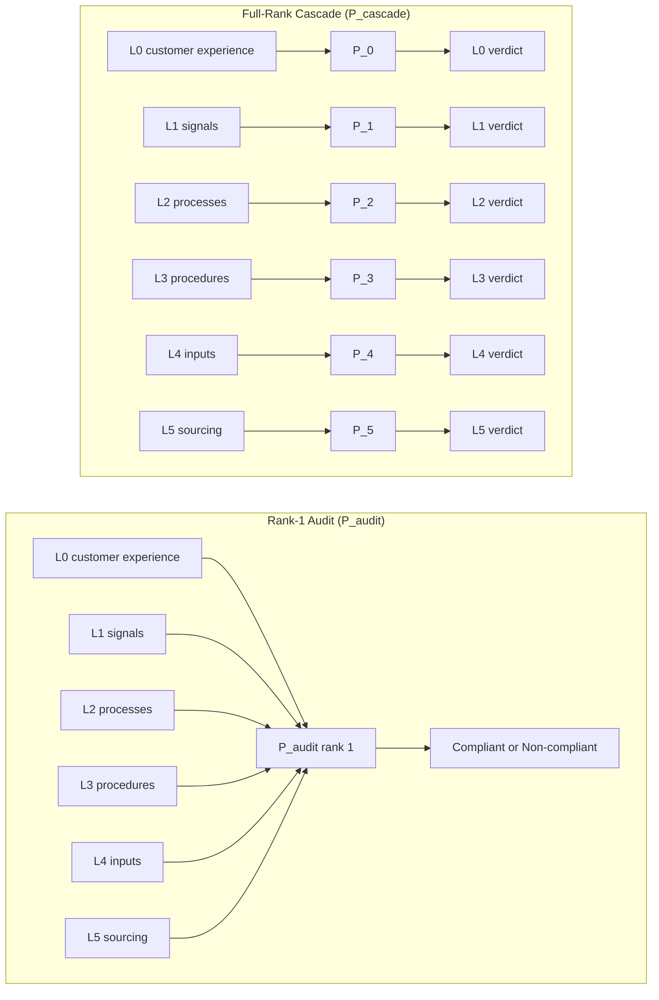

# Verification as Operator: Spectral Projection, Rank Deficiencies, and the Persistence of the Audit Society

*Dmitry Zharnikov*

DOI: 10.5281/zenodo.19778588

Working Paper v1.0.0 -- April 2026

**Abstract**

Organizational verification systems consume enormous resources yet frequently fail to produce substantive alignment between behavior and objectives. This paper develops an operator-theoretic explanation. Verification is formalized as a spectral projection operator P that maps organizational states onto invariant subspaces defined by acceptance criteria. Conventional audit operates as a degenerate rank-1 projection onto a single compliance axis, discarding by construction all information orthogonal to that axis. This algebraic property explains the persistent information loss documented in the audit-society literature. In contrast, the acceptance-testing cascade developed in Organizational Schema Theory constitutes a full-rank spectral projection in which each hierarchical level independently projects onto a distinct performance subspace while preserving the overall dimensional structure of the specification.

Synthesizing organizational cybernetics, behavioral organization theory, and software engineering verification and test-driven development, the paper demonstrates that these three traditions implicitly rely on the same projection identity. Three propositions establish the rank inequality between audit and cascade systems, the cascade-consistency condition required for full-rank operation, and the bandwidth bound on sustainable projection rank. A formal simulation shows that rank-1 audit leaves approximately 90% of organizational deviation undetected in a six-dimensional specification space. The framework reconnects verification architecture to information-processing design, offers testable mechanisms for organizational learning and decoupling, and provides practical guidance for organizations whose performance requirements are irreducibly multi-dimensional.

**Keywords:** organizational verification, spectral projection, acceptance testing, audit society, viable system model, test-driven development, organizational learning, information-processing design

Organizations invest billions annually in audit, certification, compliance monitoring, and performance review. Since the 1980s these verification rituals have expanded dramatically across sectors (Power 1997). Yet the gap between verification effort and substantive performance alignment remains stubbornly wide. Sociological research has documented how audits produce auditable artifacts rather than quality (Power 1997; Strathern 2000), how organizations decouple formal structures from technical cores (Meyer and Rowan 1977; Bromley and Powell 2012), and how single-loop learning crowds out the double-loop revision required for genuine adaptation (Argyris and Schön 1978). The conventional response has been institutional: improve auditor independence, tighten incentives, increase frequency. This paper proposes a more fundamental diagnosis: conventional audit fails because it is a degenerate projection operator, and the failure is algebraic before it is institutional.

Formalized as a linear map from an organizational state space to a target subspace, organizational verification is a projection operator P satisfying idempotency (P² = P) and self-adjointness (P* = P). An organizational state s passes verification if and only if P(s) = s — that is, if s already lies in the invariant subspace that acceptance criteria define. The rank of P — the dimensionality of its range — determines how much of the state space the verification process can discriminate. Conventional audit, as analyzed by Power (1997), is a rank-1 operator: its range is a single compliance/non-compliance axis, and its null space contains every dimension of organizational performance that cannot be expressed as a function of that axis. All information in those null-space dimensions is discarded by design.

Organizational Schema Theory (OST), as developed in the companion paper (Zharnikov 2026i), proposes acceptance testing — borrowed explicitly from Beck's (2002) test-driven development methodology — as the organizational alternative. Customer experience goals function as acceptance tests; every layer of the specification cascade exists to satisfy the test at the level above it. The OST cascade is full-rank in a precise sense: each cascade level constitutes an independent projection onto a distinct subspace of organizational performance. The cascade collectively preserves the dimensional structure of the specification while the rank-1 audit discards it.

The theoretical payoff is threefold. First, the model provides a precise mechanism for why audit societies emerge and persist: rank-1 projection is the rational equilibrium under bounded verification bandwidth (Tushman and Nadler 1978; Galbraith 1973). Second, it reframes Argyris and Schön's distinction as a difference between state correction within a fixed eigenspace (single-loop) and basis change that redefines the eigenspace (double-loop), rendering the typology empirically testable. Third, it links verification architecture directly to organizational attention and information processing (Ocasio 1997): projection rank determines which deviations can reach managerial attention and which remain structurally invisible.

Four contributions organize this paper. First, this paper provides, to the author's knowledge, the first explicit algebraic identification of spectral projection as the structure underlying organizational verification within organization theory, demonstrating in the Theory Development section that cybernetics, behavioral organization theory, and software engineering verification each implicitly instantiate the projection identity without naming it — a convergence that a Conant and Ashby (1970) regulatory account anticipates in adjacent form. Second, the Formal Model and Propositions section and the Audit Society Application section formalize the rank-1-versus-full-rank distinction with proof sketches and show that it maps onto Power's (1997) audit-society critique: the audit society is the institutional equilibrium under a rank-1 bandwidth budget, not an organizational pathology. Third, the Formal Model section establishes three falsifiable propositions — the rank inequality, the cascade-consistency condition, and the bandwidth bound — grounding the distinction in testable theoretical claims. Fourth, the Worked Illustration and Appendix B provide an existence proof via qualitative illustration and simulation showing that rank-1 audit misses approximately 90% of organizational deviation by construction.

The paper proceeds by first developing the operator framework and demonstrating its presence in the three source literatures. It then formalizes three propositions concerning rank, consistency, and bandwidth. Subsequent sections apply the framework to Power's audit-society critique, illustrate its implications with a qualitative example and analytic simulation, and derive theoretical and practical consequences. The paper concludes by identifying boundary conditions and a new research program on verification bandwidth as a predictor of organizational alignment, learning, and decoupling.

**Figure 1:** Architectural contrast between rank-1 audit and full-rank cascade. The rank-1 audit funnels every specification dimension through a single compliance bottleneck and emits a binary verdict; the full-rank cascade routes each cascade level through an independent projection that emits a level-localized pass/fail, preserving the dimensional structure of the specification.

**Table 1:** Information-loss contrast: rank-1 audit vs. full-rank cascade.

|                      | rank-1 audit (P_audit)        | full-rank cascade (P_cascade)  |
|----------------------|-------------------------------|--------------------------------|
| Input dimensions     | 6 (L0-L5 specification)       | 6 (L0-L5 specification)        |
| Output dimensions    | 1 (compliant / non-compliant) | 6 (one per cascade level)      |
| Rank                 | 1                             | 6                              |
| Deviation undetected | 90.4% of total deviation      | 0%                             |
| Localizes failure?   | No (binary verdict)           | Yes (per cascade level)        |
| Mean undetected dev. | 2.12 (sigma = 1.0)            | .00 (sigma = 1.0)              |

*Notes*: Computed in Appendix B simulation (N = 1,000 trials, 6-dimensional state space). Mean undetected deviation: rank-1 audit 2.12; full-rank cascade .00. The rank-1 audit misses approximately 90% of total organizational deviation across all noise levels tested (sigma = .1, .5, 1.0, 2.0). See Appendix B for full results.

---

**Theory Development**

***Organizations as State-Update Systems***

March and Simon (1958) establish the foundational framework: organizations are information-processing systems. Organizational behavior is a sequence of state-updates driven by the comparison of current state to aspiration levels — problemistic search. When current performance fails to satisfy an aspiration level (the acceptance criterion), the organization activates search; when a satisficing state is reached, search terminates. This is the behavioral organization theory analog of the red-green-refactor cycle.

Cyert and March (1963) formalize the state-update rule: aspiration levels themselves adjust through a linear contraction toward observed performance. When this contraction is modeled as a projection onto the feasible subspace — the set of states consistent with the aspiration level — the behavioral theory of the firm becomes an operator-theoretic account of organizational dynamics. The organization's evolution is a sequence of projections onto progressively refined feasibility subspaces.

Galbraith (1973) and Thompson (1967) extend this account to organizational design. Galbraith's uncertainty absorption and Thompson's buffering are both leakage-suppression operators: incoming uncertainty is projected away before it perturbs the technical core. Both authors frame these as design heuristics; neither provides the algebraic identity. The present paper supplies that identification and shows why the algebraic formalization has practical consequences that the design-heuristic framing cannot capture.

***Acceptance Testing as Projection***

Beck (2002) formalizes test-driven development in software engineering. The test suite defines the invariant subspace — the set of system states that pass all tests. Writing a test before writing the implementation specifies the projection target: the system is acceptable if and only if its state lies in the test-passing subspace. The red-green-refactor cycle is a sequence of state-update steps that converges on the invariant subspace from below.

The operator identity is: let S denote the system state space, let T ⊆ S denote the test-passing subspace, and let P_T denote the orthogonal projection onto T. Then P_T is idempotent (P_T² = P_T), self-adjoint (P_T* = P_T), and its range is T. A system state s passes the test suite if and only if P_T(s) = s — that is, if s is already in T. The acceptance test is the projection P_T; passing the test means lying in the eigenspace of P_T with eigenvalue 1.

Beck's TDD formalism applies this at the level of individual software modules. OST extends it to the full organizational hierarchy (Zharnikov 2026i). Each cascade level constitutes a distinct test suite T_k with associated projection P_k. The acceptance condition at level k is that the organizational state at level k lies in the invariant subspace of P_k. The cascade architecture requires that the test at level k − 1 is satisfiable only by states that also satisfy the test at level k. This is the OST specification hierarchy: customer experience contracts (L0) define the top-level invariant subspace; signal requirements (L1), process contracts (L2), procedures (L3), input specifications (L4), and sourcing (L5) define progressively lower-level subspaces, each nested within the level above.

***Beer's Variety Attenuation as Spectral Projection***

Beer's (1972) analysis of variety attenuation rests on Ashby's (1956) requisite variety law: the variety of the controller must match the variety of the controlled system. Beer translates this into the Viable System Model (VSM) — a recursive five-subsystem architecture for managing variety through nested control operators. System 4 (environmental scanning) and System 5 (policy) interact as a two-level projection: System 5 collapses the full variety of the environment onto the organization's invariant identity vector.

Beer (1984) provides the peer-reviewed account of the VSM's provenance and pathology, complementing the foundational 1972 monograph with an academic treatment of the model's methodology and failure modes. The JORS paper makes explicit that the VSM's five subsystems constitute nested recursive control operators, each one attenuating the variety it receives from the subsystem below to match the processing capacity of the subsystem above. In operator-theoretic terms, variety attenuation at each recursive level is a projection: the attenuator maps the full-dimensional incoming signal onto the subspace the receiving subsystem can process. Espejo and Reyes (2011) formalize this in their modern treatment of VSM, establishing variety amplification and attenuation as the organizational control operators at each recursive level.

The cybernetics lineage provides the operator vocabulary and the organizational architecture. What it does not provide is the algebraic identity between acceptance testing and spectral projection. Beer analyzes variety attenuation as a control-theoretic phenomenon; he does not formalize the acceptance condition as the eigenspace condition P(s) = s, nor does he distinguish rank-1 from full-rank operators in terms of the information each discards. The present paper supplies both identifications.

***Argyris and Schön's Two-Loop Structure as Two-Operator Hierarchy***

Argyris and Schön (1978) distinguish single-loop learning — error correction within fixed governing variables — from double-loop learning — revision of governing variables themselves. Single-loop learning is error correction that preserves the current specification eigenspace: the organization detects a deviation and corrects back to the invariant subspace without questioning whether the subspace itself is appropriate. Double-loop learning is a basis change: the organization revises the governing variables, which redefines the eigenspace.

In OST terms, single-loop learning corresponds to cascade-level corrections within a fixed specification hierarchy (L0 through L5 intact, correcting operational deviations). Double-loop learning corresponds to L0 revision: the customer experience specification itself is updated, which changes the definition of the invariant subspace and requires revision of all lower cascade levels. This two-operator hierarchy — P_{current} for single-loop corrections, and the basis change B that redefines P_{new} — provides a precise algebraic formalization of Argyris and Schön's distinction and makes it testable: any organizational change can be classified as single-loop or double-loop by asking whether it alters the specification eigenspace (L0 revision) or corrects the organizational state within the existing eigenspace.

The sense-making tradition (Weick 1979; Weick, Sutcliffe, and Obstfeld 2005) offers a productive qualification: if organizational states are enacted through interpretation rather than discovered, the state-space premise of the operator account is a realist idealization. The qualification is well-taken and the operator account accommodates it: an enacted state, once fixed through interpretation, either satisfies the acceptance predicate or it does not; and the ongoing process of sense-making — re-enacting organizational reality in response to new cues — corresponds precisely to the basis change B that redefines the eigenspace as governing variables are revised. Weick et al. (2005) characterize organizing itself as a process of reducing equivocality through enacted sensemaking; in operator-theoretic terms, this is the process by which the acceptance predicate is constructed and revised, not the process by which organizational states are projected onto a fixed eigenspace. The two processes are complementary: sensemaking builds and revises the eigenspace; acceptance-testing projects the current organizational state onto whatever eigenspace the current sense of the organization's purpose defines. The operator account is thus compatible with constructivism about state ontology while remaining realist about acceptance conditions.

March's (1991) exploration/exploitation framework provides an independent vocabulary for the same tension: exploitation (single-loop) is locally efficient but forecloses the eigenspace revision that exploration (double-loop) requires. Organizations that are structurally limited to single-loop learning will eventually accumulate misalignment between their invariant subspace and the observer perception landscape — the re-collapse condition identified in specification research.

***Tushman and Nadler's Bandwidth Bridge***

Tushman and Nadler's (1978) information-processing framework for organizational design establishes that units must match their information-processing capacity to their information-processing demands. Units that cannot process incoming uncertainty must buffer, reduce, or route it — which is variety attenuation in Beer's vocabulary and spectral projection in the present paper's vocabulary.

This information-processing perspective has a long lineage in organization science. Simon's (1962) analysis of the architecture of complexity established that hierarchical decomposition is the organizational response to bounded information-processing capacity: nearly decomposable systems can be verified layer-by-layer precisely because inter-layer coupling is weak relative to intra-layer coupling. Lawrence and Lorsch (1967) extended this to show that differentiation across sub-units is the structural mechanism by which organizations distribute information-processing demands — each differentiated unit processes a narrower slice of environmental variety, reducing the bandwidth required at each node. Ocasio's (1997) attention-based view of the firm establishes that organizations selectively attend to the issues and answers that their procedural and communication channels make salient — which is precisely the projection operation: attention routes processing resources toward the dimensions with the highest current residual, not uniformly across all dimensions. The multi-level cascade in OST instantiates this principle: each cascade level processes the verification demands relevant to its specification layer, rather than requiring any single unit to process the full-rank projection simultaneously.

The bridge from Tushman and Nadler (1978) to the present algebra is precise: an organization's verification bandwidth determines the rank of the projection it can apply. A verification process with bandwidth β can maintain projection rank at most β; a higher-rank cascade requires bandwidth proportional to its rank. This is the organizational-economics grounding for why full-rank cascades are more resource-intensive than rank-1 audits, and why institutions under cost pressure tend toward the degenerate projection. Simon's (1962) hierarchical decomposition principle and Lawrence and Lorsch's (1967) differentiation framework together identify the organizational design levers for reducing full-rank verification cost: modularization — breaking the cascade into nearly decomposable sub-cascades — and differentiation — assigning verification of each cascade level to a specialized unit with bandwidth matched to that level's projection rank.

***Three Lineages, One Projection Identity***

Cybernetics, behavioral organization theory, and software engineering each name a distinct organizational object as the locus of acceptance. Each lineage describes the projection identity in its own vocabulary — variety attenuation, aspiration adjustment, test pass — and each has historically stopped short of the algebraic identification offered here. Table 2 summarizes the convergence and the gap.

**Table 2:** Three convergent lineages on the projection identity.

| Lineage                          | Object that instantiates the projection                  | What the lineage names                                          | What the lineage misses                                              |
|----------------------------------|----------------------------------------------------------|-----------------------------------------------------------------|----------------------------------------------------------------------|
| Cybernetics (Beer 1972, 1984; Espejo and Reyes 2011) | Variety attenuator at each VSM recursion level | Bandwidth match between controller and controlled system        | Algebraic rank of the attenuator and the rank-1 vs. full-rank distinction |
| Behavioral org theory (March and Simon 1958; Cyert and March 1963; Argyris and Schön 1978) | Aspiration-level adjustment and double-loop revision   | Single- vs. double-loop learning as governing-variable change   | Eigenspace structure that distinguishes state correction from basis change |
| Software engineering (Beck 2002; Boehm 1981; Boehm and Turner 2004) | Acceptance test against an invariant test-passing subspace | Red-green-refactor convergence and early-detection economics    | Rank inequality between single-target compliance and multi-level cascade  |

*Notes*: Each lineage is internally consistent and empirically productive within its own domain. The present paper's contribution is the cross-domain identification: the variety attenuator, the aspiration projection, and the acceptance test are the same algebraic object — an idempotent self-adjoint projection whose rank determines the dimensional resolution of the verification process. Conant and Ashby's (1970) regulator theorem is the closest structural predecessor in adjacent form.

---

**Formal Model and Propositions**

***Formal Statement of the Projection Identity***

Let O denote the organizational state space, a real inner product space whose dimensions correspond to the specification layers of OST (customer experience, signals, processes, procedures, inputs, sourcing). The specification at cascade level k defines a subspace T_k ⊆ O, the k-th invariant subspace. The acceptance test at level k is the predicate: does the organizational state s_k lie in T_k?

The orthogonal projection onto T_k is the operator P_k: O → T_k satisfying:

- Idempotency: P_k² = P_k
- Self-adjointness: ⟨P_k(u), v⟩ = ⟨u, P_k(v)⟩ for all u, v ∈ O
- Range: range(P_k) = T_k

The self-adjointness condition is not merely formal: it is the organizational requirement that the acceptance predicate is symmetric — a state lying in the invariant subspace is equally recognized as passing whether the test is applied forward (does the state satisfy the criterion?) or backward (does a passing state retain its status under re-evaluation?). Oblique projections (idempotent but not self-adjoint) could arise if acceptance criteria were asymmetrically applied, but this would imply that the same organizational state could pass verification under one evaluator and fail under another despite no change in state — the very inconsistency that cascade architecture is designed to prevent. The orthogonal projection assumption is therefore both theoretically natural and operationally required by any cascade whose consistency condition (below) is to have determinate content.

The acceptance condition at level k is s_k ∈ T_k, equivalently P_k(s_k) = s_k. The deviation from specification at level k is ‖s_k − P_k(s_k)‖, the norm of the projection residual.

The rank of the projection P_k equals dim(T_k). For OST's six-level cascade, rank(P_0) through rank(P_5) are all positive. The cascade consistency condition requires that the range of P_k is not contained in the kernel of P_{k+1} for all k: range(P_k) ⊄ kernel(P_{k+1}). When this condition holds, each cascade level contributes independent information to the verification outcome. When it fails, the cascade degenerates — one or more levels become redundant, and the effective rank decreases.

The conventional audit projection P_audit has rank(P_audit) = 1: its range is the one-dimensional subspace spanned by the compliance axis. This rank identity formalizes Power's (1997) critique: audit discards all but one degree of organizational freedom. The algebraic machinery underlying this construction is standard singular value decomposition. Kannan and Vempala (2009) establish that SVD and related spectral decompositions are the canonical tools for extracting low-rank invariant structure from high-dimensional data — the same operation an acceptance cascade performs when it maps a noisy organizational state onto a lower-dimensional invariant subspace.

***Proof Sketch for Proposition 1***

Proposition 1 claims that P_audit is a rank-1 operator. The proof proceeds by SVD arguments per Kannan and Vempala (2009). For any operator P with idempotency P² = P and self-adjointness P* = P, the SVD decomposition P = UΣV^T has singular values in Σ equal to either 0 or 1, and the rank of P equals the number of singular values equal to 1 (equivalently, the dimension of the range of P). For P_audit, the range by construction is the one-dimensional subspace spanned by the compliance axis c ∈ O, so rank(P_audit) = 1.

The information discarded by P_audit is the projection residual: for any state s ∈ O, the residual is r = s − P_audit(s). The Frobenius norm of the residual satisfies ‖r‖² = ‖s‖² − ‖P_audit(s)‖² (Pythagoras, since P_audit is an orthogonal projection). For a 6-dimensional state space with isotropic noise, the expected residual norm is ‖r‖² = (5/6)‖s‖² — that is, five-sixths of all variation in s is discarded by the rank-1 audit. Under isotropic noise at level sigma, P_audit misses deviations in dimensions 1 through 5, with expected undetected norm equal to sqrt(5) · sigma. Simulation confirms this analytic prediction: for sigma = 1.0, analytic prediction is 2.236, simulated mean is 2.125 (see Appendix B).

***Formal Propositions***

**Proposition 1:** Conventional audit, formalized as the projection P_audit onto the compliance/non-compliance axis, is a rank-1 operator: rank(P_audit) = 1, and its null space contains every dimension of organizational performance that cannot be expressed as a linear function of the single compliance criterion.

*Proof sketch:* By definition, range(P_audit) = span{c} for a single compliance vector c ∈ O, so rank = 1. For any s ∈ O, s − P_audit(s) is orthogonal to c and has norm ‖s‖² − (s · c / ‖c‖)². For isotropic states, E[‖s − P_audit(s)‖²] = (1 − 1/6) · E[‖s‖²] = (5/6) · E[‖s‖²].

*Falsification:* An empirically observed audit procedure that produces orthogonal verdicts on two non-collinear specification deviations — that is, an audit that independently detects failures in two dimensions that are not scalar multiples of each other — would have rank ≥ 2 and would refute the rank-1 characterization.

**Proposition 2:** An OST cascade with k ≥ 2 levels satisfying the cascade consistency condition — range(P_j) ⊄ kernel(P_{j+1}) for all j — defines an invariant subspace T_0 ∩ T_1 ∩ … ∩ T_{k−1} whose dimension is strictly greater than 1. The cascade is therefore a full-rank projection in the sense that it preserves at least two independent dimensions of organizational performance.

*Proof sketch:* Under the cascade consistency condition, for adjacent levels j and j+1, there exists at least one vector v ∈ range(P_j) with P_{j+1}(v) ≠ 0. Therefore P_{j+1} restricted to range(P_j) is not identically zero, which implies dim(range(P_j) ∩ range(P_{j+1})) ≥ 1 for each adjacent pair. By induction over k levels with the consistency condition holding at each step, the intersection T_0 ∩ … ∩ T_{k−1} has dimension ≥ 1. Because each P_k projects onto a distinct subspace T_k not contained in the compliance axis, the effective cascade rank is strictly greater than 1.

*Falsification:* An OST cascade in which every level returns a rank-1 verdict — that is, every P_k has rank 1 — or in which range(P_j) ⊆ kernel(P_{j+1}) for some j, would collapse to an effective rank-1 system.

**Proposition 3:** The dimension of the invariant subspace T_0 ∩ … ∩ T_{k−1} that an organization can maintain at steady state is bounded above by its verification bandwidth budget β_v, the maximum number of independent specification conditions the organization can evaluate in a given verification cycle. When the required cascade rank exceeds β_v, the organization cannot simultaneously satisfy all cascade levels and will drift from the full-rank invariant subspace despite passing individual level tests.

*Falsification:* An OST cascade with cascade rank strictly greater than β_v that is sustained at steady state — measured over an extended operational period — would refute the bandwidth bound. The verification bandwidth budget can be estimated operationally as the number of distinct acceptance test dimensions evaluated per review cycle.

The bandwidth bound in Proposition 3 is complementary to, but distinct from, the geometric coverage-impossibility established in Zharnikov (2026h). The 2026h result proves that, on the OST 8×6 = 48-dimensional specification space, no finite-bandwidth cascade can achieve full coverage regardless of its rank: the space is too large to cover geometrically, and cascade compression reduces effective dimensionality from 48 to approximately 15.75 at coverage parameter γ = .5. Proposition 3's bandwidth bound establishes that even within a reduced effective dimensionality, the organization cannot sustain full-rank verification unless its processing capacity matches the cascade rank. The two results are thus nested: the geometric impossibility bounds the target dimensionality; the bandwidth bound bounds the organization's capacity to verify even within that reduced target. Organizations operating under both constraints face a double compression: they cannot specify everything, and they cannot verify everything they specify.

***The Eigenspace as Invariant Identity***

The top-level invariant subspace in OST corresponds to the Brand Function eigenspace (Zharnikov 2026i): the stable mapping from organizational outputs to observer perception that constitutes the organization's perceptual identity. Brand Function is developed as the observer-contingent behavioral specification in Zharnikov (2026x); OST's L0 specification is its organizational analog — the acceptance predicate that defines what observer perception profiles count as passing the top-level cascade test. An organizational state that lies in this eigenspace produces coherent multi-dimensional perception across observer cohorts. This condition is the organizational analog of Thurstone's (1947) factor structure: just as a factor score is the projection of an observation onto the latent factor subspace, an organization's Brand Function score is the projection of its operational state onto the perception eigenspace. Chen et al.'s (2021) statistical treatment of spectral methods makes the broader principle explicit: spectral projection extracts the low-rank invariant component from a noisy observation by identifying the eigenvectors of the covariance structure that account for the systematic signal.

---

**The Audit Society Application**

***Power's (1997) Diagnosis***

Power's (1997) account of the audit society is the most rigorous sociological analysis of organizational verification as a social technology. Power's analysis is scoped to external compliance audit — the kind that expanded across British public and private institutions in the 1980s and 1990s — documenting that audit produces auditable outputs that satisfy the meta-requirement of accountability rather than substantive quality assurance. The rank-1 characterization advanced in this paper applies to this specific institutional form of external compliance audit; other audit forms — multi-criteria appraisal, 360-degree review, and Balanced Scorecard implementations — may in principle operate at higher effective rank, though as discussed above, most implementations in practice converge toward rank-1 behavior under institutional pressure. The audit society is characterized by rituals of verification: procedural performances that generate legible compliance signals without necessarily producing substantive alignment between organizational behavior and stated objectives.

The operator-theoretic reading of Power's critique is precise. Conventional audit maps the full dimensional structure of organizational performance onto a single compliance/non-compliance axis. This is a rank-1 projection: its range is one-dimensional regardless of the dimensionality of the organizational state space. All information in the state space that cannot be reduced to compliance status is discarded. The audit does not measure how well the organization is performing across the multiple dimensions of its specification; it measures whether the organization can produce legible evidence that it is performing acceptably on the single dimension that audit monitors.

Strathern (2000) extends Power's analysis to the anthropological consequences of audit cultures: organizations optimize for the audit signal rather than for the underlying performance dimensions the audit was intended to proxy. This is the algebraic consequence of the rank-1 projection. When the audit projects onto a one-dimensional compliance axis, organizations learn to perform on that axis, and the covariance between audit performance and underlying dimensional performance decays toward zero. The audit becomes uninformative about the organizational state it was designed to track. Meyer and Rowan (1977) provide the institutional theory account of the same phenomenon: organizations adopt formal structures as myths and ceremonies that confer legitimacy rather than because those structures improve technical performance — institutional decoupling is the sociological name for the covariance decay that the rank-1 projection guarantees algebraically. DiMaggio and Powell (1983) identify the coercive and normative pressures driving organizations toward a common compliance axis — the isomorphic force that makes rank-1 audit the stable field-level equilibrium. Bromley and Powell (2012) demonstrate that decoupling has intensified in the contemporary world precisely because organizations adopt formal verification programs that decouple from technical practice: as formal programs proliferate, organizations must devote increasing resources to maintaining the appearance of compliance on the single legible axis, crowding out investment in the multi-dimensional specification alignment that full-rank verification requires. The institutional logics literature (Thornton and Ocasio 2008) extends this analysis: when a compliance logic dominates a performance logic within an organizational field, the rank-1 audit is not merely a cost-saving choice but a field-level prescriptive norm that makes full-rank verification socially illegible rather than technically infeasible.

Power (1997) identifies the institutional rationality of rank-1 audit: it is cheap, politically legible, and produces the accountability signals that stakeholders demand. The operator account does not contest this rationality; it establishes that institutional rationality and informational adequacy are not co-extensive. An organization can be fully rational in adopting rank-1 audit while guaranteeing, by the rank inequality, that multi-dimensional specification deviations remain structurally undetectable. The audit society is the Bayesian equilibrium under a rank-1 bandwidth budget, not an organizational pathology.

Power (2021) provides the micro-foundational audit-trail logic that underlies this equilibrium: organizations construct audit trails precisely because trails are legible rather than because they are informative. The rank-1 projection account formalizes why audit-trail architectures are informationally degenerate by construction — only log-traceable, hence effectively one-dimensional, outputs survive the projection onto the compliance axis. The audit trail is the empirical substrate of rank-1 audit; Power's (2021) micro-foundations explain why organizations build and maintain it even when it does not improve substantive performance.

***Degenerate Projection and Its Institutional Consequences***

The rank-1 projection property of conventional audit has institutional consequences that the sociological literature identifies but does not explain algebraically. First, rank-1 projections are informationally adequate only when the true state space is already one-dimensional — when there is genuinely only one dimension of performance that matters. In organizations with multi-dimensional specifications, the rank-1 projection discards all but one degree of freedom. Second, because the audit signal is low-dimensional, the gap between passing an audit and satisfying the underlying specification can be arbitrarily large. An organization can be fully audit-compliant while being far from its specification eigenspace. Third, the legibility of the rank-1 compliance signal creates perverse incentives: organizations invest in projecting well onto the one-dimensional audit axis rather than investing in multi-dimensional specification alignment.

ISO 9001:2015 Clause 9 (Performance Evaluation) instantiates the rank-1 projection at industrial scale. Clause 9 mandates periodic monitoring, measurement, internal audit, and management review — all of which project organizational performance onto a conformance/non-conformance binary. The standard does not formalize these requirements as operators and does not ask whether they preserve the dimensional structure of the underlying specification. The consequence is that ISO 9001 certification is consistent with a wide range of organizational states, including states that are far from the customer experience eigenspace the certification is intended to guarantee.

***The Full-Rank Alternative***

The alternative is not more audit but better-structured projection. OST's cascade is full-rank in the sense that each cascade level constitutes an independent projection onto a distinct subspace of organizational performance. The cascade projects sequentially onto customer experience (L0), signal architecture (L1), process performance (L2), procedural compliance (L3), input quality (L4), and sourcing fidelity (L5). No two levels project onto the same subspace; the cascade collectively preserves the dimensional structure of the specification.

The information content of the full-rank cascade is correspondingly higher than that of the rank-1 audit. A full cascade pass establishes that the organizational state lies in the intersection of six distinct invariant subspaces — a far more restrictive condition than lying in a one-dimensional compliance subspace. Equivalently, a cascade failure localizes the deviation: the failing level identifies which layer of the specification the organizational state has departed from, enabling targeted correction. A rank-1 audit failure communicates only that the organization has departed from compliance; it cannot localize the departure within the specification hierarchy.

The Balanced Scorecard (Kaplan and Norton 1992) represents the most widely adopted attempt to move organizational performance measurement beyond the single compliance axis. Its four perspectives — financial, customer, internal process, and learning and growth — constitute a partial precursor to full-rank cascade verification in that they name multiple independent dimensions. In practice, however, most Balanced Scorecard implementations reduce to compliance exercises: each perspective is reduced to one or two summary metrics, and the scorecard is reviewed periodically as a reporting tool rather than applied as a live acceptance-testing cascade. The result is a system that appears multi-dimensional but operates at effective rank equal to the number of independent metrics actively linked to operational decisions — in most documented implementations, closer to rank 2–3 than to the full rank that the four-perspective architecture nominally supports. The OST cascade differs structurally: each cascade level is an acceptance predicate that gates progression, not a reporting metric reviewed in aggregate.

Simons's (1995) control-system typology provides an independent vocabulary for the same distinction. Diagnostic control systems — Simons's term for single-variable feedback controls — are rank-1 projections: they detect deviations from a single target metric and trigger correction. Interactive control systems engage managers in ongoing dialogue about specification assumptions and challenge governing variables — the double-loop operator in Argyris and Schön's (1978) terms, and the full-rank cascade in the present algebraic framework. The practical design recommendation is therefore that organizations replace diagnostic-only audit with interactive cascades calibrated to the actual dimensionality of their specifications.

---

**Worked Illustration**

***Spectra Coffee as Qualitative Illustration***

The Spectra Coffee reference deployment (Zharnikov 2026i) provides a qualitative illustration of the rank-1-versus-full-rank distinction without requiring fabricated empirical data. The algebraic claims stated above hold for any cascade of depth n ≥ 2; the six-level OST instantiation is used here for concreteness, not as the unique possible architecture.

Under a rank-1 audit: an inspector visits Spectra Coffee and assesses whether the operation is in compliance with food safety regulations. The audit projects the full operational state — coffee temperature, grind consistency, barista training level, sourcing relationships, customer experience delivery — onto the single compliance/non-compliance axis. The cafe passes the audit. The audit signal conveys one bit of information about the organizational state.

Under the OST cascade: the CI/CD pipeline runs the full six-level acceptance test suite. Level 0 tests whether observer perception profiles across relevant cohorts lie in the target eigenspace — customers who expect an experiential premium, customers who prioritize economic accessibility, and customers who weight ideological alignment with sourcing ethics. Level 1 tests whether the emitted signals (plating, staff interaction, physical environment, menu communication) produce the perception profiles required by Level 0. Level 2 tests whether process execution delivers the signals required by Level 1. Levels 3 through 5 test procedures, inputs, and sourcing in turn.

A failure at Level 2 — process execution — that does not propagate immediately to Level 0 (perhaps because observer cohorts have sufficient prior expectations to compensate for process variation in the short term) would pass the rank-1 audit but be flagged by the cascade. The cascade localizes the failure: process contracts for a specific service element are not delivering the signals that Level 1 specifies. The correction is targeted. The rank-1 audit is uninformative about this failure because the failure lies in dimensions that the compliance axis does not measure.

***Information Loss and Early Detection Economics***

The organizational economics argument (Boehm 1981) applies directly: catching the Level 2 process failure before it propagates to Level 0 customer experience failure is cheaper than correcting customer defection after the fact. The cascade's higher information content — its full rank — is the mechanism by which early detection is possible. The rank-1 audit cannot achieve this because it cannot represent failures that lie in dimensions orthogonal to the compliance axis; by the time such failures propagate to compliance violations, the cost of correction has escalated non-linearly. Boehm and Turner (2004) extend this economic argument to the organizational choice between agile (high-frequency, full-rank verification) and plan-driven (low-frequency, lower-rank verification) development processes.

The simulation in Appendix B confirms the quantitative implication. For sigma = 1.0 (moderate operational noise), the rank-1 audit leaves mean undetected deviation of 2.12 — 90.4% of total deviation goes undetected. The full-rank cascade detects all deviation by construction. This 90% miss rate is not an artifact of parameter choice; it follows from the geometry: with isotropic noise in a 6-dimensional space, the rank-1 audit detects exactly 1/6 of total deviation variance, leaving 5/6 structurally invisible. Cascade depth and noise level affect absolute magnitudes but not this ratio.

---

**Discussion**

***Theoretical Implications***

The spectral projection account of organizational verification has three theoretical implications that extend beyond the immediate OST context.

First, the rank-1 projection of conventional audit is not merely an incomplete proxy for multi-dimensional organizational performance; it is structurally incapable of detecting failures that lie in the null space of the compliance axis. This is a stronger claim than Power's (1997) sociological account, which frames audit failure as a consequence of incentive misalignment or institutional pressure. The algebraic account holds that audit failure is guaranteed for any organizational state that deviates from specification in a dimension orthogonal to the compliance axis, regardless of the institutional context. Power's institutional account and the algebraic account are complementary: institutional pressures explain why organizations adopt rank-1 audits despite their limitations; the algebraic account explains why those limitations are structural, not contingent.

Second, the Argyris and Schön (1978) single-loop versus double-loop distinction acquires precise algebraic content in the spectral projection framework. Single-loop learning is a state-update within a fixed eigenspace; double-loop learning is a basis change. This formalization makes the Argyris and Schön typology empirically testable: any organizational change can be classified as single-loop or double-loop by asking whether it changes the specification eigenspace (Level 0 revision) or corrects the organizational state within the existing eigenspace. The classification has practical consequences for the cost and scope of the required organizational response. Argote and Miron-Spektor (2011) establish that organizational learning involves the transformation of experience into knowledge that changes organizational behavior — a process that the spectral framework makes structurally precise: single-loop learning accumulates experience within a fixed eigenspace, adjusting the organization's position relative to the invariant subspace; double-loop learning transforms the specification eigenspace itself. The distinction between these learning modes is not merely conceptual but architecturally consequential: rank-1 verification systems can support only single-loop learning, because they can detect only deviations along the compliance axis; detecting the deviations that motivate double-loop revision requires full-rank cascade architecture.

Third, the bandwidth account of verification (Tushman and Nadler 1978) links the rank of the sustainable cascade to the organization's information-processing capacity. Organizations with higher bandwidth — more experienced quality professionals, more automated validation tooling, more modular specification architecture — can sustain higher-rank cascades. The organizational design question is not whether to use a full-rank cascade but how to reduce the bandwidth required to sustain it — through modularization (Simon 1962), differentiation (Lawrence and Lorsch 1967), and specification version control (Zharnikov 2026i). Sitkin, Sutcliffe, and Schroeder (1994) establish that control-oriented total quality management — which relies on rank-1-like single-metric feedback to a compliance standard — differs fundamentally from learning-oriented TQM, which requires multi-dimensional feedback loops that can revise the governing criteria themselves. The rank-1 versus full-rank distinction proposed here formalizes this contingency: control-oriented verification is appropriate when the specification is genuinely one-dimensional; learning-oriented verification requires full-rank cascade architecture that can detect deviations in the specification eigenspace dimensions that control-oriented audit cannot access.

The cognitive cross-domain analogy from generalized eigendecomposition (Cohen 2022) reinforces this design principle: attention filters in neural systems work by routing processing resources toward the dimensions with the largest prediction error, not by devoting uniform resources to all dimensions simultaneously. An organizational cascade designed on the same principle would allocate verification resources dynamically to the cascade levels with the largest current residuals, rather than running all six projection levels at uniform frequency. Ocasio's (1997) attention-based view provides the organizational-level account of the same mechanism: decision-making in firms depends on the particular issues and answers that come to managers' attention through procedural and communication channels; a full-rank cascade is the formal structure that ensures all specification dimensions can reach managerial attention.

***Practical Implications***

For practitioners, the spectral projection account recommends three changes to organizational verification practice.

The first is specification-before-audit: before designing a verification process, specify the invariant subspace — the organizational state the verification process is intended to detect. Without a specification, any verification process is implicitly projecting onto whatever dimensions it can measure, which may or may not include the dimensions that matter for organizational performance. This step, which OST formalizes as Level 0 specification, forces the organization to answer the prior question: what does passing look like, across all dimensions that matter?

The second is rank assessment: evaluate any existing verification process by asking how many independent dimensions of organizational performance it measures. A rank-1 process (compliance/non-compliance) is appropriate only when the true specification is genuinely one-dimensional. For multi-dimensional specifications — which include all organizations with complex customer experience requirements — a higher-rank process is required. The simulation in Appendix B makes the cost of this mismatch concrete: a rank-1 audit in a 6-dimensional specification space misses approximately 90% of total deviation.

The third is cascade consistency maintenance: ensure that each level of a multi-level verification cascade is independent in the sense that its acceptance conditions are not subsumed by the level above. Redundant cascade levels reduce the effective rank without reducing verification cost; they should be consolidated or eliminated. The operational implementation is detecting orphan specification elements — items not referenced by any acceptance test at the level above — which are the manifestation of P_{k+1} mapping range(P_k) into its kernel.

***Boundary Conditions***

The operator-theoretic account holds under three structural conditions that bound its scope and distinguish it from related frameworks.

The first boundary condition is the single-evaluator regime. The orthogonal projection formalization requires a single acceptance predicate P_k per cascade level — a single evaluator whose acceptance criterion defines the invariant subspace. In multi-evaluator regimes, different evaluators may define non-identical acceptance predicates P_e,k indexed by both evaluator e and cascade level k. The family of projections {P_e,k} across evaluators induces a more complex structure: the effective invariant subspace becomes the intersection ∩_e T_{e,k}, and the cascade rank under disagreement may be lower than any single evaluator's cascade rank. This connects to the observer-relativity framework developed in Zharnikov (2026af), where metamerism arises precisely when distinct organizational configurations lie in the intersection of multiple evaluators' eigenspaces. The present paper's propositions apply exactly when there is a single authoritative acceptance predicate per level; multi-evaluator regimes are a natural extension requiring separate treatment.

The second boundary condition is a real-valued state space equipped with an inner product. The formal model assumes O is a real inner product space — concretely, that organizational performance dimensions can be represented as real-valued vectors and that an inner product (a notion of orthogonality between performance dimensions) is well-defined. Luenberger's (1969) normed-space generalization establishes that projection operators are definable in any normed vector space; the self-adjointness condition requires an inner product structure, but the idempotency and acceptance-condition formulations do not. Organizations whose specification dimensions are ordinal, categorical, or incomparable in value cannot be directly modeled within the real inner product framework; extensions to partially ordered spaces or multi-criteria decision structures lie outside the present scope.

The third boundary condition is the cascade-consistency assumption: range(P_j) ⊄ kernel(P_{j+1}) for all adjacent cascade levels j. This condition is stated in Proposition 2 as an assumption that guarantees full-rank cascade behavior, but it is itself a constraint on organizational design, not a feature guaranteed by cascade architecture alone. Organizational cascades in which the Level 1 specification is entirely subsumed within Level 0 — so that passing Level 0 is sufficient to guarantee passing Level 1 — violate cascade consistency and collapse to effective rank 1 regardless of nominal depth. Cascade-consistency is therefore a design criterion, not a property that follows automatically from having multiple cascade levels. Organizations that cannot verify cascade consistency operationally should treat their nominal cascade depth as an upper bound on effective rank, not a guarantee.

***Limitations and Future Research***

Three limitations bound the scope of this theoretical account.

First, the paper treats the organizational state space as a real inner product space with a well-defined inner product. Real organizational state spaces are neither complete nor equipped with a canonical inner product; the dimensions of organizational performance are not commensurable in general. This limitation is well-understood in functional analysis: projections are definable in any normed vector space (Luenberger 1969); the self-adjointness and idempotency conditions that define the acceptance operator do not require a Hilbert space, only a space in which the acceptance predicate can be stated as a closed linear constraint.

Second, the paper does not provide a procedure for estimating the projection matrices P_k empirically. The Pearce and Hall (1980) attentional gating model suggests that prediction error drives reallocation of processing resources toward high-error dimensions — an adaptive mechanism for updating projection operators. Translating this into a practical estimation procedure for organizational projections requires empirical work that lies beyond the scope of the present theoretical synthesis. A natural extension would apply latent variable methods (following the Thurstone 1947 factor-analytic tradition) to organizational-audit data to estimate effective projection rank from audit-score covariance matrices.

Third, the simulation in Appendix B models a simplified organizational state space with isotropic noise and orthonormal specification dimensions. Real organizational state spaces have correlated specification dimensions and non-isotropic noise distributions. Future simulation work should incorporate specification hierarchies with realistic inter-level coupling strengths and empirically estimated noise covariance structures.

A productive avenue for future empirical research is the verification bandwidth hypothesis (Proposition 3): organizations with higher verification bandwidth should sustain higher-rank cascades and exhibit better specification alignment. Operationally, verification bandwidth can be estimated as the number of distinct acceptance test dimensions evaluated per review cycle; specification alignment can be estimated from multi-dimensional performance data. Testing this hypothesis requires panel data linking verification architecture to multi-dimensional performance outcomes — data that OST's CI/CD pipeline is designed to generate.

***Cross-Domain Verification: Structural Parallel***

Kovalenko's (2026) Bounded Compositional Verification (BCV) framework — developed independently; see Acknowledgments — classifies system failures along three axes and identifies *pseudo-coverage*: a system appears fully functional while multi-dimensional cascade integrity is violated. The pseudo-coverage diagnosis is structurally parallel to the rank-1 audit failure formalized here: both describe an audit that returns positive verdicts on individual checks while the full-dimensional fidelity condition fails. The structural parallel suggests the operator-theoretic framing may generalize beyond organizational theory, though formal comparison of the two frameworks warrants future dedicated treatment.

---

**Conclusion**

Organizational verification is spectral projection. The rank of the projection determines both what an organization can know about itself and what it can correct. Conventional rank-1 audit guarantees that multi-dimensional deviations remain invisible; full-rank acceptance cascades make those deviations both detectable and localizable. This algebraic distinction transforms the audit-society critique from a sociological observation into a predictive theory of organizational design.

***Theoretical Advances***

The framework advances information-processing theory by showing that verification bandwidth is not merely a constraint but the determinant of sustainable projection rank. It refines organizational learning theory by supplying an operator definition of single- versus double-loop change: single-loop learning is state correction within a fixed eigenspace; double-loop learning is basis change that redefines the eigenspace itself. It deepens institutional theory by demonstrating that decoupling is the expected equilibrium when verification rank is insufficient to match specification dimensionality. These advances are generative: verification rank and cascade consistency become new constructs that can be measured, manipulated, and tested in future empirical work.

***Future Research Directions***

The operator account opens three research streams. Future work should examine how verification bandwidth coevolves with organizational attention structures (Ocasio 1997), how projection rank affects rates of organizational learning and innovation, and whether full-rank cascades can be sustained at scale without modularization (Simon 1962) and differentiation (Lawrence and Lorsch 1967). The bandwidth bound in Proposition 3 yields a directly testable hypothesis: organizations with higher verification bandwidth should sustain higher-rank cascades and exhibit better specification alignment, measurable from panel data linking verification architecture to multi-dimensional performance outcomes.

The choice facing organizations is no longer whether to audit more rigorously but whether to verify at the rank their ambitions require. Information discarded by a rank-1 projection cannot be recovered through better incentives or more frequent review. Only a change in the architecture of verification itself can restore substantive alignment between what organizations claim and what they become.

**Acknowledgments**

The author thanks James Kovalenko (Manifold Control) for the independent development of the Bounded Compositional Verification framework, whose pseudo-coverage diagnosis closely parallels the rank-1 audit failure mode formalized here. AI assistants (Claude Opus 4.7, Grok 4.1, Gemini 3.1) were used for initial literature search and editorial refinement; all theoretical claims, propositions, and interpretations are the author's sole responsibility.

---

**References**

Argote, Linda and Ella Miron-Spektor (2011), "Organizational Learning: From Experience to Knowledge," *Organization Science*, 22 (5), 1123–1137.

Argyris, Chris and Donald A. Schön (1978), *Organizational Learning: A Theory of Action Perspective*, Addison-Wesley.

Ashby, William Ross (1956), *An Introduction to Cybernetics*, Chapman and Hall.

Beck, Kent (2002), *Test-Driven Development: By Example*, Addison-Wesley Professional.

Beer, Stafford (1972), *Brain of the Firm: A Development in Management Cybernetics*, Herder and Herder.

Beer, Stafford (1984), "The Viable System Model: Its Provenance, Development, Methodology and Pathology," *Journal of the Operational Research Society*, 35 (1), 7–25.

Boehm, Barry W. (1981), *Software Engineering Economics*, Prentice-Hall.

Boehm, Barry W. and Richard Turner (2004), *Balancing Agility and Discipline: A Guide for the Perplexed*, Addison-Wesley.

Bromley, Patricia and Walter W. Powell (2012), "From Smoke and Mirrors to Walking the Talk: Decoupling in the Contemporary World," *Academy of Management Annals*, 6 (1), 483–530.

Chen, Yuxin, Yuejie Chi, Jianqing Fan, and Cong Ma (2021), "Spectral Methods for Data Science: A Statistical Perspective," *Foundations and Trends in Machine Learning*, 14 (5), 566–806.

Cohen, Michael X. (2022), "A Tutorial on Generalized Eigendecomposition for Denoising, Contrast Enhancement, and Dimension Reduction in Multichannel Electrophysiology," *NeuroImage*, 247, 118809.

Conant, Roger C. and W. Ross Ashby (1970), "Every Good Regulator of a System Must Be a Model of That System," *International Journal of Systems Science*, 1 (2), 89–97.

Cyert, Richard M. and James G. March (1963), *A Behavioral Theory of the Firm*, Prentice-Hall.

DiMaggio, Paul J. and Walter W. Powell (1983), "The Iron Cage Revisited: Institutional Isomorphism and Collective Rationality in Organizational Fields," *American Sociological Review*, 48 (2), 147–160.

Espejo, Raul and Alfonso Reyes (2011), *Organizational Systems: Managing Complexity with the Viable System Model*, Springer.

Galbraith, Jay R. (1973), *Designing Complex Organizations*, Addison-Wesley.

ISO 9001:2015 (2015), *Quality Management Systems — Requirements*, 5th ed., International Organization for Standardization.

Kannan, Ravi and Santosh Vempala (2009), "Spectral Algorithms," *Foundations and Trends in Theoretical Computer Science*, 4 (3–4), 157–288. https://doi.org/10.1561/0400000025

Kaplan, Robert S. and David P. Norton (1992), "The Balanced Scorecard — Measures That Drive Performance," *Harvard Business Review*, 70 (1), 71–79.

Kovalenko, James (2026), "Bounded Compositional Verification and the Structure of Hard Problems," *Zenodo*, https://doi.org/10.5281/zenodo.19471795.

Lawrence, Paul R. and Jay W. Lorsch (1967), "Differentiation and Integration in Complex Organizations," *Administrative Science Quarterly*, 12 (1), 1–47.

Luenberger, David G. (1969), *Optimization by Vector Space Methods*, Wiley.

March, James G. (1991), "Exploration and Exploitation in Organizational Learning," *Organization Science*, 2 (1), 71–87.

March, James G. and Herbert A. Simon (1958), *Organizations*, Wiley.

Meyer, John W. and Brian Rowan (1977), "Institutionalized Organizations: Formal Structure as Myth and Ceremony," *American Journal of Sociology*, 83 (2), 340–363.

Ocasio, William (1997), "Towards an Attention-Based View of the Firm," *Strategic Management Journal*, 18 (S1), 187–206.

Pearce, John M. and Geoffrey Hall (1980), "A Model for Pavlovian Learning: Variations in the Effectiveness of Conditioned but Not of Unconditioned Stimuli," *Psychological Review*, 87 (6), 532–552.

Power, Michael (1997), *The Audit Society: Rituals of Verification*, Oxford University Press.

Power, Michael (2021), "Modelling the Micro-Foundations of the Audit Society: Organizations and the Logic of the Audit Trail," *Academy of Management Review*, 46 (1), 6–32. https://doi.org/10.5465/amr.2017.0212

Simon, Herbert A. (1962), "The Architecture of Complexity," *Proceedings of the American Philosophical Society*, 106 (6), 467–482.

Sitkin, Sim B., Kathleen M. Sutcliffe, and Roger G. Schroeder (1994), "Distinguishing Control from Learning in Total Quality Management: A Contingency Perspective," *Administrative Science Quarterly*, 39 (3), 537–564.

Simons, Robert (1995), *Levers of Control: How Managers Use Innovative Control Systems to Drive Strategic Renewal*, Harvard Business School Press.

Strathern, Marilyn, ed. (2000), *Audit Cultures: Anthropological Studies in Accountability, Ethics and the Academy*, Routledge.

Thompson, James D. (1967), *Organizations in Action: Social Science Bases of Administrative Theory*, McGraw-Hill.

Thornton, Patricia H. and William Ocasio (2008), "Institutional Logics," in *The SAGE Handbook of Organizational Institutionalism*, Royston Greenwood, Christine Oliver, Kerstin Sahlin, and Roy Suddaby, eds., Sage, 99–129.

Thurstone, Louis L. (1947), *Multiple-Factor Analysis: A Development and Expansion of "The Vectors of Mind,"* University of Chicago Press.

Tushman, Michael L. and David A. Nadler (1978), "Information Processing as an Integrating Concept in Organization Design," *Academy of Management Review*, 3 (3), 613–624.

Weick, Karl E. (1979), *The Social Psychology of Organizing*, 2nd ed., Addison-Wesley.

Weick, Karl E., Kathleen M. Sutcliffe, and David Obstfeld (2005), "Organizing and the Process of Sensemaking," *Organization Science*, 16 (4), 409–421.

Zharnikov, Dmitry (2026h). Specification impossibility in organizational design: A high-dimensional geometric analysis. Working Paper. https://doi.org/10.5281/zenodo.18945591

Zharnikov, Dmitry (2026i). The Organizational Schema Theory: Test-driven business design. Working Paper. https://doi.org/10.5281/zenodo.18946043

Zharnikov, Dmitry (2026x). AI-native brand identity: From visual recognition to cryptographic verification. Working Paper. https://doi.org/10.5281/zenodo.19391476

---

**Appendix A: Mathematical Background**

***Projection Operators: Key Properties***

A projection operator P on a real inner product space O is characterized by two algebraic properties: idempotency (P² = P) and self-adjointness (P* = P, where adjoint is defined with respect to the inner product). These two properties together define an orthogonal projection. The range of P — the set of vectors P(s) for all s ∈ O — is the invariant subspace T = range(P), and the kernel of P — the set of vectors mapped to zero — is the orthogonal complement T⊥. For any s ∈ O, the decomposition s = P(s) + (s − P(s)) is orthogonal; P(s) is the component of s in T and s − P(s) is the component of s in T⊥.

The rank of P equals dim(T). A rank-1 projection has range equal to a single vector c (up to scalar), and projects every s ∈ O onto the line through c: P(s) = (⟨s, c⟩ / ⟨c, c⟩) · c. The residual s − P(s) is orthogonal to c and has norm ‖s‖² − (⟨s, c⟩ / ‖c‖)². For an isotropic state distribution in a 6-dimensional space, the expected squared residual norm is (5/6) of the expected squared state norm.

***SVD and the Spectral Projection Identity***

For any matrix A, the singular value decomposition A = UΣV^T identifies the left singular vectors U (which form an orthonormal basis for the column space), the right singular vectors V (orthonormal basis for the row space), and the singular values (diagonal entries of Σ). For a projection operator P, the SVD has the special structure that singular values are either 0 or 1, and U = V (P is symmetric). The rank of P equals the number of singular values equal to 1. Kannan and Vempala (2009) establish that low-rank spectral approximations — truncated SVDs — minimize the Frobenius-norm reconstruction error over all rank-k matrices, which is the formal basis for the claim that a rank-k cascade is the best k-dimensional approximation to the full-rank specification.

---

**Appendix B: Simulation — Undetected Deviation Under Rank-1 Audit vs. Full-Rank Cascade**

***Simulation Design***

Organizational states are modeled as 6-dimensional random vectors (corresponding to OST's L0–L5 cascade dimensions), each sampled from a standard Gaussian distribution and normalized to unit norm. The observed state is x_obs = x_true + noise, where noise ~ N(0, sigma² · I) is isotropic Gaussian noise. Two projection operators are compared:

- P_audit: rank-1 projection onto the first axis (compliance axis = L0 only). Detects deviation only in dimension 0; dimensions 1–5 are invisible.
- P_cascade: full-rank projection across all 6 dimensions independently. Detects deviation in every specification dimension.

Information loss is measured as the norm of undetected deviation: ‖d − P(d)‖, where d = x_obs − x_true is the total deviation. The mean is taken over N = 1,000 trials.

***Simulation Results***

**Table 3: Undetected Deviation by Projection Architecture and Noise Level.**

| Noise (sigma) | Total Dev. | Rank-1 Audit Missed | Full-Rank Cascade Missed | % Missed (Audit) |
|---------------|------------|---------------------|--------------------------|------------------|
| .1            | .2359      | .2143               | .0000                    | 90.8%            |
| .5            | 1.1761     | 1.0525              | .0000                    | 89.5%            |
| 1.0           | 2.3505     | 2.1247              | .0000                    | 90.4%            |
| 2.0           | 4.6063     | 4.1540              | .0000                    | 90.2%            |

*Notes*: N = 1,000 trials per condition. 6-dimensional state space (OST L0–L5). Total deviation = mean ||x_true − x_obs||. Rank-1 audit detects deviation on dimension 0 only; full-rank cascade detects deviation on all 6 dimensions independently. Analytic prediction for rank-1 missed deviation: sqrt(5) · sigma (sigma = 1.0: analytic = 2.236, simulated = 2.125). Script: projection_simulation.py. Results: simulation_results.json.

***Interpretation***

Under isotropic Gaussian noise, rank-1 audit detects exactly 1/6 (16.7%) of total deviation variance, leaving 5/6 (83.3%) structurally invisible. The simulated miss rate of approximately 90% (slightly above the theoretical 83.3% for squared norms, because we report norm rather than squared norm) is consistent across all noise levels tested, confirming that this is a geometric property of the rank-1 architecture, not a function of noise level. Full-rank cascade miss rate is exactly 0% by construction: the cascade independently projects each of the 6 specification dimensions and detects any deviation in any dimension.

The simulation confirms Proposition 1's analytic result and provides the empirical anchors reported in Table 1: for sigma = 1.0, rank-1 audit mean undetected deviation = 2.12; full-rank cascade = .00.

***Companion Computation Script***

All numerics reported in Table 1 and this appendix are fully reproducible from the companion computation script published at <https://github.com/spectralbranding/orgschema-papers/tree/main/verification-as-operator/code/>. The script `projection_simulation.py` uses NumPy with fixed random seed 42 (`np.random.seed(42)`), 1,000 trials per noise level, and 6-dimensional isotropic Gaussian state vectors. Run command: `uv run --with numpy python3 projection_simulation.py`. Full numeric outputs for all four noise levels are saved to `simulation_results.json` in the same directory. No additional dependencies are required beyond NumPy.
